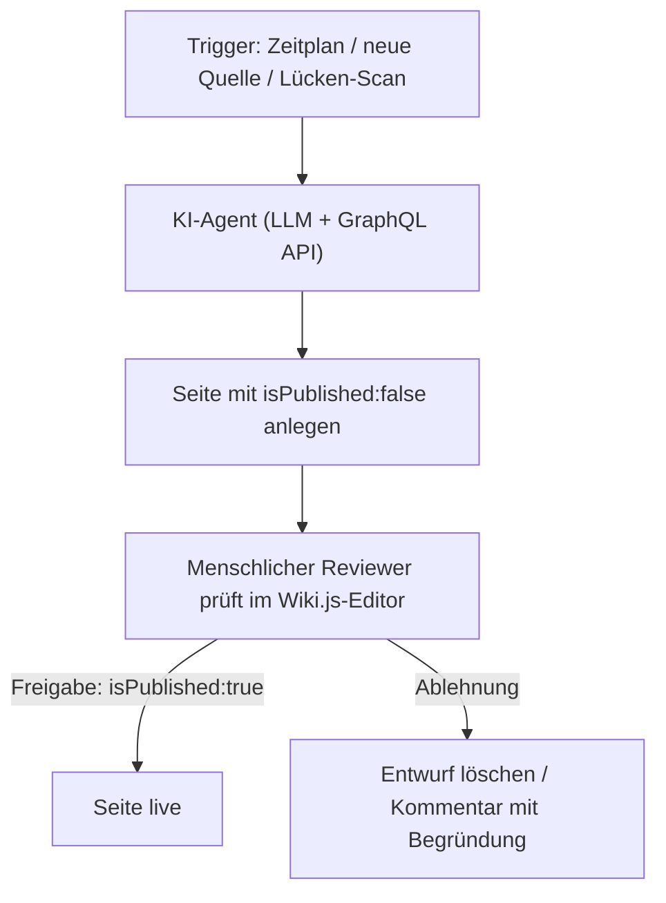
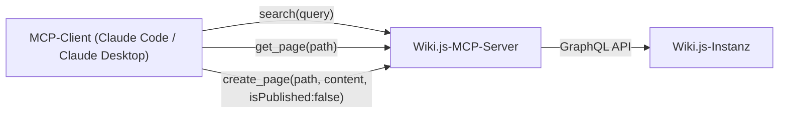

# Wiki.js Agenten-Pipeline: Automatisierte Pflege mit LLMs

**Wiki.js** ist ein modernes, Node.js-basiertes Wiki mit nativer Markdown-Unterstützung und einer **GraphQL-API** (siehe Einordnung in [Klassische Wiki-Systeme mit LLM-Integration](klassische-wiki-systeme-llm-integration.md)). Dieses Kapitel ergänzt die reine API-Anbindung um eine **KI-Schicht**: Ein Sprachmodell generiert, prüft und aktualisiert Wiki-Inhalte selbstständig — nach demselben **Human-in-the-Loop-Prinzip** wie bei [MediaWiki](mediawiki/mediawiki-ki-agent.md) und [XWiki](xwiki/xwiki-ki-agent.md) in diesem Repository.

!!! note "Hinweis: Kein natives KI-Feature, dafür GraphQL-native Draft-Funktion"
    Wiki.js bringt kein eingebautes KI-Feature mit (Weg B: Eigenbau/MCP-Server). Anders als bei MediaWiki oder XWiki, wo eine Entwurfs-Markierung manuell per Vorlage/Makro nachgebaut werden muss, unterstützt die Wiki.js-API das **nativ**: Jede Seite hat ein `isPublished`-Flag — ein KI-Agent kann Seiten also direkt als unveröffentlichten Entwurf anlegen.

---

## Installation (kurz)

```bash
docker run -d -p 3000:3000 \
  -e DB_TYPE=postgres -e DB_HOST=db -e DB_PORT=5432 \
  -e DB_USER=wikijs -e DB_PASS=wikijspw -e DB_NAME=wikijs \
  --name wikijs requarks/wiki:2
```

GraphQL-API und API-Tokens werden anschließend unter **Administration → API Access** aktiviert bzw. generiert (mit möglichst eng gefasstem Permission-Scope für das Bot-Konto).

---

## Übersicht



---

## 1. Skript-Bot mit eingebettetem LLM-Aufruf

```bash
pip install requests anthropic
```

```python
import requests
import anthropic

WIKIJS_URL = "https://wiki.deine-domain.de/graphql"
HEADERS = {"Authorization": "Bearer <API_TOKEN>", "Content-Type": "application/json"}

client = anthropic.Anthropic()  # nutzt ANTHROPIC_API_KEY aus der Umgebung

GET_PAGE_QUERY = """
query ($path: String!, $locale: String!) {
  pages { singleByPath(path: $path, locale: $locale) { id content } }
}
"""

CREATE_DRAFT_MUTATION = """
mutation (
  $content: String!, $description: String!, $editor: String!,
  $isPublished: Boolean!, $isPrivate: Boolean!, $locale: String!,
  $path: String!, $tags: [String]!, $title: String!
) {
  pages {
    create(
      content: $content, description: $description, editor: $editor,
      isPublished: $isPublished, isPrivate: $isPrivate, locale: $locale,
      path: $path, tags: $tags, title: $title
    ) {
      responseResult { succeeded errorCode message }
      page { id path }
    }
  }
}
"""

def get_page(path, locale="en"):
    r = requests.post(WIKIJS_URL, json={"query": GET_PAGE_QUERY, "variables": {"path": path, "locale": locale}}, headers=HEADERS)
    data = r.json()["data"]["pages"]["singleByPath"]
    return data["content"] if data else ""

bestehender_text = get_page("entwicklung/python-pipelines")

# LLM generiert einen Ergänzungs-Entwurf auf Basis des bestehenden Inhalts
response = client.messages.create(
    model="claude-sonnet-5",
    max_tokens=1500,
    messages=[{
        "role": "user",
        "content": (
            "Ergänze folgende Wiki-Seite um einen Abschnitt 'Fehlerbehandlung', "
            "im gleichen Markdown-Stil. Antworte NUR mit dem neuen Abschnitt.\n\n"
            f"{bestehender_text}"
        )
    }]
)
neuer_abschnitt = response.content[0].text
entwurf = f"{bestehender_text}\n\n{neuer_abschnitt}"

variables = {
    "content": entwurf,
    "description": "KI-Entwurf, wartet auf Review",
    "editor": "markdown",
    "isPublished": False,   # <- zentrale Draft-Markierung, kein manuelles Makro nötig
    "isPrivate": False,
    "locale": "en",
    "path": "entwicklung/python-pipelines",
    "tags": ["ki-entwurf"],
    "title": "Python Pipelines",
}
r = requests.post(WIKIJS_URL, json={"query": CREATE_DRAFT_MUTATION, "variables": variables}, headers=HEADERS)
result = r.json()["data"]["pages"]["create"]["responseResult"]
print("✅ Entwurf gespeichert (unveröffentlicht) — wartet auf menschliche Freigabe." if result["succeeded"] else f"❌ Fehler: {result['message']}")
```

!!! tip "Tipp: Freigabe per `pages.update`"
    Die Freigabe selbst ist eine zweite, separate Mutation (`pages { update(id: ..., isPublished: true) { ... } }`), die ein Mensch erst nach Review im Wiki.js-Editor auslöst — entweder per Klick auf „Veröffentlichen" in der Oberfläche oder über ein eigenes, nur für Reviewer freigegebenes Freigabe-Skript.

---

## 2. MCP-Server: Wiki.js als Werkzeug für allgemeine Agenten

Community-MCP-Server binden die GraphQL-API bereits an (siehe [Wiki.js & BookStack: MCP statt native KI](klassische-wiki-systeme-llm-integration.md#wikijs-bookstack-mcp-statt-native-ki)) — im Gegensatz zu MediaWiki und XWiki muss hier meist kein Eigenbau-Server geschrieben werden.



| Tool | Funktion | Schreibzugriff? |
|---|---|---|
| `search(query)` | Volltextsuche über die Wiki.js-Suche | nein |
| `get_page(path)` | Seiteninhalt (Markdown) abrufen | nein |
| `create_page(path, content)` | Legt Seite mit `isPublished:false` an — Draft-Verhalten ist API-nativ | ja, aber nur als unveröffentlichter Entwurf |
| `move_page(path, newPath)` | Seite verschieben/umbenennen | ja |

!!! warning "Achtung: API-Token-Scope bewusst eng fassen"
    Anders als bei MediaWiki (Bot-Rechtegruppe) oder XWiki (native Rechteverwaltung) hängt bei Wiki.js die gesamte Zugriffskontrolle des Agenten am **Scope des API-Tokens**. Ein zu weit gefasster Token (z. B. mit Admin-Rechten) hebelt das Human-in-the-Loop-Prinzip faktisch aus, selbst wenn der Agent brav mit `isPublished:false` arbeitet — der Token selbst könnte auch direkt veröffentlichen.

---

## Governance & Sicherheitsleitplanken

| Maßnahme | Zweck |
|---|---|
| **Eigenes API-Token pro Agent**, minimal berechtigt | Nie das Admin-Token wiederverwenden |
| **`isPublished:false`** als Standard bei jedem Agent-Write | Human-in-the-Loop — kein KI-Inhalt geht ohne Freigabe live |
| **Separates Freigabe-Skript/-Konto** für `isPublished:true` | Trennt „Entwurf erstellen" strikt von „veröffentlichen" |
| **Rate-Limits im Bot-Skript** | Verhindert Überlastung der GraphQL-API bei Batch-Läufen |
| **Sperrliste für sensible Pfade** (z. B. Impressum, rechtliche Seiten) | KI-Agent darf bestimmte Pfade grundsätzlich nicht anfassen |
| **Erst gegen Testinstanz laufen lassen** | Neue Prompt-Versionen vor Produktiveinsatz gegen eine Wiki-Kopie validieren |

---

## Verwandte Themen

- [Klassische Wiki-Systeme mit LLM-Integration](klassische-wiki-systeme-llm-integration.md#wikijs-bookstack-mcp-statt-native-ki) — Einordnung von Wiki.js im Vergleich zu anderen Systemen
- [MediaWiki KI-Agent](mediawiki/mediawiki-ki-agent.md) — paralleler Eigenbau-Weg für MediaWiki
- [XWiki KI-Agent](xwiki/xwiki-ki-agent.md) — paralleler Eigenbau-Weg für XWiki
- [Onyx (ehem. Danswer)](onyx-danswer-rag-plattform.md) — Enterprise-Suche über ein bestehendes Wiki.js als eine von vielen Datenquellen
- [Startseite](../../index.md) — zurück zur Dokumentations-Zentrale
