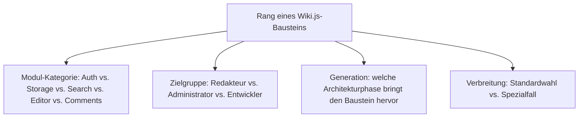
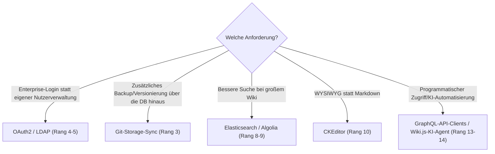

# Beste Wiki.js-Module & Integrationen 2026 — Top-15-Topliste

Die [Evolution und Architekturen von Wiki.js](wikijs-evolution-digitaler.md) ordnet die Produktgeschichte chronologisch nach sechs Generationen — von der Node.js/MongoDB-Erstversion über den vollständigen 2.0-Rewrite mit Vue.js und relationaler Datenbank bis zur modularen Auth-/Storage-/Search-/Editor-Architektur und der aktuellen GraphQL-gestützten KI-Anbindung. Da Wiki.js selbst kein Kategorie-Vergleich, sondern ein Einzelprodukt ist, übersetzt diese Seite die Chronologie stattdessen in eine **nach 2026-Relevanz gerankte Top-15-Liste konkreter Module und Integrationen**, mit denen dieses eine Produkt tatsächlich betrieben wird.

!!! note "Hinweis: feste Modul-Kategorien statt offenem Marketplace"
    Anders als bei XWiki oder DokuWiki gibt es bei Wiki.js keinen offenen Extension-Marketplace — jeder Baustein dieser Liste gehört zu einer der festen Modul-Kategorien aus [Generation 3](wikijs-evolution-digitaler.md#generation-3-modulare-auth-storage-search-editor-architektur-ab-2018) (Auth, Storage, Search, Editor, Comments), zwischen denen direkt im Admin-Interface umgeschaltet wird.

---

## Bewertungskriterien

---

## Top 15 im Überblick

| Rang | Baustein | Modul-Kategorie | Generation | Bedeutung |
|---|---|---|---|---|
| 1 | **Markdown-Editor** (CommonMark) | Editor | 3 (Modulare Architektur) | Standard-Eingabeformat, in praktisch jeder Installation aktiv |
| 2 | **Page Rules** (granulare ACL) | Core-Feature | 4 (Rechte & Mehrsprachigkeit) | Feingranulare Lese-/Schreib-/Verwaltungsrechte pro Seite, Pfad oder Gruppe |
| 3 | **Git-Storage-Sync** | Storage | 3 (Modulare Architektur) | Versioniert Seiteninhalte zusätzlich in einem Git-Repository, direkte Fortsetzung des Git-Sync aus Generation 1 |
| 4 | **OAuth2-Authentifizierung** (Google, GitHub, Azure AD) | Auth | 3 (Modulare Architektur) | Enterprise-/Consumer-SSO ohne eigenen Passwortspeicher |
| 5 | **LDAP/Active-Directory-Auth** | Auth | 3 (Modulare Architektur) | Bindet bestehende Unternehmensverzeichnisse als Authentifizierungsquelle ein |
| 6 | **Locales** (Mehrsprachigkeit) | Core-Feature | 4 (Rechte & Mehrsprachigkeit) | Parallele Sprachversionen derselben Seite als First-Class-Datenmodell |
| 7 | **PostgreSQL-Volltextsuche** (eingebaut) | Search | 2 (Wiki.js 2.0 Rewrite) | Standard-Suchindex ohne externen Dienst, direkt auf der Datenbank aus Generation 2 |
| 8 | **Elasticsearch-Suche** | Search | 3 (Modulare Architektur) | Selbstgehostete Volltextsuche im großen Maßstab für umfangreiche Wikis |
| 9 | **Algolia-Suche** | Search | 3 (Modulare Architektur) | Gehostete, facettierte Suche ohne eigene Suchinfrastruktur |
| 10 | **CKEditor** (WYSIWYG) | Editor | 3 (Modulare Architektur) | WYSIWYG-Alternative für nicht-technische Redakteure, parallel zum Markdown-Editor |
| 11 | **AsciiDoc-Editor** | Editor | 3 (Modulare Architektur) | Alternative Auszeichnungssprache, verbreitet in technischer Dokumentation |
| 12 | **AWS-S3-Storage-Sync** | Storage | 3 (Modulare Architektur) | Zusätzliches Backup-/Sync-Ziel neben Git, insbesondere für Medien-Anhänge |
| 13 | **GraphQL-API-Clients** (eigene Skripte) | Werkzeug | 5 (GraphQL-API-Reife) | Programmatischer Zugriff als Grundlage für Automatisierung und KI-Agenten |
| 14 | **Wiki.js-KI-Agent** (dieses Repository) | Werkzeug | 5 (GraphQL-API-Reife) | Beispiel-Automatisierung auf GraphQL-Basis, siehe [Wiki.js-KI-Agent](wikijs-ki-agent.md) |
| 15 | **Discourse-Kommentarintegration** | Comments | 3 (Modulare Architektur) | Forum-gestützte Diskussion statt der eingebauten, einfacheren Kommentarfunktion |

---

## Highlights im Detail

### Rang 2, 6: die relationale Architektur zahlt sich aus
Page Rules und Locales sind erst durch die relationale Datenbank aus Generation 2 praktikabel geworden — mit dem MongoDB-Modell aus Generation 1 wären beide deutlich aufwendiger umzusetzen gewesen, siehe [Generation 4](wikijs-evolution-digitaler.md#generation-4-granulares-rechte-mehrsprachigkeitssystem-ab-2018).

### Rang 4–5, 8–9: Modul-Vielfalt ohne Marketplace
OAuth2, LDAP, Elasticsearch und Algolia zeigen, wie breit die feste Modul-Architektur trotz fehlendem offenen Marketplace tatsächlich ist — Auswahl statt Installation aus einem Store, siehe [Generation 3](wikijs-evolution-digitaler.md#generation-3-modulare-auth-storage-search-editor-architektur-ab-2018).

### Rang 13–14: die aktuelle Automatisierungs-Generation
GraphQL-API-Clients und der Wiki.js-KI-Agent zeigen, wie die typisierte API aus Generation 2 in Generation 5 zur Grundlage KI-gestützter Pflege wird, siehe [Generation 5](wikijs-evolution-digitaler.md#generation-5-graphql-api-reife-ki-agenten-anbindung-ab-2023).

---

## Wegweiser: von Anforderung zu passendem Baustein

!!! tip "Tipp: die Produkt-Chronologie separat prüfen"
    Diese Liste übersetzt alle sechs Generationen der Quell-Chronologie in eine gemeinsame 2026-Momentaufnahme — für die vollständige Versionsgeschichte siehe [Evolution und Architekturen von Wiki.js](wikijs-evolution-digitaler.md).

---

## Verwandte Themen

- [Evolution und Architekturen von Wiki.js](wikijs-evolution-digitaler.md) — chronologisches Generationenmodell, dessen aktuellen Stand diese Topliste zusammenfasst
- [Wiki.js native Linux-Installation](wikijs-linux-installation.md) — Installationsanleitung
- [Nginx über Unix-Socket anbinden](wikijs-nginx-unix-socket.md) — Reverse-Proxy-Konfiguration
- [Wiki.js-KI-Agent](wikijs-ki-agent.md) — Vertiefung zu Rang 14
- [Evolution und Architekturen digitaler Wiki-Engines](evolution-digitaler-wiki-engines.md) — übergeordnetes Generationenmodell
- [Dokumentationsübersicht](index.md)
