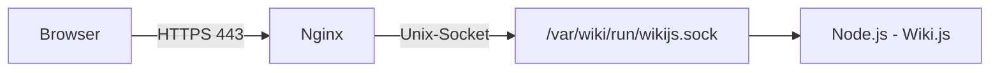

# Wiki.js über Unix-Socket mit Nginx bereitstellen

Statt Wiki.js über einen internen TCP-Port anzusprechen (siehe [Wiki.js nativ unter Linux installieren](wikijs-linux-installation.md), Abschnitt „Netzwerk und Reverse Proxy"), lässt sich Nginx auch über einen **Unix-Domain-Socket** an Wiki.js anbinden. Node.js bindet dann keinen TCP-Port mehr, der lokal erreichbar wäre — die Kommunikation läuft ausschließlich über eine Datei im Dateisystem.

!!! warning "Achtung: kein offiziell dokumentiertes Wiki.js-Feature"
    Wiki.js dokumentiert in seiner [Konfigurationsreferenz](https://docs.requarks.io/install/config) ausschließlich `port` als TCP-Port. Diese Anleitung nutzt stattdessen ein Verhalten von **Node.js selbst**: Wiki.js reicht den Wert von `port` unverändert an `server.listen(port, bindIP)` durch (siehe [`server/core/servers.js`](https://github.com/requarks/wiki/blob/main/server/core/servers.js) im Wiki.js-Quellcode, Stand August 2026). Node.js wiederum erkennt in seiner Argument-Normalisierung (`isPipeName()` in [`lib/net.js`](https://github.com/nodejs/node/blob/main/lib/net.js)), dass ein nicht-numerischer String kein Port, sondern ein Pfad ist, und öffnet stattdessen einen Unix-Socket an diesem Pfad — der zweite Parameter (`bindIP`) wird dabei stillschweigend ignoriert. Dieser Mechanismus ist ein stabiler, seit Langem dokumentierter Bestandteil der Node.js-Netzwerk-API, aber **keine von Wiki.js offiziell unterstützte Konfiguration**. Bei Problemen hilft der offizielle Wiki.js-Support daher vermutlich nicht weiter — vor einem Produktiveinsatz gründlich selbst testen und nach größeren Wiki.js-Updates erneut prüfen.

## Warum trotzdem ein Unix-Socket?

- **Kein offener TCP-Port** zwischen Wiki.js und Nginx — taucht nicht mehr in `ss -ltnp` auf.
- **Zugriffskontrolle über Dateisystemrechte** statt Netzwerk-ACLs.
- Minimal geringerer Overhead gegenüber Loopback-TCP.

## Voraussetzungen

| Voraussetzung | Prüfbefehl |
|---|---|
| laufende Wiki.js-Installation nach [Native Linux-Installation](wikijs-linux-installation.md) | `sudo systemctl status wikijs` |
| Systembenutzer `wikijs` aus dieser Installation | `id wikijs` |
| `sudo`-Rechte | — |
| Nginx als vorgeschalteter Reverse Proxy | `nginx -v` |

## Ablauf



## 1. Socket-Verzeichnis anlegen

```bash
sudo mkdir -p /var/wiki/run
sudo chown wikijs:wikijs /var/wiki/run
sudo chmod 750 /var/wiki/run
```

## 2. Nginx-Benutzer zur `wikijs`-Gruppe hinzufügen

```bash
sudo usermod -aG wikijs www-data
```

Wirksam wird die neue Gruppenmitgliedschaft erst nach einem Neustart von Nginx (siehe Schritt 5).

## 3. `config.yml` anpassen

```bash
sudo nano /var/wiki/config.yml
```

`port` auf den Socket-Pfad setzen; `bindIP` kann stehen bleiben, wird in diesem Fall aber ignoriert:

```yaml
port: /var/wiki/run/wikijs.sock
bindIP: 0.0.0.0
```

## 4. `systemd`-Dienst anpassen

Node.js entfernt die Socket-Datei beim Beenden **nicht automatisch** (anders als z. B. Tomcat bei Unix-Sockets). Ohne Gegenmaßnahme schlägt der nächste Start mit `EADDRINUSE` fehl, weil die alte Datei noch existiert. Außerdem folgt die Zugriffsrechte-Vergabe der Socket-Datei dem Prozess-`umask`, der Standardwert von `systemd` (`0022`) würde der Gruppe keinen Schreibzugriff erlauben.

Beide Punkte lassen sich in der bestehenden `/etc/systemd/system/wikijs.service` beheben:

```ini
[Service]
Type=simple
User=wikijs
Group=wikijs
WorkingDirectory=/var/wiki
Environment=NODE_ENV=production
UMask=0007
ExecStartPre=-/usr/bin/rm -f /var/wiki/run/wikijs.sock
ExecStart=/usr/bin/node server
Restart=on-failure
RestartSec=5
```

Neu hinzugekommen sind `UMask=0007` (Socket wird mit `rwxrwx---` angelegt, `wikijs`-Gruppe erhält Lese- und Schreibzugriff) und `ExecStartPre=-/usr/bin/rm -f …` (entfernt eine eventuell zurückgebliebene Socket-Datei vor jedem Start; das führende `-` sorgt dafür, dass ein Start nicht fehlschlägt, falls die Datei nicht existiert).

```bash
sudo systemctl daemon-reload
sudo systemctl restart wikijs
ls -l /var/wiki/run/wikijs.sock
```

Die Ausgabe sollte etwa so aussehen:

```text
srwxrwx--- 1 wikijs wikijs 0 Aug 10 12:00 /var/wiki/run/wikijs.sock
```

## 5. Nginx-Konfiguration anpassen

`proxy_pass` von TCP auf den Unix-Socket umstellen:

```nginx
server {
    listen 443 ssl http2;
    listen [::]:443 ssl http2;
    server_name wiki.example.org;
    ssl_certificate /etc/letsencrypt/live/wiki.example.org/fullchain.pem;
    ssl_certificate_key /etc/letsencrypt/live/wiki.example.org/privkey.pem;

    location / {
        proxy_pass http://unix:/var/wiki/run/wikijs.sock:/;
        proxy_set_header Host $host;
        proxy_set_header X-Real-IP $remote_addr;
        proxy_set_header X-Forwarded-For $proxy_add_x_forwarded_for;
        proxy_set_header X-Forwarded-Proto $scheme;
    }
}
```

Testen und neu starten (nicht nur `reload`, damit die neue Gruppenmitgliedschaft aus Schritt 2 greift):

```bash
sudo nginx -t
sudo systemctl restart nginx
```

## 6. Test

Direkt über den Socket, ohne Nginx:

```bash
curl --unix-socket /var/wiki/run/wikijs.sock http://localhost/
```

Anschließend über die öffentliche Domain im Browser aufrufen.

## Fehlerbehandlung

### Wiki.js startet nicht, `EADDRINUSE`

```bash
sudo journalctl -u wikijs -n 50 --no-pager
```

Tritt der Fehler trotz `ExecStartPre` weiterhin auf, manuell prüfen und bereinigen:

```bash
sudo systemctl stop wikijs
sudo rm -f /var/wiki/run/wikijs.sock
sudo systemctl start wikijs
```

### Nginx meldet „Permission denied" beim Verbindungsaufbau

```bash
sudo tail -f /var/log/nginx/error.log
```

Erscheint `connect() to unix:/…/wikijs.sock failed (13: Permission denied)`, fehlt entweder die Gruppenmitgliedschaft aus Schritt 2, `UMask=0007` wurde nicht übernommen, oder Nginx wurde seither nicht neu gestartet:

```bash
id www-data
stat -c "%a %U:%G" /var/wiki/run/wikijs.sock
```

### Rückbau auf TCP-Port

`port` in `config.yml` wieder auf eine Portnummer (z. B. `3000`) setzen, `UMask=` und `ExecStartPre=` aus der `systemd`-Unit entfernen, `daemon-reload` und `restart wikijs` ausführen, und `proxy_pass` in der Nginx-Konfiguration wieder auf `http://127.0.0.1:3000/` ändern.

## Weiterführende Seiten

- [Wiki.js nativ unter Linux installieren](wikijs-linux-installation.md)
- [Wiki.js-Agenten-Pipeline](wikijs-ki-agent.md)
- [Wiki.js: Konfigurationsreferenz](https://docs.requarks.io/install/config)
- [XWiki über Unix-Socket anbinden](xwiki/xwiki-nginx-unix-socket.md) – gleiches Muster für Tomcat/XWiki
- [Nginx-Härtung](../../entwicklung/infrastruktur/nginx-hardening.md)
