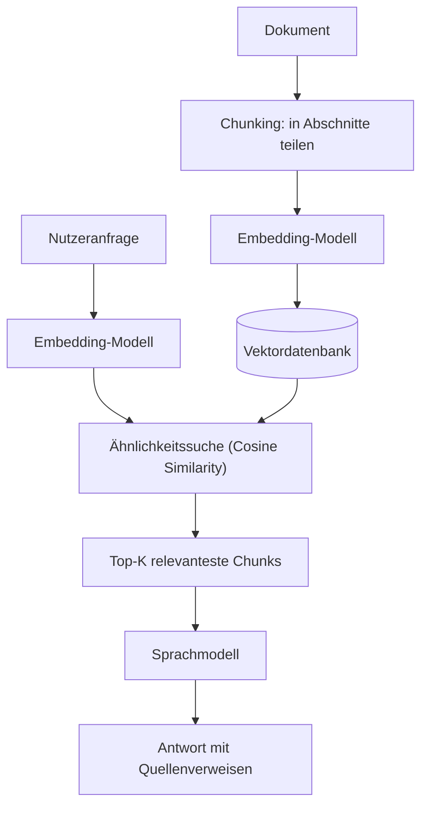

# Wissensdatenbanken mit KI & semantischer Suche

Klassische Volltextsuche findet nur, was **wörtlich** in einem Dokument steht — eine Suche nach „Auto" übersieht ein Dokument, das nur „Fahrzeug" oder „PKW" verwendet. **KI-gestützte Wissensdatenbanken** lösen das, indem sie Inhalte über **Vektordatenbanken** und **Sprachmodelle** nach **Bedeutung** statt nach exakten Begriffen durchsuchbar machen. Dieses Kapitel erklärt die technische Grundlage, auf der praktisch alle bisher in diesem Repository dokumentierten RAG-Plattformen aufbauen — [AnythingLLM](anythingllm-rag-plattform.md), [Onyx](onyx-danswer-rag-plattform.md), [Open WebUI](open-webui-rag-agenten-plattform.md), [Dify](dify-agenten-workflow-plattform.md), [Flowise](flowise-visueller-flow-builder.md) und [Khoj](khoj-ki-zweites-gehirn.md).

!!! note "Hinweis: Vertiefung zur Gesamtübersicht"
    Diese Seite vertieft Abschnitt „[RAG- & KI-Zentrierte Wissensdatenbanken](index.md#6-rag-ki-zentrierte-wissensdatenbanken-rag-co-wikis)" der [Dokumentations-Übersicht](index.md) mit den konkreten technischen Mechanismen dahinter.

---

## Übersicht

---

## Semantische Suche vs. Volltextsuche

| Kriterium | Volltextsuche (Keyword/BM25) | Semantische Suche (Embeddings) |
|---|---|---|
| Findet Synonyme? | nein — „Auto" findet kein „Fahrzeug" | ja — beide liegen im Vektorraum nahe beieinander |
| Findet exakte IDs/Codes? | sehr gut | schwächer — Bedeutungsnähe ist bei Codes/Eigennamen oft irrelevant |
| Rechenaufwand | gering (invertierter Index) | höher (Embedding-Berechnung + Vektorsuche) |
| Typischer Algorithmus | BM25/TF-IDF | Cosine Similarity / Approximate Nearest Neighbor (ANN) |

!!! tip "Tipp: Hybrid-Suche kombiniert beide Stärken"
    Reine semantische Suche versagt bei exakten Fachbegriffen, Fehlercodes oder Eigennamen — reine Volltextsuche versagt bei Synonymen und umformulierten Fragen. Produktionsreife Systeme wie [Onyx](onyx-danswer-rag-plattform.md#architektur-bausteine) kombinieren deshalb einen **Hybrid-Index aus Vektor- und Keyword-Suche**, statt sich auf eine der beiden Methoden zu verlassen.

---

## Wie Embeddings funktionieren

Ein **Embedding-Modell** übersetzt Text (ein Chunk, ein Satz, eine Anfrage) in einen **hochdimensionalen Vektor** — eine Liste von Zahlen, die die Bedeutung des Texts kodiert. Texte mit ähnlicher Bedeutung erzeugen Vektoren, die im Vektorraum **nahe beieinander** liegen, gemessen z. B. per **Cosine Similarity**. Eine Suche wird dadurch zu einer geometrischen Operation: „finde die Vektoren, die dem Anfrage-Vektor am nächsten liegen" statt „finde Dokumente mit exakt diesem Wort".

Gängige Embedding-Modelle reichen von Cloud-APIs (OpenAI `text-embedding-3`, Cohere Embed) bis zu lokal betreibbaren Modellen (`nomic-embed-text`, BGE-Familie) über [Ollama](../../künstliche-intelligenz/coding/lokales-rag-ollama.md) — siehe [Multi-LLM- & Sprachmodell-Anbieter im Vergleich](../../künstliche-intelligenz/coding/llm-anbieter-vergleich.md) für Preise/Einordnung.

---

## Chunking-Strategien

Dokumente werden vor der Vektorisierung in **Chunks** (Abschnitte) zerlegt — zu große Chunks verwässern die Bedeutung, zu kleine Chunks verlieren Kontext:

| Strategie | Funktionsweise |
|---|---|
| **Zeichenbasiert** | feste Zeichenanzahl pro Chunk, einfachste Variante |
| **Tokenbasiert** | Chunk-Grenzen an Modell-Token statt Zeichen ausgerichtet |
| **Markdown-Header-Splitting** | Chunk-Grenzen an Überschriften, erhält Dokumentstruktur |
| **Chunk-Overlap** | benachbarte Chunks überlappen sich leicht, um Kontext an Chunk-Grenzen nicht zu verlieren |

[Open WebUI](open-webui-rag-agenten-plattform.md#rag-funktionen) implementiert alle vier Optionen konfigurierbar und dokumentiert, dass eine gut gewählte **Chunk-Mindestgröße** die Gesamt-Chunk-Zahl um über 90 % reduzieren kann, ohne die Trefferqualität zu verschlechtern — ein konkretes Beispiel dafür, wie stark Chunking-Entscheidungen die Suchqualität beeinflussen.

---

## Vektordatenbanken im Vergleich

| Datenbank | Betriebsmodell | In diesem Repository verwendet von |
|---|---|---|
| **LanceDB** | eingebettet, keine externe Infrastruktur | [AnythingLLM](anythingllm-rag-plattform.md) (Standard), [Open WebUI](open-webui-rag-agenten-plattform.md) |
| **Chroma** | eingebettet oder Server-Modus | AnythingLLM, Flowise |
| **PGVector** | PostgreSQL-Erweiterung, selbst gehostet | AnythingLLM, Open WebUI, Khoj — siehe [PostgreSQL + pgvector](../daten/datenbanken/pgvector-anleitung.md) |
| **Qdrant** | selbst gehostet oder Cloud | AnythingLLM, Open WebUI, Flowise |
| **Milvus** | selbst gehostet, für große Skalierung | AnythingLLM, Open WebUI |
| **Weaviate** | selbst gehostet oder Cloud | AnythingLLM |
| **Pinecone** | vollständig gemanagt (Cloud) | AnythingLLM, Flowise |
| **Zilliz** | gemanagtes Milvus | AnythingLLM |

!!! note "Hinweis: Eingebettet vs. selbst gehostet vs. gemanagt"
    Eingebettete Datenbanken (LanceDB, Chroma) brauchen keine zusätzliche Infrastruktur und eignen sich für Einzelnutzer oder kleine Teams. Selbst gehostete Server-Lösungen (Qdrant, Milvus, PGVector) skalieren besser für viele gleichzeitige Nutzer, benötigen aber eigenen Betrieb. Gemanagte Cloud-Dienste (Pinecone, Zilliz) entfallen den Betriebsaufwand vollständig, kosten dafür laufend.

---

## Von der Suche zur Antwort: RAG-Pipeline

Semantische Suche allein liefert nur relevante Textabschnitte — **Retrieval-Augmented Generation (RAG)** fügt den entscheidenden zweiten Schritt hinzu: Die gefundenen Top-K-Chunks werden zusammen mit der Nutzerfrage als Kontext an ein Sprachmodell übergeben, das daraus eine zusammenhängende, mit Quellenverweisen versehene Antwort formuliert — statt nur eine Liste von Fundstellen zurückzugeben.

!!! warning "Achtung: RAG ≠ das LLM-Wiki-Pattern"
    RAG durchsucht bei **jeder** Anfrage erneut die Rohdaten. Das [LLM-Wiki-Pattern (Karpathy-Muster)](llm-wiki-pattern-karpathy.md) verfolgt einen anderen Ansatz: Wissen wird **einmalig** in ein strukturiertes Wiki kompiliert, Anfragen laufen danach gegen das kompilierte Artefakt statt gegen die Vektordatenbank. Beide Ansätze schließen sich nicht aus — viele Systeme kombinieren beides.

---

## Werkzeuglandschaft im Vergleich

| Tool | Vektordatenbank(en) | Suchmodus |
|---|---|---|
| [AnythingLLM](anythingllm-rag-plattform.md) | LanceDB (Standard) + 6 weitere wählbar | rein semantisch |
| [Onyx](onyx-danswer-rag-plattform.md) | fest integrierter Hybrid-Index | Hybrid (Vektor + Keyword) |
| [Open WebUI](open-webui-rag-agenten-plattform.md) | eingebettet oder Qdrant/Milvus/PGVector | rein semantisch, konfigurierbares Chunking |
| [Dify](dify-agenten-workflow-plattform.md) | RAG-Engine als Teil der Workflow-Engine | semantisch, in Workflow-Knoten einbindbar |
| [Flowise](flowise-visueller-flow-builder.md) | 100+ Integrationen (Pinecone, Chroma, Qdrant, …) | semantisch, per Node frei konfigurierbar |
| [Khoj](khoj-ki-zweites-gehirn.md) | PostgreSQL + pgvector | rein semantisch |

---

## Verwandte Themen

- [Startseite](../../index.md) — zurück zur Dokumentations-Zentrale
- [Dokumentenerstellung, Wikis & Notebooks](index.md#6-rag-ki-zentrierte-wissensdatenbanken-rag-co-wikis) — Gesamtübersicht der RAG-Co-Wiki-Kategorie
- [PostgreSQL + pgvector](../daten/datenbanken/pgvector-anleitung.md) — praktische Installationsanleitung für eine selbst gehostete Vektordatenbank
- [LLM-Wiki-Pattern (Karpathy-Muster)](llm-wiki-pattern-karpathy.md) — Alternative/Ergänzung zu RAG: einmalig kompiliertes Wiki statt Suche bei jeder Anfrage
- [Lokales RAG & LLM-Serving](../../künstliche-intelligenz/coding/lokales-rag-ollama.md) — Grundlagen zum lokalen Betrieb von Embedding- und Sprachmodellen
- [Multi-LLM- & Sprachmodell-Anbieter im Vergleich](../../künstliche-intelligenz/coding/llm-anbieter-vergleich.md) — Preise der Cloud-Embedding-/LLM-Anbieter
