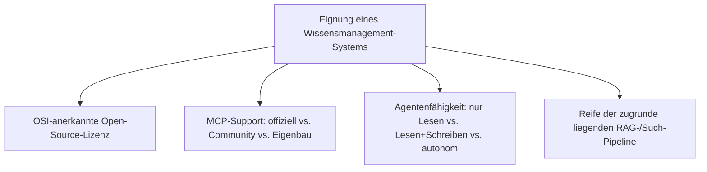
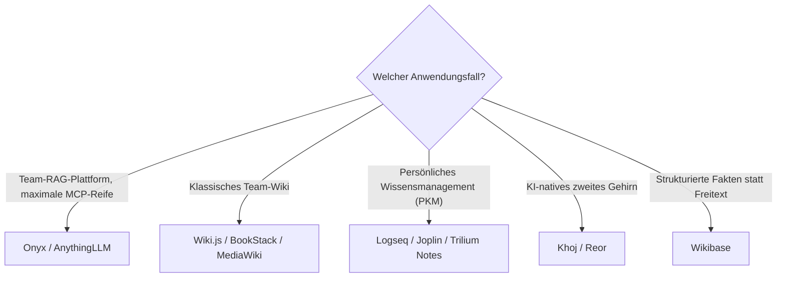

# Beste Wissensmanagement-Systeme (Open Source) mit MCP-Server — Top-20-Topliste

Die [Übersicht der Open-Source-Systeme mit vollständiger LLM-, Agenten- & MCP-Unterstützung](open-source-llm-agent-mcp-systeme.md) filtert quer über Wiki, Wissensmanagement und CMS nach der engsten Schnittmenge. Diese Seite vertieft ausschließlich die **Wissensmanagement-/Wiki-Kategorie** und rankt sie als Top-20-Topliste — inklusive Nischen-Tools wie Notiz-Apps und persönlichem Wissensmanagement (PKM), die in der Gesamtübersicht keinen Platz hatten.

!!! note "Hinweis: Nur OSI-anerkannte Lizenzen in der Haupttabelle"
    Systeme mit technisch starker MCP-Integration, aber nicht OSI-anerkannter Lizenz (z. B. **Outline** unter Business Source License) stehen separat unter „Lizenz-Sonderfälle" — konsistent mit der Handhabung in der [Gesamtübersicht](open-source-llm-agent-mcp-systeme.md#lizenz-sonderfalle-technisch-fuhrend-aber-nicht-osi-open-source).

---

## Bewertungskriterien

!!! warning "Achtung: PKM-Tools (persönliches Wissensmanagement) oft nur Community-MCP"
    Anders als bei den großen RAG-Plattformen (Onyx, AnythingLLM) stammt MCP-Support bei klassischen Notiz-/PKM-Tools (Joplin, Logseq, TiddlyWiki …) fast immer von der Community, nicht vom Kernteam. Funktionsumfang und Pflegezustand entsprechend vor Produktiveinsatz prüfen. **Stand: Juli 2026.**

---

## Top 20 im Überblick

| Rang | System | Kategorie | Lizenz | MCP-Support | Agentenfähigkeit | Besondere Stärke |
|---|---|---|---|---|---|---|
| 1 | **[Onyx](onyx-danswer-rag-plattform.md)** (ehem. Danswer) | Wissensmanagement/RAG | MIT (Community Edition) | **offiziell** (`onyx-mcp-server`) | Lesen+Schreiben, native Agents mit Actions | 50+ Connectoren, übernimmt bestehende Zugriffsrechte aus Quellsystemen |
| 2 | **AnythingLLM** | Wissensmanagement/RAG | MIT | **offiziell** (nativ seit 2025) | Lesen+Schreiben über Agent Skills | Vollständig lokal via Ollama betreibbar, sehr geringe Einstiegshürde |
| 3 | **[Wiki.js](klassische-wiki-systeme-llm-integration.md)** | Wiki | AGPL-3.0 | Community (GraphQL-basiert) | Lesen+Schreiben (CRUD, Seiten verschieben) | Moderne GraphQL-API erleichtert MCP-Server-Eigenbau erheblich |
| 4 | **BookStack** | Wiki | MIT | Community (REST-basiert) | Lesen+Schreiben | Einfache Hierarchie (Bücher/Kapitel/Seiten) erleichtert Agenten-Navigation |
| 5 | **[MediaWiki](mediawiki/mediawiki-ki-agent.md)** | Wiki | GPL-2.0 | Eigenbau (kein Standard-Server im Ökosystem) | Lesen+Schreiben, Human-in-the-Loop-Entwürfe | Größtes Wiki-Ökosystem der Welt, Action-API als solide MCP-Grundlage |
| 6 | **Docmost** | Wissensmanagement (Confluence-Alternative) | AGPL-3.0 | Community | Lesen+Schreiben | Moderne, kollaborative Doku-Plattform mit wachsender API-/MCP-Anbindung |
| 7 | **[XWiki](xwiki/installieren.md)** | Wiki | LGPL-2.1 | kein MCP-Server, offizielle LLM-Extension mit RAG-Chatbot | Lesen (Chat-Antworten) | On-Premise-fähige RAG-Integration ohne Cloud-Zwang |
| 8 | **DokuWiki** | Wiki | GPL-2.0 | kein MCP-Server, offizielle AIChat-/AI-Agent-Plugins | Lesen+Schreiben, respektiert ACL vollständig | Dateibasiert ohne Datenbank, sehr einfache Eigenbau-MCP-Anbindung |
| 9 | **Logseq** | PKM / Outliner-Notizen | AGPL-3.0 | Community | Lesen+Schreiben | Blockbasierte, verknüpfte Notizen ideal für Agent-gestützte Wissensgraphen |
| 10 | **Joplin** | PKM / Notizen | MIT | Community | Lesen+Schreiben (über REST-API-Server-Anbindung) | Eingebaute REST-API vereinfacht MCP-Server-Eigenbau |
| 11 | **Trilium Notes** | PKM / hierarchische Notizen | AGPL-3.0 | Community | Lesen+Schreiben | Sehr mächtiges hierarchisches Notizmodell mit Skripting-Unterstützung |
| 12 | **SilverBullet** | PKM / Markdown-Wiki | MIT | Community | Lesen+Schreiben | Plattform-Ansatz mit eingebautem Plug-System, gut für Agent-Erweiterungen |
| 13 | **AFFiNE** | Wissensmanagement / Whiteboard-Notizen | MIT | Community | Lesen+Schreiben | Kombiniert Dokumente, Whiteboards und Datenbanken in einem Tool |
| 14 | **TiddlyWiki** | PKM / Non-lineares Wiki | BSD-3-Clause | Community | Lesen+Schreiben | Einzeldatei-Wiki, extrem portabel, gut scriptbar für Eigenbau-Anbindung |
| 15 | **Memos** | Leichtgewichtige Notizen | MIT | Community | Lesen+Schreiben | Sehr schlankes Self-Hosting, schnelle API für einfache Agent-Anbindung |
| 16 | **Khoj** | PKM / KI-natives „zweites Gehirn" | AGPL-3.0 | Community (nativ agentenorientiert) | Lesen+Schreiben, Suche über mehrere Notiz-Quellen hinweg | Von Grund auf für LLM-gestützte Wissenssuche konzipiert, nicht nachgerüstet |
| 17 | **Wikibase** (Wikidata-Basis) | Strukturiertes Wissensmanagement | GPL-2.0 | Community (SPARQL-/API-basiert) | Lesen (strukturierte Abfragen), Schreiben über Bot-Konten | Ideal für Agenten, die strukturierte Fakten statt Freitext benötigen |
| 18 | **[OpenWiki](openwiki-repo-dokumentation-agent.md)** (LangChain) | Wissensmanagement/Repo-Doku | MIT | Sonderfall: keine MCP-Verbindung, Referenzen in `AGENTS.md`/`CLAUDE.md` | Lesen+Schreiben (generiert & aktualisiert Wiki-Dateien) | Agentenfreundlich ganz ohne klassischen MCP-Server nötig |
| 19 | **Karakeep** (ehem. Hoarder) | PKM / Bookmark-Wissensbasis | MIT | Community | Lesen+Schreiben | Automatische Kategorisierung gespeicherter Links als Agent-Kontextquelle |
| 20 | **Reor** | PKM / lokal-KI-natives Notizsystem | AGPL-3.0 | Community (früh, experimentell) | Lesen (semantische Suche) | Vollständig lokale Embeddings ohne Cloud-Abhängigkeit |

---

## Lizenz-Sonderfall

!!! warning "Achtung: Quellcode einsehbar ≠ Open Source"
    **Outline** bringt seit April 2026 in jedem Workspace einen offiziellen, sehr ausgereiften MCP-Server mit (Suchen, Lesen, Erstellen, Bearbeiten, Kommentare, Verschieben). Die Lizenz ist jedoch die **Business Source License (BSL)**, nicht OSI-anerkannt — siehe [Gesamtübersicht](open-source-llm-agent-mcp-systeme.md#lizenz-sonderfalle-technisch-fuhrend-aber-nicht-osi-open-source) für Details. Wer strikt OSI-Open-Source benötigt, greift stattdessen zu Rang 1 (Onyx) oder Rang 2 (AnythingLLM).

---

## Entscheidungshilfe nach Anwendungsfall

---

## 🔗 Verwandte Themen

- [Startseite](../../index.md) — zurück zur Dokumentations-Zentrale
- [Open-Source Systeme mit vollständiger LLM-, Agenten- & MCP-Unterstützung](open-source-llm-agent-mcp-systeme.md) — Gesamtübersicht über Wiki, Wissensmanagement & CMS
- [Beste CMS-Systeme (Open Source) mit MCP-Server (Top 20)](cms-mcp-server-topliste.md) — Gegenstück für Content-Management-Systeme
- [Beste Open-Source-Software mit MCP-Server (Top 20)](../../künstliche-intelligenz/coding/mcp-server-opensource-software-topliste.md) — MCP-Server jenseits von Wissensmanagement/CMS
- [Klassische Wiki-Systeme mit LLM-Integration](klassische-wiki-systeme-llm-integration.md) — Ausgangspunkt für Rang 3, 5, 7, 8
- [Onyx (ehem. Danswer): RAG-Plattform](onyx-danswer-rag-plattform.md) — vertiefend zu Rang 1
- [OpenWiki: Repo-Dokumentations-Agent (LangChain)](openwiki-repo-dokumentation-agent.md) — vertiefend zu Rang 18
- [Beste MCP-Server (Top 20)](../../künstliche-intelligenz/coding/mcp-server-topliste.md) — protokollnahe Referenzserver
