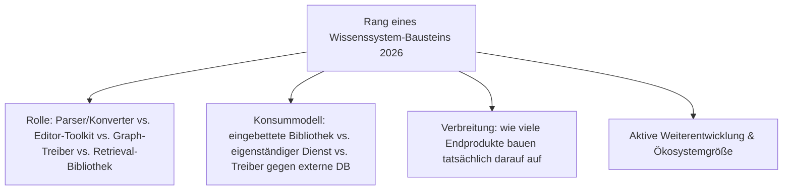
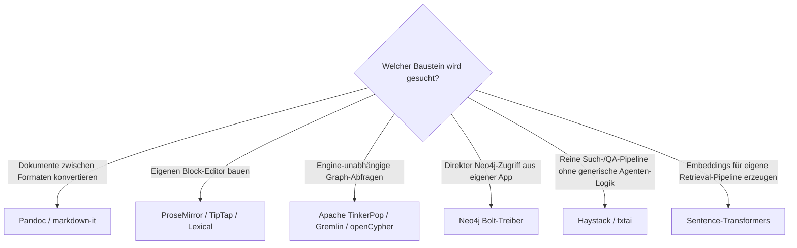

# Beste Frameworks & Bibliotheken für Wissenssysteme 2026 — Top-20-Topliste

Die [Evolution und Architekturen digitaler Frameworks & Bibliotheken für Wissenssysteme](evolution-digitaler-wissenssystem-frameworks.md) verfolgt die Bauteil-Schicht **hinter** fertigen Wikis, PKM-Tools und Docs-Plattformen — Parser, Konverter, Editor-Toolkits, Graph-Treiber und Retrieval-Bibliotheken. Diese Seite übersetzt die Chronologie in eine **Momentaufnahme 2026**: 20 Entwickler-Bausteine, mit denen sich eigene Wissenssystem-Produkte bauen lassen, quer über alle fünf Rollen hinweg.

!!! note "Hinweis: Bauteil-Ebene statt Endprodukt"
    Diese Seite rankt **Bibliotheken für Entwickler**, nicht fertige Wissenssystem-Produkte — die entsprechenden Produkt-Toplisten sind [Die führenden Open-Source-Wissenssysteme 2026](fuehrende-opensource-wissenssysteme-2026-topliste.md) und [Beste semantische & RAG-Wissenssysteme 2026](semantische-rag-wissenssysteme-2026-topliste.md). Drei Bibliotheken (Haystack, txtai, Neo4j) erscheinen in beiden Listen — dort als austauschbarer Baustein in einem RAG-/Graph-Stack, hier als eigenständige Entwickler-Bibliothek neben Parsern und Editor-Toolkits aus ganz anderen Rollen.

---

## Bewertungskriterien

!!! warning "Achtung: Manche Bausteine sind unsichtbare Infrastruktur"
    Ein großer Teil dieser Liste (insbesondere Rang 1–2, 10–14, 18) läuft unsichtbar hinter fertigen Produkten, ohne dass Endnutzer den Baustein je bewusst wahrnehmen — Verbreitung bemisst sich hier an der Zahl der Produkte, die darauf aufbauen, nicht an eigener Endnutzer-Bekanntheit. **Stand: August 2026.**

---

## Top 20 im Überblick

| Rang | Bibliothek/Framework | Generation | Rolle | Besondere Stärke |
|---|---|---|---|---|
| 1 | **[Pandoc](../tools/pandoc.md)** | 2 (Universelle Dokumentkonverter) | Parser/Konverter | „Schweizer Taschenmesser" der Dokumentkonvertierung, Dutzende Formate über ein gemeinsames AST |
| 2 | **Parsoid** | 1c (Formale Grammatik & DOM-Brücke) | Parser/Konverter | Verlustfreie Wikitext-↔-HTML-Übersetzung, Grundlage für WYSIWYG-Wiki-Editoren |
| 3 | **markdown-it** | 1 (Markup-Parser, moderne Linie) | Parser/Konverter | Meistgenutzter erweiterbarer Markdown-Parser hinter zahllosen Docs-/Wiki-Produkten |
| 4 | **ProseMirror** | 3 (Rich-Text-/Block-Editor-Toolkits) | Editor-Toolkit | Schema-getriebenes Fundament, auf dem ein Großteil moderner Block-Editoren aufbaut |
| 5 | **TipTap** | 3 (Rich-Text-/Block-Editor-Toolkits) | Editor-Toolkit | Meistgenutzter Headless-Wrapper um ProseMirror mit fertigen Erweiterungen |
| 6 | **Lexical** | 3 (Rich-Text-/Block-Editor-Toolkits, moderne Linie) | Editor-Toolkit | Metas performance-fokussiertes, hochgradig erweiterbares Editor-Framework |
| 7 | **Slate.js** | 3 (Rich-Text-/Block-Editor-Toolkits) | Editor-Toolkit | React-natives, vollständig anpassbares Rich-Text-Framework |
| 8 | **Editor.js** | 3 (Rich-Text-/Block-Editor-Toolkits) | Editor-Toolkit | Blockbasierte JSON-Ausgabe statt HTML — beliebt in Headless-CMS-Integrationen |
| 9 | **Remirror** | 3 (Rich-Text-/Block-Editor-Toolkits) | Editor-Toolkit | React-Toolkit-Schicht direkt auf ProseMirror, deklarative Erweiterungs-API |
| 10 | **Apache TinkerPop / Gremlin** | 4 (Graph-Query-Frameworks) | Datenbank-Treiber/Query-Framework | Engine-unabhängige Graph-Traversierung — dieselbe Abfrage läuft gegen mehrere Graph-DBs |
| 11 | **Neo4j Bolt-Treiber** (offizielle Sprachtreiber) | 4 (Graph-Query-Frameworks) | Datenbank-Treiber/Query-Framework | Reifste, am breitesten unterstützte offizielle Treiberfamilie für Property-Graphen |
| 12 | **openCypher** | 4 (Graph-Query-Frameworks) | Datenbank-Treiber/Query-Framework | Offener Standard der Cypher-Abfragesprache, über Neo4j hinaus implementiert |
| 13 | **FalkorDB-Client-Bibliotheken** (ehem. RedisGraph) | 4 (Graph-Query-Frameworks, moderne Linie) | Datenbank-Treiber/Query-Framework | Property-Graph-Zugriff auf Redis-Basis, beliebt für latenzkritische Graph-Abfragen |
| 14 | **py2neo** | 4 (Graph-Query-Frameworks, historisch) | Datenbank-Treiber/Query-Framework | Frühe Python-Bibliothek, in vielen älteren Wissenssystem-Codebasen weiterhin im Einsatz |
| 15 | **[Haystack](semantische-rag-wissenssysteme-2026-topliste.md)** (deepset) | 5 (Retrieval-Bibliotheken) | Retrieval-Bibliothek | Dedizierte Such-/Frage-Antwort-Pipeline mit klassischen-Information-Retrieval-Wurzeln |
| 16 | **[txtai](semantische-rag-wissenssysteme-2026-topliste.md)** | 5 (Retrieval-Bibliotheken) | Retrieval-Bibliothek | Eingebettete All-in-one-Bibliothek: Embeddings, Vektorindex und Suche in einem Paket |
| 17 | **LlamaIndex** (als Daten-Framework) | 5 (Retrieval-Bibliotheken) | Retrieval-Bibliothek | Fokussiert auf das Verbinden eigener Datenbestände mit LLMs statt allgemeiner Agenten |
| 18 | **Sentence-Transformers** | 5 (Retrieval-Bibliotheken, Fundament) | Retrieval-Bibliothek | Meistgenutzte Bibliothek zur Embedding-Erzeugung, Fundament fast aller Retrieval-Pipelines |
| 19 | **txt2tags** | 2 (Universelle Dokumentkonverter, historisch) | Parser/Konverter | Früher Vorläufer der Pandoc-Idee, in einfachen Klartext-Toolchains weiterhin präsent |
| 20 | **Quill.js** | 3 (Rich-Text-/Block-Editor-Toolkits, historisch) | Editor-Toolkit | Früher, eigenständiger Rich-Text-Editor mit eigenem Delta-Änderungsformat |

---

## Highlights im Detail

### Rang 4–9: sechs Editor-Toolkits, drei technische Generationen
ProseMirror (2015) bleibt das architektonische Fundament, auf dem TipTap und Remirror direkt aufbauen — Lexical (Meta) und Editor.js verfolgen dagegen eigenständige, jüngere Architekturansätze. Slate.js und Quill.js zeigen die Bandbreite: React-nativ vollständig anpassbar (Slate) versus früher, in sich geschlossener Standalone-Editor (Quill).

### Rang 10–14: Property-Graphen als pragmatischere Alternative zu RDF
Anders als die formalen RDF-/SPARQL-Triplestores aus [Generation 1 der Semantischen-&-RAG-Zeitachse](evolution-digitaler-semantische-rag-wissenssysteme.md#generation-1-semantic-web-symbolische-wissensgraphen-1999-2012) setzen alle fünf Bausteine dieser Gruppe auf Knoten-Kanten-Modelle mit imperativer statt deklarativer Traversierung — TinkerPop/Gremlin bleibt dabei die einzige wirklich engine-unabhängige Wahl.

### Rang 15–18: Retrieval-Bibliotheken vs. allgemeine RAG-Frameworks
Haystack, txtai, LlamaIndex und Sentence-Transformers unterscheiden sich von den generischen Orchestrierungs-Frameworks (LangChain, siehe [semantische-rag-wissenssysteme-2026-topliste.md](semantische-rag-wissenssysteme-2026-topliste.md)) durch ihren engeren Fokus: Sie lösen ausschließlich das Such-/Retrieval-Problem, statt allgemeine Agenten-Ketten zu orchestrieren.

---

## Entscheidungshilfe nach Baustellen-Typ

---

## 🔗 Verwandte Themen

- [Startseite](../../index.md) — zurück zur Dokumentations-Zentrale
- [Evolution und Architekturen digitaler Frameworks & Bibliotheken für Wissenssysteme](evolution-digitaler-wissenssystem-frameworks.md) — chronologisches Generationenmodell, dessen aktuellen Stand diese Topliste zusammenfasst
- [Beste semantische & RAG-Wissenssysteme 2026 (Top 20)](semantische-rag-wissenssysteme-2026-topliste.md) — Schwester-Topliste, dort Haystack/txtai/Neo4j als RAG-/Graph-Stack-Baustein statt eigenständige Entwickler-Bibliothek
- [Die führenden Open-Source-Wissenssysteme 2026 (Top 20)](fuehrende-opensource-wissenssysteme-2026-topliste.md) — Produktebene, die auf vielen Bausteinen dieser Liste aufbaut
- [Evolution und Architekturen digitaler Rust-Wissenssysteme](evolution-digitaler-rust-wissenssysteme.md) — Rust-spezifische Teilmenge derselben Bauteil-Schicht (Tantivy, ftml, yrs, Candle)
- [Pandoc installieren & nutzen](../tools/pandoc.md) und [Pandoc-Export-Pipeline](../tools/pandoc-export-pipeline.md) — praktische Anleitung zu Rang 1
- [Evolution und Architekturen von MediaWiki](mediawiki/evolution-digitaler-mediawiki.md) — vertiefende Produktgeschichte zu Rang 2 (Parsoid)
- [Evolution und Architekturen digitaler Programmiersprachen für Wissenssysteme](evolution-digitaler-wissenssystem-programmiersprachen.md) — Nachbarachse auf Sprachebene statt Framework-/Bibliotheksebene
