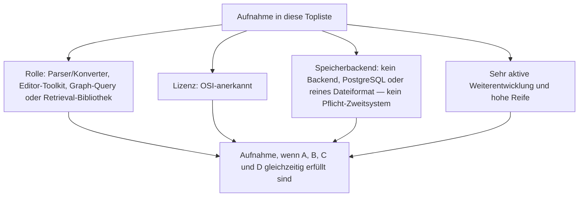
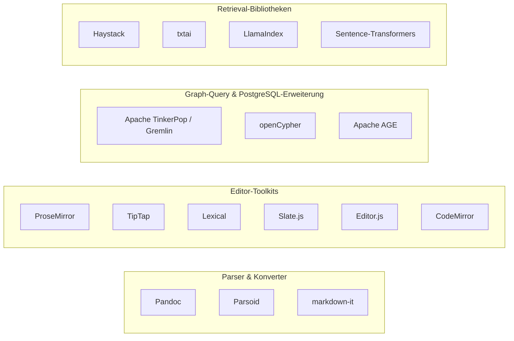
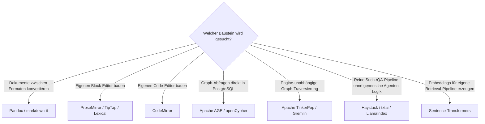

# Frameworks & Bibliotheken für Wissenssysteme mit PostgreSQL- oder Dateiformat-Speicherung, aktiver Weiterentwicklung & hoher Reife — Top-16-Topliste

Die [Beste Frameworks & Bibliotheken für Wissenssysteme 2026 (Top 20)](wissenssystem-frameworks-2026-topliste.md) rankt die Bauteil-Schicht hinter fertigen Wikis, PKM-Tools und Docs-Plattformen — Parser, Editor-Toolkits, Graph-Treiber und Retrieval-Bibliotheken —, unabhängig von Lizenz und Speicherarchitektur. Diese Seite wendet auf genau dieselbe Kategorie die inzwischen etablierten strengeren Kriterien an: nur OSI-Open-Source, Persistenz ausschließlich in PostgreSQL oder einem reinen Dateiformat, sehr aktive Weiterentwicklung, hohe Reife.

!!! note "Hinweis: Die meisten Bausteine haben ohnehin kein eigenes Speicherbackend"
    Parser, Konverter und Editor-Toolkits speichern grundsätzlich nichts selbst — sie verarbeiten, was die einbindende Anwendung ihnen übergibt. Das Speicherkriterium wird hier vor allem für die Graph-Treiber- und Retrieval-Bibliotheks-Gruppe relevant, wo einige Bausteine untrennbar an eine bereits an anderer Stelle ausgeschlossene dedizierte Datenbank gekoppelt sind (siehe Ausschluss-Abschnitt).

!!! tip "Tipp: Nur OSI-anerkannte Lizenzen"
    Wie in der [Gesamtübersicht](open-source-llm-agent-mcp-systeme.md) zählen hier ausschließlich Systeme unter einer OSI-anerkannten Open-Source-Lizenz (MIT, GPL, Apache-2.0, BSD).

---

## Bewertungskriterien

!!! warning "Achtung: Momentaufnahme, Stand August 2026 — bewusst kürzer als 20"
    Von den 20 Bausteinen der [Basis-Topliste](wissenssystem-frameworks-2026-topliste.md) fallen sechs heraus: Neo4j-Bolt-Treiber, FalkorDB-Client-Bibliotheken und py2neo sind untrennbar an eine bereits in anderen Toplisten dieser Dokumentation ausgeschlossene dedizierte Graph-/Redis-Datenbank gekoppelt (py2neo zudem seit einigen Jahren offiziell eingestellt); Remirror hat gegenüber TipTap deutlich geringere Verbreitung; txt2tags und Quill.js stuft die Basis-Topliste selbst bereits als „historisch" ein. Ergänzt um zwei zusätzliche, bislang nicht gelistete Bausteine (CodeMirror, Apache AGE) reicht es dennoch nur zu 16 statt 20 Rängen.

---

## Top 16 im Überblick

| Rang | Bibliothek/Framework | Rolle | Lizenz | Speicherbackend | Aktivität/Reife |
|---|---|---|---|---|---|
| 1 | **[Pandoc](../tools/pandoc.md)** | Parser/Konverter | GPL-2.0-or-later | Kein Backend — arbeitet auf Dateien | „Schweizer Taschenmesser" der Dokumentkonvertierung, extrem reif seit 2006 |
| 2 | **Parsoid** | Parser/Konverter | GPL-2.0 | Kein Backend | Von der Wikimedia Foundation gepflegt, aktiv |
| 3 | **markdown-it** | Parser/Konverter | MIT | Kein Backend | Meistgenutzter erweiterbarer Markdown-Parser, sehr aktiv |
| 4 | **ProseMirror** | Editor-Toolkit | MIT | Kein Backend | Architektonisches Fundament der Editor-Toolkit-Gruppe, sehr aktiv |
| 5 | **TipTap** | Editor-Toolkit | MIT | Kein Backend | Meistgenutzter ProseMirror-Wrapper, sehr aktiv |
| 6 | **Lexical** | Editor-Toolkit | MIT | Kein Backend | Meta-gestützt, performance-fokussiert, sehr aktiv |
| 7 | **CodeMirror** | Editor-Toolkit (Code) | MIT | Kein Backend | Von Marijn Haverbeke (auch ProseMirror), sehr aktiv/reif |
| 8 | **Apache AGE** | PostgreSQL-Erweiterung (Graph/Cypher) | Apache-2.0 | PostgreSQL direkt | Bringt openCypher-Abfragen nativ in eine bereits vorhandene Postgres-Instanz |
| 9 | **[Haystack](semantische-rag-wissenssysteme-2026-topliste.md)** (deepset) | Retrieval-Bibliothek | Apache-2.0 | Kein Pflicht-Backend | Enterprise-Fokus, sehr aktiv |
| 10 | **Sentence-Transformers** | Embedding-Bibliothek | Apache-2.0 | Kein Backend — erzeugt nur Vektoren | Fundament fast aller Retrieval-Pipelines, extrem aktiv |
| 11 | **Slate.js** | Editor-Toolkit | MIT | Kein Backend | React-natives, vollständig anpassbares Rich-Text-Framework |
| 12 | **Editor.js** | Editor-Toolkit | Apache-2.0 | Kein Backend — JSON-Blöcke als Ausgabeformat | Beliebt in Headless-CMS-Integrationen, aktiv |
| 13 | **Apache TinkerPop / Gremlin** | Query-Framework | Apache-2.0 | Kein Pflicht-Backend — engine-unabhängig, auch In-Memory-/Datei-TinkerGraph | Reif seit 2009, einzige wirklich engine-unabhängige Wahl |
| 14 | **LlamaIndex** (als Daten-Framework) | Retrieval-Bibliothek | MIT | Kein Pflicht-Backend | Sehr aktiv, fokussiert auf eigene Datenbestände |
| 15 | **txtai** | Retrieval-Bibliothek | Apache-2.0 | Dateiformat (SQLite + Faiss-Index) | Kompakt, aktiv gepflegt |
| 16 | **openCypher** | Query-Sprache (Standard) | Apache-2.0 | Implementierungsabhängig, u. a. nativ in PostgreSQL via Apache AGE | Offener Standard über Neo4j hinaus |

---

## Highlights im Detail

### Ein Fundament, sechs Editor-Toolkits
ProseMirror, TipTap, Lexical, Slate.js, Editor.js und CodeMirror zeigen 2026 die Bandbreite derselben Grundidee — strukturierter Text als editierbarer Baum statt rohem HTML. Bemerkenswert: TipTap und CodeMirror stammen von demselben Entwickler-Umfeld (Marijn Haverbeke), aber für zwei unterschiedliche Anwendungsfälle — Rich-Text respektive Quellcode.

### Apache AGE: openCypher direkt in PostgreSQL statt in einer separaten Graph-DB
Wo Neo4j-Bolt-Treiber, FalkorDB-Clients und py2neo aus dieser Liste herausfallen, weil sie an eine dedizierte, nicht-Postgres-Graph-Datenbank gekoppelt sind, löst Apache AGE dasselbe Grundproblem — Graph-Abfragen per Cypher — direkt **innerhalb** einer bereits vorhandenen PostgreSQL-Instanz. Dasselbe Prinzip wie pgvector für Vektorsuche (siehe [Semantische-RAG-Speicherbackend-Topliste](semantische-rag-wissenssysteme-postgresql-dateiformat-2026-topliste.md)), hier auf Graphdaten übertragen.

### Sentence-Transformers: die unsichtbarste, aber am weitesten verbreitete Bibliothek dieser Liste
Kaum ein Endnutzer kennt Sentence-Transformers namentlich, aber die Bibliothek erzeugt im Hintergrund einen Großteil der Embeddings, auf denen die RAG-Systeme aus [Semantische-RAG-Speicherbackend-Topliste](semantische-rag-wissenssysteme-postgresql-dateiformat-2026-topliste.md) aufbauen — ein reines Fundament ohne jede eigene Datenhaltung.

---

## Was bewusst nicht in dieser Liste steht

!!! warning "Achtung: Ausschluss trotz Reife oder Verbreitung"
    - **Untrennbar an eine bereits ausgeschlossene dedizierte Datenbank gekoppelt**: Neo4j-Bolt-Treiber (Neo4j) und FalkorDB-Client-Bibliotheken (Redis-Basis) — dieselbe Begründung wie bei den entsprechenden Datenbanken in der [Semantische-RAG-Speicherbackend-Topliste](semantische-rag-wissenssysteme-postgresql-dateiformat-2026-topliste.md#was-bewusst-nicht-in-dieser-liste-steht). py2neo zusätzlich seit einigen Jahren offiziell eingestellt.
    - **Geringere Verbreitung als das nähere Pendant**: Remirror — dieselbe Nische wie TipTap, aber deutlich weniger verbreitet.
    - **Von der Basis-Topliste selbst als historisch eingestuft**: txt2tags und Quill.js.

---

## Entscheidungshilfe nach Baustellen-Typ

---

## 🔗 Verwandte Themen

- [Startseite](../../index.md) — zurück zur Dokumentations-Zentrale
- [Beste Frameworks & Bibliotheken für Wissenssysteme 2026 (Top 20)](wissenssystem-frameworks-2026-topliste.md) — Basis-Topliste ohne Lizenz-/Speicherbackend-/Aktivitätsfilter
- [Evolution und Architekturen digitaler Frameworks & Bibliotheken für Wissenssysteme](evolution-digitaler-wissenssystem-frameworks.md) — chronologisches Generationenmodell als Hintergrund
- [Open-Source-Wissenssysteme mit PostgreSQL- oder Dateiformat-Speicherung (Top 20)](postgresql-dateiformat-wissenssysteme-2026-topliste.md) — dieselben Speicherkriterien für die breitere Wissenssysteme-Klasse
- [Semantische & RAG-Wissenssysteme mit PostgreSQL-/Dateiformat-Speicherung (Top 15)](semantische-rag-wissenssysteme-postgresql-dateiformat-2026-topliste.md) — Überschneidung bei Haystack, txtai, LlamaIndex, Sentence-Transformers
- [Rust-Bausteine für Wissenssysteme mit PostgreSQL-/Dateiformat-Speicherung (Top 15)](rust-wissenssysteme-postgresql-dateiformat-2026-topliste.md) — sprachspezifische Schwester-Topliste derselben Bauteil-Ebene
- [PostgreSQL DBA Praxis-Handbuch](../../entwicklung/infrastruktur/postgresql-dba-praxis.md) — vertiefend zur Datenbankschicht hinter Rang 8
- [Pandoc installieren & nutzen](../tools/pandoc.md) — vertiefend zu Rang 1
- [Evolution und Architekturen von MediaWiki](mediawiki/evolution-digitaler-mediawiki.md) — vertiefende Produktgeschichte zu Rang 2 (Parsoid)
