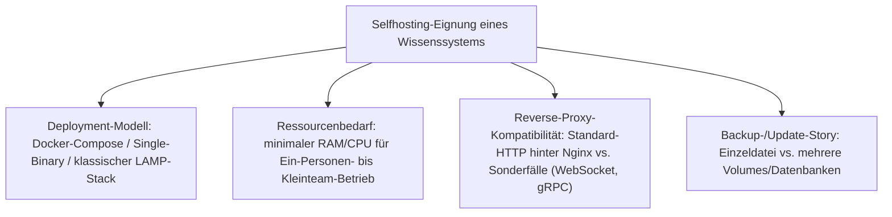
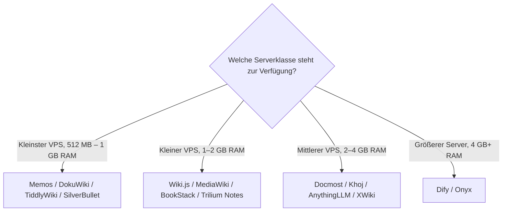

# Beste Open-Source-Wissenssysteme für den eigenen Selfhosting-Server — Top-20-Topliste

Die [Top-20-Topliste der führenden Open-Source-Wissenssysteme 2026](fuehrende-opensource-wissenssysteme-2026-topliste.md) rankt nach Verbreitung und Reife allgemein — unabhängig davon, ob ein System auf dem eigenen Server einfach zu betreiben ist. Diese Seite dreht die Perspektive: Sie rankt dieselbe Systemklasse **speziell nach Selfhosting-Tauglichkeit auf einem gemieteten oder eigenen Server** — Docker-Compose-Reife, Ressourcenbedarf, Reverse-Proxy-Kompatibilität und Backup-Story stehen im Vordergrund statt reiner Marktverbreitung.

!!! note "Hinweis: Server-Grundlagen sind hier vorausgesetzt"
    Diese Topliste bewertet nur die Wissenssysteme selbst. Server-Beschaffung, Firewall und Absicherung sind separat dokumentiert: [KVM-Server mieten](../../entwicklung/infrastruktur/kvm-server-mieten.md), [UFW-Firewall](../../entwicklung/infrastruktur/ufw-firewall.md), [SSH-Tunnel](../../entwicklung/infrastruktur/ssh-tunnel.md).

---

## Bewertungskriterien

!!! warning "Achtung: RAM-Angaben sind Richtwerte für Einzelnutzer-/Kleinteam-Betrieb"
    Die genannten Minimalwerte gelten für einen Testbetrieb oder eine Handvoll Nutzer ohne größere Vektorindizes. RAG-Plattformen mit eigenem Embedding-Modell oder großem Dokumentenbestand (Rang 8, 11, 12) benötigen in Produktion deutlich mehr — siehe jeweils verlinktes Kapitel. **Stand: August 2026.**

---

## Top 20 im Überblick

| Rang | System | Kategorie | Deployment | Minimaler RAM-Bedarf | Besondere Stärke für Selfhosting |
|---|---|---|---|---|---|
| 1 | **Memos** | Leichtgewichtige Notizen | Single-Binary/Docker (eine Datei, SQLite) | ~128 MB | Kleinster Fußabdruck dieser Liste, kein separater Datenbankdienst nötig |
| 2 | **DokuWiki** | Wiki | PHP, dateibasiert, kein Datenbankserver | ~256 MB | Kein Datenbankdienst zu pflegen — Backup ist ein einfaches `rsync` des Datenverzeichnisses |
| 3 | **TiddlyWiki** (Node.js-Server-Modus) | PKM/Non-lineares Wiki | Einzelner Node.js-Prozess (`npm i -g tiddlywiki`) | ~150 MB | Ganzes Wiki in einer HTML-Datei — Backup ist ein einzelner Dateikopiervorgang |
| 4 | **SilverBullet** | PKM/Markdown-Wiki | Single-Binary (Deno) oder Docker, PWA-Client | ~200 MB | Ein Prozess bedient Server und Web-Client, kein Build-Schritt für Deployment |
| 5 | **Wiki.js** | Wiki | Docker-Compose (Node.js + PostgreSQL) | ~512 MB | Offizielles Docker-Compose-Beispiel, WebSocket-basierte Live-Vorschau hinter Nginx dokumentiert |
| 6 | **[MediaWiki](mediawiki/entwicklungsrechner-localhost.md)** | Wiki | Klassischer LAMP-Stack (Apache/Nginx, PHP, MySQL/MariaDB) | ~512 MB | Größtes Extension-Ökosystem, ausführlichste Selfhosting-Dokumentation aller Wiki-Systeme |
| 7 | **BookStack** | Wiki/Doku | Docker-Compose (PHP + MySQL) | ~512 MB | Offizielles Docker-Compose-Setup inklusive Reverse-Proxy-Beispiel |
| 8 | **Joplin Server** | PKM/Notizen (Sync-Server) | Docker-Compose (Node.js + PostgreSQL) | ~512 MB | Nur Sync-Backend nötig — Clients bleiben lokal auf Desktop/Mobile |
| 9 | **Trilium Notes** (`trilium-server`) | PKM/hierarchische Notizen | Docker (Einzelcontainer, eingebaute Datenbank) | ~512 MB | Server- und Desktop-Variante teilen dasselbe Datenformat, nahtloser Wechsel möglich |
| 10 | **Docmost** | Wissensmanagement (Confluence-Alternative) | Docker-Compose (Node.js + PostgreSQL + Redis) | ~1 GB | Für Selfhosting konzipiert, kein Cloud-Zwang, offizielle Compose-Datei aktiv gepflegt |
| 11 | **Khoj** | PKM/KI-natives „zweites Gehirn" | Docker-Compose (Django + PostgreSQL, optional lokales Embedding-Modell) | ~1–2 GB | Vollständig lokale Embeddings möglich — keine Cloud-API-Pflicht für semantische Suche |
| 12 | **AnythingLLM** | RAG/Wissensmanagement | Docker (Einzelcontainer, eingebaute Vektor-DB) | ~2 GB (+ separat: Ollama für lokales LLM) | Ein Container reicht für RAG-Grundbetrieb, Ollama-Anbindung optional statt Pflicht |
| 13 | **[XWiki](xwiki/installieren.md)** | Wiki | Java/Tomcat + PostgreSQL (nativ oder Docker) | ~1–2 GB | Ausführlich dokumentierter Nginx-Unix-Socket-Betrieb in diesem Repository, siehe [Nginx-Anbindung](xwiki/xwiki-nginx-unix-socket.md) |
| 14 | **AFFiNE** (Self-Host-Variante) | Wissensmanagement/Whiteboard | Docker-Compose (mehrere Container) | ~2 GB | Ein Compose-Stack ersetzt Dokumente, Whiteboards und Datenbanken gleichzeitig |
| 15 | **Wikibase** (Wikidata-Basis) | Strukturiertes Wissensmanagement | Offizielles `wikibase-docker`-Compose (MediaWiki + Blazegraph) | ~2 GB | Fertiger Docker-Compose-Stack inklusive SPARQL-Endpoint, kein manuelles Blazegraph-Setup nötig |
| 16 | **Semantisches MediaWiki** | Wiki-Erweiterung | Läuft im bestehenden MediaWiki-LAMP-Stack | wie Rang 6 + gering | Erweitert eine bereits selbstgehostete MediaWiki-Instanz, kein zusätzlicher Dienst |
| 17 | **Logseq** (Sync-Server-Variante) | PKM/Outliner | Primär lokal-first; Self-Host-Sync experimentell/Community | ~256 MB (nur Sync-Layer) | Funktioniert vollständig offline — Server ist optional, kein Betriebsrisiko bei Ausfall |
| 18 | **Dify** | Agenten-Workflow-Plattform | Docker-Compose (viele Container: API, Worker, Vektor-DB, Redis, Nginx) | ~4 GB | Bringt eigenen Nginx-Reverse-Proxy im Compose-Stack bereits mit |
| 19 | **Flowise** | Agenten-Workflow-Plattform | Docker (Einzelcontainer) | ~1 GB | Deutlich schlanker als Dify bei ähnlichem Funktionsumfang, ein Container genügt |
| 20 | **[Onyx](onyx-danswer-rag-plattform.md)** (ehem. Danswer) | RAG/Wissensmanagement | Docker-Compose (viele Container: API, Web, Vespa/Elasticsearch, Postgres, Redis) | ~8 GB | Funktionsreichste RAG-Plattform dieser Liste — Ressourcenbedarf entsprechend am höchsten |

---

## Highlights im Detail

### Rang 1–4: der „ein Prozess, eine Datei"-Cluster
Memos, DokuWiki, TiddlyWiki und SilverBullet teilen ein gemeinsames Prinzip, das Selfhosting drastisch vereinfacht: **kein separater Datenbankserver**. Backup, Migration und Restore reduzieren sich auf das Kopieren eines Verzeichnisses oder einer Datei — ein klarer Vorteil gegenüber Systemen, die einen mehrteiligen Docker-Compose-Stack orchestrieren müssen.

### Rang 6, 13, 16: die etablierten Wiki-Systeme mit ausführlichster Server-Dokumentation
[MediaWiki](mediawiki/entwicklungsrechner-localhost.md) und [XWiki](xwiki/xwiki-nginx-unix-socket.md) profitieren in diesem Repository von jahrelang gewachsener Betriebsdokumentation — inklusive Nginx-Unix-Socket-Anbindung, PostgreSQL-Tuning (siehe [PostgreSQL DBA Praxis-Handbuch](../../entwicklung/infrastruktur/postgresql-dba-praxis.md)) und Backup-Skripten. Wer nicht der Erste sein will, der ein Betriebsproblem löst, profitiert hier von der größten Nutzerbasis an Erfahrungsberichten.

### Rang 18–20: der ressourcenintensivste Cluster
Dify, Flowise und Onyx bringen jeweils mehrteilige Docker-Compose-Stacks mit — Vektordatenbank, Worker-Prozesse, Cache-Schicht zusätzlich zum Kernservice. Auf einem kleinen VPS (2–4 GB RAM) stößt vor allem Onyx an Grenzen; wer RAG-Funktionalität mit deutlich geringerem Ressourcenbedarf sucht, findet in AnythingLLM (Rang 12) oder Flowise (Rang 19) die schlankere Alternative.

---

## Entscheidungshilfe nach Server-Größe

!!! tip "Tipp: Erst klein starten, später migrieren"
    Die meisten Systeme dieser Liste unterstützen einen Datenexport (Markdown, JSON oder direkten Datenbank-Dump) — ein Wechsel von Rang 1–4 zu einem ressourcenintensiveren System bei wachsendem Bedarf ist selten ein Neuanfang. Vertiefung zu einem konkreten Migrationspfad: [KI strukturiert das Wiki autonom & Selfhosting-Migration](ki-autonome-wiki-strukturierung-selfhosting-migration.md).

---

## 🔗 Verwandte Themen

- [Startseite](../../index.md) — zurück zur Dokumentations-Zentrale
- [Die führenden Open-Source-Wissenssysteme 2026 (Top 20)](fuehrende-opensource-wissenssysteme-2026-topliste.md) — Schwester-Topliste nach Verbreitung/Reife statt Selfhosting-Tauglichkeit
- [Open-Source-Wissenssysteme mit aktiver Weiterentwicklung & hoher Reife (Top 20)](aktive-reife-opensource-wissenssysteme-2026-topliste.md) — Schwester-Topliste, gerankt nach Entwicklungsaktivität und Produktionsreife statt Selfhosting-Tauglichkeit
- [Open-Source-Wissenssysteme mit PostgreSQL- oder Dateiformat-Speicherung (Top 22)](postgresql-dateiformat-wissenssysteme-2026-topliste.md) — filtert zusätzlich auf ein einfaches Speicherbackend ohne Pflicht-Zweitsystem, direkt relevant für den Betriebsaufwand auf dem eigenen Server
- [Open-Source-Wissenssysteme mit echter Echtzeit-Kollaboration (Top 15)](echtzeit-kollaboration-opensource-wissenssysteme-2026-topliste.md) — relevant, sobald mehrere Personen gleichzeitig im selbst gehosteten System arbeiten sollen
- [Backup-Strategien für Wissenssysteme (Top 20)](backup-strategien-wissenssysteme-topliste.md) — dieselbe Rangfolge, vertieft speziell für Backup-Methode und Restore-Komplexität
- [KI strukturiert das Wiki autonom & Selfhosting-Migration](ki-autonome-wiki-strukturierung-selfhosting-migration.md) — vertiefend zum Migrationsweg zwischen Systemen dieser Liste
- [KVM-Server mieten](../../entwicklung/infrastruktur/kvm-server-mieten.md) — Server-Beschaffung als Voraussetzung für alle Ränge dieser Liste
- [Nginx: Grundlagen](../../entwicklung/infrastruktur/nginx.md) — Reverse-Proxy-Basis für praktisch jedes System dieser Liste
- [PostgreSQL DBA Praxis-Handbuch](../../entwicklung/infrastruktur/postgresql-dba-praxis.md) — vertiefend zur Datenbankschicht hinter Rang 5, 7–15, 18, 20
- [UFW-Firewall](../../entwicklung/infrastruktur/ufw-firewall.md) / [SSH-Tunnel](../../entwicklung/infrastruktur/ssh-tunnel.md) — Absicherung des Servers, auf dem diese Systeme laufen
- [Systemd Service Creation](../../entwicklung/system/systemd-service-creation.md) — Alternative zu Docker für Single-Binary-Systeme aus Rang 1–4
- [XWiki: Nginx über Unix-Socket anbinden](xwiki/xwiki-nginx-unix-socket.md) — vertiefend zu Rang 13
- [Entwicklungsrechner: localhost mit Nginx und PostgreSQL (MediaWiki)](mediawiki/entwicklungsrechner-localhost.md) — vertiefend zu Rang 6
- [Onyx (ehem. Danswer): RAG-Plattform](onyx-danswer-rag-plattform.md) — vertiefend zu Rang 20
