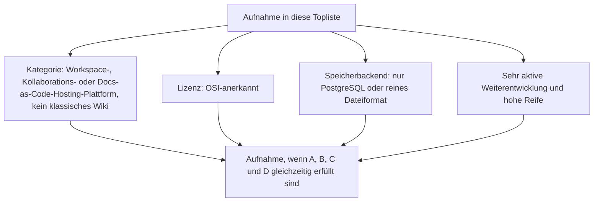
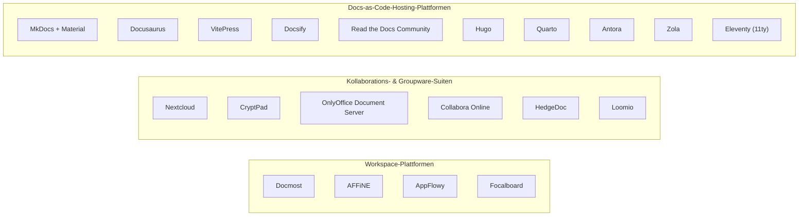
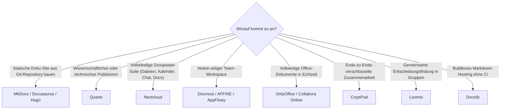

# Workspace-, Kollaborations- & Docs-as-Code-Plattformen: Open Source mit PostgreSQL-/Dateiformat-Speicherung — Top-20-Topliste

Diese Seite wendet die inzwischen etablierten vier Kriterien dieser Dokumentation — OSI-Lizenz, Content-Persistenz nur in PostgreSQL oder reinem Dateiformat, sehr aktive Weiterentwicklung, hohe Reife — auf eine dritte Systemklasse an, die bisher nur in Ausschnitten vorkam: **Team-Workspace-Plattformen** (Notion-/Confluence-Alternativen ohne klassisches Wiki-Datenmodell), **Kollaborations-/Groupware-Suiten** (Office, Verschlüsselung, Entscheidungsfindung) und **Docs-as-Code-Hosting-Plattformen** (Static-Site-Generatoren und Build-Infrastruktur für Git-basierte Dokumentation).

!!! note "Hinweis: Nur OSI-anerkannte Lizenzen"
    Wie in der [Gesamtübersicht](open-source-llm-agent-mcp-systeme.md) zählen hier ausschließlich Systeme unter einer OSI-anerkannten Open-Source-Lizenz (MIT, GPL, LGPL, AGPL, BSD, Apache-2.0, MPL-2.0).

!!! tip "Tipp: Abgrenzung zu bereits bestehenden Toplisten"
    Klassische Wiki-Engines (MediaWiki, Wiki.js, XWiki, DokuWiki …) sind hier bewusst ausgeklammert — sie stehen bereits vollständig in [Beste Wiki-Engines 2026](wiki-engines-2026-topliste.md) und der enger gefassten [Wiki-Engines mit PostgreSQL-/Dateiformat-Speicherung](wiki-engines-postgresql-dateiformat-2026-topliste.md). Reine Docs-as-Code-**Workflow**-Werkzeuge ohne eigenes Speicherbackend (Vale, Doxygen, pre-commit, markdownlint …) stehen in [Beste Docs-as-Code-Werkzeuge 2026](docs-as-code-2026-topliste.md) — diese Seite hier rankt stattdessen die **Plattformen**, auf denen Docs-as-Code-Inhalte tatsächlich gebaut und gehostet werden.

---

## Bewertungskriterien

!!! warning "Achtung: Momentaufnahme, Stand August 2026"
    Bei Rang 4 (Focalboard, seit 2023 Teil von Mattermost) und Rang 10 (Loomio) hängt die Weiterentwicklungsgeschwindigkeit stärker von externer Governance ab als bei den übrigen Einträgen — vor einer Entscheidung die aktuelle Release-Historie direkt im Repository prüfen.

---

## Top 20 im Überblick

| Rang | System | Kategorie | Lizenz | Speicherbackend | Aktivität/Reife |
|---|---|---|---|---|---|
| 1 | **MkDocs** + Material for MkDocs | Docs-as-Code-Generator | BSD-3-Clause / MIT | Reines Dateiformat (Markdown + YAML im Git-Repository) | Extrem aktiv, riesiges Ökosystem — die Technikfamilie, aus der auch Zensical hervorgegangen ist, siehe Highlight unten |
| 2 | **Docusaurus** | Docs-as-Code-Generator | MIT | Reines Dateiformat (Markdown/MDX im Git-Repository) | Meta-gestützt, sehr aktiv, mature seit 2017 |
| 3 | **Hugo** | Docs-as-Code-Generator | Apache-2.0 | Reines Dateiformat | Schnellster Build dieser Liste, extrem aktive Community seit 2013 |
| 4 | **Nextcloud** | Kollaborations-/Groupware-Suite | AGPL-3.0 | PostgreSQL empfohlen (auch MySQL/SQLite) | Größte Groupware-Suite dieser Liste, extrem aktiv seit 2016 |
| 5 | **Docmost** | Workspace-Plattform (Confluence-Alternative) | AGPL-3.0 | PostgreSQL als alleiniger Content-Speicher | Jung, aber ungewöhnlich hohe Commit-Frequenz |
| 6 | **AFFiNE** | Workspace-Plattform/Whiteboard | MIT | PostgreSQL als Metadaten-Speicher im Selfhosting-Betrieb | Wöchentliche Canary-Builds |
| 7 | **Read the Docs Community** | Docs-as-Code-Hosting-Plattform | MIT | PostgreSQL | Historischer Auslöser der gesamten Docs-as-Code-Bewegung, seit 2010 durchgängig aktiv |
| 8 | **VitePress** | Docs-as-Code-Generator | MIT | Reines Dateiformat | Sehr aktiv im Vue-Ökosystem |
| 9 | **CryptPad** | Kollaborations-Suite (Ende-zu-Ende-verschlüsselt) | AGPL-3.0 | Reines Dateiformat (verschlüsselte Blobs) | Eigene ChainPad-CRDT-Engine, aktiv gepflegt |
| 10 | **OnlyOffice Document Server** (Community Edition) | Kollaborations-Suite (Office) | AGPL-3.0 | PostgreSQL | Operational-Transform-basierte Ko-Bearbeitung, sehr aktiv |
| 11 | **AppFlowy** | Workspace-Plattform (Notion-Alternative) | AGPL-3.0 | PostgreSQL (via AppFlowy Cloud) | Eigene Rust-CRDT-Engine, aktive Weiterentwicklung |
| 12 | **Quarto** | Docs-as-Code-Generator (wissenschaftliches Publizieren) | MIT | Reines Dateiformat | Von Posit gestützt, sehr aktiv seit 2022 |
| 13 | **Eleventy** (11ty) | Docs-as-Code-Generator | MIT | Reines Dateiformat | Sehr aktive JS-Community, mature seit 2018 |
| 14 | **Collabora Online** (CODE) | Kollaborations-Suite (Office, LibreOffice-Basis) | MPL-2.0 | Reines Dateiformat (via WOPI-Host) | WOPI-Protokoll + Echtzeit-Ko-Bearbeitung |
| 15 | **HedgeDoc** | Kollaborations-Suite (Markdown-Notizen) | AGPL-3.0 | PostgreSQL oder SQLite frei wählbar | Aktiv gepflegt, breite Editor-Community |
| 16 | **Antora** | Docs-as-Code-Generator (Multi-Repo-Dokumentation) | MPL-2.0 | Reines Dateiformat | Etabliert in großen Java-/Enterprise-Docs-Projekten, mature seit 2017 |
| 17 | **Zola** | Docs-as-Code-Generator (Rust) | MIT | Reines Dateiformat | Kompakter Single-Binary-Generator, aktiv seit 2018 |
| 18 | **Docsify** | Docs-as-Code-Generator (buildlos) | MIT | Reines Dateiformat | Rendert Markdown direkt im Browser, kein Build-Schritt nötig |
| 19 | **Focalboard** | Workspace-Plattform (Notion-artige Datenbank-Views) | MIT | SQLite, PostgreSQL oder MySQL wählbar | Seit 2023 Teil von Mattermost, Weiterentwicklung dort integriert |
| 20 | **Loomio** | Kollaborations-Plattform (Gruppenentscheidungen) | AGPL-3.0 | PostgreSQL | Ruhigere, aber kontinuierliche Pflege durch die Loomio-Genossenschaft |

---

## Highlights im Detail

### MkDocs & Co.: dieselbe Technikfamilie, die dieses Repository selbst nutzt
Rang 1 ist kein abstraktes Beispiel: Diese Dokumentation wird mit Zensical gebaut, dem in `CLAUDE.md` beschriebenen Nachfolger von MkDocs + Material, der `mkdocs.yml` nativ liest. Das Architekturprinzip — Markdown-Dateien im Git-Repository, kein Datenbankserver, Build zu statischem HTML — ist über die gesamte Docs-as-Code-Generator-Gruppe dieser Liste (Rang 1–3, 8, 12–13, 16–18) identisch und der Hauptgrund, warum diese Gruppe die Speicherkriterien dieser Topliste so mühelos erfüllt.

### Nextcloud: die einzige vollständige Groupware-Suite dieser Liste
Wo HedgeDoc, CryptPad, OnlyOffice und Collabora Online jeweils eine einzelne Kollaborationsfunktion abdecken, bündelt Nextcloud Dateisync, Kalender, Kontakte, Chat und (per App) auch kollaborative Dokumente in einer einzigen, seit 2016 durchgängig aktiven Plattform — die mit Abstand größte installierte Basis unter den Kollaborations-Suiten dieser Liste.

### Focalboard & Loomio: ruhigere Governance, weiterhin verlässlich gepflegt
Beide Systeme zeigen, dass eine Verlangsamung der eigenständigen Release-Kadenz nicht zwingend Stillstand bedeutet: Focalboards Entwicklung läuft seit der Integration in Mattermost dort weiter statt im eigenständigen Repository, Loomio wird von einer Genossenschaft statt einem Venture-finanzierten Team getragen — beide erfüllen die Aktivitäts- und Reifeschwelle dieser Liste weiterhin, nur mit anderem Entwicklungstempo als die Docs-as-Code-Generatoren.

---

## Was bewusst nicht in dieser Liste steht

!!! warning "Achtung: Ausschluss trotz Open Source, Aktivität oder Reife"
    - **Bereits in dedizierten Toplisten abgedeckt**: Klassische Wiki-Engines (MediaWiki, Wiki.js, XWiki, DokuWiki, TikiWiki …) stehen in [Beste Wiki-Engines 2026](wiki-engines-2026-topliste.md) bzw. [Wiki-Engines mit PostgreSQL-/Dateiformat-Speicherung](wiki-engines-postgresql-dateiformat-2026-topliste.md). Docs-as-Code-**Workflow**-Werkzeuge ohne eigenes Speicherbackend (Vale, Doxygen, Javadoc, TypeDoc, Lychee, markdownlint, pre-commit) stehen in [Beste Docs-as-Code-Werkzeuge 2026](docs-as-code-2026-topliste.md).
    - **Kein PostgreSQL-Support**: BookStack (nur MySQL/MariaDB).
    - **Geringere Aktivität als vergleichbare Alternativen**: Jekyll hat gegenüber Hugo, Docusaurus und den übrigen Generatoren dieser Liste in den letzten Jahren spürbar an Entwicklungstempo verloren.
    - **Unklarer Lizenzstatus**: Mattermost hat seine Kernserver-Lizenzierung in den letzten Jahren mehrfach angepasst — für strikt OSI-konforme Anforderungen 2026 nicht mehr uneingeschränkt geeignet.
    - **Lizenzausschluss unabhängig von Aktivität/Reife**: GitBook (vollständig proprietäre SaaS-Plattform) und Outline (Business Source License, nicht OSI-anerkannt) — Details zu Outline siehe [Lizenz-Sonderfälle in der MCP-Topliste](wissensmanagement-mcp-server-topliste.md#lizenz-sonderfall).

---

## Entscheidungshilfe nach Anwendungsfall

---

## 🔗 Verwandte Themen

- [Startseite](../../index.md) — zurück zur Dokumentations-Zentrale
- [Open-Source-Wissenssysteme mit PostgreSQL- oder Dateiformat-Speicherung (Top 22)](postgresql-dateiformat-wissenssysteme-2026-topliste.md) — dieselben Speicherkriterien für die breitere Wiki-/PKM-/RAG-Wissenssysteme-Klasse
- [Wiki-Engines mit PostgreSQL- oder Dateiformat-Speicherung (Top 15)](wiki-engines-postgresql-dateiformat-2026-topliste.md) — dieselben Kriterien, enger gefasst auf klassische Wiki-Engines
- [Open-Source-Wissenssysteme mit echter Echtzeit-Kollaboration (Top 15)](echtzeit-kollaboration-opensource-wissenssysteme-2026-topliste.md) — Schwester-Topliste mit CRDT/OT-Fokus statt Speicherbackend, mehrere Überschneidungen (AFFiNE, CryptPad, HedgeDoc, OnlyOffice, Collabora Online)
- [Beste Docs-as-Code-Werkzeuge 2026 (Top 15)](docs-as-code-2026-topliste.md) — Workflow-Ebene (Linting, API-Doku-Extraktion, Hosting/CI) statt Plattform-Ebene
- [Beste Static-Site- & Docs-Generatoren 2026 (Top 20)](static-site-generatoren-2026-topliste.md) — breitere Rendering-Engine-Topliste inkl. allgemeiner Blog-/Marketing-Generatoren
- [Open-Source-Wissenssysteme mit aktiver Weiterentwicklung & hoher Reife (Top 20)](aktive-reife-opensource-wissenssysteme-2026-topliste.md) — Basis-Kriterien Aktivität/Reife ohne Speicherbackend-Filter
