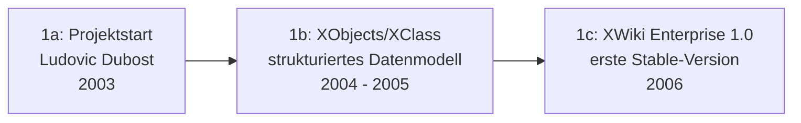

# Evolution und Architekturen von XWiki

XWiki bildet Generation 1c der [Evolution digitaler Wiki-Engines](../evolution-digitaler-wiki-engines.md#1c-enterprise-wikis-semantik-2005-2015), die ihrerseits Generation 1 der übergeordneten [Evolution digitaler Wissenssysteme](../evolution-digitaler-wissenssysteme.md) bildet. Diese eigenständige Zeitachse zoomt — analog zu den Produkt-Spezialartikeln [Evolution und Architekturen von MediaWiki](../mediawiki/evolution-digitaler-mediawiki.md), [Evolution und Architekturen von Drupal](../drupal/evolution-digitaler-drupal.md) und [Evolution und Architekturen von Moodle](../moodle/evolution-digitaler-moodle.md) — in genau XWikis eigene Architekturlinie hinein: vom XObjects-Datenmodell, das XWiki von Anfang an zur Wiki-**Anwendungsplattform** statt reinem Freitext-Wiki macht, über die Skript-Wiki-Ära, den Rendering-Engine-Rewrite und die verschachtelte Dokumentenhierarchie bis zum heutigen Extension-Marketplace und der KI-gestützten WAISE-Ära. Die praktische Installation behandelt [XWiki installieren](installieren.md) und [Installation über APT](installation-ueber-apt.md), die aktuelle KI-Integration [XWiki Agenten-Pipeline](xwiki-ki-agent.md).

!!! note "Hinweis: Generationen überlappen sich"
    Die Zeiträume sind grobe Orientierung, keine scharfen Grenzen — das ursprüngliche XObjects-Datenmodell aus Generation 1 trägt bis heute jede XWiki-Anwendung, parallel zur KI-gestützten Generation 6. Entscheidend ist die **Architektur** (Datenmodell, Rendering, Skalierungsprinzip), nicht allein das Versionsjahr.

---

## Generation 1: Projektstart & XObjects-Datenmodell, 2003 – 2006

Die Gründergeneration eint drei Prinzipien: **strukturierte Daten direkt an Wiki-Seiten** statt reinem Freitext, eine **Java-basierte Plattformarchitektur** mit relationaler Persistenz über Hibernate und der explizite Anspruch, **Wiki-Anwendungen** statt nur Wiki-Artikel zu ermöglichen. Sie lässt sich in drei technologische Entwicklungsstufen unterteilen:

### 1a. Projektstart, 2003

- **Hintergrund:** Ludovic Dubost startet XWiki mit dem expliziten Ziel, über reine Textseiten hinauszugehen — eine Wiki-Engine, auf der sich vollständige, datengetriebene Anwendungen bauen lassen.
- **Bedeutung:** dieser Plattform-Anspruch unterscheidet XWiki von Anfang an von rein dokumentenorientierten Wiki-Engines wie MediaWiki, siehe [Generation 1c der Wiki-Engines-Zeitachse](../evolution-digitaler-wiki-engines.md#1c-enterprise-wikis-semantik-2005-2015).

### 1b. XObjects/XClass — strukturiertes Datenmodell, 2004 – 2005

- **Architektur:** jede Wiki-Seite kann zusätzlich zum Freitext beliebige **XObjects** tragen — Instanzen einer selbst definierten **XClass** (Schema mit typisierten Feldern), gespeichert über Hibernate in einer relationalen Datenbank statt reiner Textform.
- **Bedeutung:** macht aus einer einzelnen Wiki-Seite potenziell einen Datensatz, aus einer Seitenfamilie eine ganze Tabelle — Grundlage aller späteren „XWiki Applications".

### 1c. XWiki Enterprise 1.0 — erste Stable-Version, 2006

- **Architektur:** erste als produktionsreif markierte Version, kombiniert das XObjects-Datenmodell mit einem WYSIWYG-Editor und granularer Rechteverwaltung.
- **Bedeutung:** Grundstein der bis heute weiterentwickelten Codebasis, siehe [XWiki installieren](installieren.md).

---

## Generation 2: Skript-Wiki & erste Wiki-Anwendungen, 2006 – 2010

Statt XObjects nur als Datencontainer zu nutzen, erlaubt diese Generation, **Logik direkt in Wiki-Seiten** einzubetten — der Schritt von strukturierten Daten zu tatsächlich ausführbaren Anwendungen.

**Architektur:** **Velocity**- und später **Groovy**-Skripte direkt in Wiki-Seiten eingebettet, lesen und schreiben XObjects zur Laufzeit — eine Wiki-Seite wird damit zu UI-Template, Geschäftslogik und Datenschema in einem Dokument.

| Meilenstein | Bedeutung |
|---|---|
| **Velocity-Skripting** | Erste eingebettete Templating-/Logik-Sprache direkt im Wikitext. |
| **Groovy-Skript-Makros** | Vollwertige Programmiersprache innerhalb von Wiki-Seiten für komplexere XWiki Applications. |
| **XWiki Applications** | Sammelbegriff für vollständige CRUD-Anwendungen (Formular, Liste, Detailansicht), komplett aus Wiki-Seiten gebaut, ohne separates Deployment. |

---

## Generation 3: Rendering-Engine-Rewrite & XWiki-2.x-Syntax, ab 2010

Nach Jahren mit einem einzigen, eng an die Java-Implementierung gekoppelten Wikitext-Parser bricht diese Generation die Rendering-Logik als eigenständiges, mehrsprachiges Modul heraus.

**Architektur:** das neue **XWiki-Rendering-Modul** unterstützt mehrere Syntaxen parallel — die neue **XWiki-2.x-Syntax** als Standard, daneben Import-/Kompatibilitätspfade für MediaWiki-, Confluence- und Markdown-Syntax. Dieselbe modulare Rendering-Pipeline treibt bis heute die REST-API an, die Seiteninhalte explizit mit einer Syntax-Kennung wie `xwiki/2.1` überträgt, siehe [XWiki REST API & Python Integration](xwiki-rest-api.md).

!!! tip "Architektonischer Vorteil gegenüber Generation 1"
    Weil Rendering als eigenständiges Modul statt fest verdrahteter Logik existiert, lässt sich Fremdinhalt (etwa aus einer MediaWiki-Migration) importieren, ohne die Kernarchitektur zu ändern.

---

## Generation 4: Verschachtelte Dokumentenhierarchie & REST-API-Reife, ab 2013

Das ursprüngliche flache `Space.Page`-Namensschema stößt bei wachsenden Installationen an Grenzen — diese Generation ersetzt es durch eine echte Baumstruktur.

| Meilenstein | Bedeutung |
|---|---|
| **Nested Spaces/Documents** | Ersetzt das flache Namensschema durch eine verschachtelte Dokumenthierarchie, vergleichbar mit einem Dateisystembaum statt einer einzelnen Namensraum-Ebene. |
| **Vollständige REST-API** | Programmatischer Zugriff auf Seiten, Objekte und Anhänge über HTTP/JSON — Grundlage aller Automatisierungs- und KI-Agenten-Integrationen dieses Repositories, siehe [XWiki REST API & Python Integration](xwiki-rest-api.md). |

---

## Generation 5: Wiki-Farm & Multi-Tenancy

Statt einer Installation pro Organisation trägt eine einzige XWiki-Instanz mehrere unabhängige Sub-Wikis gleichzeitig — ein plattformartiger statt rein dokumentenorientierter Betrieb.

**Architektur:** eine **Wiki-Farm** bündelt mehrere logisch getrennte Sub-Wikis (eigene Nutzer, Rechte, Inhalte) auf einer gemeinsamen technischen Basis — dieselbe Grundidee wie Community-Skalierungsplattformen aus [Generation 2 der Wiki-Engines-Zeitachse](../evolution-digitaler-wiki-engines.md#generation-2-community-skalierungsplattformen-ein-engine-tausende-unabhangige-wikis-2004-2016), hier jedoch auf Enterprise-/Multi-Team-Nutzung statt öffentlicher Community-Wikis zugeschnitten.

---

## Generation 6: Extension-Marketplace, Flavors & KI-Ära, ab den 2020er-Jahren

Die aktuelle Generation bringt drei parallele Entwicklungen: ein App-Store-artiges Erweiterungssystem, vorkonfigurierte Anwendungsbündel und offizielle LLM-Integration.

| Baustein | Rolle |
|---|---|
| **Extension Manager** | Installiert Erweiterungen (Makros, Anwendungen, Themes) direkt aus der Wiki-Oberfläche heraus, statt manueller Dateikopien. |
| **Flavors** | Vorkonfigurierte, sofort einsatzbereite Anwendungsbündel (z. B. Blog, Projektmanagement) auf Basis der XWiki-Applications-Architektur aus Generation 2 — dieselbe Idee wie Drupals Recipe-Distributionen, siehe [Generation 5 der Drupal-Zeitachse](../drupal/evolution-digitaler-drupal.md#generation-5-ki-natives-drupal-recipe-basierte-distributionen-ab-2024). |
| **WAISE-Extension** (`xwiki-contrib/ai-llm`) | Offizielle RAG-Chatbot-Extension direkt im Wiki, siehe [Klassische Wiki-Systeme mit LLM-Integration](../klassische-wiki-systeme-llm-integration.md#xwiki-offizielle-llm-extension-waise). |

!!! tip "Bezug zu diesem Repository"
    Neben der offiziellen WAISE-Extension dokumentiert dieses Repository mit der [XWiki Agenten-Pipeline](xwiki-ki-agent.md) zusätzlich einen Eigenbau-Weg über die REST-API aus Generation 4 — für Fälle, in denen ein allgemeiner Coding-Agent statt eines wiki-internen Chatbots die Pflege übernehmen soll.

---

## Alternative Sortier- & Klassifikationskriterien für XWiki

### 1. Datenmodell

- **Reiner Freitext** — Wiki-Seite ohne strukturierte Zusatzdaten (unüblich bei XWiki, aber möglich).
- **XObjects/XClass** — typisierte Datenfelder direkt an eine Seite angehängt (seit Generation 1).

### 2. Ausführungsmodell

- **Statischer Wikitext** — reine Anzeige ohne Logik.
- **Skript-Makro** (Velocity/Groovy) — Logik direkt im Seiteninhalt ausgeführt (seit Generation 2).

### 3. Installationstopologie

- **Einzel-Wiki** — eine Organisation, eine Instanz.
- **Wiki-Farm** — mehrere unabhängige Sub-Wikis auf gemeinsamer technischer Basis (Generation 5).

### 4. Erweiterungsweg

- **Manuelle Dateikopie** — vor Generation 6 üblich.
- **Extension Manager** — Installation aus der Wiki-Oberfläche heraus (Generation 6).
- **Flavor** — vollständiges, vorkonfiguriertes Anwendungsbündel statt Einzelerweiterung (Generation 6).

---

## Verwandte Themen

- [XWiki installieren](installieren.md) — Installationsanleitung
- [Installation über APT](installation-ueber-apt.md) — Alternative Installationsmethode
- [XWiki REST API & Python Integration](xwiki-rest-api.md) — Vertiefung zu Generation 4
- [XWiki Agenten-Pipeline: Automatisierte Pflege mit LLMs](xwiki-ki-agent.md) — Vertiefung zu Generation 6
- [Evolution und Architekturen digitaler Wiki-Engines](../evolution-digitaler-wiki-engines.md) — übergeordnetes Generationenmodell, Generation 1c dort entspricht diesem Artikel im Ganzen
- [Evolution und Architekturen digitaler Wissenssysteme](../evolution-digitaler-wissenssysteme.md) — Gesamt-Generationenmodell für Wissenssysteme im Allgemeinen
- [Evolution und Architekturen von MediaWiki](../mediawiki/evolution-digitaler-mediawiki.md) — analoger Produkt-Spezialartikel für MediaWiki
- [Evolution und Architekturen von Drupal](../drupal/evolution-digitaler-drupal.md) — analoger Produkt-Spezialartikel für Drupal
- [Evolution und Architekturen von Moodle](../moodle/evolution-digitaler-moodle.md) — analoger Produkt-Spezialartikel für Moodle
- [Klassische Wiki-Systeme mit LLM-Integration](../klassische-wiki-systeme-llm-integration.md) — LLM-Integrationsmuster jenseits des eigenen Agenten
- [Dokumentationsübersicht](../index.md)
