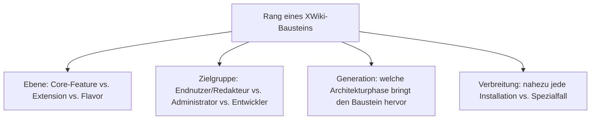
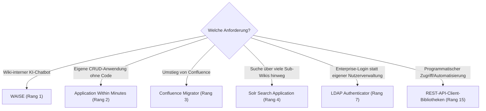

# Beste XWiki-Erweiterungen & Flavors 2026 — Top-15-Topliste

Die [Evolution und Architekturen von XWiki](evolution-digitaler-xwiki.md) ordnet die Produktgeschichte chronologisch nach sechs Generationen — vom XObjects-Datenmodell über die Skript-Wiki-Ära, den Rendering-Engine-Rewrite und die Wiki-Farm bis zum aktuellen Extension-Marketplace mit Flavors und offizieller KI-Integration. Da XWiki selbst kein Kategorie-Vergleich, sondern ein Einzelprodukt ist, übersetzt diese Seite die Chronologie stattdessen in eine **nach 2026-Relevanz gerankte Top-15-Liste konkreter Erweiterungen, Core-Features und Flavors**, mit denen dieses eine Produkt tatsächlich betrieben wird.

!!! note "Hinweis: Core-Feature, Extension und Flavor gemeinsam gerankt"
    Diese Liste mischt bewusst drei Ebenen — tief im Core verankerte Features (Rights Manager, Watchlist), weiterhin unverzichtbare Marketplace-Extensions (Application Within Minutes, Solr Search, WAISE) und vorkonfigurierte Flavors (Blog-Anwendung) — weil alle drei gemeinsam bestimmen, wie eine XWiki-Installation 2026 tatsächlich aufgebaut wird.

---

## Bewertungskriterien

---

## Top 15 im Überblick

| Rang | Baustein | Ebene | Generation | Bedeutung |
|---|---|---|---|---|
| 1 | **WAISE** (`xwiki-contrib/ai-llm`) | Extension | 6 (Extension-Marketplace, Flavors & KI-Ära) | Offizieller RAG-Chatbot direkt im Wiki, beantwortet Fragen auf Basis des eigenen Wiki-Inhalts |
| 2 | **Application Within Minutes** (AWM) | Extension | 2 (Skript-Wiki & erste Wiki-Anwendungen) | Wizard zum Bauen vollständiger XWiki Applications (Formular, Liste, Detailansicht) ohne eigenen Skript-Code |
| 3 | **Confluence Migrator** | Extension | 6 (Extension-Marketplace, Flavors & KI-Ära) | Automatisierte Migration von Confluence-Inhalten — zentraler Baustein von XWikis Positionierung als Confluence-Alternative |
| 4 | **Solr Search Application** | Extension | 5 (Wiki-Farm & Multi-Tenancy) | Volltext- und facettierte Suche über große, mehrsprachige Wiki-Farmen hinweg |
| 5 | **Office Importer** | Extension | 2 (Skript-Wiki & erste Wiki-Anwendungen) | Importiert Word-, Excel- und PowerPoint-Dokumente direkt als Wiki-Seiten |
| 6 | **Export as PDF** | Extension | 3 (Rendering-Engine-Rewrite) | Nutzt die modulare Rendering-Pipeline, um Seiten oder ganze Seitenbäume als PDF zu exportieren |
| 7 | **LDAP Authenticator** | Extension | 1 (Projektstart & XObjects-Datenmodell) | Bindet bestehende Enterprise-Verzeichnisdienste als Authentifizierungsquelle statt eigener Nutzerverwaltung ein |
| 8 | **Diagram Macro** (draw.io/PlantUML) | Extension | 2 (Skript-Wiki & erste Wiki-Anwendungen) | Diagramme direkt in Wiki-Seiten eingebettet, editierbar ohne externes Werkzeug |
| 9 | **Chart Macro** | Extension | 2 (Skript-Wiki & erste Wiki-Anwendungen) | Erzeugt Diagramme direkt aus Wiki-Tabellen oder XObject-Daten |
| 10 | **Rights Manager** | Core-Feature | 1 (Projektstart & XObjects-Datenmodell) | Granulare Rechteverwaltung pro Seite, Space oder Wiki-Farm-Mandant |
| 11 | **Watchlist & Notifications** | Core-Feature | 4/5 (REST-API-Reife, Wiki-Farm) | Änderungsbenachrichtigungen über Seiten und Spaces hinweg, auch farmweit |
| 12 | **Mentions** | Extension | 6 (Extension-Marketplace, Flavors & KI-Ära) | @-Erwähnungen mit Benachrichtigung, angelehnt an moderne Kollaborationstools |
| 13 | **Blog-Flavor** | Flavor | 6 (Extension-Marketplace, Flavors & KI-Ära) | Vorkonfiguriertes Blog-Anwendungsbündel auf AWM-Basis, sofort einsatzbereit statt Eigenbau |
| 14 | **XWiki Cloud** | Distribution/Hosting | 5 (Wiki-Farm & Multi-Tenancy) | Offizielles gehostetes Multi-Tenant-Angebot auf Wiki-Farm-Basis |
| 15 | **REST-API-Client-Bibliotheken** (Python, Java) | Werkzeug | 4 (Verschachtelte Dokumentenhierarchie & REST-API-Reife) | Programmatischer Zugriff als Grundlage für Automatisierung und KI-Agenten, siehe [XWiki REST API & Python Integration](xwiki-rest-api.md) |

---

## Highlights im Detail

### Rang 1, 3, 12: die aktuelle KI- und Kollaborations-Generation
WAISE, Confluence Migrator und Mentions zeigen, wie XWiki 2026 sowohl direkt mit LLM-Funktionen konkurriert als auch gezielt Wechsler von kommerziellen Wiki-Plattformen adressiert, siehe [Generation 6](evolution-digitaler-xwiki.md#generation-6-extension-marketplace-flavors-ki-ara-ab-den-2020er-jahren).

### Rang 2, 5, 8–9: das Skript-Wiki-Erbe als App-Baukasten
Application Within Minutes, Office Importer, Diagram Macro und Chart Macro bauen alle auf dem Velocity-/Groovy-Skript-Fundament aus Generation 2 auf — XWikis zentrales Unterscheidungsmerkmal zu rein dokumentenorientierten Wiki-Engines, siehe [Generation 2](evolution-digitaler-xwiki.md#generation-2-skript-wiki-erste-wiki-anwendungen-2006-2010).

### Rang 4, 11, 14: Wiki-Farm als Plattform-Fundament
Solr Search, Watchlist/Notifications und XWiki Cloud funktionieren erst im großen Maßstab über mehrere Sub-Wikis hinweg sinnvoll, siehe [Generation 5](evolution-digitaler-xwiki.md#generation-5-wiki-farm-multi-tenancy).

---

## Wegweiser: von Anforderung zu passendem Baustein

!!! tip "Tipp: die Produkt-Chronologie separat prüfen"
    Diese Liste übersetzt alle sechs Generationen der Quell-Chronologie in eine gemeinsame 2026-Momentaufnahme — für die vollständige Versionsgeschichte siehe [Evolution und Architekturen von XWiki](evolution-digitaler-xwiki.md).

---

## Verwandte Themen

- [Evolution und Architekturen von XWiki](evolution-digitaler-xwiki.md) — chronologisches Generationenmodell, dessen aktuellen Stand diese Topliste zusammenfasst
- [XWiki installieren](installieren.md) — Installationsanleitung
- [XWiki REST API & Python Integration](xwiki-rest-api.md) — Vertiefung zu Rang 15
- [XWiki Agenten-Pipeline: Automatisierte Pflege mit LLMs](xwiki-ki-agent.md) — Eigenbau-Alternative zu Rang 1
- [Evolution und Architekturen digitaler Wiki-Engines](../evolution-digitaler-wiki-engines.md) — übergeordnetes Generationenmodell, in dem XWiki Generation 1c bildet
- [Klassische Wiki-Systeme mit LLM-Integration](../klassische-wiki-systeme-llm-integration.md) — Vertiefung zu Rang 1
- [Dokumentationsübersicht](../index.md)
