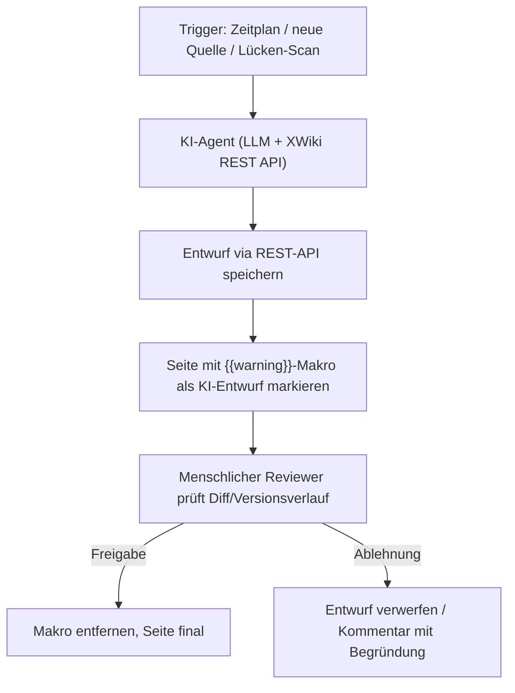
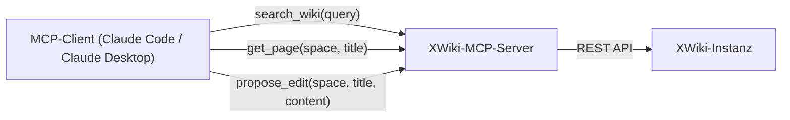

# XWiki Agenten-Pipeline: Automatisierte Pflege mit LLMs

Der [REST-API-Guide](xwiki-rest-api.md) aus dem vorherigen Kapitel automatisiert das reine Lesen und Schreiben von Seiten über `requests`. Dieses Kapitel baut darauf auf und ergänzt eine **KI-Schicht**: Ein Sprachmodell generiert, prüft und aktualisiert Wiki-Inhalte selbstständig — nach demselben **Human-in-the-Loop-Prinzip**, das bereits für [MediaWiki](../mediawiki/mediawiki-ki-agent.md) in diesem Repository beschrieben ist.

!!! note "Hinweis: Ergänzung zur offiziellen WAISE-Extension, kein Ersatz"
    XWiki bringt mit der offiziellen **LLM-Extension** (`xwiki-contrib/ai-llm`, Projekt „WAISE") bereits einen RAG-Chatbot direkt im Wiki mit — siehe [XWiki: offizielle LLM-Extension (WAISE)](../klassische-wiki-systeme-llm-integration.md#xwiki-offizielle-llm-extension-waise). Diese Seite dokumentiert den **Eigenbau-Weg** (Skript-Bot bzw. MCP-Server auf REST-API-Basis) für Fälle, in denen ein allgemeiner Coding-Agent (Claude Code, Antigravity CLI) statt eines wiki-internen Chatbots die Pflege übernehmen soll.

---

## Übersicht



---

## 1. Skript-Bot mit eingebettetem LLM-Aufruf

Erweitert den Bot aus [XWiki REST API & Python](xwiki-rest-api.md) um einen LLM-Aufruf, der fehlende Abschnitte einer Seite automatisch entwirft:

```bash
pip install requests anthropic
```

```python
import requests
from requests.auth import HTTPBasicAuth
import anthropic

XWIKI_URL = "http://localhost:8080/xwiki/rest"
AUTH = HTTPBasicAuth("ki-bot", "BotPassword123")  # dediziertes Bot-Konto!
HEADERS = {"Accept": "application/json", "Content-Type": "application/json"}

client = anthropic.Anthropic()  # nutzt ANTHROPIC_API_KEY aus der Umgebung

def get_page(wiki="xwiki", space="Main", page_title="API_Dokumentation"):
    url = f"{XWIKI_URL}/wikis/{wiki}/spaces/{space}/pages/{page_title}"
    response = requests.get(url, auth=AUTH, headers=HEADERS)
    return response.json().get("content", "") if response.status_code == 200 else ""

def save_draft(wiki="xwiki", space="Main", page_title="API_Dokumentation", content=""):
    url = f"{XWIKI_URL}/wikis/{wiki}/spaces/{space}/pages/{page_title}"
    payload = {"title": page_title, "content": content, "syntax": "xwiki/2.1"}
    response = requests.put(url, json=payload, auth=AUTH, headers=HEADERS)
    return response.status_code in (200, 201)

bestehender_text = get_page()

# LLM generiert einen Ergänzungs-Entwurf auf Basis des bestehenden Inhalts
response = client.messages.create(
    model="claude-sonnet-5",
    max_tokens=1500,
    messages=[{
        "role": "user",
        "content": (
            "Ergänze folgende XWiki-Seite um einen Abschnitt "
            "'Fehlerbehandlung', im gleichen xwiki/2.1-Syntax-Stil. "
            "Antworte NUR mit dem neuen Abschnitt in XWiki-Syntax.\n\n"
            f"{bestehender_text}"
        )
    }]
)
neuer_abschnitt = response.content[0].text

# Entwurf mit Review-Markierung speichern statt final zu veröffentlichen
entwurf = f"{bestehender_text}\n\n{{{{warning}}}}Dieser Abschnitt wurde von KI-Bot vorgeschlagen und noch nicht geprüft.{{{{/warning}}}}\n{neuer_abschnitt}"
if save_draft(content=entwurf):
    print("✅ Entwurf gespeichert — wartet auf menschliche Freigabe.")
```

!!! tip "Tipp: XWiki-Versionsverlauf ersetzt eine eigene Diff-Vorlage"
    Anders als bei MediaWiki reicht bei XWiki oft schon das eingebaute Warning-Makro (`{{warning}}...{{/warning}}`) plus der ohnehin vorhandene, vollständige Versionsverlauf jeder Seite — ein Reviewer sieht per Klick auf „Historie", was der Bot geändert hat, ohne eine separate Vorlagenseite pflegen zu müssen.

---

## 2. MCP-Server: XWiki als Werkzeug für allgemeine Agenten

Statt eines fest verdrahteten Skript-Bots lässt sich XWiki auch als **Model-Context-Protocol-Server** bereitstellen — dann kann jeder MCP-fähige Agent gezielt auf das Wiki zugreifen, ohne dass der komplette Wiki-Inhalt in den Prompt geladen werden muss (gleiches Prinzip wie beim [MCP-Ansatz für MediaWiki](../mediawiki/mediawiki-ki-agent.md#2-mcp-server-mediawiki-als-werkzeug-fur-allgemeine-agenten)).



| Tool | Funktion | Schreibzugriff? |
|---|---|---|
| `search_wiki(query)` | Volltextsuche über die XWiki-Such-API | nein |
| `get_page(space, title)` | Seiteninhalt (xwiki/2.1) abrufen | nein |
| `list_spaces(wiki)` | Verfügbare Spaces auflisten | nein |
| `propose_edit(space, title, content, summary)` | Legt einen Entwurf mit `{{warning}}`-Markierung an, **keine** finale Veröffentlichung | ja, aber nur als Entwurf |

!!! note "Hinweis: Kein fertiger Standard-MCP-Server für XWiki"
    Wie bei MediaWiki gibt es (Stand August 2026) keinen einzelnen, breit etablierten offiziellen XWiki-MCP-Server für Coding-Agenten — üblich ist ein schlanker eigener Server auf Basis der REST-API und einem MCP-SDK (Python oder TypeScript), der nur die oben gelisteten, bewusst eingeschränkten Tools freigibt.

---

## Governance & Sicherheitsleitplanken

| Maßnahme | Zweck |
|---|---|
| **Dediziertes Bot-Konto** mit eigener Rechtegruppe | Klare Abgrenzung KI-generierter von menschlichen Edits im Versionsverlauf |
| **XWiki-Rechteverwaltung** statt manueller ACL-Pflege | Bot-Konto erhält gezielt nur Schreibrecht auf die vorgesehenen Spaces |
| **`{{warning}}`-Makro statt finaler Veröffentlichung** | Human-in-the-Loop — kein KI-Inhalt gilt ohne Freigabe als final |
| **Rate-Limits im Bot-Skript** | Verhindert Überlastung der REST-API bei Batch-Läufen |
| **Sperrliste für sensible Spaces** (z. B. Impressum, rechtliche Seiten) | KI-Agent darf bestimmte Spaces grundsätzlich nicht anfassen |
| **Erst gegen Testinstanz laufen lassen** | Neue Prompt-Versionen vor Produktiveinsatz gegen eine Wiki-Kopie validieren |

---

## Verwandte Themen

- [XWiki Installieren](installieren.md) — Basis-Setup
- [XWiki REST API & Python](xwiki-rest-api.md) — Grundlagen der REST-Anbindung ohne KI-Schicht
- [Klassische Wiki-Systeme mit LLM-Integration](../klassische-wiki-systeme-llm-integration.md#xwiki-offizielle-llm-extension-waise) — Einordnung der offiziellen WAISE-Extension als Alternative
- [MediaWiki KI-Agent](../mediawiki/mediawiki-ki-agent.md) — paralleler Eigenbau-Weg für MediaWiki
- [Onyx (ehem. Danswer)](../onyx-danswer-rag-plattform.md) — Enterprise-Suche über ein bestehendes XWiki als eine von vielen Datenquellen
