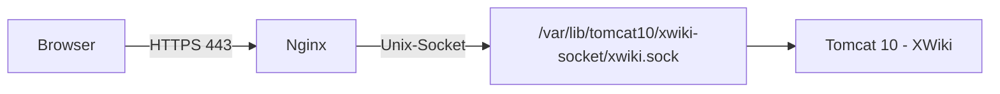

# XWiki über Unix-Socket mit Nginx bereitstellen

Statt Tomcat über einen internen TCP-Port (siehe [XWiki installieren und über Nginx bereitstellen](installieren.md)) an Nginx anzubinden, lässt sich die Verbindung auch über einen **Unix-Domain-Socket** führen. Tomcat und Nginx kommunizieren dann über eine Datei im Dateisystem statt über `localhost:9000` — Java bindet damit keinen TCP-Port mehr, der lokal erreichbar wäre.

!!! note "Hinweis"
    Diese Anleitung setzt eine laufende XWiki-Installation mit **Tomcat 10** voraus (siehe [Installation über APT](installation-ueber-apt.md) oder [Installieren](installieren.md)). Für die XJetty-Variante gilt eine andere Connector-Konfiguration und wird hier nicht behandelt.

## Warum ein Unix-Socket?

- **Kein offener TCP-Port** zwischen Tomcat und Nginx — taucht nicht mehr in `ss -ltnp` auf und muss nicht per Firewall-Regel abgesichert werden.
- **Zugriffskontrolle über Dateisystemrechte** statt Netzwerk-ACLs — nur Prozesse mit passenden Unix-Rechten können sich verbinden.
- Minimal geringerer Overhead gegenüber Loopback-TCP, da kein IP-Stack durchlaufen wird.

!!! warning "Achtung"
    Für Unix-Domain-Sockets im NIO-Connector wird **Java 16 oder neuer** sowie **Tomcat 10.1 oder neuer** benötigt. Ältere Kombinationen unterstützen ausschließlich TCP-Connectoren.

## Voraussetzungen

| Voraussetzung | Prüfbefehl |
|---|---|
| Java-Version ≥ 16 | `java -version` |
| Tomcat-Version ≥ 10.1 | `dpkg -l tomcat10` bzw. `apt list --installed \| grep tomcat10` |
| laufende XWiki-Installation | `sudo systemctl status tomcat10` |
| `sudo`-Rechte | — |
| Nginx als vorgeschalteter Reverse Proxy | `nginx -v` |

## Ablauf



## 1. Ausführenden Benutzer von Tomcat ermitteln

Der Socket wird später vom Tomcat-Prozess angelegt und übernimmt dessen Benutzer und Gruppe. Diese müssen vor der Konfiguration bekannt sein:

```bash
systemctl cat tomcat10 | grep -E "^(User|Group)="
```

Fehlt dort ein Eintrag, läuft der Dienst mit dem in `/etc/default/tomcat10` bzw. paketseitig vorgegebenen Standardbenutzer (auf Debian/Ubuntu üblicherweise `tomcat`). Im Zweifel zusätzlich prüfen:

```bash
ps -o user=,group= -C java
```

Im Folgenden wird von Benutzer und Gruppe `tomcat` ausgegangen — bei Abweichung entsprechend anpassen.

## 2. Socket-Verzeichnis anlegen

Der Socket sollte in einem **persistenten** Verzeichnis liegen, nicht unter `/run/`, da dieses beim Neustart geleert wird und sonst zusätzliche `tmpfiles.d`-Konfiguration nötig wäre:

```bash
sudo mkdir -p /var/lib/tomcat10/xwiki-socket
sudo chown tomcat:tomcat /var/lib/tomcat10/xwiki-socket
sudo chmod 750 /var/lib/tomcat10/xwiki-socket
```

## 3. Nginx-Benutzer zur Tomcat-Gruppe hinzufügen

Damit Nginx (läuft üblicherweise als `www-data`) über Gruppenrechte auf den Socket zugreifen darf, ohne ihn für alle lesbar/schreibbar zu machen:

```bash
sudo usermod -aG tomcat www-data
```

Die neue Gruppenmitgliedschaft wird erst nach einem Neustart des Nginx-Dienstes wirksam (siehe Schritt 6).

## 4. Connector in `server.xml` umstellen

```bash
sudo nano /etc/tomcat10/server.xml
```

Den bestehenden HTTP-Connector (TCP-Port, z. B. `8080` oder `9000`) ersetzen durch einen Connector mit `unixDomainSocketPath`:

```xml
<Connector protocol="org.apache.coyote.http11.Http11NioProtocol"
           unixDomainSocketPath="/var/lib/tomcat10/xwiki-socket/xwiki.sock"
           unixDomainSocketPathPermissions="rw-rw----"
           connectionTimeout="20000"
           redirectPort="8443" />
```

!!! note "Hinweis"
    Bei gesetztem `unixDomainSocketPath` entfällt das sonst verpflichtende `port`-Attribut. `unixDomainSocketPathPermissions` steuert die POSIX-Rechte der Socket-Datei als neun Zeichen (`rwxrwxrwx`-Schema); ohne diese Angabe legt Tomcat den Socket standardmäßig mit `rw-rw-rw-` an, also für alle lokalen Benutzer weltweit beschreibbar. `rw-rw----` beschränkt den Zugriff auf Eigentümer und Gruppe (`tomcat`), wozu `www-data` durch Schritt 3 gehört.

!!! warning "Achtung"
    Tomcat legt den Socket bei jedem Start neu an und entfernt ihn bei einem sauberen Shutdown wieder. Existiert die Datei bereits beim Start (z. B. nach einem Absturz), **schlägt der Start fehl**. Siehe Abschnitt „Fehlerbehandlung" weiter unten.

## 5. Tomcat neu starten und Socket prüfen

```bash
sudo systemctl restart tomcat10
ls -l /var/lib/tomcat10/xwiki-socket/xwiki.sock
```

Die Ausgabe sollte etwa so aussehen:

```text
srw-rw---- 1 tomcat tomcat 0 Aug 10 12:00 /var/lib/tomcat10/xwiki-socket/xwiki.sock
```

Das führende `s` markiert den Eintrag als Socket-Datei.

## 6. Nginx-Konfiguration anpassen

In der bestehenden Server-Konfiguration (z. B. `/etc/nginx/conf.d/xwiki.conf`) `proxy_pass` von TCP auf den Unix-Socket umstellen:

```nginx
server {
    listen 443 ssl http2;
    listen [::]:443 ssl http2;
    server_name xwiki.wissen-ahrensburg.de;
    ssl_certificate /etc/letsencrypt/live/wissen-ahrensburg.de/fullchain.pem;
    ssl_certificate_key /etc/letsencrypt/live/wissen-ahrensburg.de/privkey.pem;

    location / {
        proxy_pass http://unix:/var/lib/tomcat10/xwiki-socket/xwiki.sock:/;
        proxy_set_header Host $host;
        proxy_set_header X-Real-IP $remote_addr;
        proxy_set_header X-Forwarded-For $proxy_add_x_forwarded_for;
        proxy_set_header X-Forwarded-Proto $scheme;
    }
}
```

Konfiguration testen und Nginx neu starten (nicht nur `reload`, damit die neue Gruppenmitgliedschaft aus Schritt 3 greift):

```bash
sudo nginx -t
sudo systemctl restart nginx
```

## 7. Test

Direkt über den Socket, ohne Nginx:

```bash
curl --unix-socket /var/lib/tomcat10/xwiki-socket/xwiki.sock http://localhost/xwiki/
```

Anschließend über die öffentliche Domain im Browser aufrufen und prüfen, ob XWiki wie gewohnt erreichbar ist.

## Fehlerbehandlung

### Nginx meldet „Permission denied" beim Verbindungsaufbau

```bash
sudo tail -f /var/log/nginx/error.log
```

Erscheint `connect() to unix:/…/xwiki.sock failed (13: Permission denied)`, fehlt entweder die Gruppenmitgliedschaft aus Schritt 3 oder Nginx wurde seither nicht neu gestartet. Gruppenmitgliedschaft prüfen:

```bash
id www-data
```

### Tomcat startet nicht, Socket existiert bereits

Nach einem harten Absturz kann die Socket-Datei zurückbleiben und einen Neustart verhindern. Vor dem nächsten Start manuell entfernen:

```bash
sudo systemctl stop tomcat10
sudo rm -f /var/lib/tomcat10/xwiki-socket/xwiki.sock
sudo systemctl start tomcat10
```

### Rückbau auf TCP-Port

Um wieder auf eine TCP-basierte Anbindung zu wechseln, in `server.xml` den Connector wie in [XWiki installieren und über Nginx bereitstellen](installieren.md) beschrieben zurücksetzen und `proxy_pass` in der Nginx-Konfiguration wieder auf `http://localhost:PORT/` ändern.

## Weiterführende Seiten

- [XWiki installieren und über Nginx bereitstellen](installieren.md)
- [XWiki über APT installieren](installation-ueber-apt.md)
- [Apache Tomcat 10.1 – HTTP-Connector-Referenz (unixDomainSocketPath)](https://tomcat.apache.org/tomcat-10.1-doc/config/http.html)
- [Nginx-Härtung](../../../entwicklung/infrastruktur/nginx-hardening.md)
