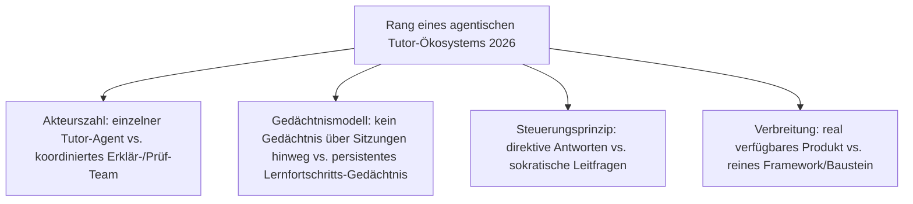
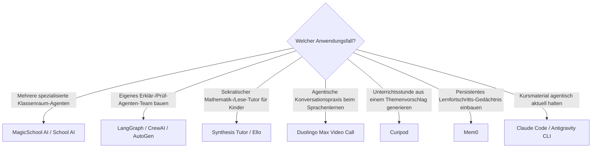

# Beste agentische Tutor-Ökosysteme 2026 — Top-15-Topliste

Die [Evolution und Architekturen digitaler Agentischer Tutor-Ökosysteme](evolution-digitaler-agentische-tutor-oekosysteme.md) beschreibt die jüngste, noch unreife LMS-Generation — von einzelnen sokratischen KI-Tutoren über Multi-Agenten-Tutor-Systeme mit arbeitsteiligen Erklär-/Prüf-Rollen bis zu autonomer Content-Pflege und Langzeitgedächtnis-Architekturen. Diese Seite übersetzt die Chronologie in eine **Momentaufnahme 2026**: 15 real verfügbare Produkte und Frameworks, die mindestens einen agentischen Baustein dieser Zeitachse umsetzen.

!!! warning "Achtung: Reifegrad variiert stark zwischen den Rängen dieser Liste"
    Wie bei den agentischen Generationen der CMS-, Wissenssysteme- und Notebook-Zeitachsen existieren für die spätesten Stufen dieser Zeitachse noch wenige vollständig ausgereifte, breit dokumentierte Referenzsysteme — Rang 13–15 stehen für gerade erst entstehende Produktkategorien, nicht für etablierte Standards. **Stand: August 2026.**

---

## Bewertungskriterien

---

## Top 15 im Überblick

| Rang | System | Anbieter | Generation | Besondere Stärke |
|---|---|---|---|---|
| 1 | **Khan Academy Khanmigo** | Khan Academy | 1a/3 (Sokratischer Einzel-Tutor / Sokratische Agenten als Steuerungsprinzip) | Reifstes sokratisches Tutor-System dieser Liste, breite K-12-Rollouts über ganze Schulbezirke |
| 2 | **MagicSchool AI** | MagicSchool | Ergänzung 2026 | Populäre Multi-Agenten-Plattform für Lehrkräfte — Unterrichtsplanung, Differenzierung und Feedback als separate Agenten |
| 3 | **School AI** | School AI | Ergänzung 2026 | Baukasten zum Erstellen eigener Klassenraum-Agenten ohne Programmierkenntnisse |
| 4 | **LangGraph** | LangChain | 2 (Multi-Agenten-Tutor-Systeme) | Verbreitetstes Orchestrierungs-Framework für Erklär-/Prüf-Agenten-Teams in Tutor-Systemen |
| 5 | **CrewAI** | CrewAI | 2 (Multi-Agenten-Tutor-Systeme) | Rollenbasiertes Multi-Agenten-Framework, verbreitet für arbeitsteilige Tutor-Architekturen |
| 6 | **AutoGen** | Microsoft | 2 (Multi-Agenten-Tutor-Systeme) | Microsoft-Framework für kooperierende Agenten, ebenfalls verbreitet in Tutor-Prototypen |
| 7 | **Synthesis Tutor** | Synthesis | Ergänzung 2026 | KI-Mathematik-Tutor mit Fokus auf spielerisches, adaptives Problemlösen für Kinder |
| 8 | **Coursera Coach** | Coursera | 1a (Sokratischer Einzel-Tutor) | Etablierter Einzel-Tutor-Agent innerhalb bestehender MOOC-Kurse |
| 9 | **Brisk Teaching** | Brisk | Ergänzung 2026 | Chrome-Erweiterung mit mehreren spezialisierten Lehrkraft-Agenten direkt im Browser |
| 10 | **Curipod** | Curipod | Ergänzung 2026 | Agentische Unterrichtsstunden-Generierung aus einem kurzen Themenvorschlag |
| 11 | **Duolingo Max Video Call** | Duolingo | Ergänzung 2026 | Agentische Konversationspraxis mit einem KI-Gesprächspartner statt statischer Übungen |
| 12 | **Ello** | Ello | Ergänzung 2026 | KI-Lese-Tutor für Kinder mit adaptivem, sprachbasiertem Feedback |
| 13 | **Google Classroom KI-Agenten-Features** | Google | Ergänzung 2026 | Erste agentische Funktionen (automatisierte Aufgabenerstellung, Feedback-Entwürfe) direkt in der größten K-12-Cloud-Plattform |
| 14 | **Mem0** | Mem0 | Ergänzung 2026 (Gedächtnis-Baustein zu Generation 5) | Verbreitete Open-Source-Gedächtnisschicht für Agenten, einsetzbar als Lernfortschritts-Gedächtnis-Baustein |
| 15 | **Claude Code / Antigravity CLI angewendet auf Kursmaterial-Pflege** | Anthropic / Antigravity | 4 (Autonome Content-Pflege-Agenten) | Agentische Coding-Werkzeuge lassen sich direkt auf Kursmaterial-Repositories anwenden — dasselbe Prinzip wie [Generation 6 der Docs-as-Code-Zeitachse](../dokumentation/evolution-digitaler-docs-as-code.md#generation-6-agentische-docs-as-code-autonome-pflege-durch-ki-agenten-ab-ca-2025) |

---

## Highlights im Detail

### Rang 1–3: die drei sichtbarsten Multi-Agenten-Klassenraum-Plattformen
Khanmigo, MagicSchool AI und School AI sind die drei Produkte dieser Liste mit der breitesten realen Schul-/Lehrkraft-Adoption — alle drei setzen bereits mehrere spezialisierte Agenten-Rollen statt eines einzelnen generischen Chatbots ein, siehe [Generation 1c](evolution-digitaler-agentische-tutor-oekosysteme.md#generation-1-vom-einzelnen-ki-tutor-zum-orchestrierten-lernprozess-2023-2024).

### Rang 4–6: die Orchestrierungs-Infrastruktur hinter vielen Tutor-Prototypen
LangGraph, CrewAI und AutoGen sind keine Bildungsprodukte, sondern die allgemeinen Agenten-Frameworks, mit denen Erklär-/Prüf-Rollenteilung aus [Generation 2](evolution-digitaler-agentische-tutor-oekosysteme.md#generation-2-multi-agenten-tutor-systeme-ab-2024) in der Praxis gebaut wird — dieselben drei Werkzeuge wie in [Generation 2 der Autonomen-KI-Agenten-Zeitachse](../../künstliche-intelligenz/evolution-digitaler-autonome-ki-agenten.md#generation-2-orchestrierungs-frameworks-etablieren-sich-2023-2024).

### Rang 14–15: die beiden am wenigsten bildungsspezifischen, aber strukturell wichtigsten Bausteine
Mem0 und agentische Coding-Werkzeuge auf Kursmaterial angewendet stammen aus völlig anderen Domänen (allgemeine Agenten-Gedächtnisschicht, Software-Entwicklung), decken aber genau die beiden am wenigsten ausgereiften Bausteine dieser Generation ab — persistentes Lernfortschritts-Gedächtnis und autonome Content-Pflege, siehe [Generation 4–5](evolution-digitaler-agentische-tutor-oekosysteme.md#generation-5-langzeitgedachtnis-uber-den-individuellen-lernfortschritt-ab-2024).

---

## Entscheidungshilfe nach Anwendungsfall

!!! tip "Tipp: Vorgänger-Generation separat prüfen"
    Für einzelne, nicht-orchestrierte KI-Tutor-Funktionen ohne Multi-Agenten-Architektur siehe [Beste KI-adaptive Lernplattformen 2026](ki-adaptive-lernplattformen-2026-topliste.md).

---

## 🔗 Verwandte Themen

- [Startseite](../../index.md) — zurück zur Dokumentations-Zentrale
- [Evolution und Architekturen digitaler Agentischer Tutor-Ökosysteme](evolution-digitaler-agentische-tutor-oekosysteme.md) — chronologisches Generationenmodell, dessen aktuellen Stand diese Topliste zusammenfasst
- [Produktionsreife agentische Tutor-Ökosysteme nach Generation (kein Treffer)](produktionsreife-agentische-tutor-oekosysteme-generationen-2026-topliste.md) — dieselbe Kategorie durch das konservative Fünf-Filter-Sieb; kein domäneneigener, quelloffener, produktionsreifer Baustein — Praxis-Fazit: reifes LMS + etabliertes Agenten-Framework
- [Beste Lernmanagement-Systeme 2026 (Top 20)](lms-2026-topliste.md) — Gesamtmarkt-Topliste über alle fünf LMS-Generationen hinweg
- [Beste KI-adaptive Lernplattformen 2026 (Top 15)](ki-adaptive-lernplattformen-2026-topliste.md) — vorausgehende Generation
- [Beste agentische Content-Ökosysteme 2026 (Top 20)](../dokumentation/agentische-content-oekosysteme-2026-topliste.md) — analoges Orchestrierungsprinzip für Content-Pflege statt individuelles Tutoring
- [Beste KI-native Notebook-Umgebungen 2026 (Top 20)](../dokumentation/ki-native-notebooks-2026-topliste.md) — analoge, ähnlich junge Agenten-Generation für Notebooks statt Lernplattformen
- [LLM-Wiki-Pattern (Karpathy-Muster)](../dokumentation/llm-wiki-pattern-karpathy.md) — verwandtes Prinzip hinter Rang 15, das dieses Repository selbst nutzt
