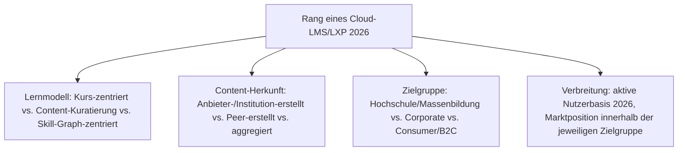
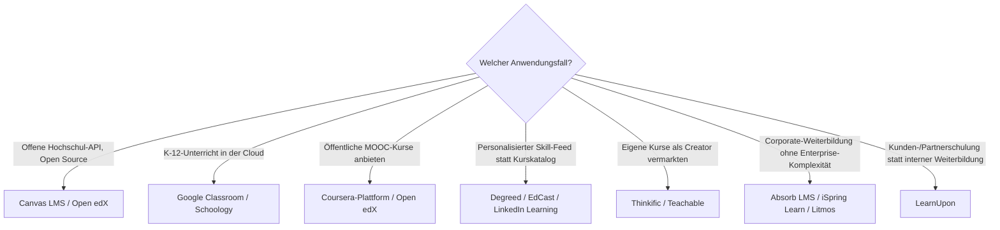

# Beste Cloud-LMS & LXP 2026 — Top-20-Topliste

Die [Evolution und Architekturen digitaler Cloud-LMS & LXP](evolution-digitaler-cloud-lms.md) ordnet diese Kategorie chronologisch nach Architektur-Generation — vom Aufstieg offener REST-APIs über Cloud-native Open-Source-LMS, MOOC-Plattformen im großen Maßstab, Content-Kuratierung nach Streaming-Vorbild und Peer-/Social-Learning bis zu Skill-Graph-zentrierten Consumer-Plattformen. Diese Seite übersetzt die Chronologie in eine **Momentaufnahme 2026**: 20 Plattformen, die heute tatsächlich betrieben werden.

!!! note "Hinweis: Abgrenzung zur Gesamtmarkt-Topliste"
    [Beste Lernmanagement-Systeme 2026](lms-2026-topliste.md) rankt bereits zehn Cloud-LMS-/LXP-Vertreter innerhalb einer generationenübergreifenden Liste. Diese Seite bleibt strikt auf die **Cloud-LMS-/LXP-Kategorie aus [Generation 2 der übergeordneten Zeitachse](evolution-digitaler-lms.md#generation-2-cloud-native-lms-learning-experience-platforms-lxp-ca-2011-2021)** beschränkt und ergänzt zehn aktuelle Marktteilnehmer, die in der historischen Chronologie nicht einzeln benannt sind.

---

## Bewertungskriterien

!!! warning "Achtung: Momentaufnahme, Stand August 2026"
    Der Creator-Economy- und K-12-Bereich (Rang 11–14) verändert sich am schnellsten — mehrere dieser Anbieter wechseln regelmäßig Preismodell und Funktionsumfang.

---

## Top 20 im Überblick

| Rang | Plattform | Generation | Zielgruppe | Besondere Stärke |
|---|---|---|---|---|
| 1 | **Canvas LMS** (Instructure) | 1b/2 (Canvas LMS & Cloud-native Open-Source) | Hochschule | API-first von Grund auf konzipiert, hohe Usability, siehe [Generation 2](evolution-digitaler-cloud-lms.md#generation-2-canvas-lms-cloud-native-open-source-2011) |
| 2 | **LinkedIn Learning** | 6 (Skill-Graph-zentrierte Consumer-Plattformen) | Consumer/B2C | Skill-Graph-Anbindung an LinkedIn-Profile, größte Consumer-Reichweite dieser Liste |
| 3 | **Docebo** | 4 (Content-Kuratierung nach Streaming-Vorbild) | Corporate | KI-gestützte Kursempfehlungen und Social-Learning-Feed statt starrem Katalog |
| 4 | **Coursera-Plattform** | 3 (MOOC-Plattformen im großen Maßstab) | Hochschule/Massenbildung | Größte kommerzielle MOOC-Plattform mit Partnerschaften zu Universitäten |
| 5 | **Open edX** | 3 (MOOC-Plattformen im großen Maßstab) | Hochschule/Massenbildung | Quelloffene MOOC-Plattform hinter edX.org, für Zehntausende gleichzeitige Teilnehmende konzipiert |
| 6 | **D2L Brightspace** | Ergänzung 2026 | Hochschule | Führender Cloud-Konkurrent zu Canvas im nordamerikanischen Hochschulmarkt |
| 7 | **Skillsoft** | Ergänzung 2026 | Corporate | Großer LXP-/Content-Aggregator mit umfangreicher Kurs-Bibliothek für Unternehmen |
| 8 | **Degreed** | 4 (Content-Kuratierung nach Streaming-Vorbild) | Corporate | Aggregiert Inhalte aus vielen Quellen (LMS, YouTube, Artikel) zu einem personalisierten Feed |
| 9 | **360Learning** | 5 (Peer- & Collaborative-Learning) | Corporate | Peer-basiertes „Collaborative Learning" — Mitarbeitende erstellen Kursinhalte selbst |
| 10 | **EdCast** | 4 (Content-Kuratierung nach Streaming-Vorbild) | Corporate | Kuratierungsprinzip mit Fokus auf Unternehmens-Wissensmanagement |
| 11 | **Google Classroom** | Ergänzung 2026 | K-12 | Größte K-12-Reichweite weltweit über die Google-Workspace-Integration |
| 12 | **Schoology** (PowerSchool) | Ergänzung 2026 | K-12 | Verbreitete Cloud-LMS-Wahl an US-amerikanischen Schulbezirken |
| 13 | **Thinkific** | Ergänzung 2026 | Consumer/Creator Economy | Selbstständige Kurs-Vermarktung für einzelne Autoren ohne eigene Infrastruktur |
| 14 | **Teachable** | Ergänzung 2026 | Consumer/Creator Economy | Vergleichbares Creator-Economy-Modell mit Fokus auf schnellen Kurs-Launch |
| 15 | **Absorb LMS** | Ergänzung 2026 | Corporate | Etablierter SaaS-Corporate-LMS-Anbieter jenseits der Talent-Suite-Schwergewichte |
| 16 | **LearnUpon** | Ergänzung 2026 | Corporate (Kunden-/Partnerschulung) | Spezialisiert auf externe Kunden- und Partnerschulungen statt reiner Mitarbeiterweiterbildung |
| 17 | **Chamilo** | 5 (Peer- & Collaborative-Learning) | Hochschule | Schlanke, selbst gehostete Open-Source-Alternative mit Fokus auf gemeinschaftliche Kursgestaltung |
| 18 | **ILIAS** | 5 (Peer- & Collaborative-Learning) | Hochschule | Schlanke, selbst gehostete Open-Source-Alternative mit Fokus auf Hochschulbetrieb |
| 19 | **iSpring Learn** | Ergänzung 2026 | Corporate | Enge Anbindung an das iSpring-Autorentool-Ökosystem für schnelle Kurserstellung |
| 20 | **Litmos** (SAP) | Ergänzung 2026 | Corporate | SAP-eigene Corporate-LXP neben SAP SuccessFactors Learning, eigenständig positioniert für kleinere Teams |

---

## Highlights im Detail

### Rang 1, 4–5: die drei API-first-Referenzsysteme der Gründergeneration
Canvas LMS, Coursera-Plattform und Open edX setzen die drei Kernprinzipien aus [Generation 1 dieser Zeitachse](evolution-digitaler-cloud-lms.md#generation-1-der-weg-zu-offenen-lms-apis-2008-2011) — SaaS-Betrieb, offene REST-API, Mobile-first — als erste konsequent um, jeweils für eine andere Zielgruppe (Hochschule, kommerzielles MOOC, Open-Source-MOOC).

### Rang 3, 8–10: vier unterschiedliche Kuratierungs-Philosophien
Docebo, Degreed, 360Learning und EdCast lösen alle dasselbe Grundproblem — starre Kurskataloge veralten schnell — mit vier unterschiedlichen Antworten: KI-Empfehlung, Multi-Quellen-Aggregation, Peer-Erstellung und Wissensmanagement-Fokus, siehe [Generation 4–5](evolution-digitaler-cloud-lms.md#generation-4-content-kuratierung-nach-streaming-vorbild-2015-2019).

### Rang 11–14: die Consumer-/K-12-Cloud-Welle jenseits der Chronologie
Google Classroom, Schoology, Thinkific und Teachable tauchen in der historischen Chronologie nicht auf, weil sie keine neue Architektur-Generation begründen — sie füllen aber 2026 den größten Teil des tatsächlichen K-12- und Creator-Economy-Marktes.

---

## Entscheidungshilfe nach Anwendungsfall

!!! tip "Tipp: klassische und interoperable Perspektive separat prüfen"
    Wer On-Premise statt SaaS sucht, findet die passenderen Kandidaten in [Beste klassische LMS 2026](klassische-lms-2026-topliste.md); für xAPI-/LTI-Interoperabilität jenseits von SCORM siehe [Beste interoperable LMS-Bausteine 2026](interoperable-lms-2026-topliste.md).

---

## 🔗 Verwandte Themen

- [Startseite](../../index.md) — zurück zur Dokumentations-Zentrale
- [Evolution und Architekturen digitaler Cloud-LMS & LXP](evolution-digitaler-cloud-lms.md) — chronologisches Generationenmodell, dessen aktuellen Stand diese Topliste zusammenfasst
- [Beste Lernmanagement-Systeme 2026 (Top 20)](lms-2026-topliste.md) — Gesamtmarkt-Topliste über alle fünf LMS-Generationen hinweg
- [Beste klassische LMS 2026 (Top 15)](klassische-lms-2026-topliste.md) — vorausgehende Generation
- [Beste interoperable LMS-Bausteine 2026 (Top 10)](interoperable-lms-2026-topliste.md) — nachfolgende Generation
- [Beste Headless-CMS 2026 (Top 20)](../dokumentation/headless-cms-2026-topliste.md) — analoges API-first-Prinzip im CMS-Kontext
