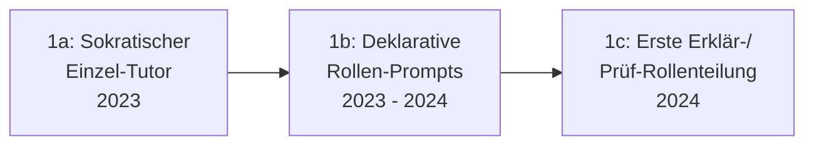

# Evolution und Architekturen digitaler Agentischer Tutor-Ökosysteme

Agentische & autonome Tutor-Ökosysteme bilden Generation 5 — die aktuelle und letzte Generation — der [Evolution digitaler Lernmanagement-Systeme](evolution-digitaler-lms.md). Diese eigenständige Zeitachse zoomt in genau diese Architekturlinie hinein: von einzelnen sokratischen KI-Tutoren über Multi-Agenten-Tutor-Systeme mit arbeitsteiligen Erklär-/Prüf-Rollen, deklarativ definierte Rollen-Prompts und autonome Content-Pflege-Agenten bis zu Langzeitgedächtnis-Architekturen über den individuellen Lernfortschritt hinweg.

!!! note "Hinweis: Generationen überlappen sich — und diese Generation ist noch jung"
    Die Zeiträume sind grobe Orientierung, keine scharfen Grenzen. Wie bei den agentischen Generationen der CMS- und Wissenssysteme-Zeitachsen existieren für die spätesten Stufen dieser Zeitachse noch wenige vollständig ausgereifte Referenzsysteme — die Einordnung stützt sich auf reale, aber noch wachsende Einzelprodukte und allgemeine Architekturprinzipien aus verwandten Agenten-Zeitachsen.

---

## Generation 1: Vom einzelnen KI-Tutor zum orchestrierten Lernprozess, 2023 – 2024

Die Gründergeneration eint drei Prinzipien: ein **einzelner, dialogfähiger KI-Tutor** als Ausgangspunkt, **didaktische Steuerung über Leitfragen statt direkter Antworten** und ein **schrittweiser Übergang** zu mehreren zusammenwirkenden Rollen. Sie lässt sich in drei technologische Entwicklungsstufen unterteilen:

### 1a. Sokratischer Einzel-Tutor, 2023

- **Architektur:** direkte Fortsetzung von [Generation 4 der KI-adaptiven Lernplattformen](evolution-digitaler-ki-adaptive-lernplattformen.md#generation-4-sokratisch-gefuhrte-ki-tutoren-ab-2023) — ein Agent übernimmt sowohl Erklären als auch Prüfen in Personalunion.

### 1b. Deklarative Rollen-Prompts, 2023 – 2024

- **Architektur:** didaktisches Verhalten (sokratisch, direktiv, ermutigend) wird über [Rollen- & Kontext-Prompts](index.md#2-erstellung-steuerung-von-ki-agenten-im-e-learning) deklarativ definiert statt in starrem Code verankert.

### 1c. Erste Erklär-/Prüf-Rollenteilung, 2024

- **Architektur:** Erklären und Prüfen werden erstmals als getrennte Agenten-Rollen modelliert, statt in einem einzigen Tutor-Prompt zu verschmelzen — die direkte Vorstufe zu Generation 2.

---

## Generation 2: Multi-Agenten-Tutor-Systeme, ab 2024

Ein „Erklär-Agent" und ein „Prüf-Agent" arbeiten arbeitsteilig zusammen — dieselbe Architekturantwort wie in [Generation 3 der Multi-Agenten-Wissensökosysteme](../dokumentation/evolution-digitaler-multiagenten-wissensoekosysteme.md#generation-3-koordinierte-multi-agenten-frameworks-2023-2024), hier auf den individuellen Lernprozess angewendet.

| Rolle | Aufgabe |
|---|---|
| **Erklär-Agent** | Führt Lernende sokratisch durch neue Konzepte. |
| **Prüf-Agent** | Bewertet Antworten und Code unabhängig vom Erklär-Agenten, siehe [Referenz-Architektur für KI-Agenten im E-Learning](index.md#5-optimales-zusammenspiel-referenz-architektur). |

Verbreitete Orchestrierungs-Frameworks für diese Rollenteilung: **LangGraph**, **CrewAI**, **AutoGen** — dieselben Werkzeuge wie in [Generation 2 der Autonomen-KI-Agenten-Zeitachse](../../künstliche-intelligenz/evolution-digitaler-autonome-ki-agenten.md#generation-2-orchestrierungs-frameworks-etablieren-sich-2023-2024).

---

## Generation 3: Sokratische Agenten als Steuerungsprinzip, ab 2023

**Khanmigo** und vergleichbare Agenten verweigern bewusst die direkte Lösung und steuern stattdessen über Leitfragen — ein didaktisches Prinzip, das zum wiederkehrenden Architekturmuster für die gesamte Generation wird.

| Baustein | Rolle |
|---|---|
| **Sokratische Verweigerungslogik** | Der Agent erkennt Anfragen nach direkten Lösungen und antwortet stattdessen mit einer Leitfrage. |

---

## Generation 4: Autonome Content-Pflege-Agenten, ab 2024

Statt nur mit Lernenden zu interagieren, prüfen Agenten **bestehendes Kursmaterial kontinuierlich auf Aktualität** und schlagen selbstständig Korrekturen vor.

| Baustein | Rolle |
|---|---|
| **Autonome Aktualitätsprüfung** | Konzeptionell deckungsgleich mit dem [LLM-Wiki-Pattern (Karpathy-Muster)](../dokumentation/llm-wiki-pattern-karpathy.md), das dieses Repository selbst für die eigene Doku-Pflege nutzt. |

---

## Generation 5: Langzeitgedächtnis über den individuellen Lernfortschritt, ab 2024

Damit ein Tutor-Agent über mehrere Sitzungen hinweg konsistent bleibt, benötigt er ein **persistentes Gedächtnis** des individuellen Lernstands — dieselbe Architekturlinie wie in [Generation 6 der Visuell-Agentischen-Wissenssysteme-Zeitachse](../dokumentation/evolution-digitaler-visuell-agentische-wissenssysteme.md#generation-6-autonome-agentische-gedachtnissysteme-ab-2023), hier auf individuelle Lernende statt allgemeine Wissensarbeit angewendet.

| Baustein | Rolle |
|---|---|
| **Agentisches Lernfortschritts-Gedächtnis** | Speichert Stärken, Schwächen und bisherige Erklärversuche pro Lernendem, statt bei jeder Sitzung neu zu beginnen. |

---

## Generation 6: Vollständig orchestrierte Tutor-Ökosysteme, ab 2025

Die Ausblick-Generation: Lernstand erfassen, Aufgaben generieren, Code/Antworten prüfen, didaktisch intervenieren und Kursmaterial aktualisieren laufen als durchgängiger, selbstständiger Agenten-Workflow — deckungsgleich mit der Beschreibung in [Generation 5 der übergeordneten LMS-Zeitachse](evolution-digitaler-lms.md#generation-5-agentische-autonome-tutor-okosysteme).

!!! warning "Achtung: Telemetrie- und Datenschutzlücken bleiben"
    Wie in [Was fehlt? Aktuelle Lücken im E-Learning-Ökosystem](index.md#3-was-fehlt-aktuelle-lucken-im-e-learning-okosystem) beschrieben, sind SCORM und selbst xAPI (vgl. [Evolution digitaler interoperabler LMS](evolution-digitaler-interoperable-lms.md)) nicht darauf ausgelegt, freie, nicht-deterministische Dialoge zwischen Lernenden und KI-Agenten vollständig zu erfassen — ein offener Punkt auch für Generation 6 dieses Artikels.

---

## Alternative Sortier- & Klassifikationskriterien für agentische Tutor-Ökosysteme

### 1. Akteurszahl

- **Einzelner Tutor-Agent** — Generation 1.
- **Koordiniertes Erklär-/Prüf-Team** — Generation 2.

### 2. Gedächtnismodell

- **Kein Gedächtnis über Sitzungen hinweg** — frühe Einzel-Tutoren.
- **Persistentes Lernfortschritts-Gedächtnis** — Generation 5.

### 3. Steuerungsprinzip

- **Direktive Antworten** — klassische KI-Assistenten außerhalb dieser Zeitachse.
- **Sokratische Leitfragen** — durchgängiges Prinzip dieser Generation.

---

## Verwandte Themen

- [Beste agentische Tutor-Ökosysteme 2026 (Top 15)](agentische-tutor-oekosysteme-2026-topliste.md) — Momentaufnahme 2026, die diese Chronologie in eine gerankte Topliste übersetzt
- [Produktionsreife agentische Tutor-Ökosysteme nach Generation (kein Treffer)](produktionsreife-agentische-tutor-oekosysteme-generationen-2026-topliste.md) — dasselbe Modell durch das konservative Fünf-Filter-Sieb; der klarste „kein Treffer" der Familie: Architektur erst seit 2023, Bildungsprodukte proprietär, quelloffene Bausteine (LangGraph, CrewAI, Mem0) domänenfremd und selbst zu jung
- [Evolution und Architekturen digitaler Lernmanagement-Systeme](evolution-digitaler-lms.md) — übergeordnetes Generationenmodell, Generation 5 dort entspricht diesem Artikel im Ganzen
- [Evolution und Architekturen digitaler KI-adaptiver Lernplattformen](evolution-digitaler-ki-adaptive-lernplattformen.md) — vorausgehende Generation
- [Evolution und Architekturen digitaler Multi-Agenten-Wissensökosysteme](../dokumentation/evolution-digitaler-multiagenten-wissensoekosysteme.md) — analoges Orchestrierungsprinzip für Wissenspflege statt individuelles Tutoring
- [Evolution und Architekturen digitaler Autonomer KI-Agenten](../../künstliche-intelligenz/evolution-digitaler-autonome-ki-agenten.md) — allgemeine Agenten-Zeitachse, Generation 2 dort entspricht Generation 2 dieses Artikels
- [Referenz-Architektur für KI-Agenten im E-Learning](index.md#5-optimales-zusammenspiel-referenz-architektur) — praktische Umsetzung
- [LLM-Wiki-Pattern (Karpathy-Muster)](../dokumentation/llm-wiki-pattern-karpathy.md) — verwandtes Prinzip, das dieses Repository selbst nutzt
