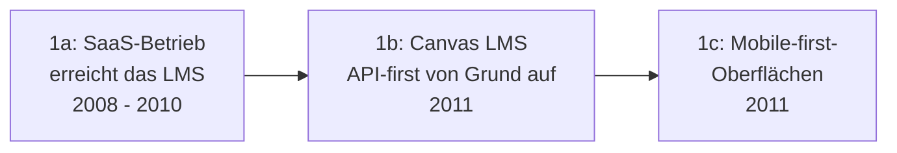

# Evolution und Architekturen digitaler Cloud-LMS & LXP

Cloud-native LMS & Learning Experience Platforms bilden Generation 2 der [Evolution digitaler Lernmanagement-Systeme](evolution-digitaler-lms.md). Diese eigenständige Zeitachse zoomt in genau diese Architekturlinie hinein: vom Aufstieg offener REST-APIs über Cloud-native Open-Source-LMS, MOOC-Plattformen im großen Maßstab, Content-Kuratierung nach Streaming-Vorbild und Peer-/Social-Learning bis zu Skill-Graph-zentrierten Consumer-Plattformen.

!!! note "Hinweis: Generationen überlappen sich"
    Die Zeiträume sind grobe Orientierung, keine scharfen Grenzen — Canvas LMS (Generation 2) läuft bis heute parallel zu Skill-Graph-Plattformen (Generation 6) produktiv. Entscheidend ist die **Architektur** (SaaS-Betrieb, REST-API, Content-Kuratierung statt starrem Kurskatalog), nicht allein das Erscheinungsjahr.

---

## Generation 1: Der Weg zu offenen LMS-APIs, 2008 – 2011

Die Gründergeneration eint drei Prinzipien: **SaaS-Betrieb statt On-Premise-Installation**, eine **offene REST-API** statt geschlossener Enterprise-Schnittstellen und **Mobile-first-Oberflächen** statt nachträglich angepasster Desktop-Ansichten. Sie lässt sich in drei technologische Entwicklungsstufen unterteilen:

### 1a. SaaS-Betrieb erreicht das LMS, 2008 – 2010

- **Beobachtung:** cloud-gehostete Software-as-a-Service-Modelle etablieren sich in anderen Enterprise-Kategorien, LMS-Anbieter beginnen nachzuziehen.

### 1b. Canvas LMS — API-first von Grund auf, 2011

- **Architektur:** Instructure konzipiert Canvas von Beginn an mit einer vollständig offenen REST-API statt sie nachträglich zu ergänzen.

### 1c. Mobile-first-Oberflächen, 2011

- **Architektur:** Bedienoberflächen werden erstmals primär für mobile Geräte entworfen, Desktop-Ansichten folgen der mobilen Struktur statt umgekehrt.

---

## Generation 2: Canvas LMS & Cloud-native Open-Source, 2011

**Canvas LMS** (Instructure) etabliert sich als Referenzarchitektur für offene, API-first betriebene Lernplattformen mit hoher Usability.

| Baustein | Rolle |
|---|---|
| **Canvas LMS** | Cloud-natives Open-Source-LMS mit offener API, siehe [Werkzeug-Übersicht](index.md#lernmanagement-systeme-lms-plattform-software). |

---

## Generation 3: MOOC-Plattformen im großen Maßstab, 2012

Massive Open Online Courses erfordern eine fundamental andere Skalierungsarchitektur als klassische Kurs-LMS — Zehntausende gleichzeitige Teilnehmende statt einzelner Klassen.

| System | Jahr | Prinzip |
|---|---|---|
| **Open edX** | 2012 | Quelloffene MOOC-Plattform hinter edX.org (Harvard/MIT), konzipiert für Massenkurse. |
| **Coursera-Plattform** | 2012 | Kommerzielle MOOC-Plattform mit Partnerschaften zu Universitäten. |

---

## Generation 4: Content-Kuratierung nach Streaming-Vorbild, 2015 – 2019

Statt eines starren Kurskatalogs empfehlen diese Systeme Lerninhalte algorithmisch — die Learning Experience Platform (LXP) entsteht als eigene Kategorie neben dem klassischen LMS.

| System | Prinzip |
|---|---|
| **Degreed** | Aggregiert Inhalte aus vielen Quellen (LMS, YouTube, Artikel) zu einem personalisierten Feed. |
| **EdCast** | Ähnliches Kuratierungsprinzip mit Fokus auf Unternehmens-Wissensmanagement. |
| **Docebo** | Kombiniert klassisches LMS mit KI-gestützten Kursempfehlungen und Social-Learning-Feed. |

---

## Generation 5: Peer- & Collaborative-Learning, 2015 – 2017

Statt Inhalte ausschließlich top-down bereitzustellen, erstellen Mitarbeitende selbst Kursinhalte — Lernen wird zum kollaborativen statt rein konsumierenden Prozess.

| System | Prinzip |
|---|---|
| **360Learning** | Peer-basiertes „Collaborative Learning" — Mitarbeitende erstellen und pflegen Kursinhalte gemeinsam. |
| **Chamilo, ILIAS** | Schlanke, selbst gehostete Open-Source-LMS mit Fokus auf einfache, gemeinschaftliche Kursgestaltung, siehe [Chamilo in der Werkzeug-Übersicht](index.md#lernmanagement-systeme-lms-plattform-software). |

---

## Generation 6: Skill-Graph-zentrierte Consumer-Plattformen, 2016

Fortschritt wird über **Kompetenzen** statt Kursabschlüsse gemessen — Lernplattformen verknüpfen sich direkt mit beruflichen Netzwerkprofilen.

| System | Prinzip |
|---|---|
| **LinkedIn Learning** | Konsumenten-orientierte LXP mit Skill-Graph-Anbindung an LinkedIn-Profile. |

!!! tip "Übergang zur nächsten Generation"
    Der Skill-Graph-Ansatz dieser Generation bereitet [Generation 3 der übergeordneten LMS-Zeitachse](evolution-digitaler-lms.md#generation-3-interoperabilitat-xapi-microlearning-okosysteme-ca-2013-heute) vor — dort wird die Erfassung granularer Lernaktivitäten über Systemgrenzen hinweg (xAPI) zum zentralen Architekturprinzip.

---

## Alternative Sortier- & Klassifikationskriterien für Cloud-LMS & LXP

### 1. Lernmodell

- **Kurs-zentriert** — Canvas LMS, Open edX.
- **Content-Kuratierung** — Degreed, EdCast.
- **Skill-Graph-zentriert** — LinkedIn Learning.

### 2. Content-Herkunft

- **Anbieter-/Institution-erstellt** — MOOC-Plattformen.
- **Peer-erstellt** — 360Learning.
- **Aggregiert aus externen Quellen** — Degreed, EdCast.

### 3. Zielgruppe

- **Hochschule/Massenbildung** — Open edX, Coursera.
- **Corporate** — Docebo, 360Learning.
- **Consumer/B2C** — LinkedIn Learning.

---

## Verwandte Themen

- [Beste Cloud-LMS & LXP 2026 (Top 20)](cloud-lms-2026-topliste.md) — Momentaufnahme 2026, die diese Chronologie in eine gerankte Topliste übersetzt
- [Produktionsreife Cloud-LMS & LXP nach Generation (Top 1)](produktionsreife-cloud-lms-generationen-2026-topliste.md) — dasselbe Modell durch ein konservatives Fünf-Filter-Sieb; nur Canvas LMS besteht, weil die LXP-Kategorie gehosteten Betrieb als Produkt verkauft und nie einen quelloffenen Vertreter hatte
- [Evolution und Architekturen digitaler Lernmanagement-Systeme](evolution-digitaler-lms.md) — übergeordnetes Generationenmodell, Generation 2 dort entspricht diesem Artikel im Ganzen
- [Evolution und Architekturen digitaler klassischer LMS](evolution-digitaler-klassische-lms.md) — vorausgehende Generation
- [Evolution und Architekturen digitaler Interoperabler LMS](evolution-digitaler-interoperable-lms.md) — nachfolgende Generation
- [E-Learning-Autorentools & Interaktive Lernumgebungen](index.md) — Gesamtübersicht Autorentools, LMS und KI-Agenten im E-Learning
