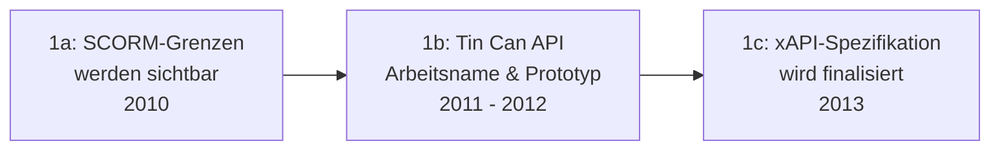

# Evolution und Architekturen digitaler interoperabler LMS

Interoperabilität, xAPI & Microlearning-Ökosysteme bilden Generation 3 der [Evolution digitaler Lernmanagement-Systeme](evolution-digitaler-lms.md). Diese eigenständige Zeitachse zoomt in genau diese Architekturlinie hinein: von den Grenzen des SCORM-Standards über die Tin-Can-API-Vorstufe, die eigentliche xAPI-Spezifikation, Learning-Record-Store-Implementierungen und LTI-Tool-Einbindung bis zu Microlearning-fokussierten Plattformen.

!!! note "Hinweis: Generationen überlappen sich"
    Die Zeiträume sind grobe Orientierung, keine scharfen Grenzen — SCORM-Pakete (Generation 1) laufen bis heute produktiv parallel zu xAPI-Statements. Entscheidend ist die **Architektur** (granulare Aktivitäts-Statements über Systemgrenzen hinweg statt geschlossener Content-Pakete), nicht allein das Erscheinungsjahr.

---

## Generation 1: Die Grenzen von SCORM werden sichtbar, 2010 – 2013

Die Gründergeneration eint drei Prinzipien: die **Erkenntnis**, dass SCORM-Pakete nur innerhalb des LMS selbst funktionieren, das **Bedürfnis nach Tracking außerhalb des Browsers** (mobile Apps, Simulationen) und ein **erster Lösungsansatz unter Arbeitsnamen** vor der endgültigen Standardisierung. Sie lässt sich in drei technologische Entwicklungsstufen unterteilen:

### 1a. SCORM-Grenzen werden sichtbar, 2010

- **Beobachtung:** mobile Lern-Apps, Simulationen und VR-Trainings finden außerhalb des Browsers statt, in dem SCORM-Pakete laufen — es gibt keinen Mechanismus, diese Aktivitäten ins LMS zurückzumelden.

### 1b. Tin Can API — Arbeitsname & Prototyp, 2011 – 2012

- **Architektur:** ein Forschungsprojekt entwickelt unter dem Arbeitsnamen „Tin Can API" ein REST-basiertes Protokoll für Aktivitäts-Statements außerhalb geschlossener Content-Pakete.

### 1c. xAPI-Spezifikation wird finalisiert, 2013

- **Architektur:** aus „Tin Can API" wird die offizielle **Experience API (xAPI)**-Spezifikation — Lernaktivitäten werden als **Aktor-Verb-Objekt**-Statements protokolliert, unabhängig vom Ausführungsort.

---

## Generation 2: Learning Record Stores etablieren sich, 2013 – 2016

xAPI-Statements benötigen einen eigenen Speicherort neben dem klassischen LMS — der **Learning Record Store (LRS)** entsteht als eigenständige Systemkategorie.

| System | Prinzip |
|---|---|
| **Watershed** | Kommerzieller LRS mit Analyse-Dashboards für xAPI-Statement-Ströme. |
| **Learning Locker** | Quelloffene LRS-Implementierung, selbst hostbar. |

---

## Generation 3: LTI standardisiert die Tool-Einbindung, 2010 – 2019

Statt jedes externe Werkzeug individuell zu integrieren, definiert **Learning Tools Interoperability (LTI)** eine sichere, standardisierte Einbettung mit automatischem Notenrückfluss ins LMS.

| Version | Jahr | Verbesserung |
|---|---|---|
| **LTI 1.0/1.1** | 2010/2013 | Grundlegende sichere Tool-Einbettung mit Notenrückfluss. |
| **LTI Advantage / LTI 1.3** | 2019 | Erweiterte Sicherheit (OAuth 2.0/OpenID Connect), tiefere Integration (Deep Linking, Names and Role Provisioning), siehe [LMS-Anbindung via LTI](ki-lehre-weiterbildung.md#32-thema-lms-anbindung-lti-standard-apis). |

---

## Generation 4: cmi5 vereint SCORM-Kompatibilität mit xAPI, 2016

**cmi5** schließt die Lücke zwischen dem etablierten SCORM-Ökosystem und der Flexibilität von xAPI — ein Profil, das xAPI-Statements mit SCORM-ähnlicher Struktur kombiniert.

| Baustein | Rolle |
|---|---|
| **cmi5-Profil** | Definiert einen standardisierten Statement-Satz auf xAPI-Basis, kompatibel mit bestehenden LMS-Workflows. |

---

## Generation 5: Microlearning-fokussierte Plattformen, 2015 – 2020

Statt langer, linearer Kurse setzen diese Systeme auf **kurze, granulare Lerneinheiten** — eine direkte Anwendung der durch xAPI ermöglichten granularen Aktivitätserfassung.

| System | Prinzip |
|---|---|
| **TalentLMS** | Fokus auf kurze, in sich abgeschlossene Lerneinheiten statt langer Kursabfolgen. |
| **Microlearning-Module in Docebo/360Learning** | Ergänzen bestehende [Generation 2 der LMS-Zeitachse](evolution-digitaler-cloud-lms.md#generation-4-content-kuratierung-nach-streaming-vorbild-2015-2019) um granulare Einzeleinheiten statt vollständiger Kurse. |

---

## Generation 6: xAPI trifft Analytics & Learning-Dashboards, ab 2018

Die aufgezeichneten xAPI-Statements werden zur Datengrundlage für Lern-Analytics — Muster über viele Lernende und Aktivitätstypen hinweg werden erstmals sichtbar, statt isolierter Einzel-Kursstatistiken.

| Baustein | Rolle |
|---|---|
| **Learning-Analytics-Dashboards** | Aggregieren LRS-Daten zu Mustern über Kohorten und Aktivitätstypen hinweg. |

!!! warning "Achtung: Grenzen bleiben auch hier"
    Wie in [Generation 5 der übergeordneten LMS-Zeitachse](evolution-digitaler-lms.md#generation-5-agentische-autonome-tutor-okosysteme) beschrieben, sind selbst xAPI und cmi5 nicht darauf ausgelegt, freie, nicht-deterministische Dialoge zwischen Lernenden und KI-Agenten vollständig zu erfassen.

---

## Alternative Sortier- & Klassifikationskriterien für interoperable LMS

### 1. Statement-Granularität

- **Ganzes Kurspaket** — SCORM (Vorgänger-Generation).
- **Einzelne Aktivitäts-Statements** — xAPI, cmi5.

### 2. Speicherort der Aktivitätsdaten

- **Im LMS selbst** — klassisches SCORM-Tracking.
- **Externer Learning Record Store** — Watershed, Learning Locker.

### 3. Kursstruktur

- **Lang, linear** — klassische Kursabfolgen.
- **Kurz, granular** — Microlearning (TalentLMS).

---

## Verwandte Themen

- [Beste interoperable LMS-Bausteine 2026 (Top 10)](interoperable-lms-2026-topliste.md) — Momentaufnahme 2026, die diese Chronologie in eine gerankte Topliste übersetzt
- [Produktionsreife interoperable LMS-Bausteine nach Generation (kein Treffer)](produktionsreife-interoperable-lms-generationen-2026-topliste.md) — dasselbe Modell durch das konservative Fünf-Filter-Sieb; Ergebnis: kein quelloffener Baustein besteht, die Kategorie ist eine Spezifikationsebene (xAPI, LTI, cmi5), die reifen LRS sind proprietär oder MongoDB-gebunden
- [Evolution und Architekturen digitaler Lernmanagement-Systeme](evolution-digitaler-lms.md) — übergeordnetes Generationenmodell, Generation 3 dort entspricht diesem Artikel im Ganzen
- [Evolution und Architekturen digitaler Cloud-LMS & LXP](evolution-digitaler-cloud-lms.md) — vorausgehende Generation
- [Evolution und Architekturen digitaler KI-adaptiver Lernplattformen](evolution-digitaler-ki-adaptive-lernplattformen.md) — nachfolgende Generation
- [KI in Lehre, Weiterbildung und Training](ki-lehre-weiterbildung.md) — praktische KI-Integration je Lernphase (2026)
