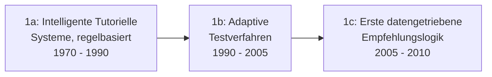

# Evolution und Architekturen digitaler KI-adaptiver Lernplattformen

KI-gestützte adaptive Lernplattformen bilden Generation 4 der [Evolution digitaler Lernmanagement-Systeme](evolution-digitaler-lms.md). Diese eigenständige Zeitachse zoomt in genau diese Architekturlinie hinein: von regelbasierten Vorläufern adaptiven Lernens über KI-generierte Kursentwürfe, personalisierte Lernpfad-Empfehlungen, sokratisch geführte KI-Tutoren und automatisiertes Feedback bis zur Nachrüstung bestehender Open-Source-LMS mit KI-Plugins.

!!! note "Hinweis: Generationen überlappen sich"
    Die Zeiträume sind grobe Orientierung, keine scharfen Grenzen — regelbasierte adaptive Systeme (Generation 1) liefen bereits Jahrzehnte vor generativer KI produktiv. Entscheidend ist die **Architektur** (statische Regeln vs. gelerntes/generatives Modell), nicht allein das Erscheinungsjahr.

---

## Generation 1: Regelbasierte Vorläufer adaptiven Lernens, 1970 – 2010

Die Gründergeneration eint drei Prinzipien: **intelligente tutorielle Systeme** mit fest programmierten Regeln statt gelernter Modelle, **Verzweigungslogik** statt linearer Kursabfolge und **kein generatives Sprachmodell** — Vorläufer der heutigen KI-Tutoren, aber technisch fundamental anders. Sie lässt sich in drei technologische Entwicklungsstufen unterteilen:

### 1a. Intelligente tutorielle Systeme, regelbasiert, 1970 – 1990

- **Architektur:** handkodierte Regelbäume analog zu [Generation 1 der Expertensysteme](../../künstliche-intelligenz/evolution-digitaler-expertensysteme.md), angewendet auf Lerninhalte statt medizinischer Diagnose.

### 1b. Adaptive Testverfahren, 1990 – 2005

- **Architektur:** Computerized Adaptive Testing (CAT) — die Schwierigkeit der nächsten Frage hängt von der vorherigen Antwort ab, statistisch fundiert statt fest verdrahtet.

### 1c. Erste datengetriebene Empfehlungslogik, 2005 – 2010

- **Architektur:** statistisches maschinelles Lernen (vgl. [Generation 1c der KI-Anwendungen](../../künstliche-intelligenz/evolution-digitaler-ki-anwendungen.md#1c-statistisches-maschinelles-lernen-fruhe-anwendungen-1990-2010)) beginnt, Lernpfad-Empfehlungen aus historischen Nutzungsdaten abzuleiten.

---

## Generation 2: KI-generierte Kursentwürfe, ab 2022

Generative KI übernimmt erstmals die **Kurserstellung selbst** — aus vorhandenen Dokumenten wird automatisiert ein strukturierter Kursentwurf statt eines manuell konzipierten Curriculums.

| System | Prinzip |
|---|---|
| **Docebo Shape** | KI-generierte Kursentwürfe aus vorhandenen Dokumenten. |

---

## Generation 3: Personalisierte Lernpfad-Empfehlungen im Enterprise-Kontext, ab 2022

Aufbauend auf [Generation 1c dieser Zeitachse](#1c-erste-datengetriebene-empfehlungslogik-2005-2010) ersetzt generative KI die statistische Empfehlungslogik durch Skill-basierte, generativ begründete Vorschläge.

| System | Prinzip |
|---|---|
| **Cornerstone AI** | KI-gestützte Skill-Erkennung und personalisierte Lernpfad-Empfehlungen im Enterprise-Talent-Kontext. |

---

## Generation 4: Sokratisch geführte KI-Tutoren, ab 2023

Statt direkte Antworten zu liefern, führen diese Systeme Lernende bewusst über **Leitfragen** — ein didaktisches Prinzip, das erst mit dialogfähigen LLMs technisch umsetzbar wird.

| System | Prinzip |
|---|---|
| **Khan Academy Khanmigo** | Sokratisch geführter KI-Tutor, der Schülerinnen und Schüler durch Fragen statt Antworten leitet. |
| **Coursera Coach** | KI-Chatbot als Lernbegleiter innerhalb bestehender MOOC-Kurse. |

---

## Generation 5: Automatisiertes Feedback & Bewertungshilfen, ab 2023

KI übernimmt die zeitintensivste Aufgabe im Lehrbetrieb — die Bewertung offener Antworten und Essays — mit strukturiertem, nachvollziehbarem Feedback statt reiner Punktzahl.

| Baustein | Rolle |
|---|---|
| **Essay-Evaluatoren** | Bewerten offene Textantworten automatisiert, siehe [Automatisches Feedback & Bewertungshilfen](ki-lehre-weiterbildung.md#23-thema-automatisches-feedback-bewertungshilfen). |

---

## Generation 6: KI-Plugin-Nachrüstung bestehender Open-Source-LMS, ab 2023

Statt eine neue Plattform zu bauen, rüsten KI-Plugins **bestehende Moodle-Installationen** um adaptive und generative Funktionen nach — dieselbe Nachrüstungslogik wie bei [Generation 5 der Wiki-Engines](../dokumentation/evolution-digitaler-wiki-engines.md#generation-5-semantische-anreicherung-trifft-rag-ab-ca-2022).

| System | Funktion |
|---|---|
| **Moodle mit KI-Plugins** (z. B. Essay-Evaluator) | Nachrüstung bestehender Open-Source-LMS-Installationen um automatisiertes Feedback. |

!!! tip "Bezug zu diesem Repository"
    Konkrete Open-Source- und Cloud-Werkzeuge je Lernphase behandelt [KI in Lehre, Weiterbildung und Training](ki-lehre-weiterbildung.md) — dort auch die praktische Abgrenzung zwischen nachgerüsteter und nativ integrierter KI-Funktion.

---

## Alternative Sortier- & Klassifikationskriterien für KI-adaptive Lernplattformen

### 1. Zugrundeliegende Technik

- **Regelbasiert** — intelligente tutorielle Systeme (Generation 1a).
- **Statistisch/klassisches ML** — adaptive Tests, frühe Empfehlungslogik (Generation 1b/1c).
- **Generatives LLM** — Kursgenerierung, Sokratische Tutoren (Generation 2–6).

### 2. Interaktionsmodell

- **Statische Empfehlung** — Cornerstone AI schlägt Inhalte vor, ohne Dialog.
- **Konversation** — Khanmigo, Coursera Coach führen einen Dialog.

### 3. Integrationsform

- **Neue, eigenständige Plattform** — Docebo Shape.
- **Plugin für bestehendes LMS** — Moodle mit KI-Plugins.

---

## Verwandte Themen

- [Evolution und Architekturen digitaler Lernmanagement-Systeme](evolution-digitaler-lms.md) — übergeordnetes Generationenmodell, Generation 4 dort entspricht diesem Artikel im Ganzen
- [Evolution und Architekturen digitaler interoperabler LMS](evolution-digitaler-interoperable-lms.md) — vorausgehende Generation
- [Evolution und Architekturen digitaler Agentischer Tutor-Ökosysteme](evolution-digitaler-agentische-tutor-oekosysteme.md) — nachfolgende Generation
- [Evolution und Architekturen digitaler Expertensysteme](../../künstliche-intelligenz/evolution-digitaler-expertensysteme.md) — Architekturvorläufer von Generation 1a dieses Artikels
- [KI in Lehre, Weiterbildung und Training](ki-lehre-weiterbildung.md) — praktische KI-Integration je Lernphase (2026)
