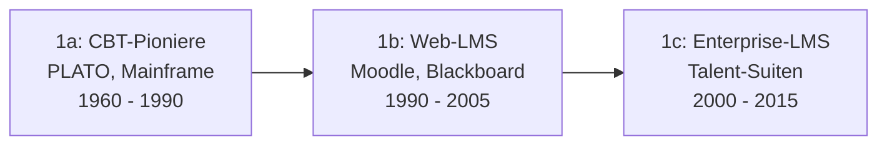

# Evolution und Architekturen digitaler klassischer LMS

Klassische, monolithische LMS bilden Generation 1 der [Evolution digitaler Lernmanagement-Systeme](evolution-digitaler-lms.md). Diese eigenständige Zeitachse zoomt in genau diese Architekturlinie hinein: von Mainframe-CBT-Pionieren über vernetzte Web-LMS in der SCORM-Ära und Enterprise-Talent-Suiten bis zu den bis heute nachwirkenden Standardisierungs- und HR-Integrations-Bausteinen dieser Systeme.

!!! note "Hinweis: Generationen überlappen sich"
    Die Zeiträume sind grobe Orientierung, keine scharfen Grenzen — Moodle (Generation 1b) wird bis heute produktiv weiterentwickelt und deckt über Plugins inzwischen auch spätere Generationen ab. Entscheidend ist die **Architektur** (paketierte Kurse, zentrale Kurs-/Nutzerdatenbank), nicht allein das Erscheinungsjahr.

---

## Generation 1: CBT-Pioniere, Web-LMS & Enterprise-Talent-Suiten, 1960 – 2015

Die Gründergeneration eint drei Prinzipien: eine **zentrale Kurs- und Nutzerdatenbank**, **paketierte Lerninhalte** und **lineares Tracking** des Lernfortschritts. Sie deckt sich mit [Generation 1 der übergeordneten LMS-Zeitachse](evolution-digitaler-lms.md#generation-1-klassische-monolithische-lms-kursverwaltung-scorm-pakete-zentrale-datenbank) und lässt sich in dieselben drei Entwicklungsstufen unterteilen:

### 1a. CBT-Pioniere, 1960 – 1990

- **Vertreter:** **PLATO** (1960, University of Illinois), **TICCIT**.

### 1b. Vernetzte Web-LMS & SCORM-Ära, 1990 – 2005

- **Vertreter:** **Blackboard Learn** (1997), **WebCT** (1996), **Moodle** (2002, eigene Architektur-Zeitachse in [Evolution und Architekturen von Moodle](../dokumentation/moodle/evolution-digitaler-moodle.md)), siehe [Lernmanagement-Systeme in der Werkzeug-Übersicht](index.md#lernmanagement-systeme-lms-plattform-software).

### 1c. Enterprise-LMS & Talent-Suiten, 2000 – 2015

- **Vertreter:** **Cornerstone OnDemand**, **SAP SuccessFactors Learning**, **Saba**.

---

## Generation 2: SCORM-Standardisierung reift, 1999 – 2004

Vor SCORM existierten mehrere konkurrierende, inkompatible Paketformate — diese Generation vereinheitlicht den Content-Austausch zwischen LMS-Anbietern.

| Standard | Jahr | Rolle |
|---|---|---|
| **AICC** | 1988/1993 | Frühester Interoperabilitätsstandard, ursprünglich aus der Luftfahrtindustrie-Schulung. |
| **SCORM 1.2** | 2001 | Erste breit adoptierte Version des Sharable Content Object Reference Model. |
| **SCORM 2004** | 2004 | Erweitert um Sequencing- und Navigationsregeln für komplexere Lernpfade. |

---

## Generation 3: Open-Source-Ökosystem-Reife, 2002 – 2010

Moodle und vergleichbare Open-Source-LMS bauen ein umfangreiches Plugin-Ökosystem auf, das kommerziellen Enterprise-Funktionsumfang ohne Lizenzkosten erreicht.

| System | Prinzip |
|---|---|
| **Moodle-Plugin-Verzeichnis** | Tausende community-gepflegte Erweiterungen für Aktivitätstypen, Integrationen und Reporting. |
| **Sakai** (2004) | Community-getragene Open-Source-Alternative mit Fokus auf Hochschulkonsortien. |

---

## Generation 4: Compliance- & Zertifizierungs-Tiefe, 2005 – 2012

Enterprise-LMS aus Generation 1c vertiefen ihre Integration in Personalprozesse — Schulungsnachweise werden zum auditierbaren Compliance-Baustein statt reiner Lernstandserfassung.

| System | Fokus |
|---|---|
| **Cornerstone OnDemand** | Verzahnung von Lernen mit Zielvereinbarungen und Nachfolgeplanung. |
| **SAP SuccessFactors Learning** | Tiefe HRIS-Integration für regulierte Branchen mit Zertifizierungspflicht. |

---

## Generation 5: Mobile- & Blended-Learning-Erweiterungen, 2010 – 2015

Klassische Web-LMS ergänzen native Mobile-Apps und Präsenz-Trainings-Verwaltung — noch innerhalb der monolithischen Architektur, aber mit wachsender Kanalvielfalt.

| Baustein | Rolle |
|---|---|
| **Mobile-Companion-Apps** | Ergänzen die Web-Oberfläche um Offline-Zugriff auf Kursmaterialien. |
| **Instructor-Led-Training-Verwaltung (ILT)** | Verwaltet Präsenztermine und Raumbuchungen innerhalb desselben LMS wie Online-Kurse. |

---

## Generation 6: Konsolidierung durch Fusionen, 2015 – 2020

Der Enterprise-LMS-Markt konsolidiert sich durch Übernahmen — aus mehreren konkurrierenden Talent-Suiten entstehen wenige, breiter aufgestellte Anbieter.

| Ereignis | Jahr | Bedeutung |
|---|---|---|
| **Cornerstone übernimmt Saba** | 2020 | Zwei der größten Enterprise-Talent-Suiten aus Generation 1c/4 fusionieren zu einem Anbieter. |
| **Blackboard-Konsolidierung** | mehrfach ab 2011 | Blackboard übernimmt mehrere kleinere Wettbewerber, bevor selbst neue Cloud-native Anbieter (Generation 2 der LMS-Zeitachse) Marktanteile gewinnen. |

!!! tip "Übergang zur nächsten Generation"
    Die Marktkonsolidierung dieser Generation fällt zeitlich mit dem Aufstieg [Generation 2 der übergeordneten LMS-Zeitachse](evolution-digitaler-lms.md#generation-2-cloud-native-lms-learning-experience-platforms-lxp-ca-2011-2021) zusammen — Cloud-native Herausforderer wie Canvas LMS gewinnen Marktanteile von den hier konsolidierenden On-Premise-Suiten.

---

## Alternative Sortier- & Klassifikationskriterien für klassische LMS

### 1. Content-Standard

- **Proprietär, vor SCORM** — CBT-Pioniere ohne Austauschformat.
- **AICC** — früher Luftfahrt-Standard.
- **SCORM 1.2/2004** — De-facto-Standard dieser Generation.

### 2. Betriebsmodell

- **On-Premise** — klassisches Enterprise-LMS-Deployment.
- **Self-hosted Open Source** — Moodle, Sakai.

### 3. Primärer Einsatzzweck

- **Hochschule/K-12** — Blackboard, WebCT, Moodle.
- **Corporate/Compliance** — Cornerstone OnDemand, SAP SuccessFactors Learning.

---

## Verwandte Themen

- [Beste klassische LMS 2026 (Top 15)](klassische-lms-2026-topliste.md) — Momentaufnahme 2026, die diese Chronologie in eine gerankte Topliste übersetzt
- [Produktionsreife klassische Open-Source-LMS nach Generation (Top 1)](produktionsreife-klassische-lms-generationen-2026-topliste.md) — dasselbe Modell durch ein konservatives Fünf-Filter-Sieb; die klassische Linie zerfällt in eine proprietäre Enterprise-Hälfte und eine MySQL-gebundene Open-Source-Hälfte, nur Moodle besteht
- [Evolution und Architekturen digitaler Lernmanagement-Systeme](evolution-digitaler-lms.md) — übergeordnetes Generationenmodell, Generation 1 dort entspricht diesem Artikel im Ganzen
- [Evolution und Architekturen digitaler Cloud-LMS & LXP](evolution-digitaler-cloud-lms.md) — nachfolgende Generation
- [E-Learning-Autorentools & Interaktive Lernumgebungen](index.md) — Gesamtübersicht Autorentools, LMS und KI-Agenten im E-Learning
