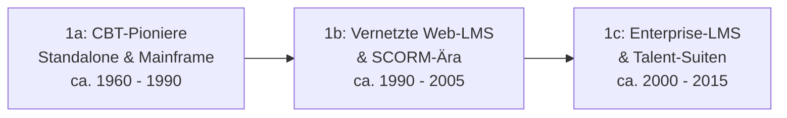

# Evolution und Architekturen digitaler Lernmanagement-Systeme (LMS)

Lernmanagement-Systeme (LMS) lassen sich — analog zu den Generationenmodellen für [Wissenssysteme](../dokumentation/evolution-digitaler-wissenssysteme.md) und [Content-Management-Systeme](../dokumentation/evolution-digitaler-cms.md) — nach **technologischen Generationen** ordnen: von isolierten Computer-Based-Training-Systemen über web-basierte, SCORM-standardisierte LMS und Enterprise-Talent-Suiten bis zu Cloud-nativen Learning Experience Platforms, xAPI-basierter Interoperabilität und schließlich KI- bzw. agentengetriebenen Tutor-Ökosystemen. Die konkreten Werkzeuge und Autorentools dazu behandelt die [Übersicht E-Learning-Autorentools & Interaktive Lernumgebungen](index.md), die KI-Integration in bestehende LMS [KI in Lehre, Weiterbildung und Training](ki-lehre-weiterbildung.md#32-thema-lms-anbindung-lti-standard-apis).

!!! note "Hinweis: Generationen überlappen sich"
    Die Zeiträume sind grobe Orientierung, keine scharfen Grenzen — Moodle (Generation 1b) wird bis heute produktiv weiterentwickelt und deckt über Plugins inzwischen auch xAPI (Generation 3) und KI-Funktionen (Generation 4) ab. Entscheidend ist die **Architektur**, nicht allein das Erscheinungsjahr.

---

## Generation 1: Klassische, monolithische LMS — Kursverwaltung, SCORM-Pakete, zentrale Datenbank

Die erste Generation eint drei Prinzipien: eine **zentrale Kurs- und Nutzerdatenbank**, **paketierte Lerninhalte** (fest geschnürte Kurs-Container statt lose verknüpfter Ressourcen) und **lineares Tracking** des Lernfortschritts. Sie lässt sich in drei technologische Entwicklungsstufen unterteilen — eine tiefergehende Betrachtung dieser Architekturlinie bietet [Evolution und Architekturen digitaler klassischer LMS](evolution-digitaler-klassische-lms.md):

### 1a. CBT-Pioniere (Standalone & Mainframe), ca. 1960 – 1990

- **Architektur:** Mainframe-Terminals bzw. später Standalone-PCs, Inhalte auf Diskette/CD-ROM, kein Netzwerkabgleich zwischen Lernenden.
- **Fokus:** lineares Drill-and-Practice, einfache Verzweigungslogik, keine plattformweite Nutzerverwaltung.
- **Vertreter:** **PLATO** (1960, University of Illinois — gilt mit integrierten Foren und Nachrichten als Vorläufer heutiger LMS-Sozialfunktionen), **TICCIT**.

### 1b. Vernetzte Web-LMS & SCORM-Ära, ca. 1990 – 2005

- **Architektur:** Client-Server, ab Mitte/Ende der 1990er Web-basiert (LAMP/.NET-Stacks), zentrale relationale Datenbank.
- **Fokus:** Kurs- und Nutzerverwaltung, Noten-/Fortschrittstracking, Standardisierung der Content-Pakete zunächst über **AICC**, ab 2001 über **SCORM** (Sharable Content Object Reference Model).

| System | Speicher | Besonderheit |
|---|---|---|
| **Blackboard Learn** (1997) | relationale DB | Früher Marktführer im Hochschulbereich, bis heute in vielen US-Universitäten im Einsatz. |
| **WebCT** (1996) | relationale DB | Einer der ersten browserbasierten Kurs-Server, 2006 von Blackboard übernommen. |
| **Moodle** (2002) | MySQL/PostgreSQL | Quelloffen, extrem modular, weltweit am weitesten verbreitetes LMS, siehe [Lernmanagement-Systeme in der Werkzeug-Übersicht](index.md#lernmanagement-systeme-lms-plattform-software). |

### 1c. Enterprise-LMS & Talent-Suiten, ca. 2000 – 2015

- **Architektur:** Java- oder .NET-Enterprise-Stacks, Integration mit HRIS (Human Resource Information Systems), mehrstufige Freigabe- und Compliance-Workflows.
- **Fokus:** Verzahnung von Lernen mit Talent-Management (Zielvereinbarungen, Nachfolgeplanung), Zertifizierungs- und Compliance-Tracking, umfangreiches Reporting für Personalabteilungen.
- **Vertreter:** **Cornerstone OnDemand**, **SAP SuccessFactors Learning**, **Saba** (später mit Cornerstone fusioniert) — allesamt geprägt von langen Implementierungszyklen und starker HR-Kopplung statt reiner Kursverwaltung.

---

## Generation 2: Cloud-native LMS & Learning Experience Platforms (LXP), ca. 2011 – 2021

Statt starrer Kurskataloge rückt **Content-Kuratierung** in den Vordergrund — LXPs empfehlen Lerninhalte ähnlich einem Streaming-Dienst, ergänzt um Social- und Peer-Learning-Funktionen. Parallel etablieren sich Cloud-native LMS mit modernen REST-APIs und Mobile-first-Oberflächen. Eine eigene, tiefergehende Generationen-Zeitachse speziell für diese Architekturlinie bietet [Evolution und Architekturen digitaler Cloud-LMS & LXP](evolution-digitaler-cloud-lms.md).

**Architektur:** SaaS-Betrieb, REST-APIs, Mobile-first-Frontends, beginnende Microservice-Aufteilung statt eines Monolithen.

| System | Prinzip |
|---|---|
| **Canvas LMS** (2011, Instructure) | Cloud-natives Open-Source-LMS mit offener API und hoher Usability, siehe [Werkzeug-Übersicht](index.md#lernmanagement-systeme-lms-plattform-software). |
| **Docebo** | KI-gestützte Kursempfehlungen und Social-Learning-Feed statt starrem Kurskatalog. |
| **360Learning** | Peer-basiertes „Collaborative Learning" — Mitarbeitende erstellen Kursinhalte selbst. |
| **Degreed, EdCast** | Reine Learning Experience Platforms: aggregieren Inhalte aus vielen Quellen (LMS, YouTube, Artikel) zu einem personalisierten Feed. |
| **LinkedIn Learning** | Konsumenten-orientierte LXP mit Skill-Graph-Anbindung an LinkedIn-Profile. |

### Parallelstrang: Open-Source-LMS & MOOC-Plattformen

Eine dateibasiert-nahe bzw. quelloffene Ausnahme dieser Ära — analog zu Grav/Kirby in der CMS-Generation 2: bewusst selbstgehostet statt SaaS.

| System | Prinzip |
|---|---|
| **Open edX** (2012, Harvard/MIT) | Quelloffene MOOC-Plattform hinter edX.org, konzipiert für Massenkurse mit Zehntausenden Teilnehmenden. |
| **Chamilo, ILIAS** | Schlanke, selbst gehostete Open-Source-LMS mit Fokus auf einfache Kursgestaltung und Hochschulbetrieb, siehe [Chamilo in der Werkzeug-Übersicht](index.md#lernmanagement-systeme-lms-plattform-software). |

---

## Generation 3: Interoperabilität, xAPI & Microlearning-Ökosysteme, ca. 2013 – heute

SCORM-Pakete stoßen an Grenzen, sobald Lernaktivitäten außerhalb des LMS stattfinden (mobile Apps, Simulationen, VR, Präsenztrainings). Die Antwort: ein **Learning Record Store (LRS)** sammelt granulare `Aktor-Verb-Objekt`-Statements über Systemgrenzen hinweg, während **LTI** (Learning Tools Interoperability) externe Tools nahtlos ins LMS einbettet.

**Architektur:** Learning Record Store neben dem LMS, xAPI/cmi5-Statements statt monolithischer SCORM-Pakete, LTI 1.3/LTI Advantage für die Tool-Einbindung. Eine eigene, tiefergehende Generationen-Zeitachse speziell für diese Architekturlinie bietet [Evolution und Architekturen digitaler interoperabler LMS](evolution-digitaler-interoperable-lms.md).

| Baustein | Rolle |
|---|---|
| **xAPI (Experience API / Tin Can)** | Protokolliert Lernaktivitäten als REST-API-Statements, auch außerhalb des LMS. |
| **LTI (Learning Tools Interoperability)** | Bindet externe Werkzeuge (z. B. eine Code-Sandbox) sicher und mit automatischem Notenrückfluss ins LMS ein, siehe [LMS-Anbindung via LTI](ki-lehre-weiterbildung.md#32-thema-lms-anbindung-lti-standard-apis). |
| **Watershed, Learning Locker** | Verbreitete Learning-Record-Store-Implementierungen zur Auswertung von xAPI-Daten. |
| **TalentLMS** und andere Microlearning-fokussierte LMS | Setzen auf kurze, granulare Lerneinheiten statt langer, linearer Kurse. |

---

## Generation 4: KI-gestützte adaptive Lernplattformen, ab ca. 2022

Generative KI wandert direkt in Kurs­erstellung, Bewertung und Lernpfadsteuerung: automatische Kursgenerierung, adaptive Schwierigkeitsanpassung und KI-Tutoren als Kernfunktion statt nachträglichem Plugin. Vertiefend dazu [KI in Lehre, Weiterbildung und Training](ki-lehre-weiterbildung.md) mit konkreten Open-Source- und Cloud-Werkzeugen je Lernphase. Eine eigene, tiefergehende Generationen-Zeitachse speziell für diese Architekturlinie bietet [Evolution und Architekturen digitaler KI-adaptiver Lernplattformen](evolution-digitaler-ki-adaptive-lernplattformen.md).

| System | KI-Funktion |
|---|---|
| **Docebo Shape** | KI-generierte Kursentwürfe aus vorhandenen Dokumenten. |
| **Cornerstone AI** | KI-gestützte Skill-Erkennung und personalisierte Lernpfad-Empfehlungen im Enterprise-Talent-Kontext. |
| **Coursera Coach** | KI-Chatbot als Lernbegleiter innerhalb bestehender MOOC-Kurse. |
| **Khan Academy Khanmigo** | Sokratisch geführter KI-Tutor, der Schülerinnen und Schüler durch Fragen statt Antworten leitet. |
| **Moodle mit KI-Plugins** (z. B. Essay-Evaluator) | Nachrüstung bestehender Open-Source-LMS-Installationen um automatisiertes Feedback, siehe [Automatisches Feedback & Bewertungshilfen](ki-lehre-weiterbildung.md#23-thema-automatisches-feedback-bewertungshilfen). |

---

## Generation 5: Agentische & autonome Tutor-Ökosysteme

Zukunftsorientierte Architekturen, in denen KI-Agenten nicht nur einzelne Aufgaben (Bewertung, Empfehlung) übernehmen, sondern den gesamten Lernprozess orchestrieren: Lernstand erfassen, Aufgaben generieren, Code/Antworten prüfen, didaktisch intervenieren und Kursmaterial selbstständig aktualisieren — mit Langzeitgedächtnis über den individuellen Lernfortschritt hinweg. Eine eigene, tiefergehende Generationen-Zeitachse speziell für diese Architekturlinie bietet [Evolution und Architekturen digitaler Agentischer Tutor-Ökosysteme](evolution-digitaler-agentische-tutor-oekosysteme.md).

- **Multi-Agenten-Tutor-Systeme** (LangGraph, CrewAI, AutoGen): ein „Erklär-Agent" und ein „Prüf-Agent" arbeiten arbeitsteilig zusammen, siehe die [Referenz-Architektur für KI-Agenten im E-Learning](index.md#5-optimales-zusammenspiel-referenz-architektur).
- **Khanmigo & vergleichbare Sokratische Agenten**: verweigern bewusst die direkte Lösung und steuern stattdessen über Leitfragen — ein Steuerungsprinzip, das sich über [Rollen- & Kontext-Prompts](index.md#2-erstellung-steuerung-von-ki-agenten-im-e-learning) deklarativ statt über starren Code definieren lässt.
- **Autonome Content-Pflege-Agenten**: prüfen bestehende Kursmaterialien kontinuierlich auf Aktualität und schlagen Korrekturen vor — konzeptionell deckungsgleich mit dem [LLM-Wiki-Pattern (Karpathy-Muster)](../dokumentation/llm-wiki-pattern-karpathy.md), das dieses Repository selbst für die eigene Doku-Pflege nutzt.

!!! warning "Achtung: Telemetrie- und Datenschutzlücken bleiben"
    Wie in [Was fehlt? Aktuelle Lücken im E-Learning-Ökosystem](index.md#3-was-fehlt-aktuelle-lucken-im-e-learning-okosystem) beschrieben, sind SCORM und selbst xAPI nicht darauf ausgelegt, freie, nicht-deterministische Dialoge zwischen Lernenden und KI-Agenten vollständig zu erfassen — ein offener Punkt auch für Generation-5-Architekturen.

!!! note "Rust als quer liegende Implementierungsachse"
    Quer zu allen fünf Generationen dieser Zeitachse liegt eine eigene Rust-Implementierungsachse — von sicherer Sandbox-Ausführung für Programmier-Übungen über den Kern etablierter Lernwerkzeuge bis zu lokaler KI-Tutor-Inferenz. Details in [Evolution und Architekturen digitaler Rust-LMS](evolution-digitaler-rust-lms.md).

---

## Alternative Sortier- & Klassifikationskriterien für LMS

Neben dem chronologischen/technologischen Generationenmodell lassen sich LMS nach folgenden Dimensionen einordnen:

### 1. Betriebsmodell

- **Self-hosted/On-Premise** — eigene Infrastruktur, volle Datenhoheit, z. B. Moodle, ILIAS, Open edX.
- **SaaS/Cloud** — Anbieter betreibt Backend und Skalierung, z. B. Canvas, Docebo, Cornerstone OnDemand.
- **Hybrid** — On-Premise-Kern mit Cloud-Zusatzdiensten, häufig bei Enterprise-Suiten (z. B. SAP SuccessFactors Learning).

### 2. Content-Standard

- **SCORM 1.2/2004** — paketierte, in sich geschlossene Kursmodule, klassischer Generation-1b/1c-Standard.
- **xAPI/cmi5** — granulare Aktivitäts-Statements über Systemgrenzen hinweg, siehe Generation 3.
- **LTI-basiert** — kein Content-Paket, sondern sichere Live-Einbindung externer Tools mit Notenrückfluss.

### 3. Lernmodell

- **Kurs-zentriert** — feste Kursstruktur mit definiertem Abschluss, klassisches LMS (Moodle, Blackboard).
- **Content-Kuratierung** — algorithmisch empfohlener Feed statt starrem Katalog, Learning Experience Platform (Degreed, EdCast).
- **Skill-Graph-zentriert** — Fortschritt wird über Kompetenzen statt Kursabschlüsse gemessen (LinkedIn Learning, Cornerstone AI).
- **Konversations-/Agenten-zentriert** — der Dialog mit einem KI-Tutor ersetzt die feste Kursnavigation (Khanmigo, Coursera Coach).

### 4. Primäre Zielgruppe

- **K-12/Hochschule** — Moodle, Canvas, Open edX, ILIAS.
- **Corporate/Compliance** — Cornerstone OnDemand, SAP SuccessFactors Learning, Docebo.
- **Consumer/B2C** — LinkedIn Learning, Coursera, Khan Academy.

---

## Verwandte Themen

- [E-Learning-Autorentools & Interaktive Lernumgebungen](index.md) — Gesamtübersicht Autorentools, LMS und KI-Agenten im E-Learning
- [Evolution und Architekturen digitaler Wissenssysteme](../dokumentation/evolution-digitaler-wissenssysteme.md) — analoges Generationenmodell für Wikis & PKM-Systeme
- [Evolution und Architekturen digitaler klassischer LMS](evolution-digitaler-klassische-lms.md) — vertiefendes Generationenmodell speziell für Generation 1 dieses Artikels
- [Evolution und Architekturen digitaler Cloud-LMS & LXP](evolution-digitaler-cloud-lms.md) — vertiefendes Generationenmodell speziell für Generation 2 dieses Artikels
- [Evolution und Architekturen digitaler interoperabler LMS](evolution-digitaler-interoperable-lms.md) — vertiefendes Generationenmodell speziell für Generation 3 dieses Artikels
- [Evolution und Architekturen digitaler KI-adaptiver Lernplattformen](evolution-digitaler-ki-adaptive-lernplattformen.md) — vertiefendes Generationenmodell speziell für Generation 4 dieses Artikels
- [Evolution und Architekturen digitaler Agentischer Tutor-Ökosysteme](evolution-digitaler-agentische-tutor-oekosysteme.md) — vertiefendes Generationenmodell speziell für Generation 5 dieses Artikels
- [Evolution und Architekturen digitaler Rust-LMS](evolution-digitaler-rust-lms.md) — quer zu allen fünf Generationen liegende Implementierungsachse (Rust-Kerne hinter Sandbox-Ausführung, Lernwerkzeugen und KI-Tutor-Inferenz)
- [Evolution und Architekturen digitaler Content-Management-Systeme](../dokumentation/evolution-digitaler-cms.md) — analoges Generationenmodell für CMS
- [Evolution und Architekturen digitaler Notebook-Systeme](../dokumentation/evolution-digitaler-notebook-systeme.md) — analoges Generationenmodell für interaktive Notebook-Systeme
- [Evolution und Architekturen digitaler Web-Frameworks](../../entwicklung/webentwicklung/evolution-digitaler-webframeworks.md) — analoges Generationenmodell für Web-Frameworks
- [Evolution und Architekturen digitaler KI-Anwendungen](../../künstliche-intelligenz/evolution-digitaler-ki-anwendungen.md) — analoges Generationenmodell für KI-Anwendungen
- [KI in Lehre, Weiterbildung und Training](ki-lehre-weiterbildung.md) — praktische KI-Integration je Lernphase (2026)
- [Interaktive Lernplattformen & Kurserstellung](interaktive-lernplattformen-kurserstellung.md) — Plattform-Architektur für Coding-spezifisches Lernen
- [Beste KI-Agenten für Deutsch- und Fremdsprachenlernen (Open Source, Top 20)](sprachlern-ki-agenten-topliste.md) — Vertiefung zu Generation 4/5 im Sprachenlernen
- [LLM-Wiki-Pattern (Karpathy-Muster)](../dokumentation/llm-wiki-pattern-karpathy.md) — agentisches Pflegeprinzip, das dieses Repository selbst nutzt
