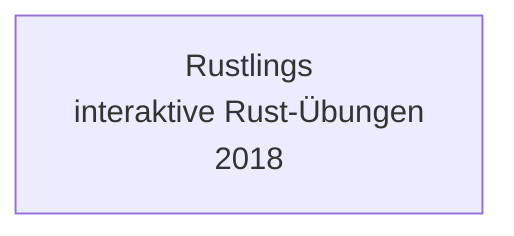

# Evolution und Architekturen digitaler Rust-LMS

Eigenständige Lernmanagement-Systeme entstehen bislang kaum vollständig in Rust — stattdessen etabliert sich Rust seit Ende der 2010er Jahre als **quer zu allen fünf Generationen von [Evolution digitaler LMS](evolution-digitaler-lms.md) liegende Implementierungsachse**: sichere Sandbox-Laufzeiten für automatisch bewertete Programmier-Übungen, der Kern etablierter Lernwerkzeuge und zuletzt lokale KI-Tutor-Inferenz wandern zunehmend auf einen Rust-Kern — meist unsichtbar hinter einer Python-, Web- oder Desktop-Oberfläche. Dieser Artikel ordnet diese Rust-Bausteine chronologisch nach **technologischen Generationen** — die allgemeine Rust-Werkzeuglandschaft jenseits von LMS behandelt [Rust in der Praxis](../../entwicklung/system/rust-praxis.md).

!!! note "Hinweis: Eine Implementierungsachse, keine Konkurrenz-Zeitachse"
    Anders als ein eigenständiges LMS-Produkt entspricht diese Zeitachse keiner einzelnen Generation von [Evolution digitaler LMS](evolution-digitaler-lms.md), sondern schneidet quer durch alle fünf — eine Firecracker-Sandbox aus Generation 2 kann z. B. dieselben Programmier-Übungen ausführen, die eine Cloud-LXP aus [Generation 2 der LMS-Zeitachse](evolution-digitaler-lms.md#generation-2-cloud-native-lms-learning-experience-platforms-lxp-ca-2011-2021) einbettet. Die Zeiträume sind grobe Orientierung, keine scharfen Grenzen.

---

## Generation 1: Rust lernt sich selbst beibringen — erste Lernwerkzeuge aus dem eigenen Ökosystem, 2018

Wie schon bei den Wissenssystemen (vgl. [Generation 1 der Rust-Wissenssysteme-Zeitachse](../dokumentation/evolution-digitaler-rust-wissenssysteme.md#generation-1-rust-erreicht-praxisreife-doku-suchwerkzeuge-aus-dem-eigenen-okosystem-2015-2018)) entsteht das erste Rust-Lernwerkzeug aus Eigenbedarf des jungen Ökosystems: Neue Rust-Entwickler brauchen eine Möglichkeit, die Sprache interaktiv zu üben.

- **Rustlings** (2018) — offizielles Übungsprojekt des Rust-Teams: kleine, absichtlich fehlerhafte Code-Snippets, die der Lernende direkt in der Kommandozeile repariert, mit sofortigem Compiler-Feedback statt browserbasierter Kursoberfläche.

**Bedeutung:** kein LMS im eigentlichen Sinn — kein Kursverwaltungssystem, keine Lernfortschritts-Datenbank —, aber die Blaupause für „direktes, werkzeuggestütztes Feedback statt reiner Videolektion", ein Prinzip, das spätere Generationen in produktionsreife Infrastruktur überführen.

---

## Generation 2: Sichere Sandbox-Ausführung für automatisch bewertete Programmier-Übungen, 2018 – 2022

Programmier-Übungen in modernen LMS/LXP-Kursen (vgl. [Generation 2/3 der LMS-Zeitachse](evolution-digitaler-lms.md#generation-2-cloud-native-lms-learning-experience-platforms-lxp-ca-2011-2021)) müssen fremden, potenziell fehlerhaften oder böswilligen Code isoliert und trotzdem schnell ausführen — eine Anforderung, die klassische Container-Isolation nur unzureichend erfüllt. Rust liefert dafür die Referenz-Infrastruktur.

**Architektur:** MicroVM-Isolation mit Rust-Kern — deutlich geringerer Startzeit- und Speicher-Overhead als vollständige virtuelle Maschinen, gleichzeitig striktere Isolation als klassische Container.

| System | Jahr | Rolle |
|---|---|---|
| **Firecracker** (AWS) | 2018 | Rust-natives MicroVM-Tool, ursprünglich für AWS Lambda entwickelt, ab 2020 von einer wachsenden Zahl an Cloud-Coding-Plattformen als sichere Ausführungsumgebung für Nutzer-Code übernommen. |
| **CodeSandbox-Cloud-Sandboxes** | ab 2022 | Migriert seine cloud-gehosteten Entwicklungsumgebungen auf Firecracker-basierte MicroVMs — direkt relevant für in Kurse eingebettete, interaktive Programmier-Umgebungen statt reiner Video-/Text-Lektionen. |

---

## Generation 3: Rust-Kern-Rewrite eines etablierten Lernwerkzeugs — Anki, 2020 – 2021

Parallel zur Sandbox-Infrastruktur migriert eines der meistgenutzten Spaced-Repetition-Lernwerkzeuge seinen Kern schrittweise nach Rust — ein direktes Vorbild für das später bei Zensical beobachtete Hybrid-Muster (vgl. [Generation 6 der Rust-Wissenssysteme-Zeitachse](../dokumentation/evolution-digitaler-rust-wissenssysteme.md#generation-6-rust-im-kern-ki-nativer-docs-as-code-plattformen-ab-2025)).

**Architektur:** Rust-Bibliothek (`rslib`) übernimmt Scheduler-Algorithmus und Synchronisationslogik, die bestehende Python-/Qt-Oberfläche bleibt unverändert bestehen — Performance- und Robustheitsgewinn ohne Rewrite der gesamten Anwendung.

| System | Jahr | Veränderung |
|---|---|---|
| **Anki** (`rslib`-Migration) | 2020/2021 | Der von Damien Elmes gestartete Rust-Kern übernimmt zunächst die Synchronisation, dann den Karten-Scheduler des populären Spaced-Repetition-Systems — die Python-/Qt-Oberfläche bleibt für Nutzer unverändert sichtbar. |

---

## Generation 4: WASM-Sandboxes für browserbasierte Code-Ausführung ohne Server-Roundtrip, 2022 – 2023

Statt jede Übungsausführung an einen Server zu schicken, führen manche interaktiven Lernplattformen Code direkt im Browser aus — mit derselben Rust-WASM-Runtime-Technologie, die bereits Composable-Commerce-Edge-Laufzeiten antreibt (vgl. [Generation 3 der Rust-CMS-Zeitachse](../dokumentation/evolution-digitaler-rust-cms.md#generation-3-wasm-edge-laufzeiten-fur-composable-mach-commerce-2019-2022)).

**Architektur:** WebAssembly-Runtime im Browser oder am Edge, keine Server-Rundreise pro Codeausführung nötig, dadurch spürbar geringere Latenz für Übungsfeedback in Echtzeit.

| Baustein | Rolle |
|---|---|
| **Wasmtime / Rust-WASM-Toolchain** | Dieselbe Bytecode-Alliance-Runtime, die Shopify Functions und Fastly Compute antreibt, bildet auch für browser- und edge-basierte Coding-Übungen die technische Grundlage. |

---

## Generation 5: Rust-gestützte lokale KI-Tutor-Inferenz, ab 2024

Agentische Tutor-Ökosysteme aus [Generation 5 der LMS-Zeitachse](evolution-digitaler-lms.md#generation-5-agentische-autonome-tutor-okosysteme) benötigen zunehmend schnelle, lokal ausführbare Modell-Inferenz statt ausschließlich externer LLM-APIs — dieselbe Rust-ML-Infrastruktur, die bereits RAG-Pipelines für Wissenssysteme antreibt.

**Architektur:** Rust-native Tensor-/Inferenz-Bibliotheken als leichtgewichtige Alternative zu Python-basierten ML-Stacks, siehe [Generation 5 der Rust-Wissenssysteme-Zeitachse](../dokumentation/evolution-digitaler-rust-wissenssysteme.md#generation-5-rust-gestutzte-ki-rag-inferenz-fur-wissenssysteme-2023-2024) für die identische technische Grundlage.

| Baustein | Rolle |
|---|---|
| **Candle** (Hugging Face) | Ermöglicht lokale Ausführung kleinerer Tutor-/Feedback-Modelle ohne Python-Laufzeit-Overhead, relevant für latenzkritisches Echtzeit-Feedback in adaptiven Lernpfaden. |

---

## Alternative Sortier- & Klassifikationskriterien für Rust-LMS

Neben dem chronologischen Generationenmodell lassen sich diese Rust-Bausteine nach folgenden Dimensionen einordnen:

### 1. Rolle im Gesamtsystem

- **Eigenständiges Übungswerkzeug** — Rustlings (Generation 1).
- **Ausführungs-Sandbox** — Firecracker, WASM-Runtimes (Generation 2, 4).
- **Lernwerkzeug-Kern** — Anki-`rslib` (Generation 3).
- **ML-Laufzeit** — Candle (Generation 5).

### 2. Sichtbarkeit für Lernende

- **Vollständig Rust, sichtbar als Werkzeug** — Rustlings (Nutzer installiert und startet es bewusst).
- **Rust-Kern hinter fremder Oberfläche** — Firecracker hinter CodeSandbox, `rslib` hinter der Anki-Oberfläche, Candle hinter einem Chat-Tutor-Interface — für Lernende unsichtbar.

### 3. Isolationsmodell

- **Kein Isolationsbedarf** — Rustlings läuft lokal auf der Maschine des Lernenden selbst.
- **MicroVM-Isolation** — Firecracker (starke Isolation, geringer Overhead).
- **WASM-Sandbox** — browser-/edge-basierte Ausführung ohne separate VM.

### 4. Migrationsmuster

- **Von Grund auf Rust** — Rustlings, Firecracker.
- **Rust-Rewrite eines bestehenden Kerns** — Anki migriert Scheduler/Sync von Python nach Rust, Oberfläche bleibt unverändert.
- **Geteilte Infrastruktur aus anderer Domäne** — Wasmtime und Candle sind keine LMS-spezifischen Neuentwicklungen, sondern Übernahmen derselben Bausteine, die bereits CMS- und Wissenssystem-Infrastruktur antreiben.

---

## Verwandte Themen

- [Evolution und Architekturen digitaler LMS](evolution-digitaler-lms.md) — übergeordnetes Generationenmodell, das diese Rust-Implementierungsachse quer durchzieht
- [Evolution und Architekturen digitaler Rust-Wissenssysteme](../dokumentation/evolution-digitaler-rust-wissenssysteme.md) — Candle als geteilter Baustein, analoge Rust-Implementierungsachse für Wissenssysteme
- [Evolution und Architekturen digitaler Rust-CMS](../dokumentation/evolution-digitaler-rust-cms.md) — Wasmtime/WASM-Tooling als geteilter Baustein, analoge Rust-Implementierungsachse für CMS
- [Evolution und Architekturen digitaler Rust-Notebooks](../dokumentation/evolution-digitaler-rust-notebooks.md) — Candle als geteilter Baustein, analoge Rust-Implementierungsachse für Notebook-Systeme
- [Evolution und Architekturen digitaler Rust-Webframeworks](../../entwicklung/webentwicklung/evolution-digitaler-rust-webframeworks.md) — Axum/Actix-web als mögliche Backend-Basis für LTI-/LMS-APIs
- [Evolution und Architekturen digitaler Cloud-LMS & LXP](evolution-digitaler-cloud-lms.md) — vertiefendes Generationenmodell, in dem Firecracker-basierte Coding-Sandboxes primär zum Einsatz kommen
- [Evolution und Architekturen digitaler Agentischer Tutor-Ökosysteme](evolution-digitaler-agentische-tutor-oekosysteme.md) — vertiefendes Generationenmodell zu Generation 5, in der Rust-gestützte lokale KI-Inferenz primär zum Einsatz kommt
- [Rust in der Praxis](../../entwicklung/system/rust-praxis.md) — allgemeine Rust-Werkzeuglandschaft jenseits von LMS
