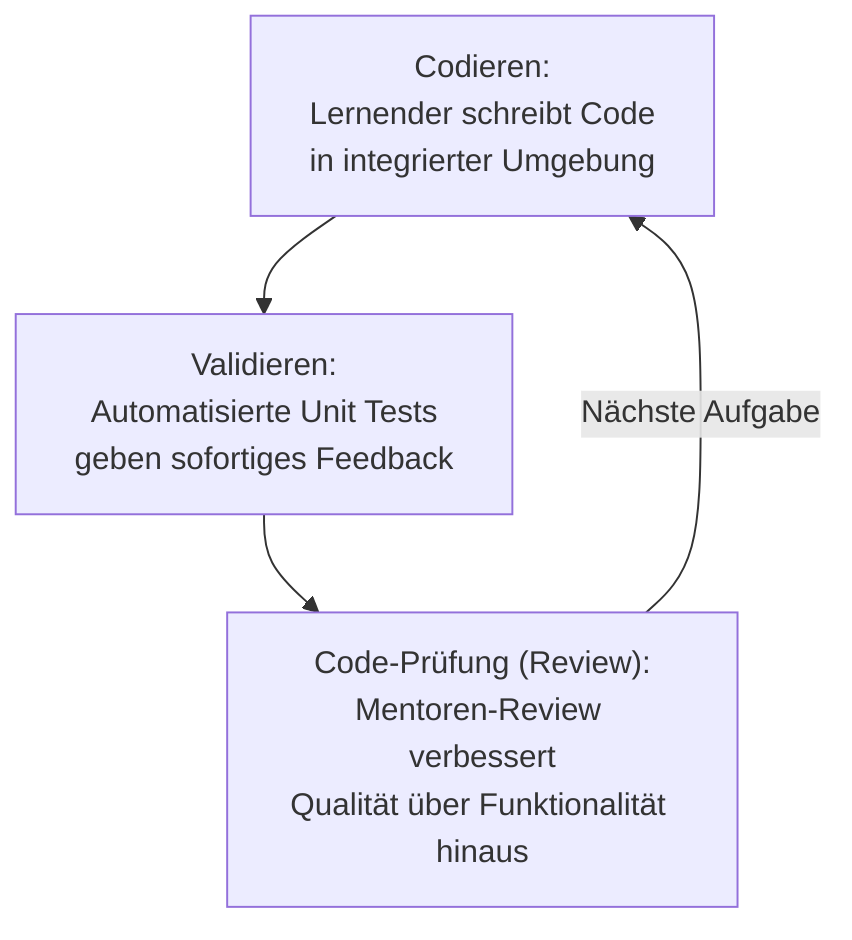

# Interaktive Lernplattformen & Kurserstellung

Neben individuellen Lerntechniken prägt auch die **Plattform-Architektur** den Lernerfolg beim Programmierenlernen: Editor-Integration, automatisierte Validierung und die Möglichkeit, eigene Kurse zu erstellen, entscheiden darüber, wie praxisnah und skalierbar ein Lernangebot ist.

---

## Übersicht

!!! note "Hinweis"
    Dieser Abschnitt ergänzt die [Moderne Lernmethoden für Programmiersprachen](lernmethoden-programmiersprachen.md) um die technische Seite: Wie sehen Plattformen aus, auf denen diese Methoden praktisch umgesetzt werden?

---

## Struktur und Benutzeroberfläche

| Baustein | Beschreibung |
|---|---|
| **VS-Code-Integration** | Moderne Lernplattformen nutzen Editoren, die stark an Visual Studio Code angelehnt sind (z. B. VS Code Server oder Monaco Editor). Das ermöglicht eine konsistente Erfahrung sowohl online im Browser als auch offline in der lokalen Entwicklungsumgebung. |
| **Dashboard & Fortschritt** | Eine `start.md` dient oft als Einstiegspunkt, der Lernziele, Voraussetzungen und den groben Ablauf des Kurses definiert. |

---

## Der Praxiskurs: Codieren, Validieren, Prüfen

Ein effektiver Praxiskurs folgt einem iterativen Prozess:



1. **Codieren:** Der Lernende schreibt Code direkt in der integrierten Umgebung.
2. **Validieren:** Automatisierte Tests (Unit Tests) geben sofortiges Feedback, ob die Aufgabe korrekt gelöst wurde.
3. **Code-Prüfung (Review):** Plattformen wie Exercism integrieren Mentoren-Reviews, um die Code-Qualität über die bloße Funktionalität hinaus zu verbessern.

---

## Eigene Kurse erstellen

Die Erstellung eigener Kurse ist ein zentrales Feature für Skalierbarkeit:

| Baustein | Beschreibung |
|---|---|
| **Markdown-basiert** | Kurse werden oft in Markdown (wie in `start.md`) verfasst, was die Versionskontrolle via Git ermöglicht. |
| **Lab-Konfiguration** | Über Konfigurationsdateien (z. B. YAML) werden die virtuelle Umgebung (Docker), benötigte Tools und die Validierungsschritte definiert. |
| **Anleitung** | Eine genaue Anleitung umfasst das Aufsetzen der Umgebung, das Definieren von Prüfskripten und das Strukturieren der Lernschritte. |

### Beispiel: Lab-Konfiguration

```yaml
# lab-config.yaml
environment:
  image: docker://python:3.12-slim
  tools:
    - pytest
    - ruff
validation:
  steps:
    - run: pytest tests/
    - run: ruff check src/
steps:
  - title: "Schritt 1 – Grundgerüst anlegen"
    file: start.md
  - title: "Schritt 2 – Erste Funktion implementieren"
    file: step-2.md
```

---

## Coding-Challenges und Code-Reviews

| Format | Beschreibung |
|---|---|
| **Challenges (Katas)** | Kurze, fokussierte Aufgaben, um spezifische Fähigkeiten zu trainieren. |
| **Reviews** | Der Austausch in der Community oder durch Experten fördert das Verständnis von Best Practices. |

!!! tip "Tipp"
    Eine gute Lab-Konfiguration trennt strikt zwischen Lerninhalt (Markdown), Laufzeitumgebung (Docker/YAML) und Validierungslogik (Testskripte) — das erleichtert Wartung und Wiederverwendung einzelner Kurs-Bausteine.

---

## Verwandte Themen

- [Moderne Lernmethoden für Programmiersprachen](lernmethoden-programmiersprachen.md)
- [E-Learning-Autorentools & Interaktive Lernumgebungen](index.md)
- [KI in Lehre, Weiterbildung und Training](ki-lehre-weiterbildung.md)
