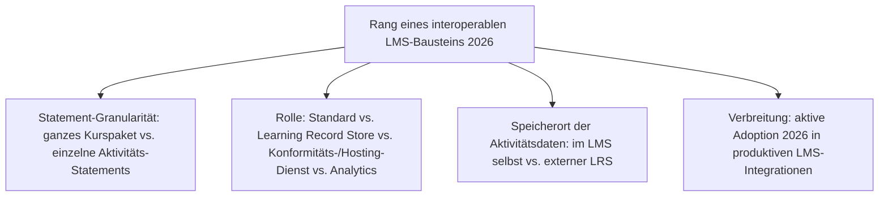
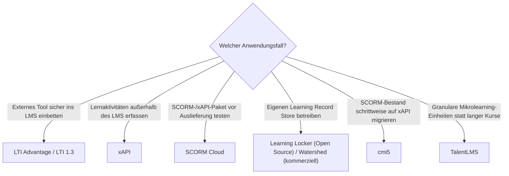

# Beste interoperable LMS-Bausteine 2026 — Top-10-Topliste

Die [Evolution und Architekturen digitaler interoperabler LMS](evolution-digitaler-interoperable-lms.md) ordnet diese Kategorie chronologisch nach Architektur-Generation — von den Grenzen des SCORM-Standards über die Tin-Can-API-Vorstufe, die xAPI-Spezifikation, Learning-Record-Store-Implementierungen und LTI-Tool-Einbindung bis zu Microlearning-Plattformen und xAPI-Analytics. Diese Seite übersetzt die Chronologie in eine **Momentaufnahme 2026**: 10 Standards und Werkzeuge, mit denen granulare Lernaktivitätserfassung über Systemgrenzen hinweg heute tatsächlich umgesetzt wird.

!!! note "Hinweis: Standards und Produkte gemeinsam gerankt"
    Anders als die übrigen LMS-Toplisten dieses Clusters mischt diese Seite bewusst **offene Standards** (xAPI, LTI, cmi5) mit den **Produkten**, die sie implementieren (Watershed, Learning Locker, SCORM Cloud) — beide Ebenen sind für Interoperabilität gleichermaßen entscheidend.

---

## Bewertungskriterien

---

## Top 10 im Überblick

| Rang | Baustein | Generation | Rolle | Besondere Stärke |
|---|---|---|---|---|
| 1 | **LTI Advantage / LTI 1.3** | 3 (LTI standardisiert die Tool-Einbindung) | Standard | Erweiterte Sicherheit (OAuth 2.0/OpenID Connect) und tiefere Integration, heutiger De-facto-Standard für Tool-Einbindung |
| 2 | **xAPI** (Experience API) | 1c (xAPI-Spezifikation wird finalisiert) | Standard | Protokolliert Lernaktivitäten als REST-API-Statements auch außerhalb des Browsers, Fundament aller granularen Interoperabilität |
| 3 | **SCORM Cloud** (Rustici Software) | Ergänzung 2026 | Konformitäts-/Hosting-Dienst | Meistgenutzter gehosteter Test- und Konformitätsdienst für SCORM-, xAPI- und cmi5-Pakete |
| 4 | **Watershed** | 2 (Learning Record Stores etablieren sich) | Learning Record Store | Kommerzieller LRS mit Analyse-Dashboards für xAPI-Statement-Ströme |
| 5 | **cmi5** | 4 (cmi5 vereint SCORM-Kompatibilität mit xAPI) | Standard | Schließt die Lücke zwischen etabliertem SCORM-Ökosystem und der Flexibilität von xAPI |
| 6 | **Learning Locker** | 2 (Learning Record Stores etablieren sich) | Learning Record Store | Meistgenutzte quelloffene, selbst hostbare LRS-Implementierung |
| 7 | **Rustici Engine** | Ergänzung 2026 | Konformitäts-/Integrations-Engine | Eingebettete SCORM-/xAPI-/cmi5-Engine, lizenziert von zahlreichen LMS-Anbietern statt jeweils eigener Implementierung |
| 8 | **TalentLMS** | 5 (Microlearning-fokussierte Plattformen) | Produkt | Setzt kurze, granulare Lerneinheiten als Kernfunktion um, direkte Anwendung der xAPI-Granularität |
| 9 | **LTI 1.0/1.1** | 3 (LTI standardisiert die Tool-Einbindung) | Standard | Grundlegende sichere Tool-Einbettung mit Notenrückfluss, in älteren Integrationen weiterhin verbreitet |
| 10 | **Yet Analytics** | Ergänzung 2026 | Analytics | Spezialisierter Anbieter für SQL-basierte xAPI-Datenanalyse jenseits reiner LRS-Speicherung |

---

## Highlights im Detail

### Rang 1–2, 5, 9: die vier tragenden Standards dieser Kategorie
LTI Advantage/1.3, xAPI, cmi5 und LTI 1.0/1.1 sind keine Produkte, sondern offene Spezifikationen — praktisch jedes moderne LMS implementiert mindestens zwei davon parallel, siehe [Generation 1 und 3 der interoperablen-LMS-Zeitachse](evolution-digitaler-interoperable-lms.md#generation-1-die-grenzen-von-scorm-werden-sichtbar-2010-2013).

### Rang 3, 7: die unsichtbare Konformitäts-Infrastruktur dahinter
SCORM Cloud und Rustici Engine tauchen in der historischen Chronologie nicht namentlich auf, tragen aber einen Großteil der tatsächlichen Standard-Implementierung — viele LMS-Anbieter lizenzieren diese Bausteine, statt SCORM-/xAPI-/cmi5-Konformität selbst zu bauen.

### Rang 4, 6, 10: drei Wege zur Auswertung derselben xAPI-Statements
Watershed, Learning Locker und Yet Analytics zeigen drei unterschiedliche Antworten auf dieselbe Grundfrage — kommerzieller LRS mit Dashboard, quelloffener selbst gehosteter LRS, spezialisierte SQL-Analytics —, siehe [Generation 6](evolution-digitaler-interoperable-lms.md#generation-6-xapi-trifft-analytics-learning-dashboards-ab-2018).

---

## Entscheidungshilfe nach Anwendungsfall

!!! tip "Tipp: Produktebene separat prüfen"
    Diese Liste rankt Standards und Infrastruktur, keine vollständigen LMS-Produkte — siehe [Beste Lernmanagement-Systeme 2026](lms-2026-topliste.md) für die Produktebene, auf der diese Bausteine eingesetzt werden.

---

## 🔗 Verwandte Themen

- [Startseite](../../index.md) — zurück zur Dokumentations-Zentrale
- [Evolution und Architekturen digitaler interoperabler LMS](evolution-digitaler-interoperable-lms.md) — chronologisches Generationenmodell, dessen aktuellen Stand diese Topliste zusammenfasst
- [Produktionsreife interoperable LMS-Bausteine nach Generation (kein Treffer)](produktionsreife-interoperable-lms-generationen-2026-topliste.md) — dieselbe Kategorie durch das konservative Fünf-Filter-Sieb; die Standards sind reif, aber keine betreibbaren Systeme, die reifen Implementierungen proprietär, Learning Locker MongoDB-gebunden
- [Beste Lernmanagement-Systeme 2026 (Top 20)](lms-2026-topliste.md) — Gesamtmarkt-Topliste über alle fünf LMS-Generationen hinweg
- [Beste Cloud-LMS & LXP 2026 (Top 20)](cloud-lms-2026-topliste.md) — vorausgehende Generation
- [Beste KI-adaptive Lernplattformen 2026 (Top 15)](ki-adaptive-lernplattformen-2026-topliste.md) — nachfolgende Generation
- [KI in Lehre, Weiterbildung und Training](ki-lehre-weiterbildung.md) — praktische Nutzung von LTI in der [LMS-Anbindung](ki-lehre-weiterbildung.md#32-thema-lms-anbindung-lti-standard-apis)
