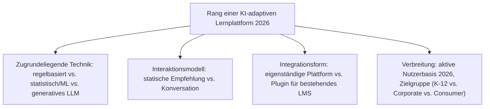
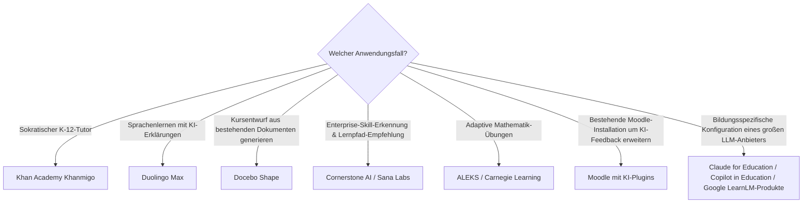

# Beste KI-adaptive Lernplattformen 2026 — Top-15-Topliste

Die [Evolution und Architekturen digitaler KI-adaptiver Lernplattformen](evolution-digitaler-ki-adaptive-lernplattformen.md) ordnet diese Kategorie chronologisch nach Architektur-Generation — von regelbasierten Vorläufern adaptiven Lernens über KI-generierte Kursentwürfe, personalisierte Lernpfad-Empfehlungen, sokratisch geführte KI-Tutoren und automatisiertes Feedback bis zur Nachrüstung bestehender Open-Source-LMS mit KI-Plugins. Diese Seite übersetzt die Chronologie in eine **Momentaufnahme 2026**: 15 Plattformen und Werkzeuge, die generative KI heute tatsächlich in Kurserstellung, Bewertung und Lernpfadsteuerung einsetzen.

!!! note "Hinweis: regelbasiert vs. generativ bleibt die zentrale Trennlinie"
    Rang 11 (Moodle mit KI-Plugins) ist der einzige Eintrag dieser Liste, der eine bestehende [Generation-1-Plattform](../dokumentation/evolution-digitaler-wiki-engines.md) nachrüstet — alle anderen sind von Beginn an KI-nativ konzipiert, siehe [Generation 1 der KI-adaptiven-Lernplattformen-Zeitachse](evolution-digitaler-ki-adaptive-lernplattformen.md#generation-1-regelbasierte-vorlaufer-adaptiven-lernens-1970-2010) zur Abgrenzung von rein regelbasierten Vorläufern.

---

## Bewertungskriterien

---

## Top 15 im Überblick

| Rang | System | Anbieter | Generation | Besondere Stärke |
|---|---|---|---|---|
| 1 | **Khan Academy Khanmigo** | Khan Academy | 4 (Sokratisch geführte KI-Tutoren) | Sokratisch geführter KI-Tutor, führt Schülerinnen und Schüler durch Fragen statt Antworten |
| 2 | **Duolingo Max** | Duolingo | Ergänzung 2026 | GPT-gestützte „Erklär mir meine Antwort"-Funktion, größte Sprachlern-Reichweite dieser Liste |
| 3 | **Coursera Coach** | Coursera | 4 (Sokratisch geführte KI-Tutoren) | KI-Chatbot als Lernbegleiter innerhalb bestehender MOOC-Kurse |
| 4 | **Sana Labs** | Sana | Ergänzung 2026 | Enterprise-adaptive-Learning-KI mit Fokus auf Skill-Gap-Analyse für Unternehmen |
| 5 | **Docebo Shape** | Docebo | 2 (KI-generierte Kursentwürfe) | KI-generierte Kursentwürfe direkt aus vorhandenen Dokumenten |
| 6 | **Cornerstone AI** | Cornerstone OnDemand | 3 (Personalisierte Lernpfad-Empfehlungen im Enterprise-Kontext) | KI-gestützte Skill-Erkennung und personalisierte Lernpfad-Empfehlungen im Enterprise-Talent-Kontext |
| 7 | **ALEKS** (McGraw Hill) | McGraw Hill | Ergänzung 2026 | Etablierte adaptive Mathematik-Plattform mit feingranularer Wissensraum-Modellierung |
| 8 | **Carnegie Learning** | Carnegie Learning | Ergänzung 2026 | KI-gestützter Mathematik-Tutor mit Wurzeln in kognitionswissenschaftlicher Forschung |
| 9 | **Century Tech** | Century Tech | Ergänzung 2026 | Adaptive Lernplattform mit Fokus auf britische K-12-Curricula |
| 10 | **Squirrel AI** | Squirrel AI | Ergänzung 2026 | Großflächig eingesetzte adaptive Lernplattform im chinesischen Bildungsmarkt |
| 11 | **Moodle mit KI-Plugins** (z. B. Essay-Evaluator) | Moodle-Community | 6 (KI-Plugin-Nachrüstung bestehender Open-Source-LMS) | Nachrüstung bestehender Open-Source-LMS-Installationen um automatisiertes Feedback |
| 12 | **Claude for Education** | Anthropic | Ergänzung 2026 | Bildungsspezifische Konfiguration mit Lernmodus statt direkter Lösungsausgabe |
| 13 | **Microsoft Copilot in Education / Reading Coach** | Microsoft | Ergänzung 2026 | Tief in Microsoft-365-Education-Umgebungen integrierte adaptive Lesehilfe |
| 14 | **Google LearnLM-gestützte Produkte** | Google | Ergänzung 2026 | Bildungsspezifisch feinabgestimmtes Sprachmodell als Grundlage mehrerer Google-Lernfunktionen |
| 15 | **Knewton** (Wiley) | Wiley | Ergänzung 2026 | Historisch prägender Pionier adaptiven Lernens, heute Teil des Wiley-Bildungsportfolios |

---

## Highlights im Detail

### Rang 1–3: die sichtbarsten dialogischen KI-Tutoren
Khanmigo, Duolingo Max und Coursera Coach teilen dasselbe didaktische Grundprinzip aus [Generation 4](evolution-digitaler-ki-adaptive-lernplattformen.md#generation-4-sokratisch-gefuhrte-ki-tutoren-ab-2023) — ein dialogfähiges LLM statt statischer Empfehlungslogik —, erreichen aber mit Abstand die größte kombinierte Nutzerzahl dieser gesamten Liste.

### Rang 7–10: der globale adaptive-Learning-Markt jenseits der US-zentrierten Chronologie
ALEKS, Carnegie Learning, Century Tech und Squirrel AI zeigen, dass adaptives Lernen längst kein rein amerikanisches Phänomen ist — vier unterschiedliche Bildungsmärkte (US-Mathematik, UK-K-12, China) setzen eigenständige, teils vor-generative Wurzeln fort, siehe [Generation 1b/1c](evolution-digitaler-ki-adaptive-lernplattformen.md#generation-1-regelbasierte-vorlaufer-adaptiven-lernens-1970-2010).

### Rang 12–14: die großen KI-Anbieter mit eigenen Bildungsangeboten
Claude for Education, Microsoft Copilot in Education und Google LearnLM-gestützte Produkte zeigen, dass sich 2026 alle drei führenden LLM-Anbieter mit eigenständigen, didaktisch angepassten Konfigurationen im E-Learning-Markt positionieren, statt Bildung ausschließlich Drittanbietern zu überlassen.

---

## Entscheidungshilfe nach Anwendungsfall

!!! tip "Tipp: agentische Perspektive separat prüfen"
    Für vollständig orchestrierte, mehrschrittige Tutor-Agenten statt einzelner adaptiver Funktionen siehe [Beste agentische Tutor-Ökosysteme 2026](agentische-tutor-oekosysteme-2026-topliste.md) — die nachfolgende, noch junge Generation dieses Clusters.

---

## 🔗 Verwandte Themen

- [Startseite](../../index.md) — zurück zur Dokumentations-Zentrale
- [Evolution und Architekturen digitaler KI-adaptiver Lernplattformen](evolution-digitaler-ki-adaptive-lernplattformen.md) — chronologisches Generationenmodell, dessen aktuellen Stand diese Topliste zusammenfasst
- [Produktionsreife KI-adaptive Lernplattformen nach Generation (kein Treffer)](produktionsreife-ki-adaptive-lernplattformen-generationen-2026-topliste.md) — dieselbe Kategorie durch das konservative Fünf-Filter-Sieb; keine dieser 15 Plattformen ist selbst betreibbar und fünf Jahre alt
- [Beste Lernmanagement-Systeme 2026 (Top 20)](lms-2026-topliste.md) — Gesamtmarkt-Topliste über alle fünf LMS-Generationen hinweg
- [Beste interoperable LMS-Bausteine 2026 (Top 10)](interoperable-lms-2026-topliste.md) — vorausgehende Generation
- [Beste agentische Tutor-Ökosysteme 2026 (Top 15)](agentische-tutor-oekosysteme-2026-topliste.md) — nachfolgende Generation
- [KI in Lehre, Weiterbildung und Training](ki-lehre-weiterbildung.md) — praktische KI-Integration je Lernphase (2026)
- [Beste KI-Agenten für Deutsch- und Fremdsprachenlernen (Open Source, Top 20)](sprachlern-ki-agenten-topliste.md) — Vertiefung zum Sprachenlernen-Teilbereich
