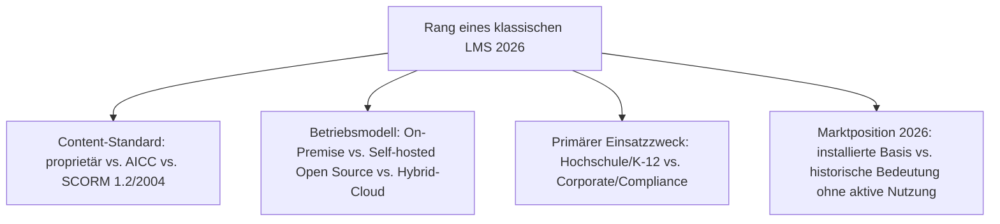
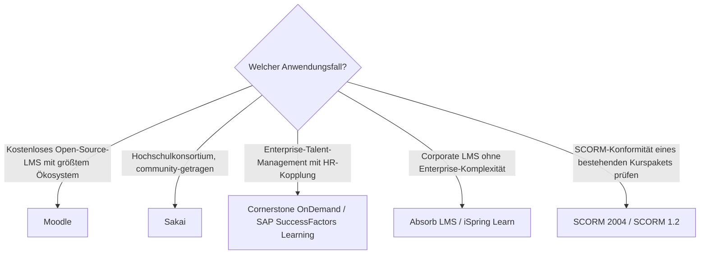

# Beste klassische LMS 2026 — Top-15-Topliste

Die [Evolution und Architekturen digitaler klassischer LMS](evolution-digitaler-klassische-lms.md) ordnet diese Kategorie chronologisch nach Architektur-Generation — von Mainframe-CBT-Pionieren über vernetzte Web-LMS in der SCORM-Ära und Enterprise-Talent-Suiten bis zu den bis heute nachwirkenden Standardisierungs- und HR-Integrations-Bausteinen. Diese Seite übersetzt die Chronologie in eine **Momentaufnahme 2026**: 15 Systeme und Standards, die 2026 tatsächlich prägend sind — anders als bei [Einflussreichste Literate-Programming-Vorläufer](../dokumentation/literate-programming-vorlaeufer-topliste.md) bleiben die meisten Generation-1-LMS bis heute aktiv im Markt, nicht bloß historisch bedeutsam.

!!! note "Hinweis: Generation 1 ist die einzige LMS-Generation ohne echten Nachfolgerbruch"
    Anders als bei CMS oder Notebooks wurden klassische, monolithische LMS nie vollständig von Cloud-nativen Systemen verdrängt — Moodle, Blackboard, Cornerstone OnDemand und SAP SuccessFactors Learning zählen 2026 weiterhin zu den meistgenutzten Plattformen überhaupt, siehe [Beste Lernmanagement-Systeme 2026](lms-2026-topliste.md).

---

## Bewertungskriterien

---

## Top 15 im Überblick

| Rang | System/Standard | Generation | Status 2026 | Besondere Stärke |
|---|---|---|---|---|
| 1 | **Moodle** | 1b (Vernetzte Web-LMS & SCORM-Ära) | Aktiv | Weltweit am weitesten verbreitetes LMS, riesiges Plugin-Ökosystem seit [Generation 3](evolution-digitaler-klassische-lms.md#generation-3-open-source-okosystem-reife-2002-2010) |
| 2 | **Blackboard Learn** | 1b (Vernetzte Web-LMS & SCORM-Ära) | Aktiv | Früher Marktführer im Hochschulbereich, bis heute in vielen US-Universitäten im Einsatz |
| 3 | **Cornerstone OnDemand** | 1c (Enterprise-LMS & Talent-Suiten) | Aktiv | Führende Enterprise-Talent-Suite, seit [Generation 6](evolution-digitaler-klassische-lms.md#generation-6-konsolidierung-durch-fusionen-2015-2020) mit Saba fusioniert |
| 4 | **SAP SuccessFactors Learning** | 1c (Enterprise-LMS & Talent-Suiten) | Aktiv | Tiefste HRIS-Integration für regulierte, compliance-pflichtige Branchen |
| 5 | **D2L Brightspace** | Ergänzung 2026 | Aktiv | Führender Cloud-Konkurrent zu Canvas im nordamerikanischen Hochschulmarkt, wurzelt architektonisch in dieser Generation |
| 6 | **Sakai** | 3 (Open-Source-Ökosystem-Reife) | Aktiv | Community-getragene Open-Source-Alternative mit Fokus auf Hochschulkonsortien |
| 7 | **SCORM 2004** | 2 (SCORM-Standardisierung reift) | Aktiv | Erweitert um Sequencing-/Navigationsregeln, bis heute von praktisch jedem LMS unterstützt |
| 8 | **SCORM 1.2** | 2 (SCORM-Standardisierung reift) | Aktiv | Trotz SCORM 2004 weiterhin die am breitesten kompatible Version im Praxiseinsatz |
| 9 | **Absorb LMS** | Ergänzung 2026 | Aktiv | Etablierter Corporate-LMS-Anbieter jenseits der Talent-Suite-Schwergewichte |
| 10 | **iSpring Learn** | Ergänzung 2026 | Aktiv | Corporate LMS mit besonders enger Anbindung an das iSpring-Autorentool-Ökosystem |
| 11 | **Moodle-Plugin-Verzeichnis** | 3 (Open-Source-Ökosystem-Reife) | Aktiv | Tausende community-gepflegte Erweiterungen, erreicht kommerziellen Enterprise-Funktionsumfang ohne Lizenzkosten |
| 12 | **AICC** | Vorläufer (vor Generation 2) | Historisch | Frühester Interoperabilitätsstandard, ursprünglich aus der Luftfahrtindustrie-Schulung |
| 13 | **WebCT** | 1b (Vernetzte Web-LMS & SCORM-Ära) | Historisch | Einer der ersten browserbasierten Kurs-Server, 2006 von Blackboard übernommen |
| 14 | **Saba** | 1c (Enterprise-LMS & Talent-Suiten) | Historisch | Ehemals eigenständige Enterprise-Talent-Suite, 2020 mit Cornerstone fusioniert |
| 15 | **PLATO** | 1a (CBT-Pioniere) | Historisch | Erstes System mit integrierten Foren und Nachrichten, gilt als Vorläufer heutiger LMS-Sozialfunktionen |

---

## Highlights im Detail

### Rang 1–4: die vier bis heute marktführenden Generation-1-Systeme
Moodle, Blackboard Learn, Cornerstone OnDemand und SAP SuccessFactors Learning belegen zusammen, dass klassische, monolithische LMS-Architektur 2026 keineswegs veraltet ist — anders als bei vergleichbaren CMS- oder Notebook-Chronologien blieb diese Generation strukturell konkurrenzfähig, siehe [Generation 1 der klassischen-LMS-Zeitachse](evolution-digitaler-klassische-lms.md#generation-1-cbt-pioniere-web-lms-enterprise-talent-suiten-1960-2015).

### Rang 7–8, 12: die Standardisierungs-Bausteine überleben ihre Produkt-Ära
SCORM 2004, SCORM 1.2 und AICC sind keine Produkte, sondern Content-Standards — SCORM bleibt 2026 der De-facto-Interoperabilitäts-Baustein praktisch jedes klassischen LMS, auch wenn [Generation 3 der übergeordneten LMS-Zeitachse](evolution-digitaler-lms.md#generation-3-interoperabilitat-xapi-microlearning-okosysteme-ca-2013-heute) mit xAPI längst eine granularere Alternative bietet.

### Rang 13–15: drei historische Wegbereiter ohne eigenständige 2026-Aktivität
WebCT, Saba und PLATO wurden vollständig in Nachfolgesysteme integriert oder eingestellt — sie erscheinen hier wegen ihrer architektonischen Bedeutung, nicht wegen aktiver Nutzung, siehe [Generation 6](evolution-digitaler-klassische-lms.md#generation-6-konsolidierung-durch-fusionen-2015-2020).

---

## Entscheidungshilfe nach Anwendungsfall

!!! tip "Tipp: Cloud-native und interoperable Perspektive separat prüfen"
    Wer primär SaaS statt Self-hosting sucht, findet die passenderen Kandidaten in [Beste Cloud-LMS & LXP 2026](cloud-lms-2026-topliste.md); für granulare Aktivitätserfassung jenseits von SCORM siehe [Beste interoperable LMS-Bausteine 2026](interoperable-lms-2026-topliste.md).

---

## 🔗 Verwandte Themen

- [Startseite](../../index.md) — zurück zur Dokumentations-Zentrale
- [Evolution und Architekturen digitaler klassischer LMS](evolution-digitaler-klassische-lms.md) — chronologisches Generationenmodell, dessen aktuellen Stand diese Topliste zusammenfasst
- [Produktionsreife klassische Open-Source-LMS nach Generation (Top 1)](produktionsreife-klassische-lms-generationen-2026-topliste.md) — dasselbe feinere Generationenmodell durch das konservative Fünf-Filter-Sieb; nur Moodle besteht, die übrigen Open-Source-Klassiker (Sakai, ILIAS, Chamilo) fallen am PostgreSQL-Speicherfilter
- [Beste Lernmanagement-Systeme 2026 (Top 20)](lms-2026-topliste.md) — Gesamtmarkt-Topliste über alle fünf LMS-Generationen hinweg
- [Beste Cloud-LMS & LXP 2026 (Top 20)](cloud-lms-2026-topliste.md) — nachfolgende Generation
- [Beste klassische CMS 2026 (Top 20)](../dokumentation/klassische-cms-2026-topliste.md) — analoge Topliste für CMS statt LMS
