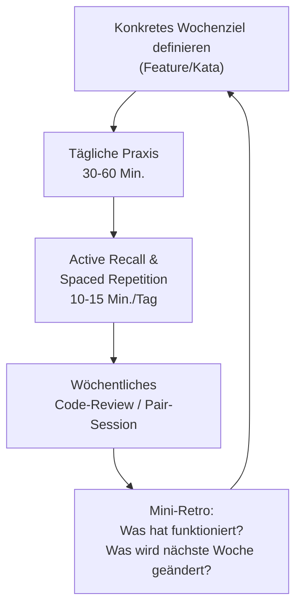

# Moderne Lernmethoden für Programmiersprachen

Effektives Programmierenlernen kombiniert praktische Übung, kognitive Strategien und soziale Formate. Die folgenden Ansätze lassen sich flexibel mischen und iterativ anwenden.

---

## Übersicht

!!! note "Hinweis"
    Keine einzelne Methode reicht für sich allein aus. Der größte Lernfortschritt entsteht, wenn praktische Übung (Projekte, Katas), kognitive Techniken (Active Recall, Spaced Repetition) und soziales Feedback (Pair Programming, Code-Reviews) kombiniert werden.

!!! tip "Tipp"
    Klein anfangen: Ein einziges Wochenziel plus tägliche 30–60 Minuten Praxis wirkt nachhaltiger als sporadische Marathon-Sessions.

---

## Praktische Ansätze

| Methode | Beschreibung |
|---|---|
| **Projektbasiertes Lernen** | Eigene Mini-Projekte (z. B. To-Do-App, CLI-Tool, kleines Spiel) liefern schnellen Praxisbezug und fördern Transfer. |
| **Coding-Challenges & Plattformen** | Regelmäßiges Lösen von Aufgaben auf LeetCode, HackerRank oder Codewars festigt Syntax und Problemlösungsfähigkeiten. |
| **Pair Programming** | Abwechselndes „Driver/Navigator"-Arbeiten erhöht Code-Qualität und Wissenstransfer. |
| **Katas & Refactoring** | Wiederholtes Lösen kleiner Aufgaben schärft Automatisierung und sauberes Design. |
| **Open-Source-Beiträge** | Kleine PRs an einsteigerfreundlichen Repos zeigen reale Standards und Workflows. |

---

## Kognitive Methoden

| Methode | Beschreibung |
|---|---|
| **Active Recall** | Wissen aktiv abrufen (Kurztests, Karteikarten) statt nur erneut lesen. |
| **Spaced Repetition** | Inhalte in wachsenden Intervallen wiederholen (z. B. mit Anki). |
| **Interleaving** | Themen und Aufgabentypen mischen, um flexible Kompetenz aufzubauen. |
| **Feynman-Technik** | Konzepte einfach erklären und Lücken gezielt schließen. |
| **Deliberate Practice** | Eng umrissene Schwächen (z. B. Rekursion, Tests) mit Feedback trainieren. |
| **Testing-Effekt** | Häufige Selbsttests statt passiver Wiederholung erhöhen die Behaltensleistung. |

---

## Soziale und strukturierte Ansätze

| Methode | Beschreibung |
|---|---|
| **Peer Learning** | Lernen in Tandems/Gruppen; gegenseitige Reviews, gemeinsame Retrospektiven. |
| **Micro-Learning** | Kurze, fokussierte Einheiten (15–30 Min.) mit klarem Ziel. |
| **Gamification** | Badges, Levels, Streaks zur Motivationsstütze. |
| **Mentoring/Code-Reviews** | Gezieltes Feedback beschleunigt Lernkurven und Qualitätsverständnis. |

---

## Alternative Lernstrategien

- **Bottom-Up-Lernen:** Von Grundlagen (Syntax, Datentypen) schrittweise zu komplexeren Konzepten aufbauen.
- **Top-Down-Lernen:** Vom Ziel/Prototyp ausgehend nur die nötigen Details vertiefen.
- **REPL-basiertes Lernen:** Sofortiges Feedback durch REPL/Notebooks (z. B. Python, Node.js, Clojure).
- **Learning in Public:** Notizen/Projekte öffentlich dokumentieren (Blog, GitHub), um Feedback zu erhalten.

---

## Praktischer Wochenzyklus

---

## Praktische Umsetzung (Kurzleitfaden)

1. Konkretes Wochenziel definieren (Feature/Kata).
2. Täglich 30–60 Min. Praxis + 10–15 Min. Active Recall/Spaced Repetition.
3. Wöchentlich 1 Code-Review/Pair-Session einplanen.
4. Mini-Retro durchführen: Was hat funktioniert? Was nächste Woche ändern?

!!! warning "Achtung"
    Reines passives Lesen von Tutorials oder Dokumentation ("Tutorial Hell") erzeugt kaum nachhaltiges Wissen — ohne aktive Anwendung (Projekte, Katas, Selbsttests) bleibt der Praxistransfer aus.

---

## Verwandte Themen

- [KI in Lehre, Weiterbildung und Training](ki-lehre-weiterbildung.md)
- [Programmieren lernen mit KI](../../künstliche-intelligenz/coding/programmieren-lernen-ki.md)
- [Zurück zur Übersicht](index.md)
