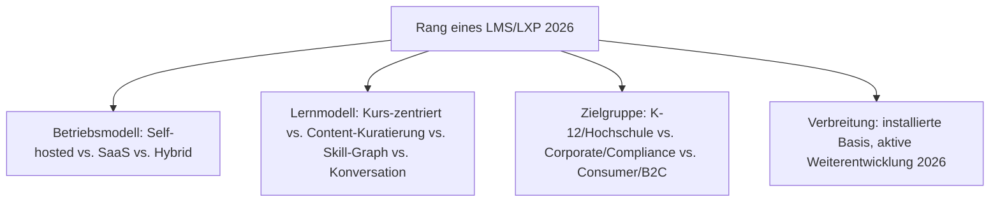
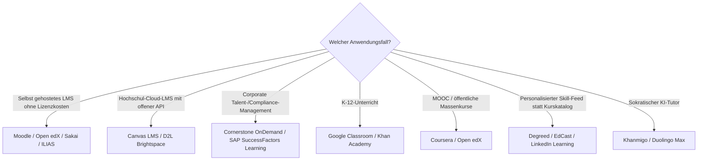

# Beste Lernmanagement-Systeme 2026 — Top-20-Topliste

Die [Evolution und Architekturen digitaler Lernmanagement-Systeme (LMS)](evolution-digitaler-lms.md) bündelt fünf eigenständige Zeitachsen — klassische LMS, Cloud-LMS & LXP, interoperable LMS, KI-adaptive Lernplattformen und agentische Tutor-Ökosysteme — zu einem gemeinsamen Generationenmodell. Diese Seite übersetzt den gesamten Cluster in eine **Momentaufnahme 2026**: 20 LMS-/LXP-Plattformen, die 2026 tatsächlich produktiv im Einsatz sind, quer über alle fünf Generationen hinweg.

!!! note "Hinweis: fünf Generationen, ein gemeinsames Ranking"
    Anders als bei den fünf vertiefenden Sub-Toplisten dieses Clusters mischt diese Seite bewusst alle Generationen gleichberechtigt — Moodle (Generation 1) konkurriert hier direkt mit Khanmigo (Generation 4), obwohl beide völlig unterschiedliche Architekturprinzipien verfolgen. Für die Tiefenperspektive je Generation siehe die verlinkten Sub-Toplisten unter „Verwandte Themen".

---

## Bewertungskriterien

!!! warning "Achtung: Momentaufnahme, Stand August 2026"
    Die KI-Tutor-Ebene (Rang 6–8) verändert sich am schnellsten — vor einer Langzeitentscheidung aktuelle Roadmap und Datenschutzlage des jeweiligen Anbieters prüfen, siehe [Was fehlt? Aktuelle Lücken im E-Learning-Ökosystem](index.md#3-was-fehlt-aktuelle-lucken-im-e-learning-okosystem).

---

## Top 20 im Überblick

| Rang | System | Generation | Betriebsmodell | Besondere Stärke |
|---|---|---|---|---|
| 1 | **[Moodle](evolution-digitaler-klassische-lms.md#1b-vernetzte-web-lms-scorm-ara-1990-2005)** | 1 (Klassische LMS) | Self-hosted, Open Source | Weltweit am weitesten verbreitetes LMS, riesiges Plugin-Ökosystem |
| 2 | **Canvas LMS** (Instructure) | 2 (Cloud-LMS & LXP) | SaaS, Open Source | API-first von Grund auf konzipiert, hohe Usability im Hochschulbereich |
| 3 | **D2L Brightspace** | 2 (Ergänzung 2026) | SaaS | Führender Cloud-Konkurrent zu Canvas im nordamerikanischen Hochschulmarkt |
| 4 | **Blackboard Learn** | 1 (Klassische LMS) | Self-hosted/SaaS | Früher Marktführer, bis heute in vielen US-Universitäten im Einsatz |
| 5 | **Cornerstone OnDemand** | 1 (Klassische LMS) | SaaS/Hybrid | Führende Enterprise-Talent-Suite, seit 2020 mit Saba fusioniert |
| 6 | **Khan Academy Khanmigo** | 4 (KI-adaptive Lernplattformen) | SaaS/Consumer | Sokratisch geführter KI-Tutor, führendes K-12-Referenzsystem für Generation-4-Prinzipien |
| 7 | **Coursera** (Plattform + Coach) | 2 (Cloud-LMS & LXP) | SaaS/Consumer | Größte kommerzielle MOOC-Plattform mit KI-Lernbegleiter |
| 8 | **SAP SuccessFactors Learning** | 1 (Klassische LMS) | SaaS/Hybrid | Tiefste HRIS-Integration für regulierte, compliance-pflichtige Branchen |
| 9 | **LinkedIn Learning** | 2 (Cloud-LMS & LXP) | SaaS/Consumer | Skill-Graph-Anbindung an LinkedIn-Profile, größte Consumer-Reichweite |
| 10 | **Open edX** | 2 (Cloud-LMS & LXP) | Self-hosted, Open Source | Quelloffene MOOC-Plattform hinter edX.org, für Massenkurse konzipiert |
| 11 | **Docebo** | 2 (Cloud-LMS & LXP) | SaaS | KI-gestützte Kursempfehlungen und Social-Learning-Feed statt starrem Katalog |
| 12 | **360Learning** | 2 (Cloud-LMS & LXP) | SaaS | Peer-basiertes „Collaborative Learning" — Mitarbeitende erstellen Kursinhalte selbst |
| 13 | **Google Classroom** | 2 (Ergänzung 2026) | SaaS | Größte K-12-Reichweite weltweit über die Google-Workspace-Integration |
| 14 | **TalentLMS** | 3 (Interoperable LMS) | SaaS | Mikrolearning-fokussiert, granulare Lerneinheiten statt langer Kurse |
| 15 | **Degreed** | 2 (Cloud-LMS & LXP) | SaaS | Aggregiert Inhalte aus vielen Quellen zu einem personalisierten Skill-Feed |
| 16 | **ILIAS** | 2 (Cloud-LMS & LXP) | Self-hosted, Open Source | Schlanke, selbst gehostete Alternative mit Fokus auf Hochschulbetrieb |
| 17 | **Sakai** | 1 (Klassische LMS) | Self-hosted, Open Source | Community-getragene Hochschulkonsortium-Alternative zu Moodle |
| 18 | **Duolingo Max** | 4 (Ergänzung 2026) | SaaS/Consumer | GPT-gestützte „Erklär mir meine Antwort"-Funktion, größte Sprachlern-Reichweite |
| 19 | **Absorb LMS** | 2 (Ergänzung 2026) | SaaS | Etablierter Corporate-LMS-Anbieter jenseits der Talent-Suite-Schwergewichte |
| 20 | **EdCast** | 2 (Cloud-LMS & LXP) | SaaS | Kuratierungsprinzip mit Fokus auf Unternehmens-Wissensmanagement |

---

## Highlights im Detail

### Rang 1, 4–5, 8, 17: Generation 1 bleibt trotz Alters marktprägend
Moodle, Blackboard Learn, Cornerstone OnDemand, SAP SuccessFactors Learning und Sakai sind allesamt Generation-1-Systeme mit teils über zwei Jahrzehnten Marktpräsenz — anders als in vergleichbaren CMS-/Notebook-Chronologien wurde die klassische, monolithische Architektur hier nie vollständig von Cloud-nativen Nachfolgern verdrängt, siehe [Beste klassische LMS 2026](klassische-lms-2026-topliste.md).

### Rang 2–3, 7, 9–13, 15–16, 20: Cloud-LMS & LXP als größte Einzelgruppe
Zehn der zwanzig Plätze entfallen auf Generation 2 — das breiteste Spektrum von Betriebsmodellen (Hochschul-Open-Source über LXP-Kuratierung bis K-12-SaaS) dieser gesamten Liste, siehe [Beste Cloud-LMS & LXP 2026](cloud-lms-2026-topliste.md).

### Rang 6, 18: die sichtbarsten KI-nativen Referenzsysteme
Khanmigo und Duolingo Max sind die beiden Systeme dieser Liste mit der größten öffentlichen Sichtbarkeit für generative KI im Lernkontext — beide setzen bewusst auf dialogische statt rein empfehlende KI-Integration, siehe [Beste KI-adaptive Lernplattformen 2026](ki-adaptive-lernplattformen-2026-topliste.md).

---

## Entscheidungshilfe nach Anwendungsfall

!!! tip "Tipp: Vertiefung je Generation"
    Diese Liste rankt generationenübergreifend — für die tieferen Toplisten je Architekturlinie siehe [Beste klassische LMS 2026](klassische-lms-2026-topliste.md), [Beste Cloud-LMS & LXP 2026](cloud-lms-2026-topliste.md), [Beste interoperable LMS-Bausteine 2026](interoperable-lms-2026-topliste.md), [Beste KI-adaptive Lernplattformen 2026](ki-adaptive-lernplattformen-2026-topliste.md) und [Beste agentische Tutor-Ökosysteme 2026](agentische-tutor-oekosysteme-2026-topliste.md).

---

## 🔗 Verwandte Themen

- [Startseite](../../index.md) — zurück zur Dokumentations-Zentrale
- [Evolution und Architekturen digitaler Lernmanagement-Systeme (LMS)](evolution-digitaler-lms.md) — übergeordnetes Generationenmodell, dessen aktuellen Stand diese Topliste zusammenfasst
- [Beste klassische LMS 2026 (Top 15)](klassische-lms-2026-topliste.md) — vertiefend zu Rang 1, 4–5, 8, 17
- [Beste Cloud-LMS & LXP 2026 (Top 20)](cloud-lms-2026-topliste.md) — vertiefend zu Rang 2–3, 7, 9–13, 15–16, 20
- [Beste interoperable LMS-Bausteine 2026 (Top 10)](interoperable-lms-2026-topliste.md) — vertiefend zu Rang 14
- [Beste KI-adaptive Lernplattformen 2026 (Top 15)](ki-adaptive-lernplattformen-2026-topliste.md) — vertiefend zu Rang 6, 18
- [Beste agentische Tutor-Ökosysteme 2026 (Top 15)](agentische-tutor-oekosysteme-2026-topliste.md) — vertiefend zur Ausblick-Generation
- [Beste Rust-Bausteine für LMS 2026 (Top 8)](rust-lms-2026-topliste.md) — quer zu allen fünf Generationen liegende Implementierungsachse
- [E-Learning-Autorentools & Interaktive Lernumgebungen](index.md) — Gesamtübersicht Autorentools, LMS und KI-Agenten im E-Learning
- [Die führenden Open-Source-Wissenssysteme 2026 (Top 20)](../dokumentation/fuehrende-opensource-wissenssysteme-2026-topliste.md) — analoge Topliste für Wissenssysteme statt Lernplattformen
