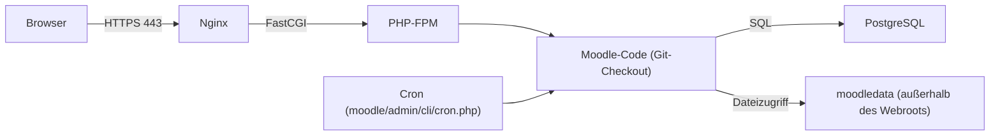

# Moodle auf Ubuntu Server installieren (Git, PostgreSQL, Nginx)

Diese Anleitung installiert **Moodle** auf einem Ubuntu Server direkt aus dem offiziellen **Git-Repository** — statt aus einem ZIP-Archiv. Als Datenbank kommt **PostgreSQL** zum Einsatz, als Webserver **Nginx** mit **PHP-FPM**. Der Git-Ursprung erlaubt spätere Versionswechsel per `git checkout` statt manuellem Datei-Austausch.

!!! note "Hinweis zur Quelle"
    Die Arbeitsschritte orientieren sich an der offiziellen [Moodle-Installationsdokumentation](https://docs.moodle.org/en/Installing_Moodle) und der [Git-für-Administratoren-Anleitung](https://docs.moodle.org/dev/Git_for_administrators). Der Text wurde eigenständig formuliert und um praktische Hinweise ergänzt; er ist keine wörtliche Übersetzung.

---

## Voraussetzungen

- Ubuntu Server (22.04 LTS oder 24.04 LTS) mit `sudo`-Rechten
- mindestens 2 CPU-Kerne, 2 GB RAM (produktiv eher mehr), ausreichend Plattenplatz für `moodledata` (Nutzer-Uploads, Kursdateien, Caches)
- eine eigene Domain oder Subdomain, z. B. `moodle.example.org`
- aktuelle Paketlisten: `sudo apt update`

!!! warning "Achtung: Versionskompatibilität prüfen"
    PHP-, PostgreSQL- und Moodle-Version müssen zueinander passen. Die unterstützte Matrix steht in den offiziellen [Moodle-Systemanforderungen](https://docs.moodle.org/en/Server_requirements) — vor der Installation prüfen, welcher Moodle-Branch (z. B. `MOODLE_405_STABLE`) zur verfügbaren PHP-Version passt.

---

## Architektur



`moodledata` liegt bewusst **außerhalb** des von Nginx ausgelieferten Verzeichnisses, damit Nutzer-Uploads nicht direkt per HTTP abrufbar sind.

---

## 1. Pakete installieren

```bash
sudo apt install -y git nginx postgresql postgresql-contrib \
    php-fpm php-pgsql php-curl php-xml php-mbstring php-zip \
    php-gd php-intl php-soap php-xmlrpc php-cli php-common graphviz aspell
```

Installierte PHP-Version ermitteln (für spätere Pfade wie `/etc/php/8.3/fpm/`):

```bash
php -v
```

---

## 2. PostgreSQL-Datenbank einrichten

```bash
sudo -u postgres psql -c "CREATE ROLE moodle WITH LOGIN PASSWORD 'EIN_LANGES_ZUFAELLIGES_PASSWORT';"
sudo -u postgres psql -c "CREATE DATABASE moodle OWNER moodle ENCODING 'UTF8' TEMPLATE template0;"
```

!!! tip "Tipp"
    Grundlagen zu Rollen, Datenbanken und Zugriffskontrolle: [PostgreSQL: Grundlagen](../../entwicklung/infrastruktur/postgresql.md). Für produktive Setups lohnt zusätzlich ein Blick in [PostgreSQL Backup & Recovery](../../entwicklung/infrastruktur/postgresql-backup-restore.md).

Standardmäßig erlaubt PostgreSQL lokale Verbindungen per `peer`-Authentifizierung nur für den Systembenutzer mit gleichem Namen. Für den Moodle-Zugriff über `localhost` mit Passwort muss in `pg_hba.conf` eine `md5`- bzw. `scram-sha-256`-Zeile für den Benutzer `moodle` vorhanden sein:

```
# /etc/postgresql/<Version>/main/pg_hba.conf
host    moodle    moodle    127.0.0.1/32    scram-sha-256
```

Nach einer Änderung:

```bash
sudo systemctl restart postgresql
```

---

## 3. Moodle-Code per Git beziehen

Moodle wird als Systembenutzer `www-data` unterhalb von `/var/www` abgelegt, damit Nginx/PHP-FPM direkt lesend zugreifen können.

```bash
sudo git clone https://git.moodle.org/moodle.git /var/www/moodle
cd /var/www/moodle
sudo git branch -a | grep MOODLE | tail -5
```

Den gewünschten stabilen Branch auschecken (Version nach Bedarf anpassen, siehe [Moodle-Versionsübersicht](https://moodledev.io/general/releases)):

```bash
sudo git checkout -t origin/MOODLE_405_STABLE
```

`moodledata` liegt außerhalb des Webroots und gehört ebenfalls `www-data`:

```bash
sudo mkdir -p /var/moodledata
sudo chown -R www-data:www-data /var/moodledata /var/www/moodle
sudo chmod -R 0750 /var/moodledata
```

!!! warning "Achtung: Nie `chmod 777`"
    `moodledata` und der Code-Ordner benötigen keine Welt-Schreibrechte. `0750` für `moodledata` (Owner + Gruppe `www-data`) reicht aus und verhindert, dass andere lokale Nutzer auf Kursinhalte zugreifen können.

---

## 4. `config.php` anlegen

```bash
sudo -u www-data cp /var/www/moodle/config-dist.php /var/www/moodle/config.php
sudo nano /var/www/moodle/config.php
```

Relevante Werte für PostgreSQL:

```php
$CFG->dbtype    = 'pgsql';
$CFG->dblibrary = 'native';
$CFG->dbhost    = 'localhost';
$CFG->dbname    = 'moodle';
$CFG->dbuser    = 'moodle';
$CFG->dbpass    = 'EIN_LANGES_ZUFAELLIGES_PASSWORT';
$CFG->prefix    = 'mdl_';
$CFG->dboptions = [
    'dbpersist' => false,
    'dbport'    => '',
    'dbsocket'  => false,
];

$CFG->wwwroot   = 'https://moodle.example.org';
$CFG->dataroot  = '/var/moodledata';
$CFG->directorypermissions = 0750;
$CFG->admin     = 'admin';
```

!!! warning "Achtung: Zugangsdaten schützen"
    `config.php` enthält das Datenbankpasswort im Klartext. Zugriff auf den Webserver-Benutzer beschränken:

    ```bash
    sudo chmod 640 /var/www/moodle/config.php
    sudo chown www-data:www-data /var/www/moodle/config.php
    ```

---

## 5. PHP-FPM konfigurieren

Empfohlene Mindestwerte in der jeweiligen `php.ini` von PHP-FPM (Pfad enthält die installierte PHP-Version, z. B. `/etc/php/8.3/fpm/php.ini`):

```ini
max_input_vars = 5000
memory_limit = 256M
upload_max_filesize = 100M
post_max_size = 100M
max_execution_time = 300
```

Danach PHP-FPM neu starten:

```bash
sudo systemctl restart php8.3-fpm
```

!!! note "Hinweis"
    PHP-Versionsnummer in allen Pfaden und Paketnamen (`php8.3-fpm`, `/etc/php/8.3/...`) an die tatsächlich installierte Version anpassen (`php -v`).

---

## 6. Nginx-Serverblock einrichten

```nginx
# /etc/nginx/sites-available/moodle
server {
    listen 80;
    server_name moodle.example.org;

    root /var/www/moodle;
    index index.php;

    client_max_body_size 100M;

    location / {
        try_files $uri $uri/ /index.php?$query_string;
    }

    location ~ [^/]\.php(/|$) {
        fastcgi_split_path_info ^(.+?\.php)(/.*)$;
        if (!-f $document_root$fastcgi_script_name) {
            return 404;
        }
        fastcgi_pass unix:/run/php/php8.3-fpm.sock;
        fastcgi_index index.php;
        include fastcgi_params;
        fastcgi_param SCRIPT_FILENAME $document_root$fastcgi_script_name;
        fastcgi_param PATH_INFO $fastcgi_path_info;
    }

    # moodledata liegt außerhalb des Webroots und ist damit ohnehin nicht erreichbar.
    # Zusätzlich: .git und interne Konfigurationsdateien sperren.
    location ~ /\.git {
        deny all;
    }
}
```

Aktivieren und testen:

```bash
sudo ln -s /etc/nginx/sites-available/moodle /etc/nginx/sites-enabled/moodle
sudo nginx -t
sudo systemctl reload nginx
```

!!! tip "Tipp"
    Grundlagen zu Serverblöcken: [Nginx: Grundlagen](../../entwicklung/infrastruktur/nginx.md). Für die produktive Auslieferung anschließend [Nginx: SSL & HTTPS](../../entwicklung/infrastruktur/nginx-ssl.md) und [Nginx: Hardening & Sicherheit](../../entwicklung/infrastruktur/nginx-hardening.md) einrichten — Moodle sollte öffentlich ausschließlich über HTTPS erreichbar sein.

    Eine ausführliche Erklärung jeder Direktive dieses Serverblocks (Clean URLs, PATH_INFO, Sperr-Regeln, Caching) steht in [Moodle: Nginx-Konfiguration im Detail](moodle-nginx-configuration.md).

---

## 7. Installation per CLI abschließen

Statt des Web-Installers (der auf einem frisch aufgesetzten Server ohne HTTPS unnötig exponiert wäre) übernimmt das mitgelieferte CLI-Skript die Ersteinrichtung:

```bash
sudo -u www-data php /var/www/moodle/admin/cli/install_database.php \
    --agree-license \
    --fullname="Wissen Ahrensburg Moodle" \
    --shortname="WA-Moodle" \
    --adminuser=admin \
    --adminpass="EIN_WEITERES_LANGES_PASSWORT" \
    --adminemail=admin@example.org
```

Das Skript legt anhand der bereits gesetzten Werte in `config.php` das Datenbankschema an und erstellt den ersten Administrator-Account.

---

## 8. Cron einrichten

Moodle benötigt einen regelmäßig laufenden Cron-Job für geplante Aufgaben (Benachrichtigungen, Backups, Aufräumarbeiten). Als `www-data`-Crontab, minütlich:

```bash
sudo crontab -u www-data -e
```

```cron
* * * * * /usr/bin/php /var/www/moodle/admin/cli/cron.php >/dev/null 2>&1
```

!!! warning "Achtung"
    Ohne laufenden Cron-Job funktionieren zentrale Moodle-Funktionen (E-Mail-Versand, geplante Backups, Kurs-Synchronisation) nicht oder nur verzögert. Nach der Einrichtung prüfen: `sudo -u www-data php /var/www/moodle/admin/cli/cron.php` sollte fehlerfrei durchlaufen.

---

## 9. Firewall

Nur HTTP/HTTPS für Nginx freigeben, alle internen Ports (PostgreSQL 5432, PHP-FPM-Socket) bleiben unerreichbar von außen:

```bash
sudo ufw allow "Nginx Full"
sudo ufw status verbose
```

Details zur Firewall-Konfiguration: [UFW-Firewall installieren und steuern](../../entwicklung/infrastruktur/ufw-firewall.md).

---

## 10. Updates über Git

Der Vorteil der Git-Installation zeigt sich beim Versionswechsel: Statt Dateien manuell zu ersetzen, wird der Ziel-Branch ausgecheckt und Moodles Web- oder CLI-Upgrade übernimmt das Datenbank-Update.

```bash
cd /var/www/moodle
sudo -u www-data git fetch
sudo -u www-data git checkout MOODLE_405_STABLE
sudo -u www-data php admin/cli/upgrade.php
```

!!! tip "Tipp"
    Vor jedem Upgrade ein Datenbank-Backup ziehen — siehe [PostgreSQL Backup & Recovery](../../entwicklung/infrastruktur/postgresql-backup-restore.md) — und den Server vorübergehend in den Wartungsmodus schalten: `sudo -u www-data php admin/cli/maintenance.php --enable`.

---

## Kurzprüfung

```bash
sudo systemctl is-active nginx
sudo systemctl is-active php8.3-fpm
sudo systemctl is-active postgresql
sudo -u www-data php /var/www/moodle/admin/cli/cron.php
curl -I http://127.0.0.1
```

Wenn alle drei Dienste aktiv sind, der Cron-Lauf fehlerfrei durchläuft und der HTTP-Aufruf eine Antwort liefert, ist die Installation funktionsfähig. Danach folgen HTTPS, ein regelmäßiger Backup-Plan für `moodledata` und die Datenbank sowie ein Update-Rhythmus über `git fetch` / `git checkout`.

---

## Quellen und weiterführende Informationen

- [Moodle: Installing Moodle](https://docs.moodle.org/en/Installing_Moodle) – technische Ausgangsbasis dieser eigenständig formulierten Anleitung
- [Moodle: Server requirements](https://docs.moodle.org/en/Server_requirements)
- [Moodle: Git for administrators](https://docs.moodle.org/dev/Git_for_administrators)
- [Moodle Releases](https://moodledev.io/general/releases)
- [Moodle: Nginx-Konfiguration im Detail](moodle-nginx-configuration.md) – vertiefende Erklärung des Serverblocks aus Schritt 6
- [PostgreSQL: Grundlagen](../../entwicklung/infrastruktur/postgresql.md)
- [Nginx: Grundlagen](../../entwicklung/infrastruktur/nginx.md)
- [Nginx: SSL & HTTPS](../../entwicklung/infrastruktur/nginx-ssl.md)
- [UFW-Firewall installieren und steuern](../../entwicklung/infrastruktur/ufw-firewall.md)
- [E-Learning-Übersicht](index.md)
