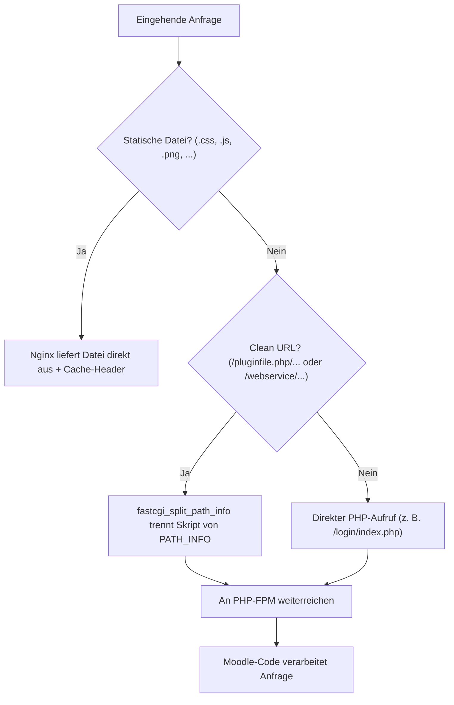

# Moodle: Nginx-Konfiguration im Detail

Dieses Kapitel erklärt den Nginx-Serverblock aus [Moodle auf Ubuntu Server installieren](moodle-installation.md) Zeile für Zeile: warum jede Direktive nötig ist, welche Angriffsfläche sie schließt und wie die Konfiguration für „Clean URLs“, effiziente Datei-Auslieferung und HTTPS erweitert wird.

!!! note "Hinweis zur Quelle"
    Die Konfiguration orientiert sich an der offiziellen [Moodle-Nginx-Dokumentation](https://docs.moodle.org/en/Nginx) sowie den [Server-Requirements](https://docs.moodle.org/en/Server_requirements). Der Text wurde eigenständig formuliert und um praktische Erklärungen ergänzt.

---

## Übersicht: Welche Aufgabe übernimmt Nginx hier?

Nginx selbst führt keinen PHP-Code aus. In der Moodle-Architektur übernimmt Nginx vier Aufgaben:

1. **Statische Anfragen direkt beantworten** (Bilder, CSS, JS) — schneller als der Umweg über PHP-FPM.
2. **Dynamische Anfragen an PHP-FPM weiterreichen** — inklusive der von Moodle genutzten „Clean URLs“ (`PATH_INFO`) für Dateidownloads und Web-Services.
3. **Sensible Pfade sperren** — `.git`, `config.php`-Backups, `moodledata`, falls versehentlich im Webroot.
4. **HTTPS terminieren** und Sicherheits-Header setzen (siehe [Nginx: SSL & HTTPS](../../entwicklung/infrastruktur/nginx-ssl.md)).



---

## 1. Der Basis-Block: `listen`, `server_name`, `root`

```nginx
server {
    listen 80;
    server_name moodle.example.org;

    root /var/www/moodle;
    index index.php;
}
```

| Direktive | Zweck |
|---|---|
| `listen 80` | Nginx nimmt Anfragen zunächst nur über HTTP entgegen. Nach Einrichtung von [SSL & HTTPS](../../entwicklung/infrastruktur/nginx-ssl.md) kommt ein zweiter Block mit `listen 443 ssl` hinzu; Port 80 dient dann nur noch der Weiterleitung auf HTTPS. |
| `server_name` | Muss exakt der Domain entsprechen, die auch in `$CFG->wwwroot` der `config.php` eingetragen ist — bei Abweichung erzeugt Moodle Warnungen oder falsche Links. |
| `root` | Zeigt auf das Moodle-Code-Verzeichnis. **Nicht** auf `moodledata` — das liegt bewusst außerhalb des Webroots (siehe [Installation, Schritt 3](moodle-installation.md#3-moodle-code-per-git-beziehen)). |
| `index index.php` | Ohne diese Zeile würde Nginx bei `/` ein Verzeichnislisting statt `index.php` versuchen. |

---

## 2. Upload-Größe: `client_max_body_size`

```nginx
client_max_body_size 100M;
```

Nginx bricht Uploads standardmäßig bereits bei 1 MB ab — unabhängig von PHP-eigenen Limits. Der Wert muss mit `upload_max_filesize` und `post_max_size` aus der `php.ini` (siehe [Installation, Schritt 5](moodle-installation.md#5-php-fpm-konfigurieren)) **übereinstimmen oder darüber liegen**, sonst schlägt der größere Wert auf einer der beiden Seiten fehl, ohne dass die andere Seite den eigentlichen Grund meldet.

!!! warning "Achtung: Drei Stellen im Gleichschritt halten"
    `client_max_body_size` (Nginx), `upload_max_filesize` und `post_max_size` (PHP-FPM) müssen zusammenpassen. Ein häufiger Supportfall ist ein Upload, der bei z. B. 20 MB ohne Fehlermeldung abbricht, weil nur einer der drei Werte erhöht wurde.

---

## 3. Routing & Clean URLs: `try_files`

```nginx
location / {
    try_files $uri $uri/ /index.php?$query_string;
}
```

`try_files` prüft der Reihe nach: Existiert die angeforderte Datei (`$uri`) wörtlich? Existiert ein gleichnamiges Verzeichnis (`$uri/`)? Falls beides nicht zutrifft, wird die Anfrage an `index.php` mit dem ursprünglichen Query-String durchgereicht. Damit landet praktisch jede dynamische Anfrage kontrolliert bei Moodles Front-Controller, statt einen nackten 404 von Nginx zu erhalten.

---

## 4. Die PHP-FPM-Anbindung im Detail

Das ist der komplexeste und sicherheitskritischste Block der gesamten Konfiguration:

```nginx
location ~ [^/]\.php(/|$) {
    fastcgi_split_path_info ^(.+?\.php)(/.*)$;
    if (!-f $document_root$fastcgi_script_name) {
        return 404;
    }
    fastcgi_pass unix:/run/php/php8.3-fpm.sock;
    fastcgi_index index.php;
    include fastcgi_params;
    fastcgi_param SCRIPT_FILENAME $document_root$fastcgi_script_name;
    fastcgi_param PATH_INFO $fastcgi_path_info;
}
```

| Direktive | Erklärung |
|---|---|
| `location ~ [^/]\.php(...)` (siehe Codeblock oben) | Regex-Match für alles, was auf `.php` endet oder `.php/` gefolgt von weiterem Pfad enthält. Das `[^/]` davor verhindert, dass ein Pfad wie `/x.php/y.php` fälschlich am ersten `.php` matcht statt am letzten. |
| `fastcgi_split_path_info ^(.+?\.php)(/.*)$` | Trennt die Anfrage in zwei Teile: das eigentliche PHP-Skript (Gruppe 1) und alles danach (Gruppe 2, `PATH_INFO`). Das ist die Grundlage für Moodles **Clean URLs / Slash Arguments** — z. B. `pluginfile.php/5/mod_resource/content/1/datei.pdf`, bei dem `/5/mod_resource/...` als `PATH_INFO` an Moodle übergeben wird, statt als klassischer Query-Parameter. |
| `if (!-f $document_root$fastcgi_script_name) { return 404; }` | Sicherheitsprüfung: Existiert die per `fastcgi_split_path_info` ermittelte `.php`-Datei tatsächlich auf der Platte? Ohne diese Prüfung könnte eine präparierte URL wie `/irgendwas/beliebig.php/nicht-vorhandene-datei.jpg` PHP-FPM dazu bringen, ein beliebiges, nicht-existentes Skript zu „erraten“ (klassische *PHP-CGI-Argument-Injection*, siehe [Moodle-Nginx-Doku](https://docs.moodle.org/en/Nginx)). |
| `fastcgi_pass unix:/run/php/php8.3-fpm.sock` | Übergabe an PHP-FPM per **Unix-Socket** statt TCP-Port — kein zusätzlicher offener Port auf `localhost`, geringfügig weniger Overhead. Pfad muss zur tatsächlich installierten PHP-Version passen (`php -v`), siehe [Installation, Schritt 5](moodle-installation.md#5-php-fpm-konfigurieren). |
| `include fastcgi_params` | Lädt die Nginx-Standardvariablen (`QUERY_STRING`, `REQUEST_METHOD`, `CONTENT_TYPE` usw.), die PHP-FPM als CGI-Umgebung erwartet. |
| `fastcgi_param SCRIPT_FILENAME ...` | Sagt PHP-FPM, welche Datei tatsächlich ausgeführt werden soll — der Dateisystempfad zum Skript aus `fastcgi_split_path_info`. |
| `fastcgi_param PATH_INFO ...` | Reicht den zweiten Teil aus `fastcgi_split_path_info` als `PATH_INFO` an PHP durch. Moodle liest diese Variable aktiv aus, um bei Slash-Argument-URLs auf den richtigen Datei- oder API-Pfad zu schließen. |

!!! tip "Tipp: Slash Arguments in Moodle aktivieren"
    Damit Moodle die `PATH_INFO`-Form tatsächlich für Datei-Downloads nutzt (statt der längeren `?file=`-Query-Variante), muss zusätzlich in der Moodle-Administration unter **Website-Administration → Server → Clean URLs** bzw. per `$CFG->slasharguments = 1;` in `config.php` aktiviert werden. Der Wert ist bei Standardinstallation bereits `1`; bei manchen restriktiven PHP-FPM-Setups (`cgi.fix_pathinfo=0`) muss er auf `0` zurückgesetzt werden, wenn Downloads sonst mit „Datei nicht gefunden“ scheitern.

---

## 5. Sensible Pfade sperren

```nginx
location ~ /\.git {
    deny all;
}

location ~ ^/(config\.php|version\.php|lib/setup\.php) {
    deny all;
}

location ~ /\.(?!well-known) {
    deny all;
}
```

| Block | Warum |
|---|---|
| `location ~ /\.git` | Der Git-Installationsweg legt `.git` direkt im Webroot ab (siehe [Installation, Schritt 3](moodle-installation.md#3-moodle-code-per-git-beziehen)). Ohne diese Sperre könnte `git-dumper` o. ä. den kompletten Repository-Verlauf über HTTP abziehen. |
| `config\.php` & Kernpfade explizit sperren | `config.php` wird zwar bereits durch Moodles eigenen PHP-Code vor direkter Ausgabe des Inhalts geschützt, eine explizite `deny`-Regel ist aber eine zusätzliche, unabhängige Schutzschicht (*defense in depth*), falls PHP-FPM aus irgendeinem Grund ausfällt und Nginx die Datei sonst als statische Datei ausliefern würde. |
| `location ~ /\.(?!well-known)` | Sperrt pauschal alle „versteckten“ Dateien/Verzeichnisse (beginnend mit `.`), mit einer expliziten Ausnahme für `.well-known` — dieser Pfad wird von Let’s-Encrypt-HTTP-01-Challenges benötigt (siehe [Nginx: SSL & HTTPS](../../entwicklung/infrastruktur/nginx-ssl.md)). |

!!! warning "Achtung: `moodledata` gehört nicht in den Webroot"
    Diese `location`-Blöcke sind zusätzliche Absicherung — der wichtigste Schutz für `moodledata` bleibt, dass das Verzeichnis laut [Installation](moodle-installation.md) **außerhalb** von `root /var/www/moodle` liegt. Läge `moodledata` versehentlich innerhalb des Webroots, wären hochgeladene Dateien ohne Zugriffskontrolle über eine direkt erratbare URL abrufbar.

---

## 6. Statische Assets & Caching

```nginx
location ~* \.(jpg|jpeg|gif|png|css|js|ico|webp|woff2?)$ {
    expires 30d;
    add_header Cache-Control "public, immutable";
    access_log off;
}
```

| Direktive | Erklärung |
|---|---|
| `location ~* \.(...)$` (siehe Codeblock oben) | Case-insensitives Regex-Matching (`~*`) auf gängige statische Dateiendungen. Diese Anfragen erreichen PHP-FPM gar nicht erst — Nginx liefert sie direkt vom Dateisystem. |
| `expires 30d;` / `Cache-Control: public, immutable` | Weist Browser an, die Datei 30 Tage ohne erneute Anfrage zu verwenden. Moodle hängt bei eigenen Theme-/JS-Assets ohnehin einen Versions-Hash an den Dateinamen (Cache-Busting), sodass ein geändertes Asset automatisch eine neue URL bekommt statt eine veraltete Version zu cachen. |
| `access_log off;` | Reduziert I/O und Logdatei-Wachstum durch massenhafte, uninteressante Statik-Zugriffe. |

!!! note "Hinweis"
    Dieser Block darf **nicht** vor dem PHP-FPM-Block aus Abschnitt 4 stehen, wenn Moodle-Dateien wie `pluginfile.php/.../bild.png` (Slash-Argument-URLs, die zufällig auch mit `.png` enden) korrekt über PHP ausgeliefert werden sollen. Nginx wertet `location`-Blöcke nach Spezifität aus, nicht streng nach Reihenfolge — bei Unsicherheit den vollständigen Serverblock aus [Installation, Schritt 6](moodle-installation.md#6-nginx-serverblock-einrichten) unverändert übernehmen und nur gezielt ergänzen.

---

## 7. Vollständiger, kommentierter Serverblock

Alle vorherigen Abschnitte zusammengeführt:

```nginx
server {
    listen 80;
    server_name moodle.example.org;

    root /var/www/moodle;
    index index.php;

    client_max_body_size 100M;

    # Clean URLs / Slash Arguments zuerst an index.php durchreichen
    location / {
        try_files $uri $uri/ /index.php?$query_string;
    }

    # Statische Assets ohne Umweg über PHP-FPM ausliefern
    location ~* \.(jpg|jpeg|gif|png|css|js|ico|webp|woff2?)$ {
        expires 30d;
        add_header Cache-Control "public, immutable";
        access_log off;
    }

    # PHP-FPM-Anbindung inkl. Clean-URL-Unterstützung (PATH_INFO)
    location ~ [^/]\.php(/|$) {
        fastcgi_split_path_info ^(.+?\.php)(/.*)$;
        if (!-f $document_root$fastcgi_script_name) {
            return 404;
        }
        fastcgi_pass unix:/run/php/php8.3-fpm.sock;
        fastcgi_index index.php;
        include fastcgi_params;
        fastcgi_param SCRIPT_FILENAME $document_root$fastcgi_script_name;
        fastcgi_param PATH_INFO $fastcgi_path_info;
    }

    # Sensible Pfade sperren
    location ~ /\.git {
        deny all;
    }

    location ~ ^/(config\.php|version\.php|lib/setup\.php) {
        deny all;
    }

    location ~ /\.(?!well-known) {
        deny all;
    }
}
```

---

## 8. Konfiguration testen

```bash
sudo nginx -t
sudo systemctl reload nginx
```

Funktionsprüfungen nach jeder Änderung:

```bash
# Statische Datei wird direkt (nicht über PHP) ausgeliefert
curl -sI http://moodle.example.org/theme/image.php/boost/core/1/favicon | head -5

# .git ist gesperrt
curl -sI http://moodle.example.org/.git/config

# config.php ist gesperrt
curl -sI http://moodle.example.org/config.php
```

Die beiden letzten Aufrufe müssen `403 Forbidden` liefern — jede andere Antwort (insbesondere `200 OK`) bedeutet, dass die entsprechende `deny`-Regel nicht greift und vor dem produktiven Betrieb korrigiert werden muss.

---

## Quellen und weiterführende Informationen

- [Moodle: Nginx](https://docs.moodle.org/en/Nginx) – technische Ausgangsbasis dieses Kapitels
- [Moodle: Server requirements](https://docs.moodle.org/en/Server_requirements)
- [Moodle auf Ubuntu Server installieren (Git, PostgreSQL, Nginx)](moodle-installation.md) – Gesamtinstallation, in die diese Konfiguration eingebettet ist
- [Moodle: SSL/HTTPS einrichten & Nginx absichern](moodle-nginx-ssl-hardening.md) – Fortsetzung: HTTPS-Umstellung, Sicherheits-Header, Rate Limiting, Timeouts
- [Nginx: Grundlagen](../../entwicklung/infrastruktur/nginx.md)
- [Nginx: SSL & HTTPS](../../entwicklung/infrastruktur/nginx-ssl.md)
- [Nginx: Hardening & Sicherheit](../../entwicklung/infrastruktur/nginx-hardening.md)
- [E-Learning-Übersicht](index.md)
