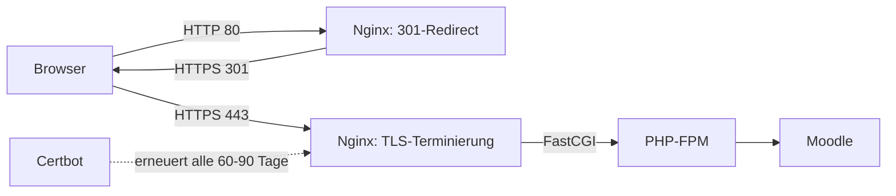

# Moodle: SSL/HTTPS einrichten & Nginx absichern

Dieses Kapitel baut auf [Moodle: Nginx-Konfiguration im Detail](moodle-nginx-configuration.md) auf und ergänzt den bisherigen HTTP-Serverblock um ein Let's-Encrypt-Zertifikat, eine gehärtete TLS-Konfiguration sowie weitere Moodle-spezifische Nginx-Einstellungen: Sicherheits-Header, Brute-Force-Schutz für den Login, Gzip-Kompression und Timeouts für große Uploads/Backups.

!!! note "Hinweis zur Quelle"
    Die TLS-Parameter orientieren sich an den [Mozilla SSL Configuration Generator](https://ssl-config.mozilla.org/)-Empfehlungen (Profil „Intermediate“) sowie der [Moodle-Nginx-Dokumentation](https://docs.moodle.org/en/Nginx). Für die allgemeinen Grundlagen zu Zertifikaten und Wildcard-Domains siehe [Nginx: SSL & HTTPS](../../entwicklung/infrastruktur/nginx-ssl.md) und [Nginx: Hardening & Sicherheit](../../entwicklung/infrastruktur/nginx-hardening.md) — dieses Kapitel wendet beides konkret auf die Moodle-Installation aus [Moodle auf Ubuntu Server installieren](moodle-installation.md) an.

---

## Übersicht



Nginx übernimmt für Moodle drei zusätzliche Aufgaben gegenüber der reinen HTTP-Konfiguration:

1. **HTTP dauerhaft auf HTTPS umleiten** — Moodle darf produktiv nicht unverschlüsselt erreichbar sein, da Anmeldedaten und Session-Cookies sonst im Klartext übertragen würden.
2. **TLS mit sicheren Protokollen/Ciphern terminieren**.
3. **Zusätzliche Schutzmaßnahmen**, die über das reine Routing aus dem vorherigen Kapitel hinausgehen: Header, Rate Limiting, Timeouts.

---

## 1. Zertifikat mit Certbot beziehen

Die HTTP-Konfiguration aus [Moodle: Nginx-Konfiguration im Detail](moodle-nginx-configuration.md#5-sensible-pfade-sperren) lässt `/.well-known/` bereits unangetastet — das ist Voraussetzung für die HTTP-01-Challenge von Let's Encrypt.

```bash
sudo apt install -y certbot python3-certbot-nginx
sudo certbot --nginx -d moodle.example.org
```

Das Certbot-Nginx-Plugin erkennt den bestehenden `server`-Block für `moodle.example.org`, ergänzt automatisch `listen 443 ssl;`, trägt die Zertifikatspfade ein und legt optional den HTTP→HTTPS-Redirect an. Für eine über mehrere Server/Loadbalancer verteilte Installation oder Wildcard-Zertifikate (`*.example.org`) gilt stattdessen das DNS-TXT-Verfahren aus [Nginx: SSL & HTTPS](../../entwicklung/infrastruktur/nginx-ssl.md).

Automatische Erneuerung prüfen (Certbot richtet dafür bereits einen systemd-Timer bzw. Cron-Eintrag ein):

```bash
sudo certbot renew --dry-run
sudo systemctl list-timers | grep certbot
```

---

## 2. HTTP → HTTPS-Redirect

Falls Certbot den Redirect nicht automatisch angelegt hat, oder um ihn explizit nachzuvollziehen:

```nginx
server {
    listen 80;
    server_name moodle.example.org;

    # Let's-Encrypt-Erneuerung weiterhin über HTTP erlauben
    location /.well-known/acme-challenge/ {
        root /var/www/moodle;
    }

    location / {
        return 301 https://$host$request_uri;
    }
}
```

!!! warning "Achtung: Kein `try_files` mehr im HTTP-Block"
    Sobald HTTPS aktiv ist, darf der HTTP-Block aus dem vorherigen Kapitel (`try_files ... /index.php`) **nicht** parallel bestehen bleiben — sonst bleibt Moodle über die unverschlüsselte URL vollständig nutzbar. Der HTTP-Block reduziert sich auf die ACME-Challenge und den Redirect.

---

## 3. TLS-Parameter im HTTPS-Block

```nginx
server {
    listen 443 ssl http2;
    server_name moodle.example.org;

    ssl_certificate     /etc/letsencrypt/live/moodle.example.org/fullchain.pem;
    ssl_certificate_key /etc/letsencrypt/live/moodle.example.org/privkey.pem;

    ssl_protocols TLSv1.2 TLSv1.3;
    ssl_ciphers ECDHE-ECDSA-AES128-GCM-SHA256:ECDHE-RSA-AES128-GCM-SHA256:ECDHE-ECDSA-AES256-GCM-SHA384:ECDHE-RSA-AES256-GCM-SHA384;
    ssl_prefer_server_ciphers off;

    ssl_session_cache shared:MoodleSSL:10m;
    ssl_session_timeout 1d;
    ssl_session_tickets off;

    ssl_stapling on;
    ssl_stapling_verify on;
    resolver 1.1.1.1 8.8.8.8 valid=300s;

    # ... root, index, location-Blöcke wie im vorherigen Kapitel
}
```

| Direktive | Erklärung |
|---|---|
| `listen 443 ssl http2` | Terminiert TLS und aktiviert HTTP/2 — mehrere Ressourcen (CSS, JS, Bilder von Moodle-Themes) werden über eine einzige Verbindung parallel statt sequenziell geladen. |
| `ssl_protocols TLSv1.2 TLSv1.3` | Nur noch moderne Protokollversionen. SSLv3/TLSv1.0/1.1 gelten als gebrochen bzw. veraltet und werden bewusst ausgeschlossen. |
| `ssl_ciphers` / `ssl_prefer_server_ciphers off` | Cipher-Auswahl nach Mozilla-„Intermediate“-Profil; moderne Browser handeln selbst den stärksten gemeinsamen Cipher aus, daher `off`. |
| `ssl_session_cache` / `ssl_session_timeout` | Erlaubt TLS-Session-Resumption — wiederkehrende Besucher (z. B. während einer Klausur-Sitzung mit vielen AJAX-Requests) sparen sich den vollen TLS-Handshake. |
| `ssl_session_tickets off` | Deaktiviert TLS-Session-Tickets, die bei falscher Rotation ein Forward-Secrecy-Risiko darstellen können. |
| `ssl_stapling` / `ssl_stapling_verify` | OCSP Stapling: Der Server liefert den Zertifikat-Gültigkeitsstatus direkt mit, statt dass jeder Browser einzeln beim CA-OCSP-Responder nachfragt — schneller und diskreter. |

Konfiguration testen und laden:

```bash
sudo nginx -t
sudo systemctl reload nginx
```

Externe Kontrolle der TLS-Konfiguration z. B. über [SSL Labs](https://www.ssllabs.com/ssltest/) oder `testssl.sh`.

---

## 4. `config.php` für HTTPS anpassen

Nach der Umstellung muss Moodle selbst wissen, dass es ausschließlich über HTTPS läuft:

```php
$CFG->wwwroot = 'https://moodle.example.org';
```

Läuft Nginx **nicht** direkt vor PHP-FPM, sondern terminiert TLS auf einem vorgeschalteten Load Balancer/Reverse Proxy (z. B. bei mehreren Moodle-Knoten), muss Moodle zusätzlich mitgeteilt werden, dass die eingehende Verbindung intern zwar HTTP ist, ursprünglich aber über HTTPS kam:

```php
$CFG->sslproxy = 1;
```

!!! warning "Achtung"
    `$CFG->sslproxy = 1` nur setzen, wenn tatsächlich ein vorgeschalteter Proxy TLS terminiert und Moodle selbst nur intern per HTTP erreicht wird. Bei einer direkten Ein-Server-Installation wie in [Moodle auf Ubuntu Server installieren](moodle-installation.md) bleibt dieser Wert auf `0` (Standard), da Nginx selbst TLS terminiert.

Nach jeder Änderung an `config.php` den PHP-FPM-Opcache-Zustand nicht vergessen — bei aktiviertem Opcache mit Zeitstempel-Prüfung reicht in der Regel ein einfacher Reload, ansonsten:

```bash
sudo systemctl restart php8.3-fpm
```

---

## 5. Sicherheits-Header — mit Moodle-Besonderheiten

Die generischen Header aus [Nginx: Hardening & Sicherheit](../../entwicklung/infrastruktur/nginx-hardening.md) gelten auch für Moodle, mit zwei Anpassungen:

```nginx
add_header X-Content-Type-Options "nosniff" always;
add_header X-XSS-Protection "1; mode=block" always;
add_header Referrer-Policy "strict-origin-when-cross-origin" always;
add_header Strict-Transport-Security "max-age=63072000; includeSubDomains" always;

# SAMEORIGIN statt DENY: Moodle bettet eigene Inhalte (H5P, Quiz-Popups,
# manche Aktivitäten) über iframes innerhalb derselben Domain ein.
add_header X-Frame-Options "SAMEORIGIN" always;
```

!!! warning "Achtung: Content-Security-Policy nicht blind übernehmen"
    Eine pauschale, restriktive CSP (wie im generischen Hardening-Guide als Grundgerüst gezeigt) bricht bei Moodle häufig TinyMCE, eingebettete YouTube-/Vimeo-Videos, H5P-Inhalte und Drittanbieter-Plugins, die eigene externe Ressourcen nachladen. Eine funktionierende CSP für Moodle erfordert eine plugin- und theme-abhängige Whitelist und sollte zunächst im `Content-Security-Policy-Report-Only`-Modus getestet werden, bevor sie erzwungen wird.

`Strict-Transport-Security` erst aktivieren, wenn HTTPS zuverlässig läuft — der Header zwingt Browser, die Domain für die angegebene Dauer (hier zwei Jahre) ausschließlich über HTTPS anzusprechen, auch bei einem versehentlichen späteren Rückbau auf HTTP.

---

## 6. Brute-Force-Schutz für den Login

Moodles Login-Formular (`/login/index.php`) ist ein typisches Ziel für automatisierte Anmeldeversuche. Ergänzend zu Moodles eigenem [Login-Lockout](https://docs.moodle.org/en/Brute_force_attack_prevention) lässt sich auf Nginx-Ebene eine Rate-Limit-Zone vorschalten:

```nginx
# im http-Block von /etc/nginx/nginx.conf
limit_req_zone $binary_remote_addr zone=moodle_login:10m rate=5r/m;
```

```nginx
# im server-Block, vor dem allgemeinen PHP-FPM-Block aus dem vorherigen Kapitel
location = /login/index.php {
    limit_req zone=moodle_login burst=3 nodelay;

    fastcgi_pass unix:/run/php/php8.3-fpm.sock;
    fastcgi_index index.php;
    include fastcgi_params;
    fastcgi_param SCRIPT_FILENAME $document_root/login/index.php;
}
```

`rate=5r/m` erlaubt fünf Anfragen pro Minute und IP-Adresse, `burst=3` toleriert kurze Bursts (z. B. ein Nutzer, der Benutzername und Passwort zweimal knapp hintereinander falsch eingibt), bevor Nginx mit `503` antwortet. Details zu `limit_req_zone`: [Nginx: Hardening & Sicherheit](../../entwicklung/infrastruktur/nginx-hardening.md).

---

## 7. Gzip-Kompression

Moodle liefert viel textbasierten Inhalt (HTML, CSS, JS, JSON-Antworten der AJAX-Services) — Kompression reduziert Übertragungsgröße spürbar:

```nginx
gzip on;
gzip_vary on;
gzip_comp_level 5;
gzip_min_length 256;
gzip_types text/plain text/css application/json application/javascript
           text/xml application/xml application/xml+rss text/javascript;
```

Bereits komprimierte Formate (JPEG, PNG, WOFF2, PDF) bewusst **nicht** in `gzip_types` aufnehmen — erneutes Komprimieren kostet CPU-Zeit ohne nennenswerten Größengewinn.

---

## 8. Timeouts & Buffer für große Uploads/Backups

Moodle-Kurssicherungen (`.mbz`-Dateien) und größere Datei-Uploads laufen häufig länger als die Nginx-Standardwerte erlauben:

```nginx
client_body_timeout 300s;
fastcgi_read_timeout 300s;
fastcgi_send_timeout 300s;

fastcgi_buffers 16 16k;
fastcgi_buffer_size 32k;
```

| Direktive | Erklärung |
|---|---|
| `client_body_timeout` | Wie lange Nginx auf den vollständigen Empfang eines großen Uploads wartet, bevor es abbricht. |
| `fastcgi_read_timeout` / `fastcgi_send_timeout` | Wie lange Nginx auf eine Antwort von PHP-FPM wartet — relevant bei lang laufenden Vorgängen wie Kurs-Backups oder großen Restores. Muss zum `max_execution_time`-Wert aus [Installation, Schritt 5](moodle-installation.md#5-php-fpm-konfigurieren) passen; ein zu kurzer Nginx-Timeout bricht sonst Anfragen ab, die PHP-FPM noch bereitwillig zu Ende verarbeitet hätte. |
| `fastcgi_buffers` / `fastcgi_buffer_size` | Puffergröße für Antworten von PHP-FPM. Zu klein dimensioniert, schreibt Nginx Zwischenergebnisse auf die Platte (`fastcgi_temp_file_write_size`) statt im RAM zu halten — messbar langsamer bei Seiten mit vielen Elementen (z. B. Kursübersicht mit vielen Aktivitäten). |

---

## 9. Weitere Grundhärtung

```nginx
# im http-Block von /etc/nginx/nginx.conf
server_tokens off;
```

Unterdrückt die Nginx-Versionsnummer in Fehlerseiten und im `Server`-Header — erschwert automatisiertes Fingerprinting nach bekannten CVEs der eingesetzten Nginx-Version. Weitere allgemeine Maßnahmen (Fail2ban-Integration, Verbindungslimits) stehen in [Nginx: Hardening & Sicherheit](../../entwicklung/infrastruktur/nginx-hardening.md).

---

## Kurzprüfung

```bash
sudo nginx -t
curl -I http://moodle.example.org          # muss 301 auf https:// liefern
curl -I https://moodle.example.org         # muss 200 liefern, Server-Header ohne Versionsnummer
curl -sI https://moodle.example.org | grep -i strict-transport-security
openssl s_client -connect moodle.example.org:443 -tls1 </dev/null 2>&1 | grep -i "no protocols available"
```

Der letzte Befehl muss fehlschlagen bzw. „no protocols available“ melden — das bestätigt, dass das veraltete `TLSv1.0` tatsächlich abgelehnt wird.

---

## Quellen und weiterführende Informationen

- [Mozilla SSL Configuration Generator](https://ssl-config.mozilla.org/)
- [Moodle: Nginx](https://docs.moodle.org/en/Nginx)
- [Moodle: Brute force attack prevention](https://docs.moodle.org/en/Brute_force_attack_prevention)
- [Moodle: Nginx-Konfiguration im Detail](moodle-nginx-configuration.md) – Basis-Serverblock, den dieses Kapitel um TLS und Härtung erweitert
- [Moodle auf Ubuntu Server installieren (Git, PostgreSQL, Nginx)](moodle-installation.md)
- [Nginx: SSL & HTTPS](../../entwicklung/infrastruktur/nginx-ssl.md)
- [Nginx: Hardening & Sicherheit](../../entwicklung/infrastruktur/nginx-hardening.md)
- [E-Learning-Übersicht](index.md)
