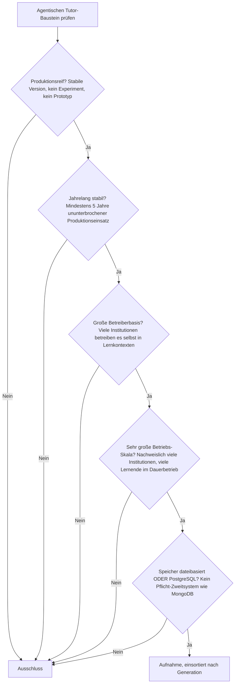
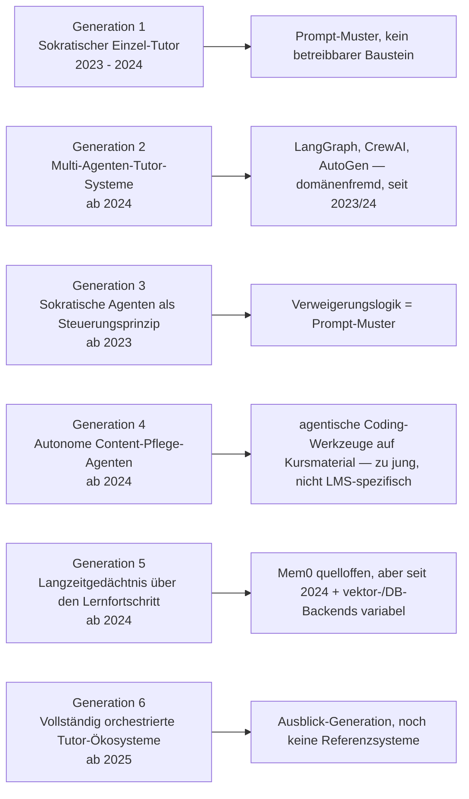
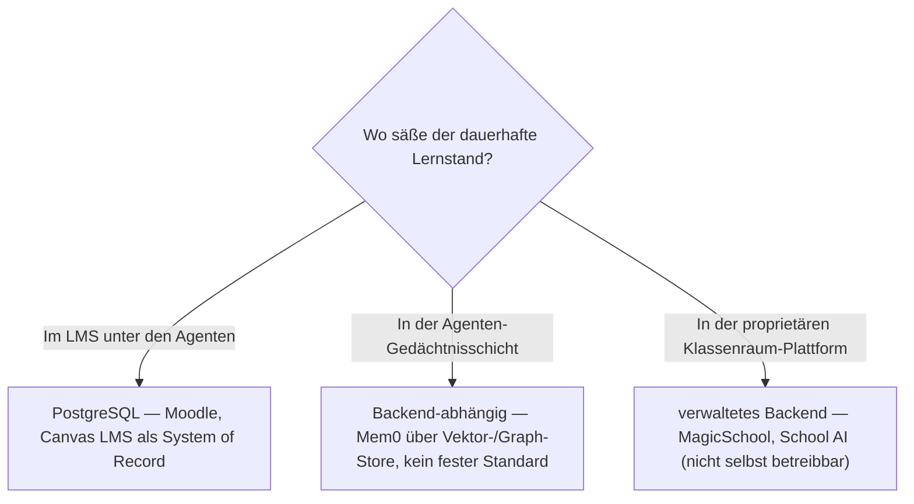

# Produktionsreife agentische Tutor-Ökosysteme nach Generation — Reifegrad, Evaluation & Betriebs-Skala (kein Treffer — jüngste Kategorie der Familie)

Die [Evolution und Architekturen digitaler Agentischer Tutor-Ökosysteme](evolution-digitaler-agentische-tutor-oekosysteme.md) zoomt in Generation 5 — die aktuelle und letzte — der [übergeordneten LMS-Zeitachse](evolution-digitaler-lms.md) hinein und teilt die agentische Linie in ein feineres Modell: vom sokratischen Einzel-Tutor (1) über Multi-Agenten-Tutor-Systeme (2), sokratische Agenten als Steuerungsprinzip (3), autonome Content-Pflege-Agenten (4), Langzeitgedächtnis über den Lernfortschritt (5) bis zu vollständig orchestrierten Tutor-Ökosystemen (6). Die [Topliste bester agentischer Tutor-Ökosysteme 2026](agentische-tutor-oekosysteme-2026-topliste.md) rankt die gesamte Kategorie. Diese Seite legt dasselbe **konservative** Fünf-Filter-Sieb an wie die übrigen LMS-Schwesterseiten — [allgemein](produktionsreife-lms-generationen-2026-topliste.md), [klassisch](produktionsreife-klassische-lms-generationen-2026-topliste.md), [Cloud](produktionsreife-cloud-lms-generationen-2026-topliste.md), [Rust](produktionsreife-rust-lms-generationen-2026-topliste.md), [interoperabel](produktionsreife-interoperable-lms-generationen-2026-topliste.md), [KI-adaptiv](produktionsreife-ki-adaptive-lernplattformen-generationen-2026-topliste.md) — produktionsreif · jahrelang stabil · große Betreiberbasis · sehr große Betriebs-Skala · Speicher dateibasiert oder PostgreSQL —, hier für die *agentische Linie* und nach deren feinerem Generationenmodell sortiert.

!!! warning "Achtung: Der klarste „kein Treffer" der ganzen Familie"
    Diese Kategorie kann das Sieb strukturell nicht bestehen: Ihre Architektur ist **erst seit 2023 real** — jeder Filter, der fünf Jahre Produktion verlangt, schließt sie vollständig aus. Die Bildungsprodukte (**Khanmigo**, **MagicSchool AI**, **School AI**, **Synthesis Tutor**, **Curipod**, **Brisk Teaching**, **Ello**, **Google-Classroom-Agenten**) sind ausnahmslos **proprietäres SaaS**. Die quelloffenen Bausteine — **LangGraph**, **CrewAI**, **AutoGen**, **Mem0**, agentische Coding-Werkzeuge auf Kursmaterial angewendet — stammen aus **anderen Domänen** (allgemeine Agenten-Orchestrierung, Agenten-Gedächtnis, Software-Entwicklung), sind selbst 2023/24 entstanden und für Tutoring weder gebaut noch in Lern-Skala erprobt. Es gibt keinen domäneneigenen, quelloffenen, produktionsreifen agentischen Tutor-Baustein. Fazit für die Praxis: **reifes LMS ([Moodle/Canvas](produktionsreife-lms-generationen-2026-topliste.md)) + etabliertes Agenten-Framework**. Dieselbe Struktur wie bei [autonomen KI-Agenten](../../künstliche-intelligenz/produktionsreife-autonome-ki-agenten-generationen-2026-topliste.md) und [RAG-Werkzeug-Anwendungen](../../künstliche-intelligenz/produktionsreife-rag-werkzeug-anwendungen-generationen-2026-topliste.md).

---

## Die fünf harten Filter

!!! note "Hinweis: nur OSI-Lizenzen, nur selbst betreibbare Systeme"
    Aufgenommen werden Systeme unter OSI-anerkannter Lizenz, die man selbst betreiben kann. Das schließt sämtliche Bildungsprodukte der Basis-Topliste aus — **Khanmigo**, **MagicSchool AI**, **School AI**, **Synthesis Tutor**, **Coursera Coach**, **Brisk Teaching**, **Curipod**, **Duolingo Max Video Call**, **Ello**, **Google-Classroom-KI-Agenten**. Die quelloffenen Einträge (**LangGraph**, **CrewAI**, **AutoGen**, **Mem0**) sind Filterkandidaten — scheitern aber alle an der Fünf-Jahres-Marke und am fehlenden Lern-Skala-Nachweis.

---

## Ergebnis: kein Treffer über sechs Generationsstufen

---

## Warum keine Generation einen Treffer liefert

### Generation 1 — Vom Einzel-Tutor zum orchestrierten Lernprozess (2023 – 2024)

Der sokratische Einzel-Tutor und die deklarativen Rollen-Prompts sind **Prompt- und Architekturmuster**, keine betreibbaren Systeme mit Speicher und Betreiberbasis. Sie setzen unmittelbar auf [Generation 4 der KI-adaptiven Lernplattformen](produktionsreife-ki-adaptive-lernplattformen-generationen-2026-topliste.md) auf, die selbst schon keinen Treffer liefert.

### Generation 2 — Multi-Agenten-Tutor-Systeme (ab 2024)

Hier sitzen die quelloffenen Filterkandidaten: **LangGraph** (LangChain), **CrewAI**, **AutoGen** (Microsoft). Alle drei sind reale, verbreitete Orchestrierungs-Frameworks — aber:

| Baustein | Scheitert an | Anmerkung |
|---|---|---|
| **LangGraph** | Reifezeit (seit 2024) + Kategorie | Allgemeines Agenten-Orchestrierungs-Framework, nicht für Tutoring gebaut; API noch in Bewegung |
| **CrewAI** | Reifezeit (seit 2023) + Kategorie | Rollenbasiertes Multi-Agenten-Framework, domänenneutral |
| **AutoGen** | Reifezeit (seit 2023) + Kategorie | Microsoft-Forschungsframework, mehrfach umgebaut (v0.2 → v0.4) |

Dieselben drei Werkzeuge fallen aus demselben Grund schon auf der [Autonome-KI-Agenten-Schwesterseite](../../künstliche-intelligenz/produktionsreife-autonome-ki-agenten-generationen-2026-topliste.md).

### Generation 3 — Sokratische Agenten als Steuerungsprinzip (ab 2023)

Die sokratische Verweigerungslogik ist ein **didaktisches Prompt-Muster**, das sich durch die ganze Generation zieht — kein abgrenzbarer, versionierter Baustein, den man betreiben oder dessen Speicher man prüfen könnte.

### Generation 4 — Autonome Content-Pflege-Agenten (ab 2024)

Agentische Coding-Werkzeuge (Claude Code, Antigravity CLI), angewandt auf Kursmaterial-Repositories, setzen das [LLM-Wiki-Pattern](../dokumentation/llm-wiki-pattern-karpathy.md) um — sind aber Software-Entwicklungswerkzeuge, nicht LMS-spezifisch, und erst seit ~2024 verfügbar. Der Ansatz ist tragfähig (dieses Repository nutzt ihn selbst), aber kein produktionsreifer Tutor-Baustein im Filtersinn.

### Generation 5 — Langzeitgedächtnis über den individuellen Lernfortschritt (ab 2024)

**Mem0** ist die verbreitetste quelloffene Agenten-Gedächtnisschicht und ließe sich als Lernfortschritts-Gedächtnis einsetzen — aber seit 2024 (unter fünf Jahre), domänenneutral, und die Persistenz hängt am gewählten Backend (Vektor-DB, teils zusätzlich Graph-Store). Ein persistentes, revisionssicheres Lernprofil über viele Institutionen in Produktion gibt es quelloffen nicht.

### Generation 6 — Vollständig orchestrierte Tutor-Ökosysteme (ab 2025)

Die **Ausblick-Generation**: Lernstand erfassen, Aufgaben generieren, prüfen, intervenieren und Kursmaterial aktualisieren als durchgängiger Agenten-Workflow. 2026 existieren dafür weder quelloffene noch verbreitete proprietäre Referenzsysteme — sie ist per Definition noch nicht produktionsreif.

---

## Dateibasiert oder PostgreSQL?

Die Frage ist hier weitgehend gegenstandslos: Es gibt kein selbst betreibbares Tutor-Ökosystem, dessen Speicher man prüfen könnte. Sobald eines entsteht, sitzt sein Lernstand nach derselben Logik wie bei jedem LMS in einer relationalen Datenbank — siehe [allgemeine LMS-Schwesterseite](produktionsreife-lms-generationen-2026-topliste.md#dateibasis-oder-postgresql-die-antwort-ist-eindeutig).

- Ein agentisches Tutor-Ökosystem ist kein Ersatz für das LMS, sondern eine Schicht **darüber** — Einschreibung, Noten und Zertifikate bleiben im transaktionalen **PostgreSQL**-System of Record.
- Das agentische **Lernfortschritts-Gedächtnis** hat 2026 kein etabliertes Speichermodell — genau diese Lücke beschreibt Generation 5 der Zeitachse.
- Der Speicherfilter wird erst relevant, wenn ein quelloffenes Tutor-Ökosystem die übrigen vier Filter überhaupt erreicht.

Vertiefung zur Datenbankschicht: [PostgreSQL DBA Praxis-Handbuch](../../entwicklung/infrastruktur/postgresql-dba-praxis.md).

!!! warning "Achtung: Momentaufnahme, Stand August 2026"
    Diese Kategorie wird sich am schnellsten von allen LMS-Schwesterseiten verändern. Der erste Treffer entsteht frühestens, wenn eines der heutigen Agenten-Frameworks fünf Jahre Produktion erreicht **und** ein quelloffenes Tutor-Ökosystem darauf eine große Betreiberbasis in Lernkontexten aufbaut — realistisch nicht vor Ende der 2020er.

---

## Was bewusst nicht auf dieser Liste steht

| Baustein | Erfüllt nicht | Anmerkung |
|---|---|---|
| **LangGraph, CrewAI, AutoGen** | Reifezeit + Kategorie | Quelloffene Agenten-Orchestrierung, seit 2023/24, domänenneutral, APIs in Bewegung |
| **Mem0** | Reifezeit + Speichermodell | Quelloffene Agenten-Gedächtnisschicht seit 2024; Persistenz backend-abhängig |
| **Claude Code / Antigravity CLI auf Kursmaterial** | Reifezeit + Kategorie | Software-Entwicklungswerkzeuge, seit ~2024, nicht LMS-spezifisch |
| **Khanmigo, MagicSchool AI, School AI, Synthesis Tutor, Curipod, Brisk Teaching, Ello** | Lizenz + Reifezeit | Proprietäre Klassenraum-/Tutor-SaaS, seit 2023 |
| **Coursera Coach, Duolingo Max Video Call** | Lizenz + Reifezeit | Proprietäre Einzel-Tutor-Funktionen bestehender Plattformen |
| **Google-Classroom-KI-Agenten-Features** | Lizenz + Reifezeit | Proprietäre Funktionsschicht der größten K-12-Cloud, gerade erst eingeführt |
| **Moodle, Canvas LMS** | Kategorie | Reife LMS als System of Record unter den Agenten — auf der [allgemeinen Schwesterseite](produktionsreife-lms-generationen-2026-topliste.md) |

---

## 🔗 Verwandte Themen

- [Evolution und Architekturen digitaler Agentischer Tutor-Ökosysteme](evolution-digitaler-agentische-tutor-oekosysteme.md) — das feinere Generationenmodell der agentischen Linie, nach dem diese Liste sortiert ist
- [Beste agentische Tutor-Ökosysteme 2026 (Top 15)](agentische-tutor-oekosysteme-2026-topliste.md) — breiteste Basis-Topliste inklusive proprietärer Produkte und domänenfremder Bausteine
- [Produktionsreife Open-Source-LMS nach Generation (Top 2 + Grenzfälle)](produktionsreife-lms-generationen-2026-topliste.md) — allgemeine Schwesterseite; dort bestehen Moodle und Canvas LMS als System of Record unter den Agenten
- [Produktionsreife KI-adaptive Lernplattformen nach Generation (kein Treffer)](produktionsreife-ki-adaptive-lernplattformen-generationen-2026-topliste.md) — vorausgehende Generation, ebenfalls ohne Treffer
- [Produktionsreife interoperable LMS-Bausteine nach Generation (kein Treffer)](produktionsreife-interoperable-lms-generationen-2026-topliste.md) — dieselbe Familie, Interoperabilitäts-Linie
- [Produktionsreife autonome KI-Agenten nach Generation (kein Treffer)](../../künstliche-intelligenz/produktionsreife-autonome-ki-agenten-generationen-2026-topliste.md) — dieselben Frameworks (LangGraph, CrewAI, AutoGen) fallen dort aus demselben Grund
- [LLM-Wiki-Pattern (Karpathy-Muster)](../dokumentation/llm-wiki-pattern-karpathy.md) — verwandtes Prinzip hinter der autonomen Content-Pflege (Generation 4)
- [PostgreSQL DBA Praxis-Handbuch](../../entwicklung/infrastruktur/postgresql-dba-praxis.md) — Datenbankschicht des LMS unter den Agenten
