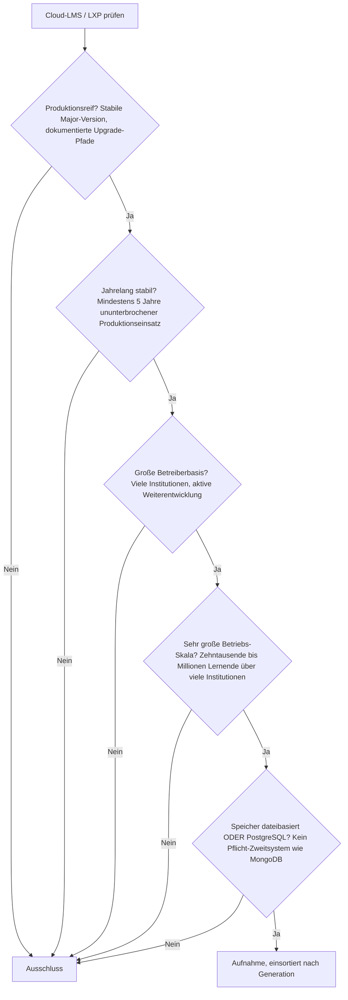
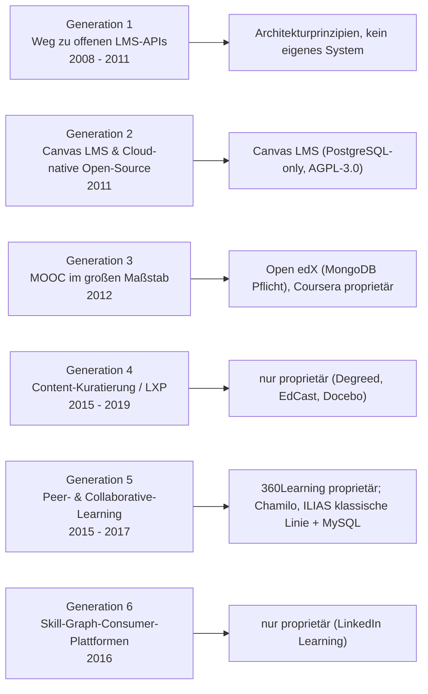
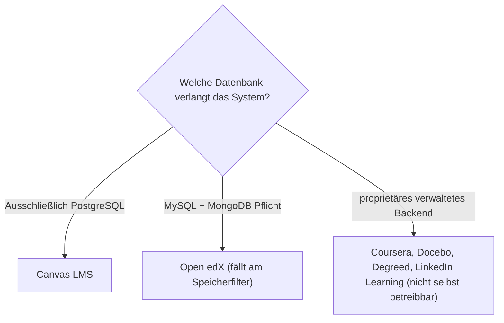

# Produktionsreife Cloud-LMS & LXP nach Generation — Reifegrad, Evaluation & Betriebs-Skala (Top 1)

Die [Evolution und Architekturen digitaler Cloud-LMS & LXP](evolution-digitaler-cloud-lms.md) zoomt in Generation 2 der [übergeordneten LMS-Zeitachse](evolution-digitaler-lms.md) hinein und teilt die Cloud-native Architekturlinie in ein feineres Modell: der Weg zu offenen LMS-APIs (1), Canvas LMS als Cloud-native-Open-Source-Referenz (2), MOOC-Plattformen im großen Maßstab (3), Content-Kuratierung nach Streaming-Vorbild / LXP (4), Peer- & Collaborative-Learning (5) und Skill-Graph-zentrierte Consumer-Plattformen (6). Die [Topliste bester Cloud-LMS & LXP 2026](cloud-lms-2026-topliste.md) rankt die gesamte Kategorie. Diese Seite legt dasselbe **konservative** Fünf-Filter-Sieb an wie die [allgemeine LMS-Schwesterseite](produktionsreife-lms-generationen-2026-topliste.md) und die [klassische Schwesterseite](produktionsreife-klassische-lms-generationen-2026-topliste.md) — produktionsreif · jahrelang stabil · große Betreiberbasis · sehr große Betriebs-Skala · Speicher dateibasiert oder PostgreSQL —, hier aber nur für die *Cloud-LMS-/LXP-Linie* und nach deren feinerem Generationenmodell sortiert.

!!! warning "Achtung: Genau ein Treffer — Canvas LMS — weil die Kategorie gehosteten Betrieb als Produkt verkauft"
    Nur **Canvas LMS** besteht alle fünf Filter. Der Grund ist strukturell: Eine Cloud-LMS-/Learning-Experience-Platform verkauft **den gehosteten Betrieb selbst** als Produkt — quelloffener Code untergräbt das Geschäftsmodell. Die LXP-Generationen 4–6 (Degreed, EdCast, Docebo, 360Learning, LinkedIn Learning) hatten daher **nie einen quelloffenen Vertreter**. Canvas LMS ist die Ausnahme: Instructure legte den Kern unter AGPL-3.0 offen und betreibt die kommerzielle Cloud daneben. Open edX (Generation 3) ist quelloffen, benötigt aber zwingend MongoDB und fällt am Speicherfilter ([Speicher-Fazit](#dateibasiert-oder-postgresql)). Dieselbe Struktur wie bei [Cloud-Notebooks](../dokumentation/produktionsreife-cloud-notebooks-generationen-2026-topliste.md) (nur Binder/BinderHub) und [BI-Analytics-Werkzeugen](../daten/datenbanken/produktionsreife-bi-analytics-tools-generationen-2026-topliste.md).

---

## Die fünf harten Filter

!!! note "Hinweis: nur OSI-Lizenzen, nur selbst betreibbare Systeme"
    Aufgenommen werden Systeme unter OSI-anerkannter Lizenz, die man selbst betreiben kann. Das schließt die gesamte SaaS-Hälfte der [Basis-Topliste](cloud-lms-2026-topliste.md) aus — **Coursera-Plattform**, **Docebo**, **Degreed**, **EdCast**, **360Learning**, **Skillsoft**, **D2L Brightspace**, **Google Classroom**, **Schoology**, **Thinkific**, **Teachable**, **Absorb LMS**, **LearnUpon**, **iSpring Learn**, **Litmos** und **LinkedIn Learning**. **Chamilo** und **ILIAS** sind quelloffen, gehören aber zur selbst gehosteten [klassischen Linie](produktionsreife-klassische-lms-generationen-2026-topliste.md) und sind zusätzlich MySQL/MariaDB-gebunden.

---

## Ergebnis: ein System über sechs Generationsstufen

---

## Systeme nach Generation

### Generation 2 — Canvas LMS & Cloud-native Open-Source (2011)

| # | System | Speicher | Lizenz | Seit | Skala-Nachweis | Betreiberbasis |
|---|---|---|---|---|---|---|
| 1 | **Canvas LMS** (Instructure) | **Ausschließlich PostgreSQL** — keine andere Datenbank unterstützt | AGPL-3.0 | 2011 | Dominierend im nordamerikanischen Hochschulmarkt; die Instructure-Cloud bedient Millionen aktiver Nutzer | Große Hochschul-Basis; die selbst gehostete Open-Source-Variante ist kleiner, aber produktionserprobt |

**Canvas LMS** ist der einzige Treffer — und dasselbe „PostgreSQL statt Auswahl"-Beispiel, das schon die [allgemeine Schwesterseite](produktionsreife-lms-generationen-2026-topliste.md#generation-2-cloud-native-lms-lxp-open-source-mooc-ca-2011-2021) als Generation-2-Vertreter führt. Von Grund auf API-first konzipiert, über ein Jahrzehnt Produktionshistorie, Skalierung bis in den Millionenbereich. Zu bewerten vor einer Self-Hosting-Entscheidung: Die AGPL-3.0-Lizenz und der Umstand, dass Hauptentwickler Instructure zugleich die kommerzielle Cloud betreibt — der Kern ist aber uneingeschränkt offen und deckungsgleich mit dem gehosteten Produkt.

### Generation 1 & Generation 3 – 6 — warum hier nichts steht

- **Generation 1 (Weg zu offenen LMS-APIs)**: SaaS-Betrieb, offene REST-API und Mobile-first-Oberflächen sind **Architekturprinzipien**, keine eigenständigen Systeme. Sie münden 2011 direkt in Canvas LMS (Generation 2).
- **Generation 3 (MOOC im großen Maßstab)**: **Open edX** (seit 2012, hinter edX.org, für Zehntausende gleichzeitige Teilnehmende konzipiert) ist bei Reife, Betreiberbasis und Skala voll qualifiziert — benötigt aber neben MySQL zwingend **MongoDB** als Kursinhalts-Speicher (Modulestore). Die laufende „Learning Core"-Migration verschiebt diese Daten schrittweise nach MySQL, ist 2026 aber nicht abgeschlossen. **Coursera-Plattform** ist proprietär.
- **Generation 4 (Content-Kuratierung / LXP)**: **Degreed**, **EdCast** und **Docebo** — sämtlich proprietäres SaaS. Die Learning Experience Platform entstand als kommerzielle Kategorie und hatte nie einen quelloffenen Vertreter mit großer Betreiberbasis.
- **Generation 5 (Peer- & Collaborative-Learning)**: **360Learning** ist proprietär. **Chamilo** und **ILIAS** sind quelloffen und reif, gehören aber zur selbst gehosteten [klassischen LMS-Linie](produktionsreife-klassische-lms-generationen-2026-topliste.md) und sind zusätzlich auf MySQL/MariaDB festgelegt — doppelt außerhalb dieser Liste.
- **Generation 6 (Skill-Graph-Consumer-Plattformen)**: **LinkedIn Learning** ist proprietär und ein Consumer-/B2C-Dienst — per Definition kein selbst betreibbares System.

---

## Dateibasiert oder PostgreSQL?

Die Antwort ist dieselbe wie auf der [allgemeinen LMS-Schwesterseite](produktionsreife-lms-generationen-2026-topliste.md#dateibasis-oder-postgresql-die-antwort-ist-eindeutig): **PostgreSQL** — und in der Cloud-LMS-Linie sogar besonders zugespitzt.

- **Canvas LMS** unterstützt **keine** andere Datenbank als PostgreSQL — das reinste „PostgreSQL ist Pflicht, nicht Wahl"-Beispiel aller Familienseiten.
- **Open edX** ist das wörtliche Gegenbeispiel des Speicherfilters: MongoDB als Pflicht-Zweitsystem neben der relationalen Datenbank. Wer die „Learning Core"-Migration abwartet, bekommt später womöglich einen zweiten Treffer.
- Dateibasiert sein kann nur das Autoren-Quellformat (Open edX OLX, Markdown-Kurse, SCORM-/cmi5-Pakete) — nicht das laufende LMS, sobald Einschreibung, Fortschritt, Bewertung und Zertifikate hinzukommen. Ein LMS ist ein **transaktionales System of Record**.

Vertiefung zur Datenbankschicht: [PostgreSQL DBA Praxis-Handbuch](../../entwicklung/infrastruktur/postgresql-dba-praxis.md).

!!! warning "Achtung: Momentaufnahme, Stand August 2026"
    Datenbank-Unterstützung ändert sich mit Major-Releases. Sollte die Open-edX-„Learning Core"-Umstellung MongoDB vollständig ablösen, verdoppelt sich diese Liste. Canvas LMS ist die stabile Konstante.

---

## Was bewusst nicht auf dieser Liste steht

| System | Erfüllt nicht | Anmerkung |
|---|---|---|
| **Open edX** | Pflicht-Zweitsystem | Benötigt neben MySQL zwingend MongoDB (Modulestore); „Learning Core"-Migration läuft, ist aber nicht abgeschlossen. Ansonsten voll qualifiziert |
| **Chamilo, ILIAS** | Speicherfilter + Kategorie | Nur MySQL/MariaDB; gehören zur selbst gehosteten klassischen Linie, nicht zur Cloud-native-Kategorie |
| **Coursera-Plattform, Docebo, Degreed, EdCast, 360Learning, Skillsoft, LinkedIn Learning** | Lizenzfilter | Proprietäre SaaS-/LXP-Plattformen; gehosteter Betrieb ist das Produkt |
| **D2L Brightspace, Google Classroom, Schoology, Absorb LMS, LearnUpon, iSpring Learn, Litmos** | Lizenzfilter | Proprietäre Cloud-LMS ohne selbst betreibbare Open-Source-Variante |
| **Thinkific, Teachable** | Lizenz + Reifezeit | Creator-Economy-SaaS mit häufig wechselndem Funktions- und Preismodell |
| **Canvas Cloud (gehostet)** | Kategorie | Kommerzieller Managed-Betrieb; der offene Kern *ist* auf dieser Liste |

---

## 🔗 Verwandte Themen

- [Evolution und Architekturen digitaler Cloud-LMS & LXP](evolution-digitaler-cloud-lms.md) — das feinere Generationenmodell der Cloud-Linie, nach dem diese Liste sortiert ist
- [Beste Cloud-LMS & LXP 2026 (Top 20)](cloud-lms-2026-topliste.md) — breiteste Basis-Topliste inklusive proprietärer SaaS-Plattformen
- [Produktionsreife Open-Source-LMS nach Generation (Top 2 + Grenzfälle)](produktionsreife-lms-generationen-2026-topliste.md) — allgemeine Schwesterseite über alle fünf LMS-Generationen; dort kommt Moodle als Generation-1b-Treffer hinzu
- [Produktionsreife klassische Open-Source-LMS nach Generation (Top 1)](produktionsreife-klassische-lms-generationen-2026-topliste.md) — Schwesterseite für die vorausgehende, selbst gehostete Generation
- [Produktionsreife Rust-Bausteine für LMS nach Generation (Top 2)](produktionsreife-rust-lms-generationen-2026-topliste.md) — Firecracker-basierte Coding-Sandboxes, die Canvas LMS und andere Cloud-Plattformen einbetten
- [Produktionsreife interoperable LMS-Bausteine nach Generation (kein Treffer)](produktionsreife-interoperable-lms-generationen-2026-topliste.md) — dort fällt Learning Locker am selben MongoDB-Speicherfilter wie hier Open edX
- [Produktionsreife KI-adaptive Lernplattformen nach Generation (kein Treffer)](produktionsreife-ki-adaptive-lernplattformen-generationen-2026-topliste.md) — Schwesterseite für die KI-adaptive Linie (Generation 4)
- [Produktionsreife agentische Tutor-Ökosysteme nach Generation (kein Treffer)](produktionsreife-agentische-tutor-oekosysteme-generationen-2026-topliste.md) — Schwesterseite für die agentische Linie (Generation 5)
- [Produktionsreife Open-Source-Cloud-Notebooks nach Generation (Top 1)](../dokumentation/produktionsreife-cloud-notebooks-generationen-2026-topliste.md) — dieselbe strukturelle Aussage: eine Kategorie, die Rechen-/Betriebskapazität verkauft, bleibt fast vollständig proprietär
- [Produktionsreife BI- & Analytics-Werkzeuge nach Generation (Top 3)](../daten/datenbanken/produktionsreife-bi-analytics-tools-generationen-2026-topliste.md) — Schwesterseite mit demselben Fünf-Filter-Sieb und derselben Lizenz-Dominanz-Beobachtung
- [PostgreSQL DBA Praxis-Handbuch](../../entwicklung/infrastruktur/postgresql-dba-praxis.md) — Datenbankschicht hinter dem Treffer
