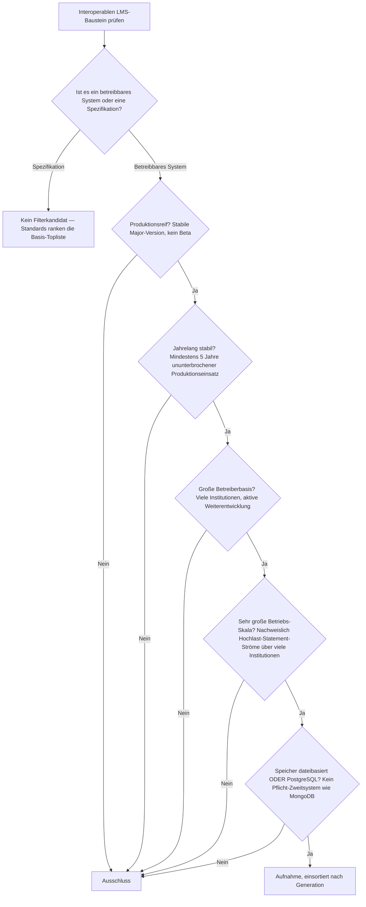
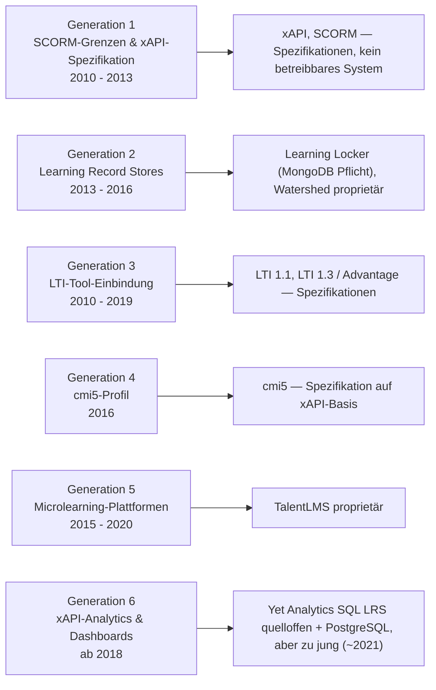
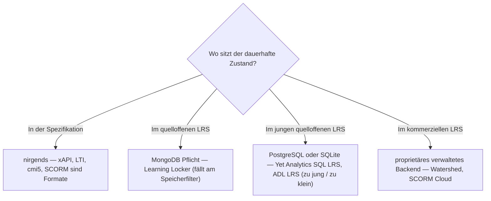

# Produktionsreife interoperable LMS-Bausteine nach Generation — Reifegrad, Evaluation & Betriebs-Skala (kein Treffer — die Kategorie ist eine Spezifikationsebene)

Die [Evolution und Architekturen digitaler interoperabler LMS](evolution-digitaler-interoperable-lms.md) zoomt in Generation 3 der [übergeordneten LMS-Zeitachse](evolution-digitaler-lms.md) hinein und teilt die Interoperabilitäts-Linie in ein feineres Modell: die sichtbar werdenden SCORM-Grenzen und die xAPI-Spezifikation (1), Learning Record Stores (2), LTI-Tool-Einbindung (3), das cmi5-Profil (4), Microlearning-Plattformen (5) und xAPI-Analytics (6). Die [Topliste bester interoperabler LMS-Bausteine 2026](interoperable-lms-2026-topliste.md) rankt die gesamte Kategorie — Standards und Produkte gemischt. Diese Seite legt dasselbe **konservative** Fünf-Filter-Sieb an wie die [allgemeine](produktionsreife-lms-generationen-2026-topliste.md), die [klassische](produktionsreife-klassische-lms-generationen-2026-topliste.md), die [Cloud-LMS-](produktionsreife-cloud-lms-generationen-2026-topliste.md) und die [Rust-Schwesterseite](produktionsreife-rust-lms-generationen-2026-topliste.md) — produktionsreif · jahrelang stabil · große Betreiberbasis · sehr große Betriebs-Skala · Speicher dateibasiert oder PostgreSQL —, hier für die *Interoperabilitäts-Linie* und nach deren feinerem Generationenmodell sortiert.

!!! warning "Achtung: Kein quelloffener interoperabler LMS-Baustein besteht alle fünf Filter"
    Die Kategorie zerfällt in zwei Hälften, die je an einer anderen Achse scheitern. Die **tragenden Bausteine sind offene Spezifikationen** — **xAPI**, **LTI 1.3 / LTI Advantage**, **cmi5**, **SCORM** — reif, jahrzehntelang stabil und in gigantischer Verbreitung, aber **keine betreibbaren Systeme**: kein Speicherbackend, keine Betriebs-Skala im Filtersinn, nichts, das man „produktionsreif betreibt". Die **reifen Implementierungen** — **Watershed**, **SCORM Cloud**, **Rustici Engine**, **TalentLMS** — sind durchweg **proprietär**. Der einzige verbreitete quelloffene Learning Record Store, **Learning Locker**, verlangt zwingend **MongoDB** und fällt am Speicherfilter — dasselbe wörtliche Gegenbeispiel wie Open edX auf der [Cloud-Schwesterseite](produktionsreife-cloud-lms-generationen-2026-topliste.md). Die quelloffenen PostgreSQL-gestützten LRS (**Yet Analytics SQL LRS**, **ADL LRS**) sind zu jung bzw. zu klein ([Speicher-Fazit](#dateibasiert-oder-postgresql)). Dieselbe Struktur wie bei [KI-nativen Web-Frameworks](../../entwicklung/webentwicklung/produktionsreife-ki-native-webframeworks-generationen-2026-topliste.md) — reife Schicht = Spezifikation, Produkte = proprietär.

---

## Die fünf harten Filter

!!! note "Hinweis: Standards sind keine Filterkandidaten, nur OSI-Lizenzen bei den Produkten"
    Eine Spezifikation wie xAPI oder LTI hat kein Speicherbackend und keinen Betrieb — sie kann „reif" sein, aber nicht „produktionsreif betrieben". Solche Standards ordnet die [Basis-Topliste](interoperable-lms-2026-topliste.md) ein; hier zählen nur selbst betreibbare Systeme unter OSI-anerkannter Lizenz. Das schließt die kommerzielle Hälfte der Kategorie aus — **Watershed**, **SCORM Cloud** und **Rustici Engine** (beide Rustici Software / Learning Technologies Group), **TalentLMS**, **Yet Analytics** als Dienstleister — sowie die LRS-Funktionen, die in proprietären LMS eingebaut sind.

---

## Ergebnis: kein Treffer über sechs Generationsstufen

---

## Warum keine Generation einen Treffer liefert

### Generation 1 — SCORM-Grenzen & xAPI-Spezifikation (2010 – 2013)

**xAPI** (Experience API) und der Altstandard **SCORM** sind die reifsten Bausteine der ganzen Kategorie — SCORM seit 2004 im Feld, xAPI seit der Finalisierung 2013 in praktisch jedem modernen LMS implementiert. Aber es sind **Datenformate und Protokolle**, keine Systeme: Sie haben keinen Betrieb, keine Betreiberbasis im Sinne betriebener Instanzen, kein Speicherbackend. Der Filter greift strukturell nicht — dieselbe Lage wie beim [Debug Adapter Protocol auf der Debugger-Schwesterseite](../../entwicklung/system/produktionsreife-debugger-werkzeuge-generationen-2026-topliste.md) (eine Spezifikation, kein Werkzeug).

### Generation 2 — Learning Record Stores (2013 – 2016)

Hier säße der plausibelste Treffer — ein LRS *ist* ein betreibbares System mit Datenbank. Aber:

| System | Scheitert an | Anmerkung |
|---|---|---|
| **Learning Locker** (Community Edition) | Speicherfilter (MongoDB Pflicht) | GPL-3.0, meistgenutzter quelloffener LRS — aber Statements liegen zwingend in **MongoDB**, dazu Redis für die Warteschlange. Nach der Übernahme von HT2 Labs durch Learning Pool (2020) stagnierte die Community-Edition zusätzlich. Wörtliches „wie MongoDB"-Gegenbeispiel des Speicherfilters |
| **Watershed LRS** | Lizenzfilter | Kommerzieller LRS mit Analyse-Dashboards, nie quelloffen |
| **ADL LRS** | Betreiberbasis + Skala | Django/PostgreSQL-Referenzimplementierung der xAPI-Autoren — technisch PostgreSQL-konform, aber als Referenz gedacht, nicht für Hochlast, mit sehr kleiner Betreiberbasis und nur sporadischer Pflege |

### Generation 3 — LTI-Tool-Einbindung (2010 – 2019)

**LTI 1.1** und **LTI 1.3 / LTI Advantage** sind der heutige De-facto-Standard für die sichere Einbettung externer Werkzeuge mit Notenrückfluss — und wieder **reine Spezifikationen** des IMS Global / 1EdTech-Konsortiums. Was sie implementiert, sind die vollständigen LMS (Moodle, Canvas — beide auf ihren eigenen Schwesterseiten) oder proprietäre Tool-Anbieter.

### Generation 4 — cmi5-Profil (2016)

**cmi5** ist ein Profil, das xAPI-Statements SCORM-ähnlich strukturiert — die Brücke zwischen beiden Welten. Ein **Dokument**, kein System; implementiert von denselben LMS und Konformitäts-Engines wie LTI und xAPI.

### Generation 5 — Microlearning-Plattformen (2015 – 2020)

**TalentLMS** setzt kurze, granulare Lerneinheiten als Kernfunktion um — ist aber ein **proprietäres SaaS** (Epignosis). Die Microlearning-Module in Docebo und 360Learning sind ebenfalls proprietär. Kein quelloffener Vertreter mit großer Betreiberbasis.

### Generation 6 — xAPI-Analytics & Dashboards (ab 2018)

**Yet Analytics SQL LRS** (yet-analytics/lrsql) ist der interessanteste Grenzfall: Apache-2.0, betreibt xAPI-Statements in **PostgreSQL oder SQLite** — bestände Speicher- *und* Lizenzfilter. Aber die erste Freigabe fällt auf ~2021 (unter fünf Jahre), die Betreiberbasis ist überschaubar und ein Hochlast-Skala-Nachweis über viele Institutionen fehlt. Reift der Baustein weiter, ist er der wahrscheinlichste erste Treffer dieser Seite.

---

## Dateibasiert oder PostgreSQL?

Die Frage stellt sich hier zweigeteilt — für die Spezifikationen gar nicht, für die Implementierungen mit demselben eindeutigen Ergebnis wie auf der [allgemeinen LMS-Schwesterseite](produktionsreife-lms-generationen-2026-topliste.md#dateibasis-oder-postgresql-die-antwort-ist-eindeutig).

- **Ein xAPI-Statement-Store ist ein transaktionales System of Record** — genau wie das LMS darüber. Flache Dateien scheiden aus, sobald konkurrierende Statement-Ströme, Idempotenz und Abfrage-Last dazukommen.
- Der Speicherfilter trennt hier sauber: Der verbreitete quelloffene LRS (**Learning Locker**) nutzt **MongoDB als Pflicht-Zweitsystem**, die PostgreSQL-Alternativen (**Yet Analytics SQL LRS**, **ADL LRS**) bestehen ihn — scheitern aber an Reifezeit und Skala.
- **SCORM-/xAPI-/cmi5-Pakete** selbst dürfen dateibasiert auf der Platte liegen (ZIP-Container); das ist Auslieferungs­format, nicht Laufzeit-Zustand.

Vertiefung zur Datenbankschicht: [PostgreSQL DBA Praxis-Handbuch](../../entwicklung/infrastruktur/postgresql-dba-praxis.md).

!!! warning "Achtung: Momentaufnahme, Stand August 2026"
    Erreicht **Yet Analytics SQL LRS** die Fünf-Jahres-Marke mit dann nachweisbarer Betreiberbasis und Skala, bekommt diese Seite ihren ersten Treffer — in Generation 6, PostgreSQL-gestützt. Bis dahin bleibt die Kategorie eine Spezifikationsebene ohne produktionsreifen quelloffenen Baustein.

---

## Was bewusst nicht auf dieser Liste steht

| Baustein | Erfüllt nicht | Anmerkung |
|---|---|---|
| **xAPI, LTI 1.1, LTI 1.3 / Advantage, cmi5, SCORM** | Kategorie | Offene Spezifikationen (1EdTech / ADL), keine betreibbaren Systeme — reif, aber nicht „produktionsreif betrieben" |
| **Learning Locker** | Speicherfilter | GPL-3.0, aber MongoDB als Pflicht-Store; Community-Edition seit der Learning-Pool-Übernahme stagnierend |
| **Yet Analytics SQL LRS** | Reifezeit + Skala | Apache-2.0, PostgreSQL/SQLite — bestände Speicher- und Lizenzfilter, aber erst ~2021, kleine Betreiberbasis |
| **ADL LRS** | Betreiberbasis + Skala | Django/PostgreSQL-Referenzimplementierung, nicht für Hochlast gedacht, nur sporadisch gepflegt |
| **Watershed LRS** | Lizenzfilter | Kommerzieller LRS mit Dashboards |
| **SCORM Cloud, Rustici Engine** | Lizenzfilter | Proprietäre Konformitäts-/Hosting-Infrastruktur (Rustici Software / LTG); von vielen LMS lizenziert |
| **TalentLMS** | Lizenzfilter | Proprietäres Microlearning-SaaS (Epignosis) |
| **Moodle, Canvas LMS** | Kategorie | Vollständige LMS, die LTI/xAPI implementieren — auf der [allgemeinen](produktionsreife-lms-generationen-2026-topliste.md) und der [Cloud-Schwesterseite](produktionsreife-cloud-lms-generationen-2026-topliste.md) |

---

## 🔗 Verwandte Themen

- [Evolution und Architekturen digitaler interoperabler LMS](evolution-digitaler-interoperable-lms.md) — das feinere Generationenmodell der Interoperabilitäts-Linie, nach dem diese Liste sortiert ist
- [Beste interoperable LMS-Bausteine 2026 (Top 10)](interoperable-lms-2026-topliste.md) — breiteste Basis-Topliste, Standards und Produkte gemeinsam gerankt
- [Produktionsreife Open-Source-LMS nach Generation (Top 2 + Grenzfälle)](produktionsreife-lms-generationen-2026-topliste.md) — allgemeine Schwesterseite; dort bestehen Moodle und Canvas LMS, die diese Standards implementieren
- [Produktionsreife klassische Open-Source-LMS nach Generation (Top 1)](produktionsreife-klassische-lms-generationen-2026-topliste.md) — Schwesterseite der klassischen Linie
- [Produktionsreife Cloud-LMS & LXP nach Generation (Top 1)](produktionsreife-cloud-lms-generationen-2026-topliste.md) — dort fällt Open edX am selben MongoDB-Speicherfilter wie hier Learning Locker
- [Produktionsreife Rust-Bausteine für LMS nach Generation (Top 2)](produktionsreife-rust-lms-generationen-2026-topliste.md) — Schwesterseite der Rust-Implementierungsachse
- [Produktionsreife Debugger-Werkzeuge nach Generation](../../entwicklung/system/produktionsreife-debugger-werkzeuge-generationen-2026-topliste.md) — dieselbe Beobachtung: eine Spezifikation (dort DAP) ist kein Filterkandidat
- [KI in Lehre, Weiterbildung und Training](ki-lehre-weiterbildung.md) — praktische Nutzung von LTI in der [LMS-Anbindung](ki-lehre-weiterbildung.md#32-thema-lms-anbindung-lti-standard-apis)
- [PostgreSQL DBA Praxis-Handbuch](../../entwicklung/infrastruktur/postgresql-dba-praxis.md) — Datenbankschicht, an der die quelloffenen LRS gemessen werden
