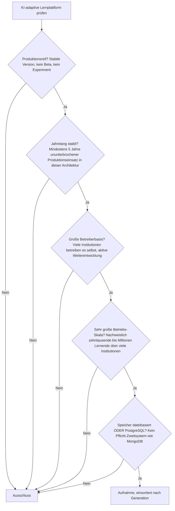
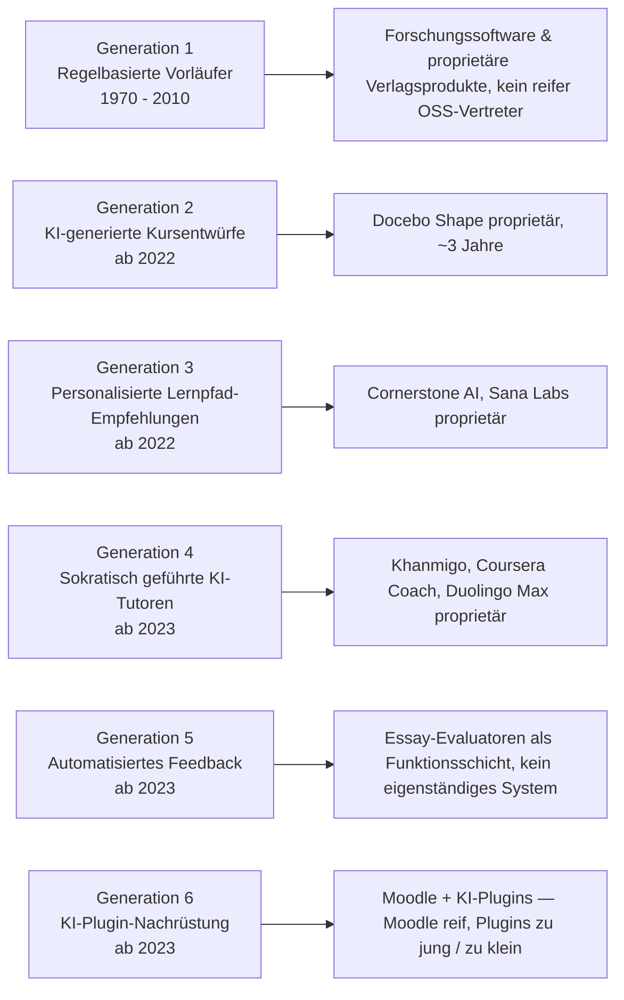
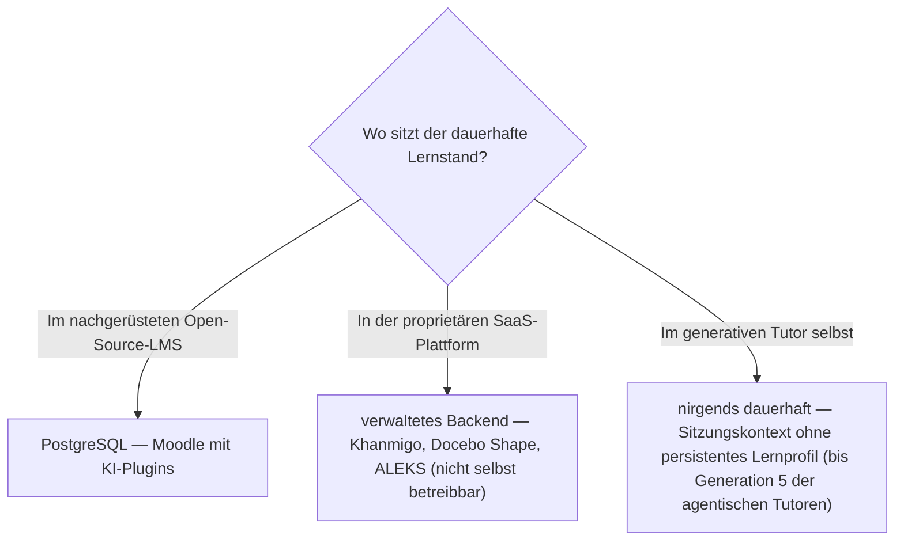

# Produktionsreife KI-adaptive Lernplattformen nach Generation — Reifegrad, Evaluation & Betriebs-Skala (kein Treffer — proprietäre SaaS-Kategorie)

Die [Evolution und Architekturen digitaler KI-adaptiver Lernplattformen](evolution-digitaler-ki-adaptive-lernplattformen.md) zoomt in Generation 4 der [übergeordneten LMS-Zeitachse](evolution-digitaler-lms.md) hinein und teilt die adaptive Linie in ein feineres Modell: regelbasierte Vorläufer (1), KI-generierte Kursentwürfe (2), personalisierte Lernpfad-Empfehlungen (3), sokratisch geführte KI-Tutoren (4), automatisiertes Feedback (5) und KI-Plugin-Nachrüstung bestehender Open-Source-LMS (6). Die [Topliste bester KI-adaptiver Lernplattformen 2026](ki-adaptive-lernplattformen-2026-topliste.md) rankt die gesamte Kategorie. Diese Seite legt dasselbe **konservative** Fünf-Filter-Sieb an wie die [allgemeine](produktionsreife-lms-generationen-2026-topliste.md), die [klassische](produktionsreife-klassische-lms-generationen-2026-topliste.md), die [Cloud-](produktionsreife-cloud-lms-generationen-2026-topliste.md), die [Rust-](produktionsreife-rust-lms-generationen-2026-topliste.md) und die [interoperable Schwesterseite](produktionsreife-interoperable-lms-generationen-2026-topliste.md) — produktionsreif · jahrelang stabil · große Betreiberbasis · sehr große Betriebs-Skala · Speicher dateibasiert oder PostgreSQL —, hier für die *KI-adaptive Linie* und nach deren feinerem Generationenmodell sortiert.

!!! warning "Achtung: Keine KI-adaptive Lernplattform besteht alle fünf Filter"
    Die Kategorie ist strukturell filterfeindlich. Ihr generativer Kern ist erst seit 2022 real (**unter fünf Jahre**), und sie ist **fast vollständig proprietäres SaaS** — Khanmigo, Duolingo Max, Coursera Coach, Sana Labs, Docebo Shape, Cornerstone AI, ALEKS, Carnegie Learning, Century Tech, Squirrel AI, Knewton, Claude for Education, Microsoft Copilot in Education, Google-LearnLM-Produkte: kein einziger dieser 15 Ränge ist selbst betreibbar. Die **vor-generative Tradition** (intelligente tutorielle Systeme, Computerized Adaptive Testing, Knewton) ist alt genug, brachte aber nie ein quelloffenes System mit großer Betreiberbasis hervor — sie lebte in Forschungssoftware und proprietären Verlagsprodukten. Der **einzige quelloffene Pfad** ist die Nachrüstung: **Moodle mit KI-Plugins** — und das ist Moodle (bereits auf der [allgemeinen Schwesterseite](produktionsreife-lms-generationen-2026-topliste.md)) plus Plugins, die die Fünf-Jahres- und Skala-Marke reißen. Dieselbe Struktur wie bei [autonomen KI-Agenten](../../künstliche-intelligenz/produktionsreife-autonome-ki-agenten-generationen-2026-topliste.md) und [RAG-Werkzeug-Anwendungen](../../künstliche-intelligenz/produktionsreife-rag-werkzeug-anwendungen-generationen-2026-topliste.md).

---

## Die fünf harten Filter

!!! note "Hinweis: nur OSI-Lizenzen, nur selbst betreibbare Systeme"
    Aufgenommen werden Systeme unter OSI-anerkannter Lizenz, die man selbst betreiben kann. Das schließt die gesamte Basis-Topliste bis auf einen Eintrag aus — **Khanmigo**, **Duolingo Max**, **Coursera Coach**, **Sana Labs**, **Docebo Shape**, **Cornerstone AI**, **ALEKS**, **Carnegie Learning**, **Century Tech**, **Squirrel AI**, **Knewton**, **Claude for Education**, **Microsoft Copilot in Education**, **Google-LearnLM-Produkte**. Eine bildungsspezifisch feinabgestimmte, aber proprietäre LLM-Konfiguration ist kein selbst betreibbares System, auch wenn das Basismodell teilweise offen ist.

---

## Ergebnis: kein Treffer über sechs Generationsstufen

---

## Warum keine Generation einen Treffer liefert

### Generation 1 — Regelbasierte Vorläufer adaptiven Lernens (1970 – 2010)

Die einzige Generation, die die Fünf-Jahres-Marke mühelos besteht — intelligente tutorielle Systeme seit den 1970ern, Computerized Adaptive Testing seit den 1990ern. Aber sie hinterließ **kein quelloffenes Produktionssystem mit großer Betreiberbasis**: Die ITS-Tradition lebte in universitärer Forschungssoftware (Cognitive Tutor / Carnegie Learning wurde kommerzialisiert), CAT steckt in proprietären Prüfungsplattformen der Testverlage, und **Knewton** — der prägende Pionier — ist heute ein geschlossenes Wiley-Produkt. Reife ja, Offenheit und selbst betreibbare Skala nein.

### Generation 2 — KI-generierte Kursentwürfe (ab 2022)

**Docebo Shape** generiert Kursentwürfe aus vorhandenen Dokumenten — proprietäre Funktion einer proprietären LXP, zudem erst ~3 Jahre alt. Quelloffene Kursgenerierung existiert nur als Skript-Ebene über allgemeinen LLM-Frameworks, nicht als betriebenes System.

### Generation 3 — Personalisierte Lernpfad-Empfehlungen (ab 2022)

**Cornerstone AI** und **Sana Labs** liefern Skill-Erkennung und generativ begründete Lernpfad-Vorschläge im Enterprise-Kontext — beide proprietär, beide gehostet. Die vor-generative Empfehlungslogik (Generation 1c) hatte quelloffene Bausteine (klassische Recommender), aber keine LMS-spezifische Plattform, die das Sieb besteht.

### Generation 4 — Sokratisch geführte KI-Tutoren (ab 2023)

Die sichtbarste Generation — **Khanmigo**, **Coursera Coach**, **Duolingo Max** — und die mit der größten kombinierten Nutzerzahl. Alle drei proprietär, alle drei erst seit 2023. Die sokratische Verweigerungslogik selbst ist ein Prompt-Muster, kein Baustein.

### Generation 5 — Automatisiertes Feedback & Bewertungshilfen (ab 2023)

Essay-Evaluatoren und Bewertungshilfen sind **Funktionsschichten** innerhalb eines LMS oder eines Autorenwerkzeugs, kein eigenständig betreibbares System mit eigener Betreiberbasis und Skala. Sie werden auf der [allgemeinen LMS-Seite](produktionsreife-lms-generationen-2026-topliste.md) als Moodle-Nachrüstung geführt.

### Generation 6 — KI-Plugin-Nachrüstung bestehender Open-Source-LMS (ab 2023)

Der einzige quelloffene Pfad und zugleich der ehrlichste: **Moodle** ist reif, breit betrieben, PostgreSQL-fähig — besteht das Sieb, aber als Generation-1b-LMS auf der [allgemeinen Schwesterseite](produktionsreife-lms-generationen-2026-topliste.md#generation-1b-vernetzte-web-lms-scorm-ara-ca-1990-2005), nicht als KI-adaptive Plattform. Die **KI-Plugins** (Essay-Evaluator, Tutor-Blöcke, LLM-Anbindungen) sind seit 2023 verfügbar — unter fünf Jahre, wechselnde Maintainer, keine nachweisbare Skala über viele Institutionen. Die Kombination „reifes LMS + junges Plugin" erbt die Schwäche des jüngeren Teils.

---

## Dateibasiert oder PostgreSQL?

Die Frage ist auf dieser Seite fast gegenstandslos: Es gibt kein selbst betreibbares System, dessen Speicher man prüfen könnte. Für den einen quelloffenen Pfad gilt das eindeutige Ergebnis der [allgemeinen LMS-Schwesterseite](produktionsreife-lms-generationen-2026-topliste.md#dateibasis-oder-postgresql-die-antwort-ist-eindeutig).

- **Moodle mit KI-Plugins** speichert Lernstand, Noten und Feedback in **PostgreSQL** — dieselbe transaktionale System-of-Record-Anforderung wie bei jedem LMS.
- Die proprietären Plattformen halten das adaptive Lernprofil in verwalteten, nicht einsehbaren Backends.
- Ein reiner sokratischer Tutor ohne Langzeitgedächtnis hält gar keinen dauerhaften Zustand — das persistente Lernfortschritts-Gedächtnis ist erst Thema der [agentischen Tutor-Ökosysteme](produktionsreife-agentische-tutor-oekosysteme-generationen-2026-topliste.md).

Vertiefung zur Datenbankschicht: [PostgreSQL DBA Praxis-Handbuch](../../entwicklung/infrastruktur/postgresql-dba-praxis.md).

!!! warning "Achtung: Momentaufnahme, Stand August 2026"
    Erreicht ein quelloffener KI-adaptiver Stack (am ehesten ein etabliertes Moodle-KI-Plugin-Bündel) die Fünf-Jahres-Marke mit nachweisbarer Betreiberbasis, bekommt diese Seite ihren ersten Treffer — voraussichtlich in Generation 6, PostgreSQL-gestützt.

---

## Was bewusst nicht auf dieser Liste steht

| System | Erfüllt nicht | Anmerkung |
|---|---|---|
| **Moodle mit KI-Plugins** | Reifezeit der Plugin-Schicht | Moodle selbst besteht das Sieb (allgemeine Schwesterseite); die KI-Plugins sind seit 2023, ohne nachweisbare Skala über viele Institutionen |
| **Khanmigo, Coursera Coach, Duolingo Max** | Lizenz + Reifezeit | Proprietäre sokratische Tutoren, seit 2023 |
| **Docebo Shape, Cornerstone AI, Sana Labs** | Lizenzfilter | Proprietäre Enterprise-LXP-Funktionen |
| **ALEKS, Carnegie Learning, Century Tech, Squirrel AI** | Lizenzfilter | Proprietäre adaptive Plattformen verschiedener Bildungsmärkte |
| **Knewton** | Lizenzfilter | Historisch prägender Pionier, heute geschlossenes Wiley-Produkt |
| **Claude for Education, Microsoft Copilot in Education, Google-LearnLM-Produkte** | Lizenz + Kategorie | Proprietäre, bildungsspezifisch konfigurierte LLM-Angebote, keine selbst betreibbaren Lernplattformen |
| **Intelligente tutorielle Systeme / CAT (Generation 1)** | Betreiberbasis | Alt genug, aber nur als Forschungssoftware und in proprietären Testverlags-Plattformen realisiert |

---

## 🔗 Verwandte Themen

- [Evolution und Architekturen digitaler KI-adaptiver Lernplattformen](evolution-digitaler-ki-adaptive-lernplattformen.md) — das feinere Generationenmodell der adaptiven Linie, nach dem diese Liste sortiert ist
- [Beste KI-adaptive Lernplattformen 2026 (Top 15)](ki-adaptive-lernplattformen-2026-topliste.md) — breiteste Basis-Topliste inklusive proprietärer SaaS-Plattformen
- [Produktionsreife Open-Source-LMS nach Generation (Top 2 + Grenzfälle)](produktionsreife-lms-generationen-2026-topliste.md) — allgemeine Schwesterseite; dort besteht Moodle, das man um KI-Funktionen nachrüstet
- [Produktionsreife interoperable LMS-Bausteine nach Generation (kein Treffer)](produktionsreife-interoperable-lms-generationen-2026-topliste.md) — vorausgehende Generation, ebenfalls ohne Treffer
- [Produktionsreife agentische Tutor-Ökosysteme nach Generation (kein Treffer)](produktionsreife-agentische-tutor-oekosysteme-generationen-2026-topliste.md) — nachfolgende Generation, ebenfalls ohne Treffer
- [Produktionsreife autonome KI-Agenten nach Generation (kein Treffer)](../../künstliche-intelligenz/produktionsreife-autonome-ki-agenten-generationen-2026-topliste.md) — dieselbe strukturelle Aussage für die allgemeine Agenten-Kategorie: zu jung + proprietär dominiert
- [KI in Lehre, Weiterbildung und Training](ki-lehre-weiterbildung.md) — wie man Generation 4–6 praktisch auf Moodle nachrüstet
- [PostgreSQL DBA Praxis-Handbuch](../../entwicklung/infrastruktur/postgresql-dba-praxis.md) — Datenbankschicht hinter dem einzigen quelloffenen Pfad
