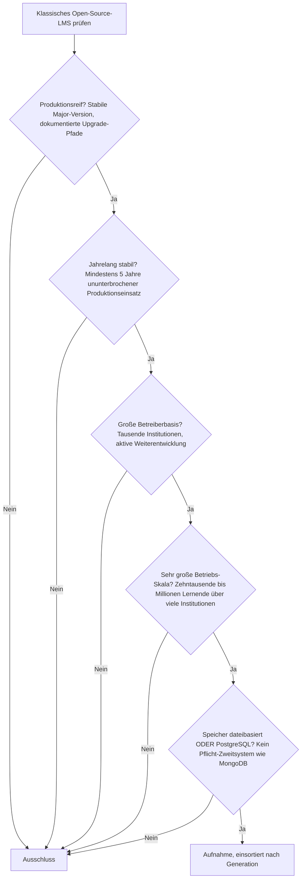
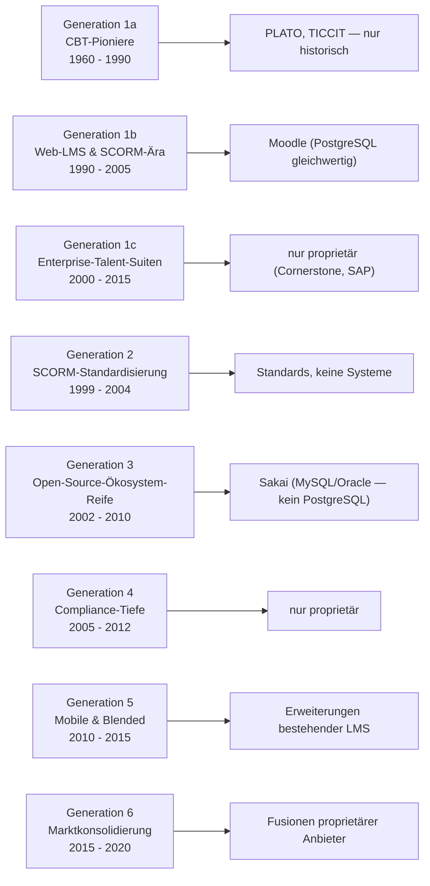

# Produktionsreife klassische Open-Source-LMS nach Generation — Reifegrad, Evaluation & Betriebs-Skala (Top 1)

Die [Evolution und Architekturen digitaler klassischer LMS](evolution-digitaler-klassische-lms.md) zoomt in Generation 1 der [übergeordneten LMS-Zeitachse](evolution-digitaler-lms.md) hinein und teilt die monolithische Architekturlinie in ein feineres Modell: CBT-Pioniere (1a), vernetzte Web-LMS der SCORM-Ära (1b), Enterprise-Talent-Suiten (1c), SCORM-Standardisierung (2), Open-Source-Ökosystem-Reife (3), Compliance-Tiefe (4), Mobile-/Blended-Erweiterungen (5) und Marktkonsolidierung (6). Die [Topliste bester klassischer LMS 2026](klassische-lms-2026-topliste.md) rankt die gesamte Kategorie. Diese Seite legt dasselbe **konservative** Fünf-Filter-Sieb an wie die [allgemeine LMS-Schwesterseite](produktionsreife-lms-generationen-2026-topliste.md) — produktionsreif · jahrelang stabil · große Betreiberbasis · sehr große Betriebs-Skala · Speicher dateibasiert oder PostgreSQL —, hier aber nur für die *klassische* Architekturlinie und nach deren feinerem Generationenmodell sortiert.

!!! warning "Achtung: Genau ein Treffer — Moodle — und der Rest der Linie zerfällt in zwei Sackgassen"
    Nur **Moodle** besteht alle fünf Filter. Die klassische LMS-Linie teilt sich sauber: Die **Enterprise-Talent-Suiten-Hälfte** (Generation 1c, 4, 6 — Cornerstone, SAP SuccessFactors, Saba) ist **vollständig proprietär**. Die **quelloffene Hälfte** (Sakai, ILIAS, Chamilo) ist reif und breit betrieben, aber **fest an MySQL/MariaDB gebunden** und fällt am Speicherfilter. Moodle ist das einzige klassische LMS, das quelloffen *und* auf PostgreSQL gleichwertig lauffähig ist ([Speicher-Fazit](#dateibasiert-oder-postgresql)). SCORM 1.2/2004 und AICC sind Standards, keine Systeme.

---

## Die fünf harten Filter

!!! note "Hinweis: nur OSI-Lizenzen, nur die klassische Linie"
    Aufgenommen werden Systeme unter OSI-anerkannter Lizenz — das schließt **Blackboard Learn**, **D2L Brightspace**, **Cornerstone OnDemand**, **SAP SuccessFactors Learning**, **Absorb LMS** und **iSpring Learn** aus. Cloud-native Systeme (**Canvas LMS**, das auf der allgemeinen Schwesterseite Generation 2 vertritt) gehören nicht zur *klassischen* Linie und werden hier nicht geführt. SCORM 1.2/2004 und AICC sind Content-Standards, keine LMS.

---

## Ergebnis: ein System über acht Generationsstufen

---

## Systeme nach Generation

### Generation 1b — Vernetzte Web-LMS & SCORM-Ära (ca. 1990 – 2005)

| # | System | Speicher | Lizenz | Seit | Skala-Nachweis | Betreiberbasis |
|---|---|---|---|---|---|---|
| 1 | **Moodle** | PostgreSQL **oder** MySQL/MariaDB, offiziell gleichwertig | GPL-3.0-or-later | 2002 | Nationale Bildungs-Deployments und Großuniversitäten mit Millionen Lernenden; moodle.org selbst läuft auf PostgreSQL | Mit Abstand größte Betreiberbasis aller LMS, hauptamtliches Kernteam plus riesiges Plugin- und Partner-Ökosystem |

**Moodle** ist der einzige Treffer — und ein sehr klarer: über zwei Jahrzehnte Produktionshistorie, Skalierung bis in den Millionenbereich, vollständige SCORM-/xAPI-/LTI-Unterstützung über Kern und Plugins. Entscheidend für den Speicherfilter: PostgreSQL ist eine **gleichwertige, offiziell dokumentierte** Backend-Wahl, kein nachträglich angeflanschter Sonderfall. Über das Plugin-Ökosystem (Generation 3) deckt Moodle inzwischen auch Compliance-Tiefe, Mobile und KI-Adaptivität ab, ohne die monolithische Architektur zu verlassen. Vertiefung: [Evolution und Architekturen von Moodle](../dokumentation/moodle/evolution-digitaler-moodle.md), Installation: [Moodle installieren](../dokumentation/moodle/installieren.md).

### Generation 1a, 1c, 2 – 6 — warum hier nichts steht

- **Generation 1a (CBT-Pioniere)**: **PLATO** (1960) und **TICCIT** sind die konzeptionellen Wurzeln — integrierte Foren, Nachrichten, lineares Tracking —, aber seit Jahrzehnten nicht mehr betrieben.
- **Generation 1c & 4 & 6 (Enterprise-Talent-Suiten, Compliance, Konsolidierung)**: **Cornerstone OnDemand**, **SAP SuccessFactors Learning**, **Saba** — sämtlich proprietär. Diese Hälfte der klassischen Linie hatte nie einen quelloffenen Vertreter; die Konsolidierung 2015–2020 (Cornerstone übernimmt Saba) verringerte die Anbieterzahl zusätzlich.
- **Generation 2 (SCORM-Standardisierung)**: **SCORM 1.2**, **SCORM 2004** und **AICC** sind Content-Austauschstandards, keine LMS. SCORM bleibt 2026 der De-facto-Interoperabilitäts-Baustein praktisch jedes klassischen LMS.
- **Generation 3 (Open-Source-Ökosystem-Reife)**: **Sakai** (Apereo Foundation, seit 2004, Hochschulkonsortien) ist voll qualifiziert bei Reife, Betreiberbasis und Skala — unterstützt aber offiziell nur MySQL und Oracle, **kein PostgreSQL**. Damit fällt es am Speicherfilter, ebenso **ILIAS** (seit 1998, sicherheitsauditiert, DACH-Behörden/Hochschulen) und **Chamilo** (frankophoner Raum, Lateinamerika) — alle drei reif, alle drei MySQL/MariaDB-only.
- **Generation 5 (Mobile & Blended)**: Companion-Apps und ILT-Verwaltung sind Erweiterungen bestehender LMS, keine eigenständigen Systeme.

---

## Dateibasiert oder PostgreSQL?

Die Antwort ist dieselbe wie auf der [allgemeinen LMS-Schwesterseite](produktionsreife-lms-generationen-2026-topliste.md#dateibasis-oder-postgresql-die-antwort-ist-eindeutig): **PostgreSQL**, und ein dateibasiertes klassisches LMS im Produktionsmaßstab existiert nicht.

- Ein LMS ist ein **transaktionales System of Record**: gleichzeitige Abgaben, Noten, die weder verloren gehen noch doppelt zählen dürfen, revisionssichere Prüfungsdaten. Das verlangt eine relationale Datenbank mit Transaktions-, Sperr- und Integritätsmechanik.
- Für klassische Open-Source-LMS heißt „PostgreSQL" konkret: **Moodle** — und sonst nichts. **Sakai**, **ILIAS** und **Chamilo** sind gleichwertig reif, aber auf MySQL/MariaDB festgelegt; wer MySQL akzeptiert, gewinnt drei weitere reife Optionen, verlässt aber den Speicherfilter dieser Familie.
- Dateibasiert sein kann nur der Lern**inhalt** (SCORM-Pakete, statische Kurs-Sites, Git-verwaltete Kursquellen) — nicht das LMS selbst, sobald Einschreibung, Bewertung oder Zertifikate hinzukommen.

Vertiefung zur Datenbankschicht: [PostgreSQL DBA Praxis-Handbuch](../../entwicklung/infrastruktur/postgresql-dba-praxis.md).

!!! warning "Achtung: Momentaufnahme, Stand August 2026"
    Datenbank-Unterstützung ändert sich mit Major-Releases — sollte eines von Sakai, ILIAS oder Chamilo offiziellen PostgreSQL-Support aufnehmen, verdreifacht sich diese Liste. Moodle ist die stabile Konstante.

---

## Was bewusst nicht auf dieser Liste steht

| System | Erfüllt nicht | Anmerkung |
|---|---|---|
| **Sakai** | Speicherfilter | Nur MySQL und Oracle, kein PostgreSQL-Support; ansonsten voll qualifiziert (Apereo Foundation, seit 2004, Hochschulkonsortien) |
| **ILIAS** | Speicherfilter | Nur MySQL/MariaDB — seit 1998, sicherheitsauditiert, breite DACH-Behörden-/Hochschulnutzung |
| **Chamilo** | Speicherfilter | Nur MySQL/MariaDB; große Basis im frankophonen Raum und in Lateinamerika |
| **Blackboard Learn, D2L Brightspace, Cornerstone OnDemand, SAP SuccessFactors Learning, Saba, Absorb LMS, iSpring Learn** | Lizenzfilter | Proprietäre Enterprise-/SaaS-Plattformen |
| **Moodle Workplace** | Lizenzfilter | Kommerzielle, nicht frei lizenzierte Moodle-Erweiterung |
| **SCORM 1.2 / SCORM 2004 / AICC** | Kategorie | Content-Austauschstandards, keine LMS |
| **PLATO, TICCIT, WebCT** | Betriebs-Skala | Historische Generation-1a/1b-Wegbereiter ohne aktive Nutzung |

---

## 🔗 Verwandte Themen

- [Evolution und Architekturen digitaler klassischer LMS](evolution-digitaler-klassische-lms.md) — das feinere Generationenmodell der klassischen Linie, nach dem diese Liste sortiert ist
- [Beste klassische LMS 2026 (Top 15)](klassische-lms-2026-topliste.md) — breiteste Basis-Topliste inklusive proprietärer und historischer Systeme
- [Produktionsreife Open-Source-LMS nach Generation (Top 2 + Grenzfälle)](produktionsreife-lms-generationen-2026-topliste.md) — allgemeine Schwesterseite über alle fünf LMS-Generationen; dort kommt Canvas LMS als Generation-2-Treffer hinzu
- [Produktionsreife Cloud-LMS & LXP nach Generation (Top 1)](produktionsreife-cloud-lms-generationen-2026-topliste.md) — Schwesterseite für die nachfolgende, Cloud-native Generation; dort ist Canvas LMS der einzige Treffer
- [Produktionsreife Rust-Bausteine für LMS nach Generation (Top 2)](produktionsreife-rust-lms-generationen-2026-topliste.md) — Schwesterseite für die quer liegende Rust-Implementierungsachse
- [Produktionsreife interoperable LMS-Bausteine nach Generation (kein Treffer)](produktionsreife-interoperable-lms-generationen-2026-topliste.md) — Schwesterseite für die Interoperabilitäts-Linie
- [Produktionsreife KI-adaptive Lernplattformen nach Generation (kein Treffer)](produktionsreife-ki-adaptive-lernplattformen-generationen-2026-topliste.md) — Schwesterseite für die KI-adaptive Linie
- [Produktionsreife agentische Tutor-Ökosysteme nach Generation (kein Treffer)](produktionsreife-agentische-tutor-oekosysteme-generationen-2026-topliste.md) — Schwesterseite für die agentische Linie
- [Evolution und Architekturen von Moodle](../dokumentation/moodle/evolution-digitaler-moodle.md) — vertiefend zum einzigen Treffer
- [Moodle installieren (Git, PostgreSQL, Nginx)](../dokumentation/moodle/installieren.md) — Installation auf dem Speicherfilter-Backend
- [Produktionsreife Open-Source-CMS nach Generation (Top 12)](../dokumentation/produktionsreife-cms-generationen-2026-topliste.md) — Schwesterseite mit demselben Fünf-Filter-Sieb
- [PostgreSQL DBA Praxis-Handbuch](../../entwicklung/infrastruktur/postgresql-dba-praxis.md) — Datenbankschicht hinter dem Treffer
