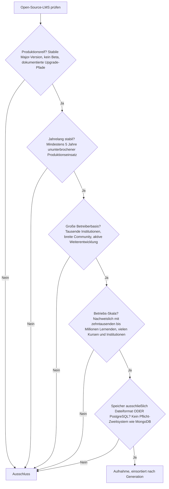
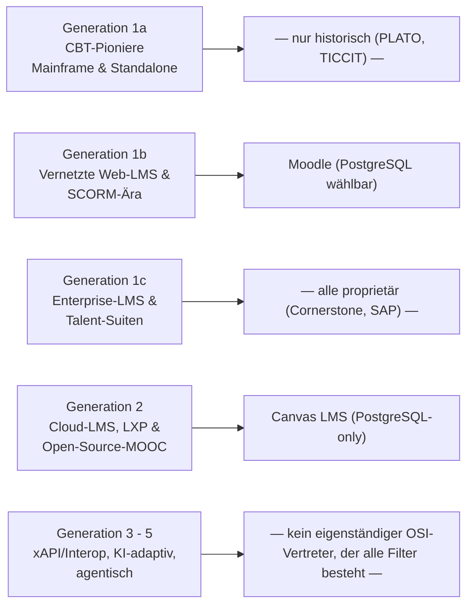
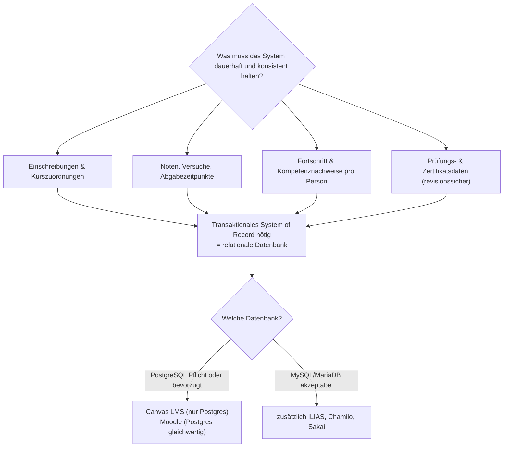

# Produktionsreife Open-Source-LMS nach Generation — Reifegrad, Evaluation & Betriebs-Skala (Top 2 + Grenzfälle)

Die [Evolution und Architekturen digitaler Lernmanagement-Systeme](evolution-digitaler-lms.md) ordnet die LMS-Klasse chronologisch in fünf technologische Generationen, die [Topliste bester LMS 2026](lms-2026-topliste.md) rankt die gesamte Kategorie nach Verbreitung. Diese Seite kombiniert — parallel zu den Schwesterseiten für [Wissenssysteme](../dokumentation/produktionsreife-wissenssysteme-generationen-2026-topliste.md) und [CMS](../dokumentation/produktionsreife-cms-generationen-2026-topliste.md) — Reife, Evaluation, Skala und Speicherbackend zu einem bewusst **konservativen** Sieb und sortiert nach Generation.

!!! warning "Achtung: Das Ergebnis ist ungewöhnlich kurz — und das ist die eigentliche Aussage"
    Von allen drei Schwesterlisten fällt die LMS-Variante am knappsten aus: **Nur zwei Open-Source-LMS bestehen alle fünf Filter — Moodle und Canvas LMS.** Fast die gesamte übrige Open-Source-LMS-Welt (ILIAS, Chamilo, Sakai) ist fest an MySQL/MariaDB gebunden, und Open edX benötigt zusätzlich MongoDB. Ein rein **dateibasiertes** LMS im Produktionsmaßstab gibt es nicht — die Gründe dafür stehen im [Speicher-Fazit](#dateibasis-oder-postgresql-die-antwort-ist-eindeutig).

---

## Die fünf harten Filter

!!! note "Hinweis: Nur OSI-anerkannte Lizenzen"
    Wie in der [Gesamtübersicht](../dokumentation/open-source-llm-agent-mcp-systeme.md) zählen hier ausschließlich Systeme unter einer OSI-anerkannten Open-Source-Lizenz. Das kostet die Liste alle marktprägenden SaaS-Systeme der [Basis-Topliste](lms-2026-topliste.md): Blackboard Learn, D2L Brightspace, Cornerstone OnDemand, SAP SuccessFactors Learning, Docebo, 360Learning, Google Classroom, LinkedIn Learning, Khanmigo, Coursera.

---

## Ergebnis: zwei Systeme, beide datenbankgestützt

---

## Systeme nach Generation

### Generation 1b — Vernetzte Web-LMS & SCORM-Ära (ca. 1990 – 2005)

| # | System | Speicher | Lizenz | Seit | Skala-Nachweis | Betreiberbasis |
|---|---|---|---|---|---|---|
| 1 | **[Moodle](evolution-digitaler-klassische-lms.md)** | PostgreSQL oder MySQL/MariaDB offiziell gleichwertig | GPL-3.0-or-later | 2002 | Nationale Bildungs-Deployments und Großuniversitäten mit Millionen Lernenden | Mit Abstand größte Betreiberbasis aller LMS, hauptamtliches Kernteam plus riesiges Plugin- und Partner-Ökosystem |

**Moodle** ist die klare Nummer 1 und das einzige LMS mit großer Betreiberbasis, bei dem PostgreSQL eine **gleichwertige, offiziell dokumentierte** Backend-Wahl ist — nicht ein nachträglich angeflanschter Sonderfall (moodle.org selbst läuft auf PostgreSQL). Zwei Jahrzehnte Produktionshistorie, Skalierung bis in den Millionenbereich, vollständige SCORM-/xAPI-/LTI-Unterstützung über den Kern und Plugins. Vertiefend: [Evolution und Architekturen von Moodle](../dokumentation/moodle/evolution-digitaler-moodle.md), Installation: [Moodle installieren](../dokumentation/moodle/installieren.md).

### Generation 2 — Cloud-native LMS, LXP & Open-Source-MOOC (ca. 2011 – 2021)

| # | System | Speicher | Lizenz | Seit | Skala-Nachweis | Betreiberbasis |
|---|---|---|---|---|---|---|
| 2 | **Canvas LMS** (Instructure) | **Ausschließlich PostgreSQL** — keine andere Datenbank unterstützt | AGPL-3.0 | 2011 | Dominierend im nordamerikanischen Hochschulmarkt, Instructure-Cloud mit Millionen aktiver Nutzer | Große Hochschul-Basis; die selbst gehostete Open-Source-Variante ist kleiner, aber produktionserprobt |

**Canvas LMS** ist das reinste „PostgreSQL statt Auswahl"-Beispiel der drei Schwesterlisten: Es unterstützt **keine** andere Datenbank. Wer ein LMS explizit auf PostgreSQL betreiben will, bekommt hier ein von Grund auf API-first konzipiertes System mit hoher Usability. Die AGPL-3.0-Lizenz und der Umstand, dass der Hauptentwickler Instructure zugleich die kommerzielle Cloud betreibt, sind vor einer Self-Hosting-Entscheidung zu bewerten — der Kern ist aber uneingeschränkt offen.

### Generation 1c & Generation 3 – 5 — warum hier nichts steht

- **Generation 1c (Enterprise-Talent-Suiten)**: Cornerstone OnDemand, SAP SuccessFactors Learning, Saba — sämtlich proprietär, Lizenzfilter.
- **Generation 3 (xAPI / Interoperabilität)**: Learning Record Stores wie Learning Locker laufen auf MongoDB; xAPI/LTI selbst sind Standards, keine LMS.
- **Generation 4 – 5 (KI-adaptiv, agentisch)**: Khanmigo, Coursera Coach, Docebo Shape sind proprietäre Funktionsschichten; quelloffene agentische Tutor-Stacks sind zu jung für die Fünf-Jahres-Marke. In der Praxis erreicht man Generation 4 heute, indem man **Moodle mit KI-Plugins** nachrüstet — siehe [KI in Lehre, Weiterbildung und Training](ki-lehre-weiterbildung.md).

### Quer zu den Generationen — dateibasierte Kursinhalte

Was dateibasiert sein **kann**, ist der Lern**inhalt**, nicht das LMS:

| Ansatz | Was dateibasiert ist |
|---|---|
| **SCORM-/cmi5-Pakete auf der Platte** | Der Kurs-Container (ZIP mit HTML/JS) liegt im Dateisystem; Fortschritt/Noten trackt trotzdem die LMS-Datenbank |
| **Statische Kurs-Sites** (Hugo/Zensical + Git) | Reines Selbstlern-Material ohne Einschreibung, Bewertung oder Zertifikat — kein LMS im engeren Sinn |
| **Git-verwaltete Kursquellen** (Open edX OLX, Markdown-Kurse) | Autoren-Quellformat; zur Auslieferung wird es in die LMS-Datenbank importiert |

Für reine, unbewertete Selbstlern-Inhalte ist ein Static-Site-Generator die betriebsärmste Lösung — sobald aber Einschreibung, Fortschritt, Bewertung oder Zertifikate dazukommen, braucht es ein datenbankgestütztes LMS.

---

## Dateibasis oder PostgreSQL? — Die Antwort ist eindeutig

**PostgreSQL. Ein dateibasiertes LMS ist im Produktionsmaßstab keine ernsthafte Option** — und der Grund ist strukturell, nicht eine Frage fehlender Projekte:

Ein LMS ist ein **transaktionales System of Record**: gleichzeitige Abgaben vieler Lernender, Noten, die nicht verloren gehen oder doppelt gezählt werden dürfen, revisionssichere Prüfungsdaten. Flache Dateien ohne Transaktions-, Sperr- und Integritätsmechanik können das nicht leisten — deshalb existiert kein dateibasiertes LMS mit großer Betreiberbasis.

**Konkret für Open Source heißt „PostgreSQL":**

- **PostgreSQL ist Pflicht** → **Canvas LMS** (unterstützt nur PostgreSQL) oder **Moodle** auf PostgreSQL.
- **MySQL/MariaDB ist auch akzeptabel** → dann öffnet sich das Feld zusätzlich zu **ILIAS** (sicherheitsauditiert, stark im deutschsprachigen Behörden- und Hochschulraum), **Chamilo** und **Sakai** — alle drei sind reif und breit betrieben, aber eben **nicht** auf PostgreSQL lauffähig.

Vertiefung zur Datenbankschicht: [PostgreSQL DBA Praxis-Handbuch](../../entwicklung/infrastruktur/postgresql-dba-praxis.md).

!!! warning "Achtung: Momentaufnahme, Stand August 2026"
    Datenbank-Unterstützung ändert sich mit Major-Releases. Vor dem Produktivstart die aktuelle Installationsdokumentation prüfen — insbesondere bei Open edX, dessen laufende „Learning Core"-Umstellung Kursinhalte schrittweise von MongoDB nach MySQL verschiebt.

---

## Was bewusst nicht auf dieser Liste steht

| System | Erfüllt nicht | Anmerkung |
|---|---|---|
| **ILIAS** | Speicherfilter | Nur MySQL/MariaDB — ansonsten voll qualifiziert: seit 1998, sicherheitsauditiert, breite Behörden-/Hochschulnutzung im DACH-Raum |
| **Chamilo** | Speicherfilter | Nur MySQL/MariaDB; große Basis im frankophonen Raum und in Lateinamerika |
| **Sakai** | Speicherfilter | Offiziell MySQL und Oracle, kein PostgreSQL-Support; Hochschulkonsortien-Fokus |
| **Open edX** | Pflicht-Zweitsystem | Benötigt neben MySQL zwingend MongoDB für den Kursinhalts-Speicher (Modulestore); „Learning Core"-Migration läuft, ist aber nicht abgeschlossen |
| **Moodle Workplace** | Lizenzfilter | Kommerzielle, nicht frei lizenzierte Erweiterung von Moodle |
| **Blackboard, D2L Brightspace, Cornerstone, SAP SF Learning, Docebo** | Lizenzfilter | Proprietäre SaaS-/Enterprise-Plattformen |
| **Khanmigo, Coursera Coach, Duolingo Max** | Lizenz + Reifezeit | Proprietäre KI-Tutor-Schichten der Generation 4, keine selbst betreibbaren LMS |

---

## 🔗 Verwandte Themen

- [E-Learning-Autorentools & Interaktive Lernumgebungen](index.md) — zurück zur E-Learning-Übersicht
- [Evolution und Architekturen digitaler Lernmanagement-Systeme (LMS)](evolution-digitaler-lms.md) — das fünfstufige Generationenmodell, nach dem diese Liste sortiert ist
- [Beste Lernmanagement-Systeme 2026 (Top 20)](lms-2026-topliste.md) — breiteste Basis-Topliste nach Verbreitung, inklusive proprietärer SaaS-Systeme
- [Beste klassische LMS 2026 (Top 15)](klassische-lms-2026-topliste.md) — Fokus auf Generation 1
- [Produktionsreife Open-Source-Wissenssysteme nach Generation (Top 12)](../dokumentation/produktionsreife-wissenssysteme-generationen-2026-topliste.md) — Schwester-Topliste mit demselben Fünf-Filter-Sieb für Wikis, PKM und RAG
- [Produktionsreife Open-Source-CMS nach Generation (Top 12)](../dokumentation/produktionsreife-cms-generationen-2026-topliste.md) — Schwester-Topliste mit demselben Sieb für Content-Management-Systeme
- [Produktionsreife Open-Source-Web-Frameworks & -Bibliotheken nach Generation](../../entwicklung/webentwicklung/produktionsreife-webframeworks-generationen-2026-topliste.md) — dasselbe Sieb für Web-Frameworks
- [KI in Lehre, Weiterbildung und Training](ki-lehre-weiterbildung.md) — wie man Generation 4 (KI-adaptiv) auf Moodle nachrüstet
- [Evolution und Architekturen von Moodle](../dokumentation/moodle/evolution-digitaler-moodle.md) — vertiefend zu Rang 1
- [PostgreSQL DBA Praxis-Handbuch](../../entwicklung/infrastruktur/postgresql-dba-praxis.md) — Datenbankschicht hinter beiden Rängen dieser Liste
- [Beste Static-Site- & Docs-Generatoren 2026 (Top 20)](../dokumentation/static-site-generatoren-2026-topliste.md) — die dateibasierte Option für reine, unbewertete Selbstlern-Inhalte
