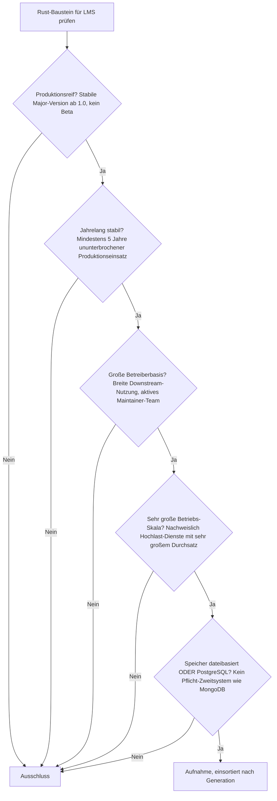
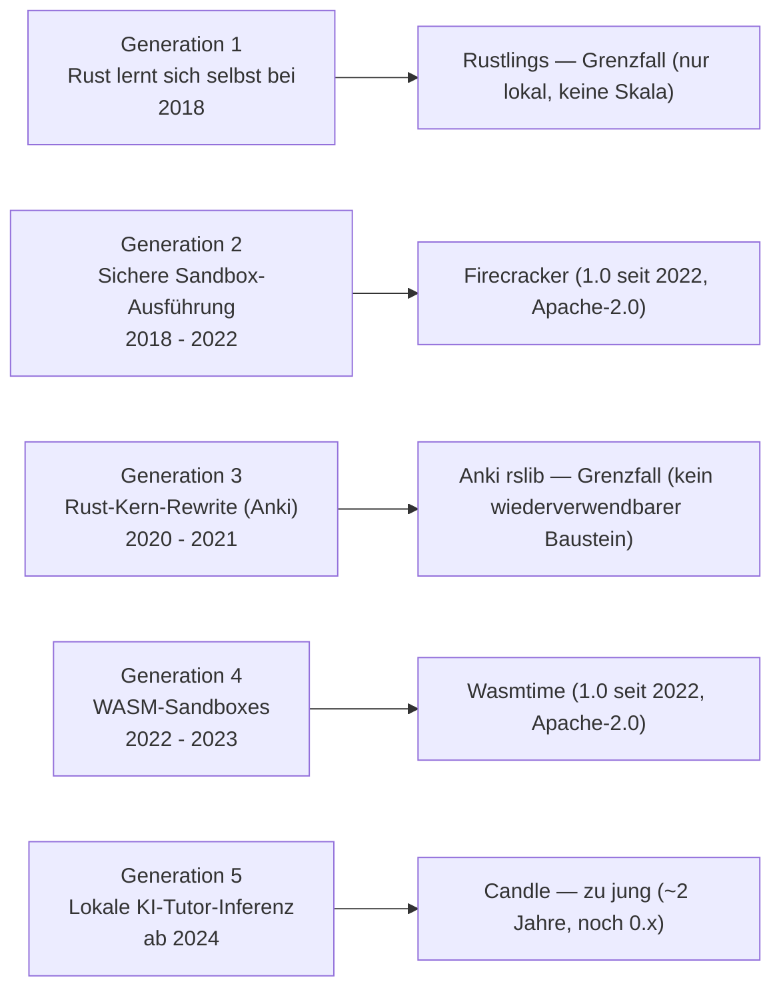
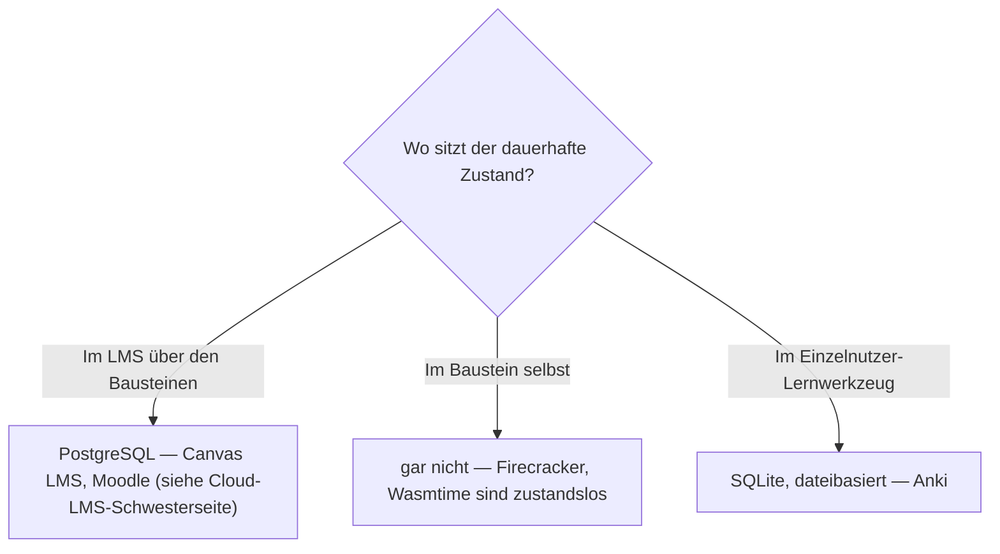

# Produktionsreife Rust-Bausteine für LMS nach Generation — Reifegrad, Evaluation & Betriebs-Skala (Top 2, beide domänenfremd)

Die [Evolution und Architekturen digitaler Rust-LMS](evolution-digitaler-rust-lms.md) verfolgt Rust nicht als eigene LMS-Produktklasse, sondern als **quer zu allen fünf LMS-Generationen liegende Implementierungsachse** — sichere Sandbox-Laufzeiten für Programmier-Übungen, der Kern etablierter Lernwerkzeuge, lokale KI-Tutor-Inferenz. Die [Topliste bester Rust-Bausteine für LMS 2026](rust-lms-2026-topliste.md) rankt diese Achse. Diese Seite legt dasselbe **konservative** Fünf-Filter-Sieb an wie die [allgemeine](produktionsreife-lms-generationen-2026-topliste.md), die [klassische](produktionsreife-klassische-lms-generationen-2026-topliste.md) und die [Cloud-LMS-Schwesterseite](produktionsreife-cloud-lms-generationen-2026-topliste.md) — produktionsreif · jahrelang stabil · große Betreiberbasis · sehr große Betriebs-Skala · Speicher dateibasiert oder PostgreSQL — und ist damit die e-learning-Parallele zur [Rust-Webframework-Variante](../../entwicklung/webentwicklung/produktionsreife-rust-webframeworks-generationen-2026-topliste.md). Sortiert nach Generation.

!!! warning "Achtung: Kein LMS-eigener Rust-Baustein besteht — nur zwei quer genutzte Infrastruktur-Bausteine"
    Anders als bei den Rust-Webframeworks (dort besteht mit **Actix-web** immerhin ein domäneneigenes Framework) gibt es hier **keinen einzigen Baustein, der *für* LMS entstanden ist und alle fünf Filter besteht**. Was besteht, ist ausgeliehene Infrastruktur: **Firecracker** (MicroVM-Sandbox, Generation 2) und **Wasmtime** (WASM-Laufzeit, Generation 4) — beide seit Jahren bei 1.0 und in gigantischer Produktions-Skala, beide von LMS-Plattformen für sichere Code-Ausführung eingebettet. **Rustlings** läuft nur lokal (keine betriebene Skala), **Candle** und **E2B** sind zu jung, Ankis `rslib` ist kein wiederverwendbarer Baustein. Der Speicherfilter ist hier — wie bei [Systemprogrammierungs-Werkzeugen](../../entwicklung/system/produktionsreife-interpreter-werkzeuge-generationen-2026-topliste.md) — strukturell bedeutungslos („Code rein, Ergebnis raus"); die siebende Achse ist **stabile 1.0 plus fünf Jahre Produktion** ([Speicher-Fazit](#dateibasiert-oder-postgresql)).

---

## Die fünf harten Filter

!!! note "Hinweis: „Baustein für LMS" ist hier weit gefasst"
    Aufgenommen wird, was 2026 produktiv in Lernkontexten eingebettet ist — auch wenn der Baustein ursprünglich für einen anderen Zweck (Serverless-Computing, Edge-Funktionen) entstand. Alle Kandidaten stehen unter permissiver Lizenz (Apache-2.0). Fertige LMS-Produkte ranken die [allgemeine LMS-Topliste](produktionsreife-lms-generationen-2026-topliste.md) und die Basis-Topliste; diese Seite bleibt auf der Bauteil-Ebene.

---

## Ergebnis: zwei Infrastruktur-Bausteine über fünf Generationsstufen

---

## Systeme nach Generation

### Generation 2 — Sichere Sandbox-Ausführung für automatisch bewertete Programmier-Übungen (2018 – 2022)

| # | System | Speicher | Lizenz | Major seit | Skala-Nachweis |
|---|---|---|---|---|---|
| 1 | **[Firecracker](evolution-digitaler-rust-lms.md#generation-2-sichere-sandbox-ausfuhrung-fur-automatisch-bewertete-programmier-ubungen-2018-2022)** (AWS) | keine Persistenzschicht — VMM, „Code rein, Ergebnis raus" | Apache-2.0 | 1.0 im Januar 2022, aktuell 1.x | Trägt AWS Lambda und Fargate seit 2018 (Billionen Aufrufe); dazu Fly.io und eine wachsende Zahl an Coding-Übungs- und KI-Tutor-Plattformen |

**Firecracker** ist der klare Treffer: Rust-natives MicroVM-Tool, seit 2018 bei AWS im Produktionseinsatz, seit 2022 bei stabiler 1.0. Es liefert die Referenz-Isolation für das Grundproblem jeder eingebetteten Programmier-Übung — fremden, potenziell böswilligen Code schnell *und* streng isoliert ausführen. In Lernkontexten steckt es meist unsichtbar unter einer Sandbox-als-Service-Schicht (E2B) oder direkt unter einer Cloud-Coding-Plattform. Der Speicherfilter greift nicht: Ein VMM hält keinen dauerhaften Zustand.

### Generation 4 — WASM-Sandboxes für browserbasierte Code-Ausführung (2022 – 2023)

| # | System | Speicher | Lizenz | Major seit | Skala-Nachweis |
|---|---|---|---|---|---|
| 2 | **[Wasmtime](evolution-digitaler-rust-lms.md#generation-4-wasm-sandboxes-fur-browserbasierte-code-ausfuhrung-ohne-server-roundtrip-2022-2023)** (Bytecode Alliance) | keine Persistenzschicht — Bytecode-Laufzeit | Apache-2.0 (mit LLVM-Ausnahme) | 1.0 im September 2022, aktuell übernimmt jährliche Major-Zyklen | Treibt Fastly Compute@Edge und Shopify Functions; dieselbe Laufzeit hinter browser- und edge-basierten Coding-Übungen ohne Server-Rundreise |

**Wasmtime** besteht dasselbe Sieb als zweiter Infrastruktur-Baustein: stabile 1.0 seit 2022, in Produktion seit den Lucet-Anfängen um 2020, sehr große Skala über Fastly und Shopify. Für Lernplattformen ist der Nutzen die Latenz — Übungsfeedback ohne Server-Roundtrip, weil der Code direkt im Browser oder am Edge in der WASM-Sandbox läuft. Wie Firecracker keine LMS-Neuentwicklung, sondern geteilte Infrastruktur (dieselbe Runtime auch in [Rust-CMS](../dokumentation/rust-cms-2026-topliste.md) und Composable-Commerce).

### Generation 1, 3 & 5 — warum hier nichts steht

- **Generation 1 (Rustlings)**: Das offizielle Rust-Übungsprojekt ist seit 2018 breit genutzt, hat aber **keine betriebene Skala** im Filtersinn — es läuft lokal auf der Maschine jeder lernenden Person, ohne Kursverwaltung, ohne Fortschritts-Datenbank, ohne institutionelles Deployment. Grenzfall an der Skala-Definition, kein Ausführungs-Baustein für Dritte.
- **Generation 3 (Anki `rslib`)**: Anki selbst ist überreif und millionenfach genutzt, der Rust-Kern (`rslib`) übernimmt seit 2020 Scheduler und Synchronisation, die Persistenz ist **SQLite — also dateibasiert**. Aber `rslib` ist **kein wiederverwendbarer Baustein**: Es ist Ankis interner Kern, nicht als Bibliothek für andere Lernsysteme gedacht oder gepflegt. Als Rust-Baustein *für LMS* fällt es damit heraus; als Lernwerkzeug mit Rust-Kern ist es ein Grenzfall.
- **Generation 5 (Candle)**: Die Rust-native Inferenz-Bibliothek von Hugging Face ist erst seit 2024 relevant (~2 Jahre) und steht bei `0.x` — reißt die Fünf-Jahres- und die 1.0-Marke klar. Interessanter, aber verfrühter Kandidat.

---

## Dateibasiert oder PostgreSQL?

Die Frage verschiebt sich auf dieser Seite: Die Bausteine **haben keine Persistenzschicht** — sie führen Code aus, sie speichern ihn nicht. Der Speicherfilter greift hier so wenig wie bei [Compilern und Interpretern](../../entwicklung/system/produktionsreife-interpreter-werkzeuge-generationen-2026-topliste.md).

- Das **LMS über** Firecracker/Wasmtime braucht weiterhin eine relationale Datenbank für Einschreibung, Noten und Zertifikate — konkret PostgreSQL, siehe [Cloud-LMS-Schwesterseite](produktionsreife-cloud-lms-generationen-2026-topliste.md#dateibasiert-oder-postgresql) (Canvas LMS) und [allgemeine LMS-Seite](produktionsreife-lms-generationen-2026-topliste.md#dateibasis-oder-postgresql-die-antwort-ist-eindeutig) (Moodle).
- Die **Sandbox-Bausteine selbst** sind bewusst zustandslos — genau das macht sie sicher und schnell startbar.
- Die einzige echte „dateibasiert"-Ausnahme ist **Anki mit SQLite** — tragfähig, weil es ein Einzelnutzer-Werkzeug ohne geteilten Zustand ist, dieselbe Konstellation wie bei den [PKM-Wissensgraphen](../dokumentation/produktionsreife-pkm-wissensgraphen-generationen-2026-topliste.md).

Vertiefung zur Datenbankschicht: [PostgreSQL DBA Praxis-Handbuch](../../entwicklung/infrastruktur/postgresql-dba-praxis.md).

!!! warning "Achtung: Momentaufnahme, Stand August 2026"
    Die jungen Generationen bewegen sich schnell — erreicht Candle eine 1.0 und fünf Jahre Produktion, oder wird `rslib` als eigenständige Crate nutzbar, wächst diese Liste. Firecracker und Wasmtime sind die stabilen Konstanten.

---

## Was bewusst nicht auf dieser Liste steht

| Baustein | Erfüllt nicht | Anmerkung |
|---|---|---|
| **Rustlings** | Betriebs-Skala | Seit 2018, riesige Reichweite unter Rust-Lernenden, aber rein lokal — kein betriebenes System, keine Persistenz |
| **Anki `rslib`** | Wiederverwendbarkeit | Ankis interner Rust-Kern, nicht als Baustein für andere Lernsysteme gepflegt; Anki selbst ist überreif (SQLite, dateibasiert) |
| **Candle** | Reifezeit + 1.0 | Seit 2024, noch `0.x` — Rust-native lokale Tutor-Inferenz, aber verfrüht |
| **E2B** | Reifezeit | Sandbox-als-Service auf Firecracker-Basis, erst seit 2023 |
| **CodeSandbox-Cloud-Sandboxes** | Kategorie | Proprietäres Produkt, kein selbst nutzbarer Baustein — nutzt aber Firecracker |
| **Deno** | LMS-Bezug am Rand | Rust-Kern-JS/TS-Runtime, nur punktuell zur Sandbox-Ausführung von JS-Übungen eingesetzt |
| **Axum / Actix-web als LTI-Backend** | Kategorie | Gehören zur [Rust-Webframework-Seite](../../entwicklung/webentwicklung/produktionsreife-rust-webframeworks-generationen-2026-topliste.md); kein LMS-spezifischer Baustein |

---

## 🔗 Verwandte Themen

- [Evolution und Architekturen digitaler Rust-LMS](evolution-digitaler-rust-lms.md) — das Generationenmodell der Rust-Implementierungsachse, nach dem diese Liste sortiert ist
- [Beste Rust-Bausteine für LMS 2026 (Top 8)](rust-lms-2026-topliste.md) — breitere Basis-Topliste inklusive junger und punktueller Bausteine
- [Produktionsreife Rust-Web-Frameworks nach Generation (1 Framework + Grenzfälle)](../../entwicklung/webentwicklung/produktionsreife-rust-webframeworks-generationen-2026-topliste.md) — die Schwesterseite mit demselben Sieb, dort besteht mit Actix-web ein domäneneigenes Framework
- [Produktionsreife Open-Source-LMS nach Generation (Top 2 + Grenzfälle)](produktionsreife-lms-generationen-2026-topliste.md) — die Produktebene über diesen Bausteinen
- [Produktionsreife Cloud-LMS & LXP nach Generation (Top 1)](produktionsreife-cloud-lms-generationen-2026-topliste.md) — Canvas LMS bettet Firecracker-basierte Coding-Sandboxes ein
- [Produktionsreife klassische Open-Source-LMS nach Generation (Top 1)](produktionsreife-klassische-lms-generationen-2026-topliste.md) — Schwesterseite der klassischen Linie
- [Produktionsreife interoperable LMS-Bausteine nach Generation (kein Treffer)](produktionsreife-interoperable-lms-generationen-2026-topliste.md) — Schwesterseite der Interoperabilitäts-Linie
- [Produktionsreife KI-adaptive Lernplattformen nach Generation (kein Treffer)](produktionsreife-ki-adaptive-lernplattformen-generationen-2026-topliste.md) — Schwesterseite der KI-adaptiven Linie
- [Produktionsreife agentische Tutor-Ökosysteme nach Generation (kein Treffer)](produktionsreife-agentische-tutor-oekosysteme-generationen-2026-topliste.md) — Schwesterseite der agentischen Linie
- [Produktionsreife Rust-Bausteine für CMS nach Generation (Top 2)](../dokumentation/produktionsreife-rust-cms-generationen-2026-topliste.md) — dieselbe Beobachtung für CMS: die reife Rust-Schicht ist geteilte Infrastruktur (SWC, Wasmtime)
- [Produktionsreife Rust-Bausteine für Wissenssysteme nach Generation (Top 3)](../dokumentation/produktionsreife-rust-wissenssysteme-generationen-2026-topliste.md) — dieselbe Beobachtung für Wissenssysteme (Tantivy, Tokio, mdBook)
- [Produktionsreife Rust-Bausteine für Notebooks nach Generation (Top 4)](../dokumentation/produktionsreife-rust-notebooks-generationen-2026-topliste.md) — dieselbe Beobachtung für Notebooks (Rust-Python-Datenpipeline)
- [Produktionsreife Interpreter-Werkzeuge nach Generation](../../entwicklung/system/produktionsreife-interpreter-werkzeuge-generationen-2026-topliste.md) — dieselbe Beobachtung: bei Werkzeug-Bausteinen ist der Speicherfilter strukturell bedeutungslos
- [PostgreSQL DBA Praxis-Handbuch](../../entwicklung/infrastruktur/postgresql-dba-praxis.md) — Datenbankschicht des LMS über den Bausteinen
