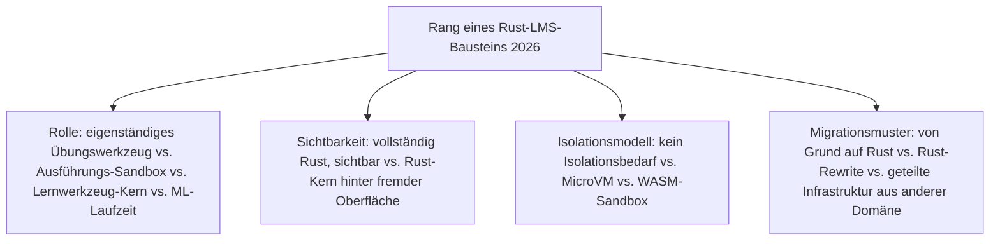
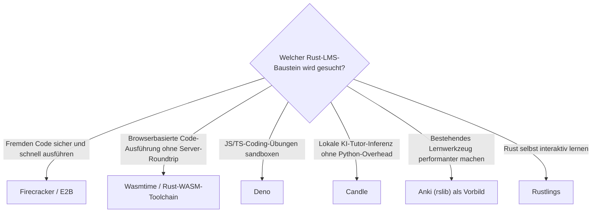

# Beste Rust-Bausteine für LMS 2026 — Top-8-Topliste

Die [Evolution und Architekturen digitaler Rust-LMS](evolution-digitaler-rust-lms.md) verfolgt Rust als **quer zu allen fünf Generationen von LMS liegende Implementierungsachse** — nicht als eigene LMS-Produktklasse. Diese Seite übersetzt diese Achse in eine **Momentaufnahme 2026**: 8 Rust-Bausteine, mit denen sichere Sandbox-Ausführung für Programmier-Übungen, etablierte Lernwerkzeug-Kerne und lokale KI-Tutor-Inferenz heute tatsächlich gebaut werden.

!!! note "Hinweis: die schmalste Rust-Achse dieses Repositories"
    Anders als bei [Rust-Bausteine für CMS](../dokumentation/rust-cms-2026-topliste.md) (15 Einträge) oder [Rust-Bausteine für Wissenssysteme](../dokumentation/rust-wissenssysteme-2026-topliste.md) (20 Einträge) benennt die Chronologie hier nur sechs konkrete Bausteine — LMS-Software selbst entsteht bislang kaum vollständig in Rust. Diese Liste ergänzt zwei aktuelle, real genutzte Produkte, die dieselbe Firecracker-Sandbox-Infrastruktur konkret in Lernkontexten einsetzen, statt die Liste künstlich auf 10 oder mehr Einträge zu strecken.

---

## Bewertungskriterien

---

## Top 8 im Überblick

| Rang | Baustein | Generation | Rolle | Besondere Stärke |
|---|---|---|---|---|
| 1 | **Firecracker** (AWS) | 2 (Sichere Sandbox-Ausführung für automatisch bewertete Programmier-Übungen) | Ausführungs-Sandbox | Rust-natives MicroVM-Tool, technisches Fundament für sichere Code-Ausführungsumgebungen in unzähligen Coding-Übungsplattformen |
| 2 | **Candle** (Hugging Face) | 5 (Rust-gestützte lokale KI-Tutor-Inferenz) | ML-Laufzeit | Ermöglicht lokale Ausführung kleinerer Tutor-/Feedback-Modelle ohne Python-Laufzeit-Overhead |
| 3 | **Anki** (`rslib`-Migration) | 3 (Rust-Kern-Rewrite eines etablierten Lernwerkzeugs) | Lernwerkzeug-Kern | Rust-Kern übernimmt Scheduler-Algorithmus und Synchronisationslogik des populärsten Spaced-Repetition-Systems |
| 4 | **E2B** | Ergänzung 2026 (baut auf Generation 2) | Ausführungs-Sandbox | Sandbox-als-Service auf Firecracker-Basis, verbreitet als Ausführungsumgebung hinter modernen KI-Tutor- und Coding-Übungsplattformen |
| 5 | **Rustlings** | 1 (Rust lernt sich selbst beibringen) | Eigenständiges Übungswerkzeug | Offizielles Rust-Übungsprojekt — kleine, absichtlich fehlerhafte Snippets mit sofortigem Compiler-Feedback statt Videolektion |
| 6 | **Wasmtime / Rust-WASM-Toolchain** | 4 (WASM-Sandboxes für browserbasierte Code-Ausführung) | Ausführungs-Sandbox | Ermöglicht Übungsfeedback ohne Server-Rundreise, dieselbe Bytecode-Alliance-Infrastruktur wie hinter Shopify Functions |
| 7 | **CodeSandbox-Cloud-Sandboxes** | 2 (Sichere Sandbox-Ausführung für automatisch bewertete Programmier-Übungen) | Ausführungs-Sandbox | Migrierte auf Firecracker-basierte MicroVMs, direkt relevant für in Kurse eingebettete interaktive Programmier-Umgebungen |
| 8 | **Deno** | Ergänzung 2026 (baut auf Generation 4) | Ausführungs-Sandbox | Rust-Kern-JavaScript-/TypeScript-Runtime, zunehmend zur Sandbox-Ausführung von JS/TS-Coding-Übungen in interaktiven Lernplattformen eingesetzt |

---

## Highlights im Detail

### Rang 1, 4, 7: dieselbe MicroVM-Infrastruktur, drei unterschiedliche Konsumformen
Firecracker, E2B und CodeSandbox-Cloud-Sandboxes zeigen dieselbe Architekturlinie auf drei Ebenen — die Basis-Runtime selbst, ein spezialisierter Sandbox-als-Service-Anbieter darüber, und eine konkrete Cloud-Coding-Plattform, die beides nutzt, siehe [Generation 2 der Rust-LMS-Zeitachse](evolution-digitaler-rust-lms.md#generation-2-sichere-sandbox-ausfuhrung-fur-automatisch-bewertete-programmier-ubungen-2018-2022).

### Rang 3: der einzige Baustein mit sichtbarem Vorher-Nachher für Endnutzer
Anki ist das einzige System dieser Liste, bei dem eine bestehende Anwendung ihren Kern nach Rust migrierte, ohne die Oberfläche zu verändern — dasselbe Hybrid-Muster, das später bei Zensical wiederkehrt, siehe [Generation 3](evolution-digitaler-rust-lms.md#generation-3-rust-kern-rewrite-eines-etablierten-lernwerkzeugs-anki-2020-2021).

### Rang 5: das einzige vollständig sichtbare Rust-Werkzeug dieser Liste
Rustlings ist der einzige Baustein, den Lernende bewusst installieren und direkt aufrufen — alle übrigen sieben laufen unsichtbar hinter einer Python-, Web- oder Desktop-Oberfläche.

---

## Entscheidungshilfe nach Baustellen-Typ

!!! tip "Tipp: Produktebene separat prüfen"
    Diese Liste rankt Entwickler-Bausteine, keine fertigen LMS-Produkte — siehe [Beste Lernmanagement-Systeme 2026](lms-2026-topliste.md) für die Plattformen, in die diese Bausteine unsichtbar einfließen.

---

## 🔗 Verwandte Themen

- [Startseite](../../index.md) — zurück zur Dokumentations-Zentrale
- [Evolution und Architekturen digitaler Rust-LMS](evolution-digitaler-rust-lms.md) — chronologisches Generationenmodell, dessen aktuellen Stand diese Topliste zusammenfasst
- [Beste Lernmanagement-Systeme 2026 (Top 20)](lms-2026-topliste.md) — Produktebene, zu der diese Bausteine unsichtbar beitragen
- [Beste Rust-Bausteine für CMS 2026 (Top 15)](../dokumentation/rust-cms-2026-topliste.md) — Wasmtime dort im Composable-Commerce-Kontext, analoge Topliste derselben Bauteil-Ebene für CMS
- [Beste Rust-Bausteine für Wissenssysteme 2026 (Top 20)](../dokumentation/rust-wissenssysteme-2026-topliste.md) — Candle als geteilter Baustein, analoge Topliste derselben Bauteil-Ebene für Wissenssysteme
- [Beste Rust-Bausteine für Notebooks 2026 (Top 10)](../dokumentation/rust-notebooks-2026-topliste.md) — Candle/Deno als geteilte Bausteine, analoge Topliste derselben Bauteil-Ebene für Notebooks
- [Beste KI-native Notebook-Umgebungen 2026 (Top 20)](../dokumentation/ki-native-notebooks-2026-topliste.md) — E2B dort im Kontext agentischer Code-Ausführung außerhalb von Lernkontexten
- [Rust in der Praxis](../../entwicklung/system/rust-praxis.md) — allgemeine Rust-Werkzeuglandschaft jenseits von LMS
