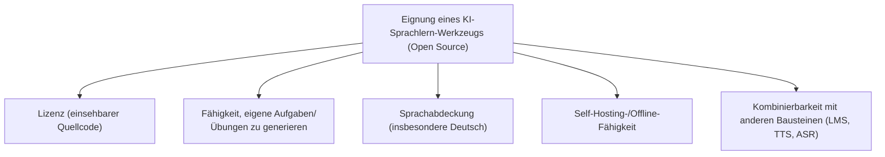
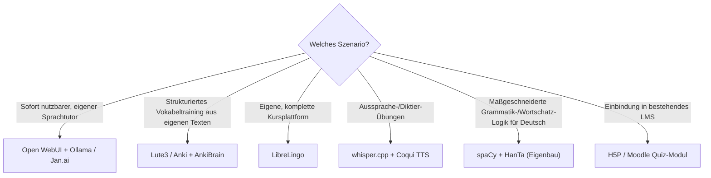

# Beste KI-Agenten für Deutsch- und Fremdsprachenlernen — Top-20-Topliste (Open Source)

Neben der allgemeinen Übersicht zu [KI in Lehre & Weiterbildung](ki-lehre-weiterbildung.md) geht es hier speziell um eine Kernaufgabe des Sprachenlernens: **KI-Agenten und -Software, die Deutsch als Fremdsprache, Zweitsprache oder eine beliebige andere Fremdsprache unterstützen — und dabei eigene Aufgaben und Übungen selbst generieren können**, statt nur auf fest vorgegebene Lektionen zurückzugreifen. Diese Seite bewertet ausschließlich **quelloffene** Werkzeuge und Bausteine.

!!! note "Hinweis: Warum ausschließlich Open Source?"
    Verbreitete Sprachlern-Apps wie Duolingo, Babbel oder Busuu sind bewusst **nicht** gelistet — sie sind proprietär, cloud-gebunden und lassen keine eigene Übungserstellung außerhalb ihrer festen Kursstruktur zu. Diese Liste zeigt stattdessen, wie sich mit quelloffenen Bausteinen (LLM-Tutor, ASR, TTS, Übersetzung, Spaced-Repetition) eine vollständig selbst hostbare, individuell anpassbare Sprachlernumgebung aufbauen lässt.

---

## Bewertungskriterien

!!! warning "Achtung: Viele Einträge sind Bausteine, kein fertiger Kurs"
    Ein Teil dieser Liste (spaCy, HanTa, LibreTranslate, Whisper, Coqui TTS) sind **NLP-/Sprach-Bausteine**, aus denen erst mit eigenem Prompt-/Skript-Aufwand ein vollständiger Sprachtutor entsteht. Nur wenige Projekte (Lute3, LibreLingo, Open WebUI + Ollama) liefern bereits eine fertige Lernoberfläche „ab Werk". **Stand: Juli 2026.**

---

## Top 20 im Überblick

| Rang | Software/Werkzeug | Lizenz | Kategorie | Einschätzung | Besondere Stärke | Schwäche |
|---|---|---|---|---|---|---|
| 1 | **Open WebUI + Ollama (eigener Sprachtutor)** | MIT | Self-Hosted LLM-Chat | Sehr stark | Vollständig lokaler Chat-Tutor, generiert per Systemprompt beliebige eigene Übungen (Lückentext, Dialog, Grammatikfrage) in jeder Sprache | Übungsqualität hängt vollständig vom gewählten Modell und Prompt ab |
| 2 | **Lute3 (Lute v3)** | AGPL-3.0 | Self-Hosted Sprachlern-Reader | Sehr stark | Verfolgt bekannte/unbekannte Wörter beim Lesen eigener Texte, erzeugt daraus automatisch individuelles Vokabeltraining | Fokus auf Lesen/Vokabular, keine eigenständigen Grammatik-Dialogübungen |
| 3 | **LibreLingo** | AGPL-3.0 | Selbst hostbare Kursplattform | Stark | Quelloffene Duolingo-Alternative, eigene Kurse/Übungen per YAML-Dateien vollständig frei definierbar | Community-Kurse für Deutsch kleiner als bei kommerziellen Anbietern |
| 4 | **Anki (+ eigene LLM-Notiz-Generierung)** | AGPL-3.0 | Spaced-Repetition-Karteikarten | Stark | Extrem verbreitetes, hochgradig skriptbares Karteikarten-System, per Add-on/API automatisch mit KI-generierten Karten befüllbar | Kein Dialog-/Gesprächstraining, primär Vokabel-/Faktenwiederholung |
| 5 | **AnkiBrain** | MIT | Open-Source-Anki-Add-on | Stark | Bindet ein lokales oder Cloud-LLM direkt in Anki ein, erklärt und generiert Karten aus eigenem Material | Erfordert bereits laufende Anki-Installation |
| 6 | **LanguageTool** | LGPL (Kern), AGPL (Server) | Grammatik-/Stilprüfung | Stark | Sehr gute Deutsch-Unterstützung, self-hostbarer Server, direkt in eigene Schreibübungen integrierbar | Reine Korrektur, keine eigenständige Aufgabengenerierung |
| 7 | **whisper.cpp** | MIT | Spracherkennung (ASR) | Stark | Sehr schnelle, lokale Spracherkennung für Diktat- und Aussprache-Übungen in der Zielsprache | Reine Transkription, Bewertung der Aussprache muss selbst ergänzt werden |
| 8 | **ReadAlong Studio** | MIT | Text-Audio-Alignment | Solide bis stark | Erzeugt automatisch synchronisierte Lese-/Hör-Übungen aus eigenem Text und eigener Audiodatei | Kleinere Community, Einrichtung technischer als fertige Apps |
| 9 | **Coqui TTS (XTTS v2)** | MPL-2.0 | Sprachsynthese (TTS) | Solide bis stark | Lokale Sprachausgabe als Aussprachevorbild für selbst erstellte Übungssätze, siehe [AI Voice Cloning](../../kreativ/audio/ai-voice-cloning-xtts.md) | Reine Sprachausgabe, kein eigenständiges Übungssystem |
| 10 | **LibreTranslate** | AGPL-3.0 | Maschinelle Übersetzung | Solide bis stark | Offline-fähig, self-hostbar, guter Baustein für eigene Übersetzungsübungen | Übersetzungsqualität teils hinter kommerziellen Cloud-Diensten |
| 11 | **Jan.ai** | AGPL-3.0 | Lokale LLM-Desktop-App | Solide | Vollständig lokale Chat-Oberfläche, per System-Prompt als Sprachtutor mit eigenen Übungen konfigurierbar | Übungsgenerierung erfordert eigene Prompt-Konfiguration wie bei Open WebUI |
| 12 | **H5P** | MIT | Interaktive Übungs-Erstellung | Solide | Erstellt eigene Lückentexte, Diktate und Quizzes direkt im Browser, self-hostbar über Moodle/WordPress | Kein KI-gestütztes Generieren „ab Werk", Übungen werden manuell erstellt |
| 13 | **Moodle Quiz-Modul (+ KI-generierte GIFT-Dateien)** | GPL-3.0 | LMS-Übungsmodul | Solide | Import beliebiger, per LLM generierter Sprachübungs-Quizzes im GIFT-/Aiken-Format | Generierung selbst erfolgt extern, Moodle importiert nur das Ergebnis |
| 14 | **spaCy (+ deutsches Sprachmodell)** | MIT | NLP-Bibliothek | Solide | Guter Baustein für eigene Grammatik-/Wortarten-Übungsgeneratoren speziell für Deutsch | Framework statt fertigem Lernwerkzeug, erfordert eigene Entwicklung |
| 15 | **HanTa (Deutscher Lemmatizer)** | BSD-3-Clause | NLP-Bibliothek (Deutsch) | Solide | Speziell auf deutsche Wortformen/Flexion zugeschnitten, guter Baustein für Grammatikübungen | Sehr spezialisiert, kein eigenständiges Übungssystem |
| 16 | **LibreOffice Impress (+ Ollama-Textgenerierung)** | MPL-2.0 | Präsentations-/Materialerstellung | Solide | Erstellung eigener Lernmaterialien/Foliensätze für Sprachunterricht, KI-Text direkt einfügbar | Keine interaktive Übungslogik, reines Präsentationswerkzeug |
| 17 | **Anki-Connect (+ eigener KI-Wrapper)** | MIT | API-Schnittstelle | Ausreichend bis solide | Ermöglicht automatisiertes Einspielen KI-generierter Karten in eine laufende Anki-Instanz | Reine Schnittstelle, keine eigene Lernlogik |
| 18 | **gpt4all** | MIT | Lokale LLM-Runtime | Ausreichend bis solide | Vollständig lokale Modellausführung ohne Cloud-Abhängigkeit als Basis für einen eigenen Sprachtutor | Modellqualität kleinerer lokaler Modelle hinter größeren Cloud-LLMs |
| 19 | **Mozilla Common Voice (+ eigener Wrapper)** | CC0 (Daten), MPL-2.0 (Tools) | Aussprache-Datensatz/Werkzeuge | Ausreichend | Große mehrsprachige Sprachdaten-Basis als Grundlage für eigene Aussprache-Trainer | Kein fertiges Lernwerkzeug, reine Datengrundlage |
| 20 | **Whisper + eigener Diktier-Übungs-Stack (Eigenbau)** | MIT | Eigenbau-Kombination | Grundlegend | Maximale Flexibilität, Kombination aus ASR und LLM-Feedback für individuelle Diktier-/Ausspracheübungen | Vollständige Eigenentwicklung der gesamten Übungslogik nötig |

!!! tip "Tipp: Rang ≠ einzige Entscheidungsgröße"
    Für **einen fertigen, sofort nutzbaren Sprachtutor** ist die Kombination aus Open WebUI und Ollama aktuell der pragmatischste Einstieg — ein einziger Systemprompt reicht, um beliebige eigene Übungen in jeder Sprache generieren zu lassen. Für **strukturiertes Vokabeltraining aus eigenen Texten** sind Lute3 und Anki (+ AnkiBrain) die ausgereiftesten Optionen. Reine NLP-Bausteine (spaCy, HanTa, LibreTranslate) lohnen sich vor allem, wenn eine **maßgeschneiderte, deutschspezifische Übungslogik** entstehen soll, die es „fertig" nicht gibt.

---

## Empfehlung nach Einsatzszenario

---

## 🔗 Verwandte Themen

- [Startseite](../../index.md) — zurück zur Dokumentations-Zentrale
- [E-Learning-Übersicht](index.md) — Autorentools & interaktive Lernumgebungen allgemein
- [KI in Lehre, Weiterbildung und Training](ki-lehre-weiterbildung.md) — breiterer didaktischer Kontext, RAG-Tutoren, DSGVO-Aspekte
- [AI Voice Cloning (XTTS v2)](../../kreativ/audio/ai-voice-cloning-xtts.md) — vertiefende Praxis zu Rang 9
- [Beste Voice-Steuerung-KI-Agenten (Open Source, Ubuntu 26.04, Top 20)](../../künstliche-intelligenz/automatisierung/voice-steuerung-opensource-ubuntu-topliste.md) — verwandte ASR-/TTS-Bausteine für Rang 7/9
