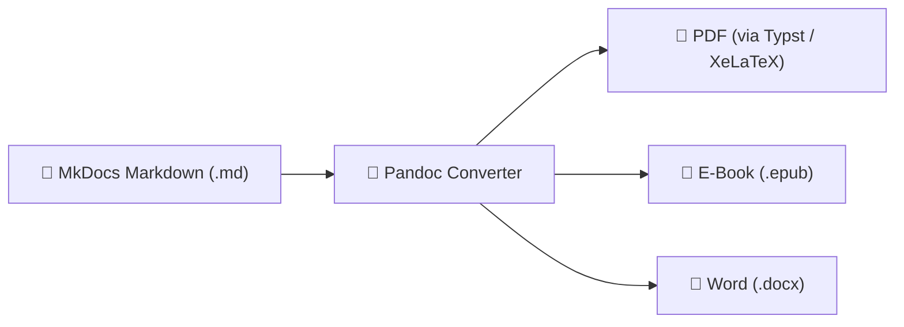

# Praxis-Guide: Pandoc Multi-Format Export-Pipeline

Pandoc ermöglicht das hochpräzise Konvertieren deiner Markdown-Dokumentation in Druck-PDFs, E-Books (EPUB) und Microsoft Word (DOCX) Dokumente.

---



---

## 🛠️ 1. Installation

```bash
# Pandoc & Typst (moderner, schneller PDF-Engine) installieren
sudo apt update && sudo apt install -y pandoc

# Typst installieren (für schnelle PDF-Generierung)
curl -fsSL https://typst.app/install.sh | sh
```

---

## 🚀 2. Konvertierungs-Befehle

### Markdown zu PDF (mit Typst Engine)
```bash
pandoc input.md -o output.pdf --pdf-engine=typst -V margin=2cm
```

### Markdown zu E-Book (EPUB) mit Inhaltsverzeichnis
```bash
pandoc input.md -o output.epub --toc --toc-depth=2 --metadata title="Meine Dokumentation"
```

### Markdown zu Microsoft Word (DOCX)
```bash
pandoc input.md -o output.docx
```

---

## ⚡ 3. Batch-Skript: Gesamte Doku als PDF kompilieren (`build_book.sh`)

```bash
#!/bin/bash
set -e

OUTPUT_DIR="exports"
mkdir -p "$OUTPUT_DIR"

echo "Kompiliere gesamte Dokumentation zu einem Buch-PDF..."

# Führe alle Haupt-Dokumente zusammen
pandoc docs/index.md \
       docs/künstliche-intelligenz/index.md \
       docs/entwicklung/webentwicklung/index.md \
       -o "$OUTPUT_DIR/Gesamtdokumentation.pdf" \
       --pdf-engine=typst \
       --toc \
       -V title="Gesamtdokumentation" \
       -V author="Thorsten Klöhn"

echo "✅ PDF erfolgreich in '$OUTPUT_DIR/Gesamtdokumentation.pdf' erstellt!"
```

---

## 🔗 Verwandte Themen
* [Pandoc Übersicht](pandoc.md) – Pandoc Grundlagen
* [Benchmark](benchmark.md) – Performance-Vergleiche
* [Analysetool](analysetool.md) – Text- & Code-Analyse
